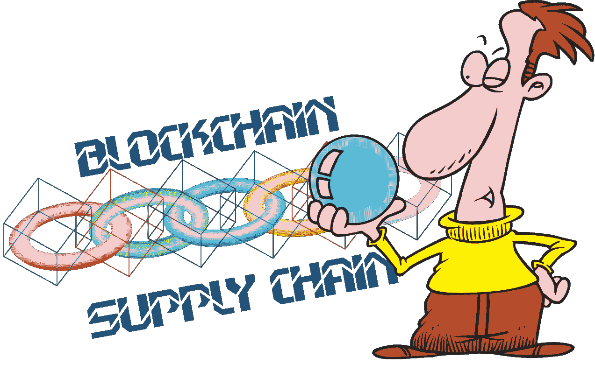
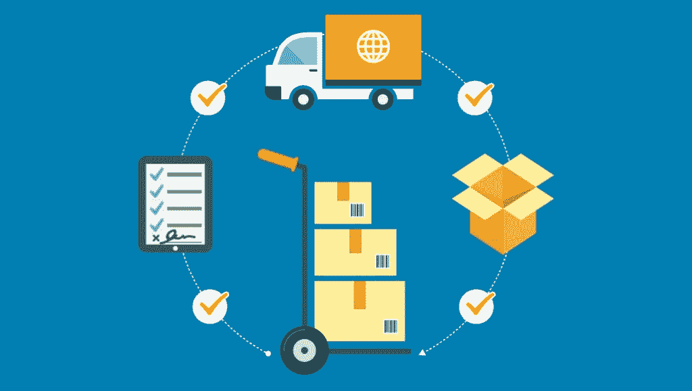
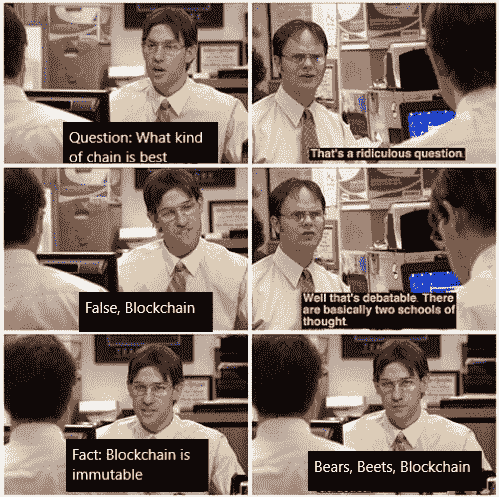

# 供应链、区块链和碳足迹

> 原文：<https://medium.com/coinmonks/supply-chain-blockchain-and-carbon-footprint-888d377c7d14?source=collection_archive---------10----------------------->

# **第 0 块:创世纪**

让我们把事情弄清楚一点，

供应链代表了生产者和消费者之间由商品驱动的关系。供应链主要是企业对企业的交易，最后一个阶段是企业对消费者。供应链是公司与其供应商之间生产和分销特定产品的网络，供应链代表了将产品或服务提供给客户所采取的步骤。

从卡尔·马克思的《政治经济学批判》中，我们可以推断出当今供应链中商品流动的一个关键点。在许多情况下，商品被认为与其实际的物质价值无关。材料价值可以分解为与商品相关的财务、环境和劳动力成本。供应链中的大多数参与者只关心与供应链相关的财务成本。我们不关心诸如环境破坏或用于制造产品的劳动力种类等因素。

让我们考虑一下环境影响。[碳披露项目(CDP)](https://www.cdp.net/en) 是一个非政府组织，拥有一整套全球企业环境数据。他们的一份报告提到，与公司的直接运营相比，供应链的 GHG 排放量是其 4 倍。术语“碳足迹”是指在产品或服务的整个生命周期中排放的二氧化碳(CO2)和其他温室气体的总量。测量碳足迹的方法仍在开发中，部分原因是关于一家公司对其价值链释放的所有碳应承担多大责任的争论仍在继续。商业中的粗心管理和不当行为会增加链条的碳足迹:

2006 年，[碳信托](https://www.carbontrust.com/home/)，一个总部设在英国的研究和咨询集团，发现了一个在欧洲生产休闲食品的生土豆采购中的“不正当激励”。研究人员与一家大型食品制造商合作，研究其生产的薯片的碳足迹，发现由于价格是由重量决定的，农民控制湿度来生产水分更重的马铃薯。即使在食品制造商设定的水分含量的严格规范内，这几克额外的水也是很重要的。此外，燃烧掉水分所需的额外烹饪占了薯片能源消耗的百分比高得出乎意料。

那么，区块链能帮上什么忙呢？区块链是网络中发生的交易的可信的分布式分类帐。区块链提供了出处、透明和不可变的共享账本等功能。但是解决方案中缺少一部分。缺少的部分就是物联网。区块链有一个简单的原理:“垃圾进垃圾出”。进入区块链的数据的可靠性是一个问题。不应该有任何错误的空间。物联网端点比任何捕获数据的人都更值得信任。因此，整合供应链和区块链，并将其与物联网结合起来，是改善旧系统和填补漏洞的潜在解决方案。

区块链如何为企业增值？区块链技术最显著的特点是:
**时间效率**:需要几天的交易可以实时完成。
**成本效率**:间接费用和中间费用降低。
**降低风险**:几乎没有篡改、欺诈和网络犯罪的风险。
**增加信任**:由于重复的分类账和基于共识的流程

大多数企业都关心与其他参与者共享他们的数据。被许可的区块链可以处理这个问题，并启用分层架构来控制参与者可以访问的数据。

供应链忽略了获取原材料的过程，原材料是如何储存的，等等。物联网设备可以帮助获取关于这些问题的数据。让我们来看一些可以提供帮助的使用案例:

**交付或运输系统:**
使用物联网设备跟踪车辆油耗，优化交付路线。

**药品温度监控:**
使用 NFC 进行冷链合规性温度记录。

**记录能源消耗做法:**
记录是否使用了可再生能源。使用的光源也有影响。从白炽灯泡换成 led 可以减少碳消耗。

供应链中的废物产生和处理技术分析。

比用账本记录碳足迹更重要的是增加对清洁燃料和可持续实践的投资。这些举措有助于将现有的供应链管理系统发展成为一个更负责任的系统。

**从更轻松的角度来看……**

