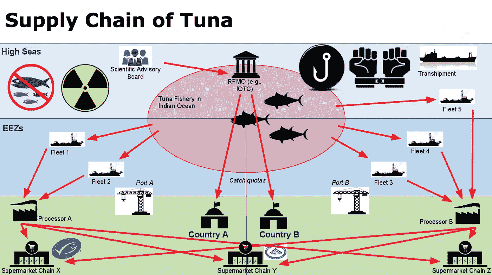

# Hyperledger 中带区块链的供应链管理

> 原文：<https://medium.com/coinmonks/supply-chain-management-w-blockchain-in-hyperledger-f5c43ffc9ece?source=collection_archive---------5----------------------->

> 供应链管理是企业资源计划(ERP)的重要组成部分。它是对资金、原材料、零部件和成品从供应商、制造商、批发商、零售商和消费者手中转移的监督。这种流动既可以发生在一个公司内部，也可以发生在几个公司之间。随着假设随着时间的推移而改变，供应链模型可能开始显示出弱的性能指标。良好的供应链管理将保持产品质量的一致性，并防止库存的库存问题。— ebx 课程介绍

对于制造商和分销商等许多公司来说，供需同步是高效供应链中的一个关键因素。

在许多情况下，跨组织使用几个 ERP 系统，严重阻碍了它们之间的数据流动。通常缺乏透明度，因为公司不想暴露他们的竞争优势，并有可能被完全排除在供应链之外。

区块链现在被用来解决这些问题，因为它消除了可信方对交易和商品以及其他数据的需求。因为所有参与者都有网络中所有过去交易的副本，所以任何参与者都可以检测到产品是否不像广告宣传的那样。

在整个供应链中，可以通过区块链将项目的检验记录绑定到它们。虽然记录是公开的，但分布式分类账的伪匿名性质导致必要信息的更合理共享。

> 贸易金融行业还可以利用供应链区块链中的可见信息。出口商需要降低不付款的风险，而进口商希望降低供应风险。贸易融资的功能是作为第三方消除支付风险和供应风险，同时为出口商提供加速应收账款，为进口商提供延期信贷。在这些交易中提供资本的机构可以利用供应链区块链中的可见信息来更好地评估贷款公司。

Source: Nishan Degnarain — permissionless

## 起源

作为所有权的记录，出处被用作真实性或质量的指南。传统上，这些记录只能用于非常大型的物品，如艺术品。区块链可以帮助消费者做出购买决定。

区块链有许多清晰出处记录的使用案例。

例如，消费者可能想要验证他们购买的产品的公平性，该产品被贴上了这样的标签。此外，这种类型信息的显著性通过能够追踪制造的品牌商品的来源工厂，降低了消费者被出售假冒商品的风险。

> 制造商可以证明其来源符合认证机构的标准，如果这些来源在区块链上被列为通过了所有要求。任何感兴趣的人都可以查看源的原始认证和更新的时间。

通过公开可用的记录和设计合理的界面，消费者能够全面查看产品的保管历史和采购事件。

在适当的区块链基础设施的帮助下，制造商和消费者团结在一起，并为他们的问题提供解决方案；透明度和权限有助于他们在决策中整合重要数据。