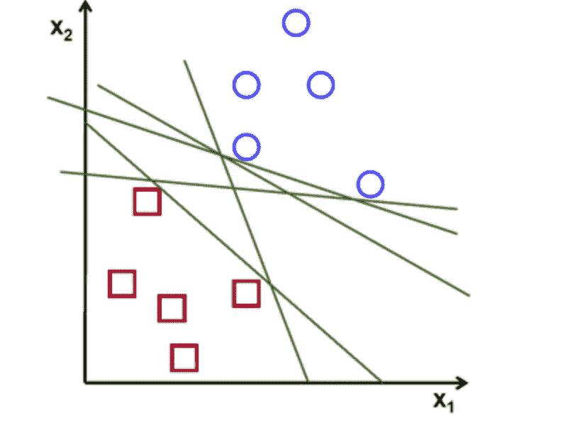
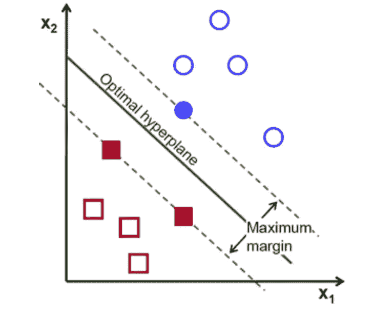
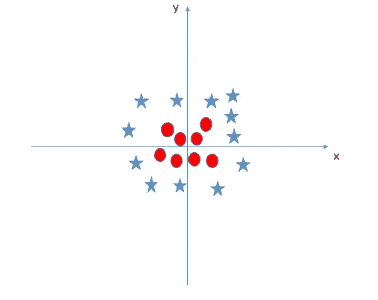
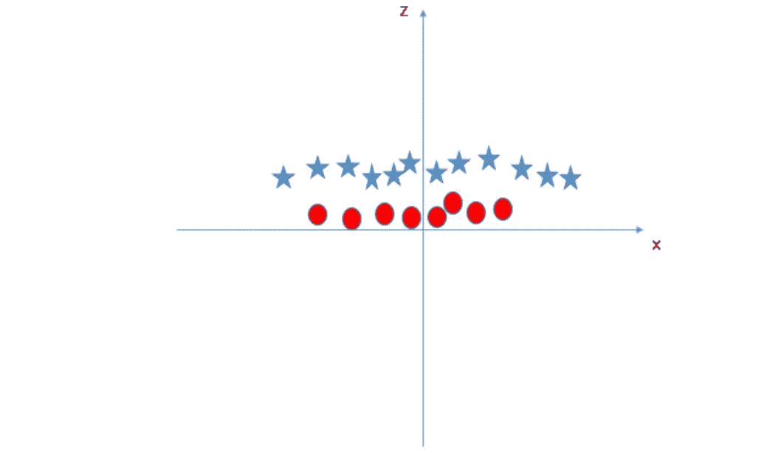
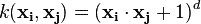
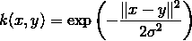
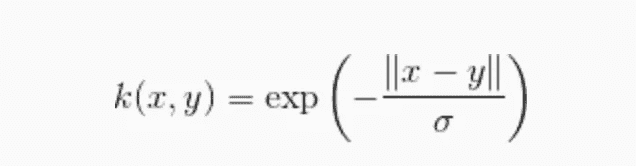

# 支持向量机(SVM)

> 原文：<https://medium.com/coinmonks/support-vector-machines-svm-b2b433419d73?source=collection_archive---------6----------------------->


支持向量机(SVM)是一种受监督的机器学习算法，可用于分类和回归目的。支持向量机更常用于分类问题，因此，这是我们在这篇文章中要关注的。

在该算法中，我们将每个数据项绘制为 n 维空间中的一个点(其中 n 是您拥有的特征的数量)，每个特征的值是特定坐标的值。然后，我们通过找到能够很好地区分两类的**最优** **超平面**来执行分类。

***超平面*** 对于一维数据是点，对于二维数据是线，对于三维数据是面，以此类推。

## 最优超平面



在图中，明显存在两个类别。一类用蓝色圆圈表示，另一类用红色方块表示。现在我们必须找到一条线来区分这两个类。正如你所看到的，这两个类之间有很多线，那么在这种情况下什么是 ***最优线*** ？

**因此，我们的目标应该是找到尽可能远离所有点的直线。**



SVM 算法的操作是基于找到给予训练样本最大最小距离的超平面。在 SVM 的理论中，这个距离两次获得了重要的名称**裕度**。因此，最佳分离超平面*最大化*训练数据的余量。

现在，在上述情况下，寻找最佳超平面的任务很简单，因为数据点是线性可分离的。但是如果数据点不是 ***线性分离*** 呢？在这种情况下，我们如何找到最佳超平面。

## 如果数据点不是线性分离的怎么办？



考虑下面的情况，我们的目标是找到一个超平面(在这种情况下是直线),将这两个类分开。如你所见，这两个类之间没有分界线。SVM 可以解决这个问题。我们可以引入一个新的特征 z=x + y，并绘制 z 特征。



在 SVM，这两个阶层之间很容易有一个线性超平面。但是，另一个亟待解决的问题是，我们是否需要手动添加这个功能来获得一个超平面。不，SVM 有一种手法叫做 [**内核**](https://en.wikipedia.org/wiki/Kernel_method) **绝招**。这些函数将低维输入空间转换到高维空间，即将不可分问题转换为可分问题，这些函数称为核。它主要用于非线性分离问题。

## 核

SVM 算法实际上是使用内核来实现的。在线性 SVM 中超平面的学习是通过使用一些线性代数来转换问题来完成的，这超出了 SVM 简介的范围。

## SVM 核的例子

**多项式内核**

它在图像处理中很流行。

等式是:



其中 d 是多项式的次数。

**高斯核**

它是通用内核；当没有关于数据的先验知识时使用。等式是:



**拉普拉斯 RBF 核**

它是通用内核；当没有关于数据的先验知识时使用。

等式是:



你可以在这里 获得更多关于不同内核 [*的信息。*](https://data-flair.training/blogs/svm-kernel-functions/)

**SVM 调谐参数**

可以使用 sklearn 在 python 中实现 SVM。你可以在这里 找到更多关于 SVM [*的执行情况。*](http://scikit-learn.org/stable/modules/svm.html)

```
sklearn.svm.SVC(*C=1.0*, *kernel='rbf'*, *degree=3*, *gamma=0.0*, *coef0=0.0*, *shrinking=True*, *probability=False*,*tol=0.001*, *cache_size=200*, *class_weight=None*, *verbose=False*, *max_iter=-1*, *random_state=None*)
```

我所说的参数是:-

**内核**

我们有各种内核选项，如**、【线性】、【rbf】、**等。这里**【RBF】****【poly】**用于非线性超平面。

**伽玛**

“rbf”、“poly”和“sigmoid”的核系数。gamma 值越高，将尝试按照训练数据集精确拟合，即泛化误差，并导致过拟合问题。

**C**

误差项的惩罚参数 C。它还控制平滑决策边界和正确分类训练点之间的折衷。

# SVM 的利与弊

**优点:**

*   它工作得很好，有清晰的分离界限
*   在高维空间是有效的。
*   这在维数大于样本数的情况下是有效的。
*   它在决策函数中使用训练点的子集(称为支持向量)，因此它也是内存高效的。

**缺点:**

*   当我们有大的数据集时，它表现不好，因为所需的训练时间更长
*   当数据集有更多噪声时，即目标类重叠时，它的性能也不是很好
*   SVM 没有直接提供概率估计，这些是通过昂贵的五重交叉验证计算出来的。它是 Python scikit-learn 库的相关 SVC 方法。

**结论**

我没有涉及 SVM 背后的数学。要了解更多，你可以学习**吴恩达的** [*讲义*](http://cs229.stanford.edu/notes/cs229-notes3.pdf) 。可能需要一些时间来理解推导过程。

也可以访问 SVM 的 [*sklearn 文档，了解更多算法在 python 中的实现。如果你有任何疑问，可以在评论区发表。继续学习！！！*](http://scikit-learn.org/stable/modules/svm.html)