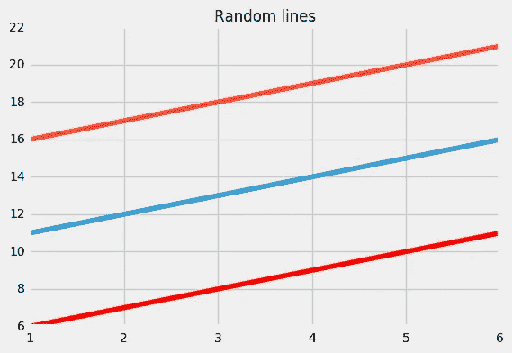
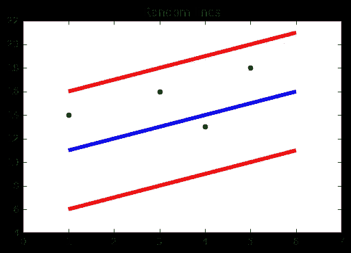
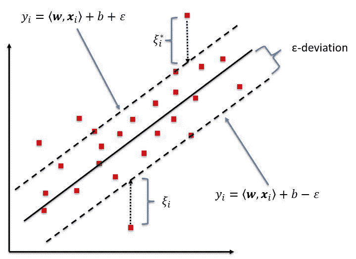
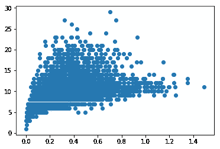

# 支持向量回归机

> 原文：<https://medium.com/coinmonks/support-vector-regression-or-svr-8eb3acf6d0ff?source=collection_archive---------2----------------------->

这篇文章是关于支持向量回归的。那些从事机器学习或数据科学的人非常熟悉术语 SVM 或支持向量机。但是 SVR 和 SVM 有点不同。顾名思义，SVR 是一种回归算法，因此我们可以使用 SVR 来处理连续值，而不是 SVM 分类。

在这篇文章中我们将会经常用到的术语

1.  **内核**:用于将低维数据映射到高维数据的函数。
2.  **超平面**:在 SVM，这基本上是数据类之间的分隔线。虽然在 SVR 中，我们将它定义为，将帮助我们预测连续值或目标值的线
3.  **边界线**:在 SVM，除了超平面之外，还有两条线形成了一个边界。支持向量可以在边界线上或边界线外。这条分界线把两个阶级分开了。在 SVR 中，概念是相同的。
4.  **支持向量**:这是最接近边界的数据点。这些点的距离是最小的。

> ***为什么是 SVR？SVR 和简单回归模型的主要区别是什么？***
> 
> 在简单回归中，我们试图将误差率降到最低。而在 SVR 中，我们试图将误差拟合在某个阈值内。这可能有点令人困惑，但让我解释一下。



fig 1 :Blue line: Hyper Plane; Red Line: Boundary Line

***蓝线:超平面；红线:边界线***



\fig 2:Now see the points

参见图 2，了解所有点如何位于边界线(红线)内。当我们继续使用 SVR 时，我们的目标是基本上考虑边界线内的点。我们的最佳拟合线是具有最大点数的线超平面。

***那么我们开始:***

所以我们首先要了解的是 ***这条边界线是什么？(是的！那条红线)。*** 把它想象成距离为‘e’(虽然不是 e，但基本上是ε)的线，但为了简单起见，让我们称它为**‘e’。**

> 所以我们画的线在距离超平面 **'+e'** 和 **'-e '** 的位置。

> 假设我们的超平面是穿过 Y 轴的直线
> 
> 我们可以说超平面的方程是

> **wx+b=0**

> 所以我们可以说这两条边界线的方程是

> **Wx+b=+e**
> 
> **Wx+b=-e**

各自地

因此，根据以下事实，对于任何线性超平面，满足我们的 SVR 的方程是:

> e≤y-Wx-b≤+e

> 陈述 y=Wx+b 的事实
> 
> y-Wx-b=0

***这适用于所有其他类型的回归(非线性、多项式)***

> 概述
> 
> 我们在这里尝试做的事情基本上是尝试在距离原始超平面“e”距离处决定决策边界，使得最接近超平面或支持向量的数据点在该边界线内



Fig 3: [https://www.researchgate.net/figure/Schematic-of-the-one-dimensional-support-vector-regression-SVR-model-Only-the-points_fig5_320916953](https://www.researchgate.net/figure/Schematic-of-the-one-dimensional-support-vector-regression-SVR-model-Only-the-points_fig5_320916953)

因此，决策边界是我们的容限，也就是说，我们将只选取那些在此边界内的点。

或者简单地说，我们只取那些误差率最小的点。从而给我们一个更好的拟合模型。

如果我的解释不够充分，你可以检查:

[](http://www.saedsayad.com/support_vector_machine_reg.htm) [## 支持向量回归

### 编辑描述

www.saedsayad.com](http://www.saedsayad.com/support_vector_machine_reg.htm) 

好了，现在让我们做我们真正想做的事。当然是编码部分

**从这里下载代码和 CSV:**

[](https://github.com/neelindresh/NeelBlog) [## neelindresh/NeelBlog

### NeelBlog——包含我博客中的代码和 csv

github.com](https://github.com/neelindresh/NeelBlog) 

***数据集描述:***

```
Predicting the age of abalone from physical measurements. 
Name		Data Type	Meas.	Description
	----		---------	-----	-----------
	Sex		nominal			M, F, and I (infant)
	Length		continuous	mm	Longest shell measurement
	Diameter	continuous	mm	perpendicular to length
	Height		continuous	mm	with meat in shell
	Whole weight	continuous	grams	whole abalone
	Shucked weight	continuous	grams	weight of meat
	Viscera weight	continuous	grams	gut weight (after bleeding)
	Shell weight	continuous	grams	after being dried
	Rings		integer			+1.5 gives the age in years
```

链接:

[https://archive . ics . UCI . edu/ml/machine-learning-databases/鲍鱼/鲍鱼. names](https://archive.ics.uci.edu/ml/machine-learning-databases/abalone/abalone.names)

这次让我们全力以赴吧！从缩放到功能选择，说什么！

> #编码:utf-8
> 
> 进口熊猫作为 pd
> 
> df=pd.read_csv('。/age _ mod . CSV’)
> 
> df.head()
> 
> df=df.drop(['Sex']，axis=1)
> 
> 从 sklearn.svm 导入 SVR
> 
> 回归变量=SVR(内核= '线性'，次数=1)
> 
> 将 matplotlib.pyplot 作为 plt 导入
> 
> plt.scatter(df['去皮重量']，df['年龄'])
> 
> 从 sklearn.model_selection 导入训练 _ 测试 _ 拆分
> 
> xtrain，xtest，ytrain，ytest=train_test_split(x，y)
> 
> regressor.fit(xtrain，ytrain)
> 
> pred=regressor.predict(xtest)
> 
> print(regressor.score(xtest，ytest))
> 
> 从 sklearn.metrics 导入 r2_score
> 
> print(r2_score(ytest，pred))
> 
> regressor=SVR(kernel='rbf '，epsilon = 1.0)
> regressor . fit(xtrain，ytrain)
> pred = regressor . predict(xtest)
> print(regressor . score(xtest，ytest))
> print(R2 _ score(ytest，pred))

***读取 CSV 文件***

> 进口熊猫作为 pd
> 
> df=pd.read_csv('。/age _ mod . CSV’)
> 
> df.head()

***我们不需要‘性别’一栏所以删除***

> df=df.drop(['Sex']，axis=1)

***从 sklearn.svm 加载 SVR 模型***

> 从 sklearn.svm 导入 SVR
> 
> 回归变量=支持向量回归机(内核= '线性')

**#注意:kernel='linear' →我们将内核设置为线性内核**

**#DEFAULT: kernel='rbf'**

***剧情关系:***

> 将 matplotlib.pyplot 作为 plt 导入
> 
> plt.scatter(df['去皮重量']，df['年龄'])

**#其他参数试试**



**分成训练和测试组**

> 从 sklearn.model_selection 导入训练 _ 测试 _ 拆分
> 
> xtrain，xtest，ytrain，ytest=train_test_split(x，y)

**拟合模型做预测**

> regressor.fit(xtrain，ytrain)
> 
> pred = regressor . predict(xtest**)**

**检查精度**

> print(regressor.score(xtest，ytest))
> 
> 从 sklearn.metrics 导入 r2_score
> 
> print(r2_score(ytest，pred))

***#注:均有。score()和 r2_score 给了我们一个准确度分数预测***

***让我们调整 SO 参数，看看我们是否能得到更好的分数:***

> regressor=SVR(kernel='rbf '，epsilon = 1.0)
> regressor . fit(xtrain，ytrain)
> pred = regressor . predict(xtest)
> print(regressor . score(xtest，ytest))
> print(R2 _ score(ytest，pred))\

**看这里:**

> SVR(核='rbf '，ε= 1.0，度=3)

> **#这里我们将内核设置为 3 度的“rbf”和 1.0 的ε值**
> 
> **#默认情况下内核是‘RBF’度是 3，ε是 0.1**
> 
> **#其他内核有→‘线性’，‘多元’(代表多项式)，‘RBF’**

感谢阅读！

***关注我的博客:***

[](https://dataneel.wordpress.com/) [## 面向所有人的数据科学

### 多项式回归正如上一篇文章所说，多项式回归是线性回归的特例…

dataneel.wordpress.com](https://dataneel.wordpress.com/) 

***多项式回归:***

[](https://dataneel.wordpress.com/2018/06/22/polynomial-regression/) [## 多项式回归

### 多项式回归正如上一篇文章所说，多项式回归是线性回归的特例…

dataneel.wordpress.com](https://dataneel.wordpress.com/2018/06/22/polynomial-regression/) 

***多元回归***

[](https://dataneel.wordpress.com/2018/06/11/linear-regression-part-2/) [## 多元回归/回归第 2 部分:

### 正如我们在前面的后线性回归第一部分线性回归第一部分中所讨论的，当…

dataneel.wordpress.com](https://dataneel.wordpress.com/2018/06/11/linear-regression-part-2/) 

***线性回归***

[](https://dataneel.wordpress.com/2018/06/09/linear-regression-part-1/) [## 线性回归第一部分

### 线性回归是最简单的监督学习类型。回归分析的目的是探索…

dataneel.wordpress.com](https://dataneel.wordpress.com/2018/06/09/linear-regression-part-1/) 

> 加入 Coinmonks [电报频道](https://t.me/coincodecap)和 [Youtube 频道](https://www.youtube.com/c/coinmonks/videos)获取每日[加密新闻](http://coincodecap.com/)

## 另外，阅读

*   [密码电报信号](http://Top 4 Telegram Channels for Crypto Traders) | [密码交易机器人](/coinmonks/crypto-trading-bot-c2ffce8acb2a)
*   [复制交易](/coinmonks/top-10-crypto-copy-trading-platforms-for-beginners-d0c37c7d698c) | [加密税务软件](/coinmonks/crypto-tax-software-ed4b4810e338)
*   [电网交易](https://coincodecap.com/grid-trading) | [加密硬件钱包](/coinmonks/the-best-cryptocurrency-hardware-wallets-of-2020-e28b1c124069)
*   [加密交易所](/coinmonks/crypto-exchange-dd2f9d6f3769) | [印度的加密应用](/coinmonks/buy-bitcoin-in-india-feb50ddfef94)