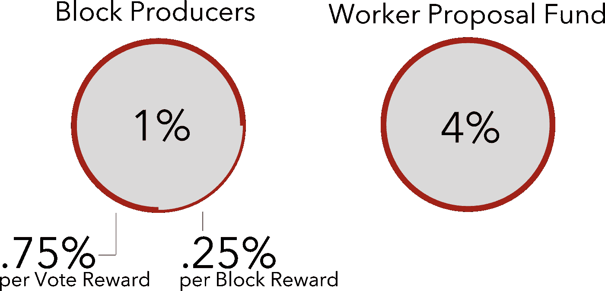
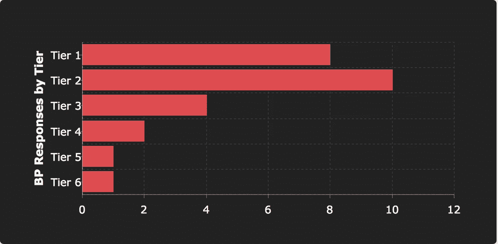
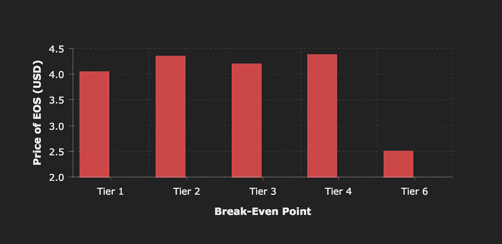
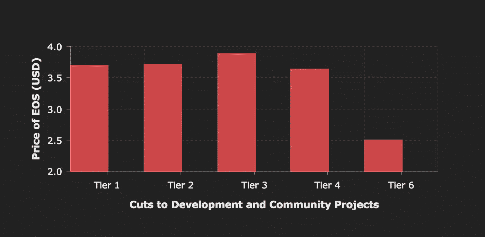
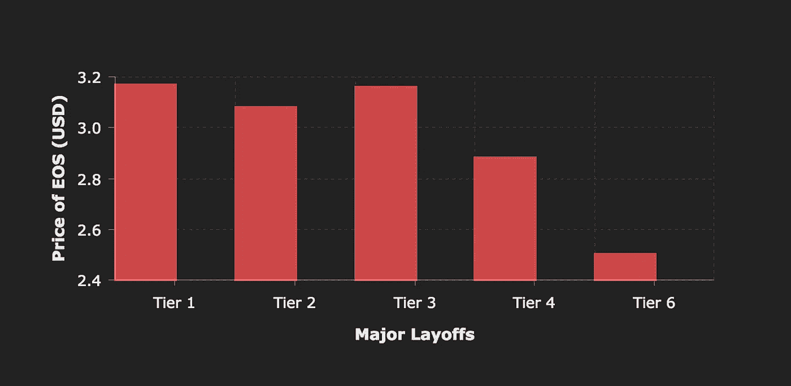
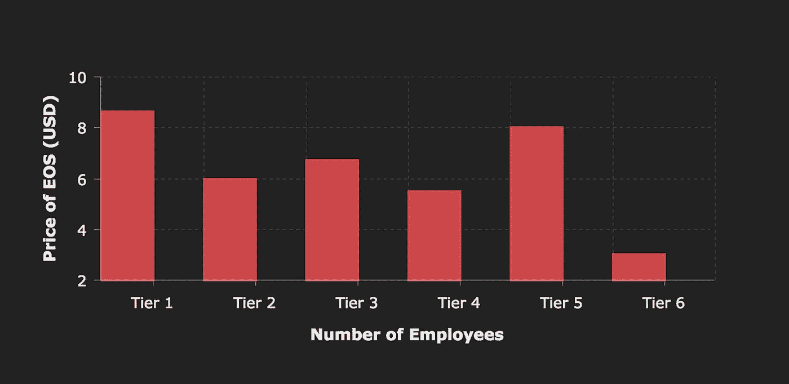
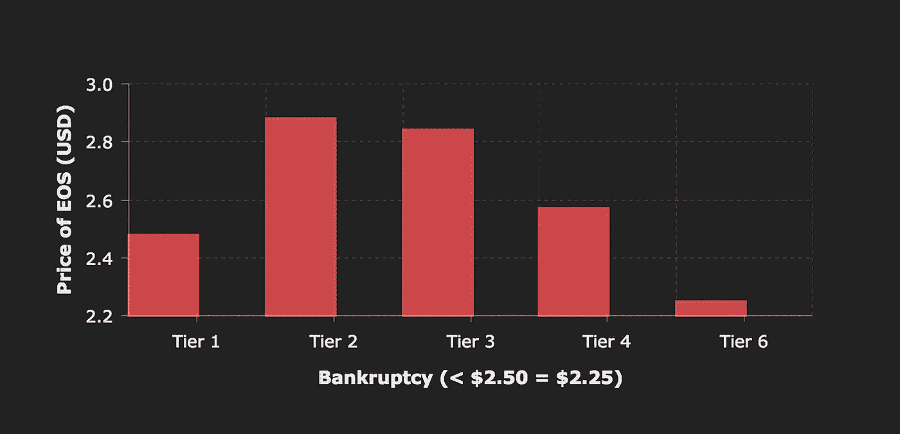
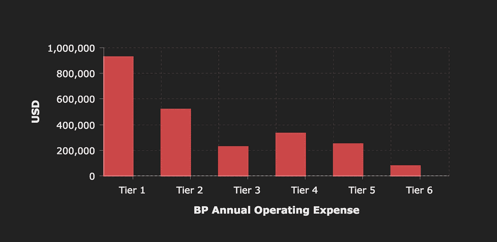
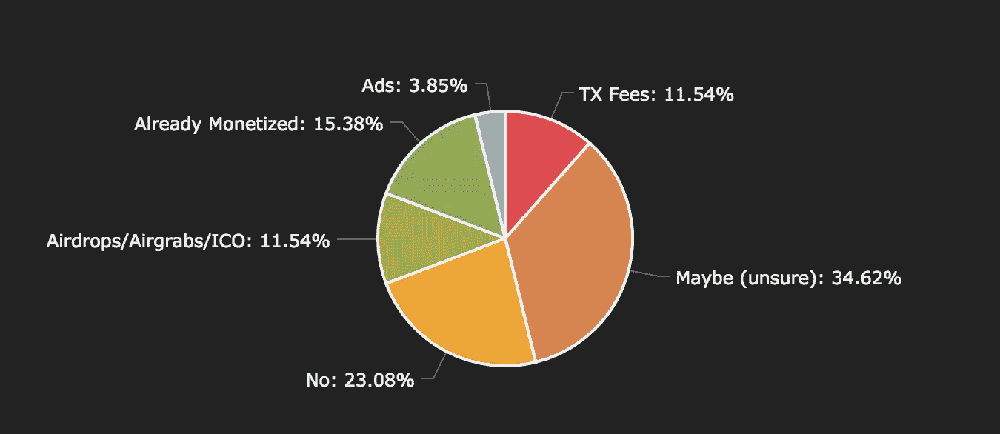
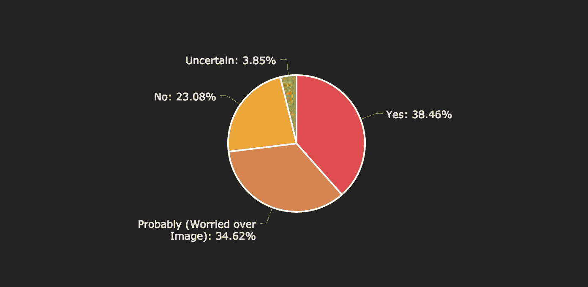

# 在当前的密码市场中，EOS 块生产商是否像我们想象的那样富裕？

> 原文：<https://medium.com/coinmonks/survey-of-eos-block-producers-cf9677561db7?source=collection_archive---------1----------------------->

## 请和我一起深入 EOS Block 生产商的世界，了解他们的薪酬有多少，经营一家公司需要什么，以及他们在这次熊市中的表现如何。

## 街区制作人的报酬如何？

在我们开始调查之前，你需要先了解一些事情。即，砌块生产商如何通过 EOSIO 网络上的通货膨胀赚取收入。

EOS Mainnet 以每年 5%的速度增长，其中 4%被锁定在工人提案基金中——一个未动账户( [eosio.saving](https://altshiftdev.com/account/eosio.saving/) )目前持有 1850 万 EOS，用于为网络升级提供资金。

剩下的 1%用于支付制作人工资，许多人认为这足以阻止他们用外部资源补充收入。

Allocation of Inflation on the EOS Mainnet

目前 EOS 和整个加密市场的价格下降趋势令人担忧，原因有很多，我认为其中最重要的是 BP 因为他们的努力获得了相同数量的 EOS，而货币已经从近 28 美元的历史高点和大约 14 美元的发行价贬值到 3 美元以下。

社区对 BPs 挣大钱、开蓝宝和喝香槟的看法准确吗？这正是我想弄明白的…

Communities perception of EOS Block Producers? Image Source: [rebloggy.com](http://rebloggy.com/post/canon-eos-paris-france-car-lamborghini-aventador-sport-lp-voiture-bull-dof-lambo/43499702626)

# 该调查

我最近调查了 EOS Block 生产商，收集了他们组织的各种数据，如财务稳定性、团队规模、年度支出等……(*如果你是一个数据呆子，你可以在这里查看原始数据***和原始调查* [*这里*](https://docs.google.com/forms/d/e/1FAIpQLSf85nEMpxcELJQNXeJEIOGDicFK-yyncMTQHxTrfiQgyWHbaw/viewanalytics) *。*)*

*我将数据按英国石油公司的层级进行了细分，因为就收入而言，各层级之间存在很大差异。下面是我如何定义我的层级，以及我在每个层级收到了多少回复:*

> **第 1 层:排名 1-21 的区块生产商(8 个答复)
> 第 2 层:排名 22-42 的区块生产商(10 个答复)
> 第 3 层:排名 43-63 的区块生产商(4 个答复)
> 第 4 层:排名 64-84 的区块生产商(2 个答复)
> 第 5 层:排名 85-105 的区块生产商(1 个答复)
> 第 6 层:排名 106 或更高的区块生产商(1 个答复)**

**

*Survey Responses by Block Producer Tier*

*团队被问及他们在哪个价位属于以下类别(按顺序):盈亏平衡，削减发展和社区项目，大规模裁员和破产。他们被要求假设至少 3 个月内 EOS 价格稳定。*

## *收支平衡*

**

*T1\. $4.04 | T2\. $4.35 | T3\. $4.19 | T4\. $4.38 | T6\. < $2.50*

*第 1 级团队的盈亏平衡点是每 EOS 4.04 美元，这使他们成为网络中最有弹性的团队。二级团队盈亏平衡为 4.35 美元，三级团队为 4.19 美元，四级团队为 4.38 美元。唯一的 T5 受访者没有具体说明，T6 表示价格范围低于 2.50 美元。我的数据集的平均盈亏平衡点是 4.14 美元。*

## *削减发展和社区项目*

*当被问及对社区项目和开源开发进行重大削减的代价是什么时，所有层级的平均价格是 3.67 美元。*

**

*T1\. $3.69 | T2\. $3.71 | T3\. $3.88 | T4\. $3.63 | T6\. < $2.50*

## *大规模裁员*

*必须进行大规模裁员的所有层级的平均价格是 3.08 美元。*

**

*T1\. $3.17 | T2\. $3.08 | T3\. $3.16 | T4\. $2.88 | T6\. < $2.50*

*这里值得一提的是，我问他们有多少员工在工资单上。所有层级的平均团队规模为 6.85 人，其中 T1 团队以 8.63 人的平均团队规模领先。*

**

*T1\. 8.63 | T2\. 6.00 | T3\. 6.75 | T4\. 5.50 | T5\. 8.00 | T6\. 3.00*

*第 5 层和第 6 层数据可能不具有代表性，因为每层只有 1 个数据点。这些层级也可能有外部资金来源，因为它们从 BP 获得的奖励不足以支付其成本。*

*我的理论是，团队规模可能会从 T1 下降到 T2——因为这些团队可以通过提高排名和奖励获得更多收益——并且从 T3 到 T6 是不可预测的——因为他们可能完全由外部资源资助，使他们的规模取决于他们在像传统业务一样货币化服务方面的成功。*

## *破产*

*很难确定可能破产的所有层级的平均价格，因为我表格中的最低选项是“< $2.50”，超过一半的受访者选择了它。这是我的错，我低估了这些团队的弹性，应该在调查中包括低价选项。*

*如果让我猜的话，我会说它非常接近每 EOS 2.50 美元，因为两个最不具弹性的 T1 团队估计价格为 2.88 美元(持续至少 3 个月)，第三个团队紧随其后，价格为 2.63 美元，而其余 T1 团队选择低于 2.50 美元(这一趋势在 T2 团队中几乎相同)。*

*最不容易破产的英国石油公司是 T3，其象征性价格为 3.63 美元或更低(持续 3 个月)，这意味着他们可能已经处于破产边缘，或者如果他们还没有成功货币化，他们可能已经耗尽了他们的积蓄。*

*相反，最有弹性的也是 T3 团队，并没有提供破产的代价。他们报出每年 600 美元的费用，并从 ICO/Airdrop/Airgrab 获得其他收入来源。表明他们能够以惊人的速度扩展团队，这可能是 T1 团队无法满足服务器需求的壮举。*

*虽然我在上面估计，对于大多数团队来说，每个 EOS 的最低可接受价格可能接近 2.50 美元，但让我们慷慨地用 2.25 美元的值来代替那些选择“< $2.50”的人，看看数据会是什么样子:*

**

*T1\. $2.48 | T2\. $2.88 | T3\. $2.84 | T4\. $2.57 | T6\. $2.25*

*在撰写本文时，根据 [CMC](https://coinmarketcap.com/currencies/eos/) 的数据，EOS 的价格为 2.53 美元。*

## *成为批量生产商的成本*

*另一个有趣的指标是他们的年度运营费用，运营 T1 团队与备用团队(T2、T3 等)的成本差异是什么..)?*

**

*BP Annual Operating Expense in USD*

*如您所见，运营一个 T1 团队的成本确实要高得多。T1 团队平均每年花费 925，625.00 美元，而一个由 13 名成员组成的异常 T1 团队声称仅花费 80，000 美元，这一平均值被拉低了不少。如果我们将他们从平均值中剔除，价格会猛增至 1，046，428.57 美元，是 T2 团队平均值的两倍多，T3 的三倍。*

*为什么运营一个 T1 团队要贵这么多？很可能是因为他们可以用额外收入资助的项目的规模，以及他们可以驱动这些项目的更大的团队。一些额外的收入可能也会资助社区项目，如 Chintai 和我自己的应用程序 [My EOS Wallet](https://altshiftdev.com/) ，它完全由捐款资助，主要来自 BPs。*

# *解决方法*

*除了大规模裁员和削减开源项目，Block 生产商还能做些什么来抵御破产呢？*

## *服务货币化(dApps /空投等)*

*当被问及 BPs 是否有计划在未来将其服务货币化时，回答如下:*

**

*Block Producers vs Monetization of Services*

*几乎一半的服务提供商打算将他们的服务货币化，而 34%的人仍不确定，23%的人自信地回答说他们不会货币化。*

*货币化可以采取多种形式，目前还不清楚哪种方式最受欢迎。一些公司已经开始提供企业解决方案，其他公司开始收取交易费，甚至空投。这些方法通常没有在 EOS 生态系统中测试过，时间会告诉我们用户如何反应。*

## *动态通货膨胀*

*另一个潜在的解决方案——如果我们不想在流行的 EOS 服务上看到交易费用——可能是实施动态通货膨胀。这将意味着相对于 EOS 的固定价值的通货膨胀价值的缩放。*

*目前，通胀回报为 1%，这是在 mainnet 推出之前的任意数字，当时价格一直高于 10 美元(当时我们关心的是如何保持 BP 的回报不太高……)。当价格在 8-14 美元之间时，这是一个限制利润的适当数字，但当 EOS 超过 20 美元时，这也使事情变得非常有利可图，现在导致价格远低于平均 4.14 美元的盈亏平衡阈值的严重问题。*

*理论上，如果处理得当，动态通货膨胀将通过阻止牛市中的兰博派对和防止熊市中的破产来解决所有这些问题。*

*为了实现这种解决方案，我们需要一个 Oracle(对真实世界价值的链上客观测量)。如果编写一个 Oracle 来评估 EOS 的每日价格——通过许多交易所进行汇总，并对多种货币进行平均——我们可以为 BP 奖励设置一个不断移动但适当的通胀值，高于或低于 1%以稳定他们的收入。*

*一种可能的实施方式是保持 5%的总通胀值，以避免过度通胀和浪费(此时我们尚未利用工人提案基金)，并简单地改变分配给 BPs 和 WPF 的金额。*

## *大宗商品生产商支持动态通胀吗？*

*当被问及是否会支持动态通胀时，回答非常有趣。我有一种预感，许多人害怕提出这样的事情，因为社区普遍认为他们在现金中游泳，所以我提供了以下选项:*

1.  ***是的，我们会支持这一提议** — 在下面的图表中简化为*是的*。*
2.  ***我们可能支持这一提议，但担心我们的公众形象(社区对贪婪的看法等)** —在下面的图表中简化为*(担心形象)*。*
3.  ***不，我们不会支持该提案**——在下表中简化为*否*。*
4.  ***其他(请注明)** —在下图中简化为*不确定*或合并到最合适的组别。*

**

*接受调查的英国石油公司中，整整 73%的人希望出现动态通胀，他们清楚地知道这将限制他们在牛市中的利润，其中近 35%的人过于担心失去目前的投票权，以至于对此无所作为，即使是在濒临破产的时候。*

*我认为数据很清楚，对于砌块生产商来说，现在是艰难的时候了，我也认为是时候让社区参与进来了。*

*你支持动态通货膨胀的概念，还是希望他们货币化？无论哪种方式，[让你的意见为人所知](https://www.strawpoll.me/16966113) *(每个 IP 限 1 个回复，反垃圾邮件必须输入验证码)*，你可以肯定，屏蔽制作者正在倾听。*

> *[直接在您的收件箱中获得最佳软件交易](https://coincodecap.com/?utm_source=coinmonks)*

*** [## 你支持 EOS Mainnet 上的块生产者的动态通货膨胀或货币化策略吗？

### 立即投票！[动态通货膨胀][货币化]

www.strawpoll.me](https://www.strawpoll.me/16966113) 

您也可以加入关于 [r/eos](https://www.reddit.com/r/eos/comments/a30tbt/are_eos_block_producers_as_welloff_as_we_think_in/) 子编辑的讨论以及下面的评论。* 

**喵是 100%由来自社会各界的捐款资助的，如果您愿意支持本站或我的作品，欢迎捐款到* [*喵. x*](https://altshiftdev.com/eos/account/meow.x/) *账户。**

*[*altShiftDev*](https://medium.com/u/d526da9c9897?source=post_page-----cf9677561db7--------------------------------)*是*[*My EOS Wallet*](https://altshiftdev.com)*(喵)的创建者，这是一个社区拥有的无广告钱包和 EOS 账户浏览器。它允许 EOS 社区访问和管理他们的 EOS 帐户，具有硬件钱包的可信安全性。**

*

[**Click to read today’s top story**](http://bit.ly/2G71Sp7)*