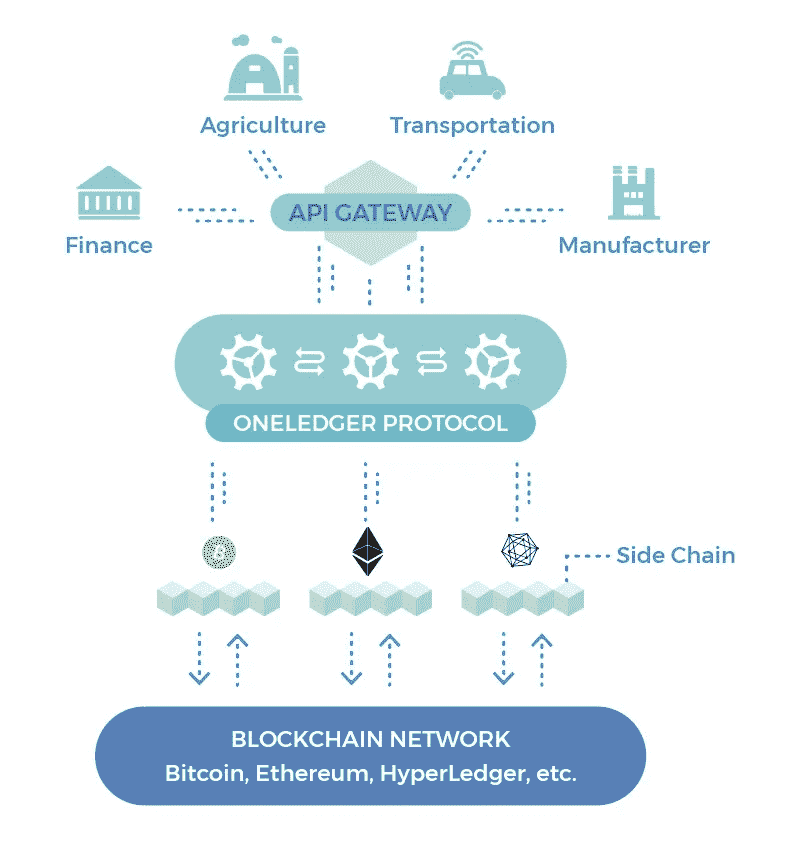
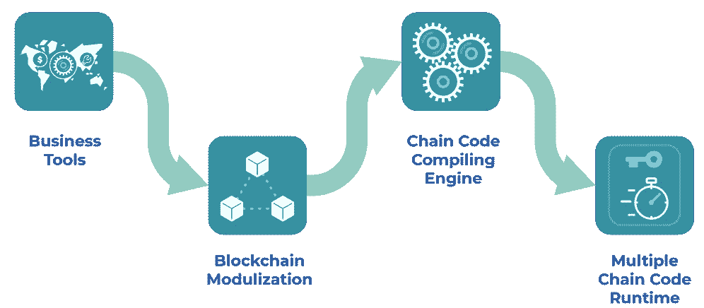
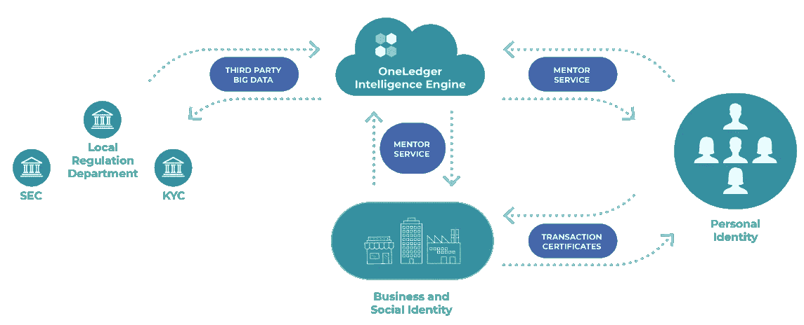
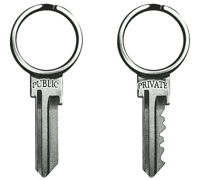

# 在区块链世界中茁壮成长:私有 Vs 公有区块链

> 原文：<https://medium.com/coinmonks/surviving-in-a-blockchain-world-the-vision-of-the-oneledger-project-becbcfef3a2b?source=collection_archive---------4----------------------->

Private internal blockchains, if disconnected from external blockchains, serve no useful purpose (Image: [Unsplash](https://unsplash.com/@krisroller?utm_source=medium&utm_medium=referral))

*本文意在提供一个* ***的行话——lite****的视角来看待企业面临的挑战，试图* ***适应*** *和* ***采用基于*******的分布式总账*** *技术。虽然本文假设了一些基本的区块链知识，但它试图解释无权限的***和有权限的***区块链、* ***内部的*** *和* ***外部的*** *区块链之间的重要区别，以及开发*****的方法通过检查 ***总账项目*** *提出的相关解决方案，进一步探讨这些概念和业务挑战。********

**itcoin，以及紧随其后的流行的区块链平台，允许任何人购买这些区块链操作所依赖的价值单位。这使得散户投资者——从父母到普通人——将资金投入这个领域。因此，许多新项目试图通过面向消费者的理念**来吸引这些散户投资者的注意力**，如视频交付平台(如 Verasity)、消费者忠诚度计划(如 Carry Protocol)和分散共享经济(如 Bee Token)。**

**然而，就现实世界的采用和开发而言，区块链项目在**企业空间**取得了更大的进展，在零售消费者可能永远不会直接接触的运营领域。**

**在这个世界上，企业需要采用区块链技术来保持竞争力，因此 [**OneLedger 项目**](https://oneledger.io/) 备受关注。**

**那么，希望利用基于区块链的分布式账本技术的企业有什么样的需求呢？**

*   ****快速**和**机密**区块链作业，通过**‘许可’**和/或**‘非连锁’**流程实施。**
*   ****内部区块链与外部区块链的互操作性**和**同步**。**
*   ****跨平台**分散式应用(DApp)和智能合同支持。**
*   ****身份管理**用于分配操作控制(角色)和网络内声誉的累积。**

****

**What are the tradeoffs between permissionless and permissioned networks? (Image: [Unsplash](https://unsplash.com/@punttim?utm_source=medium&utm_medium=referral))**

**让我们从讨论**无权限**和**有权限**区块链的区别开始:**

## **未经许可的区块链…**

**比特币和以太坊是**【无许可】**区块链。在这种情况下，无许可描述了访问区块链网络的自由，因为任何人都可以购买网络内的价值单位，或者运行网络节点等等，**而无需来自中央机构的**许可。这种设计的意图不仅仅是平等主义；它直接增强了平台的安全性和廉洁性，因为平台内没有关键的**中央权威**可以被**攻击**或**增选**。**

## **...是公共的…**

**无权限区块链也倾向于对谁可以查看他们的数据没有限制，因为没有中央权力机构来决定谁可以查看什么。这样的区块链经常被描述为“公众人物”。**

## **…而且很慢！**

**未经许可的区块链平台也渴望运行在**分布良好的**和**众多**节点网络上，这些节点参与存储**所有**关键的区块链数据，并采用高度**健壮的共识机制**，可以应对大量的网络波动和直接攻击。由于这些原因，没有权限的区块链往往是**缓慢。**比如比特币和以太坊预计每秒最大交易量(tps)分别为 3-7 tps 和 20 tps。**

**现在让我们考虑一下**【被许可】的区块链。****

********

****Permissioned blockchains can have high-performance, but are of limited use in isolation (Image: [Unsplash](https://unsplash.com/@she_sees?utm_source=medium&utm_medium=referral))****

## ****许可区块链可以是私人的和快速的...****

****在未经许可的区块链中，缺乏保密性和速度显然与许多企业活动的要求不相容。为了更好地支持这样的活动，一个选择是建立一个**许可的**区块链。在这样的区块链上，**可以委托**谁可以获得什么区块链数据，谁可以改变区块链上的数据，或者谁可以运行一个网络节点，等等。因为这种区块链上的私人数据很可能只在企业内部共享，我们可以将这种区块链描述为**【内部】**(以帮助区分它们与**【外部】**区块链平台，如比特币和以太坊)。****

****通过预先选择可信节点运营商来运行许可的区块链，网络的**大小**和共识机制的**严格性**都可以被**降低，**同时仍然保持安全性。这些减少使得得到许可的区块链比没有得到许可的区块链如比特币和以太坊运行得更快。****

## ****…但是，养一只 DApp 需要一个村子的力量！****

****尽管有上述优势，许可的区块链实际上是鲁布-戈德堡数据库**，除非**它们的目的是**与外部区块链网络**互操作。像比特币和以太坊这样的区块链公共网络对企业来说是一个巨大的基础设施机会，提供开源、健壮、国际化和公正的网络，这些企业不必自己开发或谈判。****

****OneLedger 团队的观点是，当企业习惯于与外部区块链网络内的数据和流程进行同步、查询和扩展时，内部区块链可以为企业带来巨大的好处。为了有任何真正的效用，内部区块链——以及任何建立在它们之上的去中心化应用——需要**与外部平台的更大“村庄”进行互操作。******

****正如下一节所讨论的，内部区块链的有效**实现**和**使用**与外部区块链(公共和私有)进行互操作，这是 **OneLedger 平台**的主要关注点。****

********

****Figure 1 (Image: OneLedger whitepaper, pg 5)****

# ****OneLedger 平台****

## ****体系结构****

****如图 1 的下半部分所示(见上文)，OneLedger 平台建议为企业希望与之互操作的每个外部**【主链】**网络创建单独的**【侧链】**。在图 1 中，主链示例是**比特币**、**以太坊**和**超级账户**。在 OneLedger 平台上，每个业务将能够配置这些侧链在多大程度上以**许可**或**无许可**状态运行。****

****OneLedger 平台还将允许每个侧链在稍后的****时间**对其主链副本执行可协调(即达成共识)的操作。因为在共识事件之间发生的这种操作不受主链的事务速度限制的限制，所以这种方法被称为**“链外缩放”**。******

******图 1 还说明了 **OneLedger 协议**将处理这些侧链和各种业务运营之间的通信，以及促进侧链之间的一致性(对于实现“跨链”运营的 DApps，如下所述)。******

******如图 1 顶部所示，OneLedger 平台将包括一个 **API** (应用程序编程接口)，旨在简化业务运营和 OneLedger 协议之间的信息流开发。******

************

******Figure 2 (Image: OneLedger whitepaper, pg 7)******

## ******跨链分散式应用******

******OneLedger 团队设想，多个区块链平台将会共存，企业可能希望在各种平台上编写和部署由智能合约驱动的去中心化应用程序。******

******因此，OneLedger 团队正在开发一个 SDK(软件开发工具包)，它将允许程序员创建一个**“主智能合同”**，从该合同中可以导出**不同平台语言**的智能合同(参见图 2 中的“链代码编译引擎”)。这种输出的语言可以包括以太坊的 Solidity 或者 EOS 的 C/C++。因此，这个 SDK 的用户可以开发一个可以在多个平台上运行的智能契约。******

******除了跨不同网络复制分散的应用程序，OneLedger 平台还旨在支持能够**结合**不同平台独特属性的“**跨链”**应用程序。例如，跨链智能合约可以将比特币的**储值功能**与以太坊的**图灵完全计算功能**结合起来。另一个可能的应用是跨不同的加密货币进行支付，例如使用莱特币进行比特币支付。******

******这种跨平台 SDK 在其他软件开发市场很常见。一个众所周知的例子是 **Unity** (一个非常流行的游戏开发环境)，它允许开发的游戏被导出到多个平台上运行，包括 iOS、Android、Windows 和 Mac 以及允许不同平台上的玩家进行交互。******

******除了跨链支持之外，OneLedger 项目还旨在通过**代码模块化和创建**市场**来销售和购买应用程序/服务，从而极大地**简化**业务活动与区块链流程的集成。********

************

******Figure 3 (Image: OneLedger whitepaper, pg 6)******

## ******身份管理******

******OneLedger 方法的另一个关键部分是身份管理。该平台将允许创建可分配给**私有/公共密钥对**的身份。这在 OneLedger 白皮书中称为**‘公钥基础设施’**(PKI)。******

******公钥基础设施是一种成熟高效的安全身份认证技术，广泛应用于电子商务、网上银行和机密邮件。尽管公钥基础设施通常涉及分配私钥/公钥对的**中央机构**，但是这些对也可以通过分散的方法有效地分配。******

******现在让我们在稍微深一点的层次上检查公钥基础设施，因为这将有助于说明为什么这种技术适合于在**分散的**网络中建立**可信身份**。******

************

******私钥和它关联的公钥之间的关系是什么？通过加密过程，一个**公钥**(一个众所周知的字母和数字串)可以用来**证明**那个人拥有相应的**私钥**(一个必须保密的字母和数字串)。底层加密技术的神奇之处在于，实际上**不可能**使用公钥**逆向工程**私钥。******

******这意味着私钥的拥有者可以反复证明他们的身份并授权交易**而不会**泄露任何敏感信息。******

******此外，这种私有/公共密钥对的使用允许在网络内建立身份和权威，即使该身份**不**与个人或团体的真实世界**个人身份**相关联。******

******这方面的一个例子是比特币，参与者使用私钥/公钥对来证明他们有权从特定的比特币地址发送比特币。他们这样做**【化名】**，即与他们的**个人身份**无关。然而，作为与公共区块链相关的问题的一个有用的例子，已经开发出技术来**通过比特币**交易历史**追溯**假名身份到个人身份(隐私不是比特币的设计目标)。******

****在 OneLedger 平台上，参与者将能够将其分配的私有/公共密钥对(称为**“主密钥对”)**与其他平台上的公共密钥相关联。至关重要的是，这将允许跟踪和管理存储在**多个**网络平台上的用户资产，包括主链。****

****如图 3 所示，主密钥对可以与不同的**身份类型**相关联，以便在特定的上下文中使用。例如，参与者可以选择建立单独的**个人**、**业务**和**社交身份**，并通过最合适的身份类型与外部第三方系统进行交互(例如，考虑通常在 LinkedIn 上共享的信息与在脸书上共享的信息之间的差异)。****

****OneLedger 平台还将允许主密钥对身份相互分配**信任值**。只要每个参与者都知道并信任他们所赋予价值的其他参与者，一个可靠的 **'** [**信任网**](https://en.wikipedia.org/wiki/Web_of_trust) **'** 就能在网络中出现。重要的是要注意，即使主密钥对身份是**假名**，并且重要的是**没有**中央机构的参与，这种信任网络也可以发展。****

****OneLedger 平台的身份管理系统对于希望使用**许可**区块链的企业可能特别有用。OneLedger 平台上的身份将允许在此类许可的区块链内分配**角色**，包括基本授权，如**读取**和**写入**访问。通过 OneLedger 平台上可信身份的出现，参与的企业也将能够更容易地获得可靠的区块链服务。例如，可以通过使用 OneLedger 平台搜索具有**高** **信任**评级的节点运营商来外包区块链节点的运营。****

****与消费者在使用**亚马逊**或 **AirBnB** 时可能感到相对安全的方式类似(由于对这些平台上评论和声誉真实性的信心)，**可靠的信任评级**可能是对 OneLedger 平台及其应用和服务计划市场的额外吸引力。****

****总之，我们已经讨论了那些试图**适应**和**采用**基于区块链的分布式总账技术的企业所面临的**挑战**。此外，我们还探索了**无权限**和**有权限**区块链之间的关键差异、**内部**和**外部**区块链之间的协同作用，以及在**去中心化**网络中开发**安全**和**可信**身份的方法。我们还研究了 **OneLedger 项目**如何解决已确定的业务挑战。****

****OneLedger 团队显然专注于为旨在与比特币和以太坊等成熟的区块链公共平台建立**互操作性**的企业提供“一站式商店”。本文旨在提供该项目的一些主要方面的概述，因此，要了解更全面的信息和技术细节，请参考 [**OneLedger 白皮书**](https://oneledger.io/wp-content/uploads/2018/06/oneledger-whitepaper-06.01.18.pdf) 。****

******免责声明:**本文**并非**理财建议。还请理解，任何象征性投资都可能导致该投资的**部分或** **全部** **损失**，因此请自行研究。****