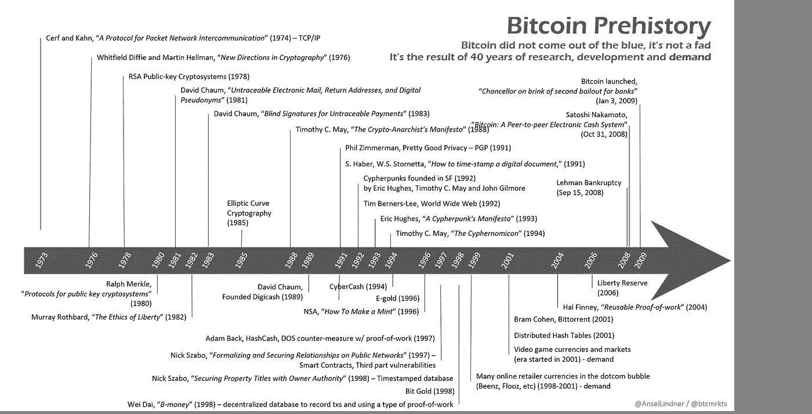
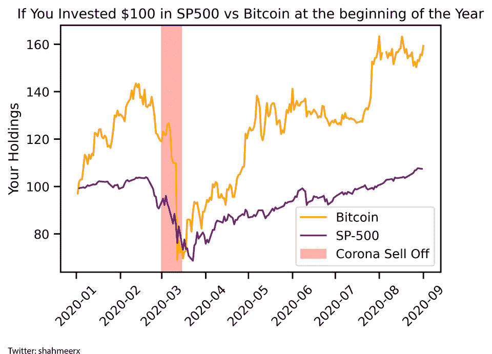
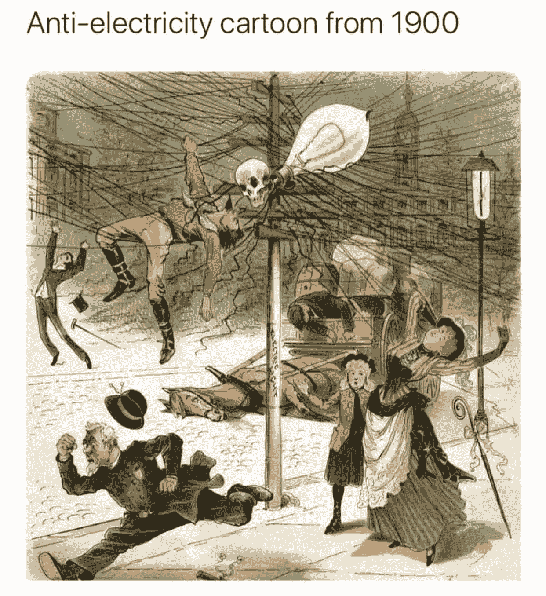

# Sushi 的主要开发商 cash out / Bithumb 被警方突袭/比特币基地推出 IOE 平台

> 原文：<https://medium.com/coinmonks/sushis-lead-developer-cash-out-bithumb-raided-by-police-coinbase-launching-ioe-platform-79100042ff4e?source=collection_archive---------1----------------------->

[Source](https://www.reddit.com/r/Bitcoin/comments/io4i0b/bitcoin_prehistory_bitcoin_did_not_come_out_of/)

## 曲线分叉转向融资(SWRV)锁定超过 4 亿美元

Sushi 的主要开发者使用 Uniswap 兑现 38k ETH 的所有累积令牌。那是一个退出骗局吗？现在寿司的创始人[将控制权移交给 FTX 的山姆](https://twitter.com/NomiChef/status/1302509536943640577)。

[Source](https://twitter.com/mattybchats/status/1302268443912175617)

## 试试 [Bitsgap](https://bitsgap.com/?ref=2cb1231&utm_source=coinmonks&utm_medum=blog&utm_campaign=coinmonks_newsletter)

寻找简单的易于使用的加密交易机器人？阅读我们的 [Bitsgap 评论](https://blog.coincodecap.com/bitsgap-review)。

[Bitsgap](https://bitsgap.com/?ref=2cb1231&utm_source=coinmonks&utm_medum=blog&utm_campaign=coinmonks_newsletter) 是一个真正有用的平台，它提供了简单的交易机器人、信号、套利机会和强大的交易终端。

## 最新消息📰

*   韩国加密交易所 Bithumb 因涉嫌 2520 万美元诈骗案被警方突袭
*   美联储现在拥有近三分之一的美国抵押贷款
*   在首席开发商[卖掉他/她的所有股份后，寿司令牌的价格暴跌了 80%](https://www.forbes.com/sites/tatianakoffman/2020/09/06/exclusive-sbf-speaks-out-on-defis-sushi-saga/#261e7ed65145)
*   比特币基地推出首次公开募股(IEO)平台
*   Eth2 testnet Medalla 激活了超过 42，000 个验证器，并有 10 天的加入队列。阅读最新的 Eth2 更新[这里](https://hackmd.io/@benjaminion/eth2_news/https%3A%2F%2Fhackmd.io%2F%40benjaminion%2Fwnie2_200905)和[这里](https://blog.ethereum.org/2020/09/01/eth2-quick-update-no-15/)。
*   该图的[托管服务](https://twitter.com/graphprotocol/status/1301634482714402816)现在每天处理超过 2 . 2 亿次查询
*   曲线叉[转向](https://bitcoinexchangeguide.com/curve-fork-swerve-finance-swrv-locks-in-over-400-million-within-a-day-of-launch/)金融(SWRV)在推出一天内锁定超过 4 亿美元
*   链环节点在上周末的一次攻击中成为目标，[损失了 700 ETH](https://www.theblockcrypto.com/post/76986/chainlink-nodes-attack-eth)
*   微软警告[数字货币所有者](https://cointelegraph.com/news/microsoft-warns-digital-currency-owners-to-be-aware-of-new-malware)警惕新的恶意软件
*   瑞士从明年开始接受比特币税
*   Uniswap [的总锁定价值超过了](https://www.theblockcrypto.com/linked/76725/uniswap-maker-tlv-sushiswap)制造商
*   哈萨克斯坦将在比特币开采上下 7 亿美元的赌注
*   硬件[钱包漏洞](https://www.coindesk.com/trezor-keepkey-wallets-attack)让攻击者在不接触设备的情况下持有密码勒索赎金

[Source](https://www.reddit.com/r/Bitcoin/comments/iop1xm/bitcoin_performance_2020_compared_to_sp_500/)

## 播客💽

*   开发商[社区](https://onthebrink-podcast.com/electric-capital/)，筹集机构资本
*   对不起，政府们，我们正在进入私人资金时代

## 好的读物📑

*   我认为最好的加密税务工具
*   [Web3](https://blog.oceanprotocol.com/the-web3-sustainability-loop-b2a4097a36e) 可持续发展循环
*   将 Eth 2.0 简化为数据可用性层
*   缩放[定义](https://blog.0xproject.com/scaling-defi-layer-one-7eeb24aca4f0) —第一层
*   简易[自动](/coinmonks/simple-automated-market-making-for-dummies-d10869a727a5)做市商假人
*   在[高以太气](/livepeer-blog/livepeer-protocol-scaling-during-times-of-high-ethereum-gas-prices-f13614562d6a)价格时期
*   比特币:一种[新奇的](https://ark-invest.com/white-papers/bitcoin-part-one/)经济机构
*   所有的[数字内容](https://blog.coinfund.io/all-digital-content-is-going-on-chain-ae26a7071657)都在链上运行
*   DeFi 中的有机[增长](/@vadymnesterenko/organic-growth-in-defi-19f4d71c0c9f)
*   治理令牌[对 DeFi 协议的深远影响](https://cryptopurview.com/governance-token-far-reaching-impact-on-defi-protocols/)

> 想了解以太网开发- Linda Xie 正在组织一次虚拟会议-填写[这份注册表格](https://docs.google.com/forms/d/e/1FAIpQLSdoARMfQ9L0C2N-qRcIfqOmzAIGlhXeeeAzTnmb8CeXIav1Kg/viewform)。

## 开发商

*   [图](https://soliditydeveloper.com/thegraph):修复 Web3 数据查询
*   通过研究源代码了解[以太坊](https://gisli.hamstur.is/2020/08/understanding-ethereum-by-studying-the-source-code/)
*   获取[以太币令牌余额](https://blog.bitquery.io/etheruem-token-api)的单一 API
*   [Compound.js](/compound-finance/compound-js-9d1e3e5742d8)
*   [坚实度教程](/coinmonks/solidity-tutorial-all-about-mappings-29a12269ee14):关于映射的所有内容
*   新证书[链](/stakin/introduction-to-certik-chain-936023ccd3e7)和听障语
*   如何[构建](https://blog.scrt.network/how-to-build-secret-apps/)秘密应用程序:不断发展的开发指南
*   [MuSig-DN](/blockstream/musig-dn-schnorr-multisignatures-with-verifiably-deterministic-nonces-27424b5df9d6) : Schnorr 多重签名，具有可验证的确定性随机数
*   [恢复](https://wilbarnes.ghost.io/restoring-dai-peg-triforce-yvault/)戴钉与三力耶特/MKR/戴伊沃
*   智能合同[共享](/coinmonks/smart-contracts-sharing-common-data-777310263ac0?source=friends_link&sk=b462ff3559ae9c8da243ba31a557e4f4)公共数据
*   亚历山大港:连锁历史超过发现
*   BLS [签名](https://ethresear.ch/t/bls-signatures-in-solidity/7919)在实处
*   构建和使用[外部](https://blog.chain.link/build-and-use-external-adapters/)适配器
*   [安全](https://github.com/crytic/building-secure-contracts/blob/master/development-guidelines/workflow.md)开发工作流程
*   [解释 Halo2](https://electriccoin.co/blog/explaining-halo-2/) ，一个没有可信设置的 SNARK
*   如何运行[探险街区探索者](https://www.quiknode.io/guides/infrastructure/how-to-run-expedition-block-explorer)

## 黑客马拉松

*   HackAtom India :打造宇宙
*   链环虚拟[黑客马拉松](https://chainlink-hackathon.devpost.com/)
*   [HackAtom V](http://hackatomv.devpost.com)

## 产品评论

*   [you hodler](https://blog.coincodecap.com/youhodler-earn-crypto-interest)——4 种简单的赚钱方法
*   [Hodlnaut 评论](https://blog.coincodecap.com/hodlnaut-review)——Hodl 的最佳方式是赚取你的比特币的利息
*   [Quadency Review](https://blog.coincodecap.com/quadency-review-a-crypto-trading-automation-platform)——专为专业人士打造的加密交易机器人
*   [Botsfolio Review](https://blog.coincodecap.com/botsfolio-review-automate-crypto-investment)——让你的加密投资自动化的简单方法
*   Napbots 评论——增加加密回报的简单方法
*   [Shrimpy 评论](https://blog.coincodecap.com/shrimpy-crypto-trading-bot-review) —社交投资组合管理的加密交易机器人
*   你需要知道的 2020 年前五大[加密贷款平台](https://blog.coincodecap.com/top-5-crypto-lending-platforms)
*   2020 年最佳加密交易机器人

想让我们展示你的产品吗？请通过 [Twitter @coinmonks](https://twitter.com/coinmonks) 联系我们

## 多方面的

*   [胃痉挛](https://etherscan.io/gastracker)
*   [惬意财经](/@cozyfinance/introducing-cozy-finance-8af86e0ded41)
*   [CosmWasm](https://cosmwasm.com/) —建立多链契约
*   安全游戏[甲骨文](https://www.certik.foundation/blog/announcing-game-of-security-oracle-operators)运营商
*   如何[将 Ledger](/chainapsis/how-to-use-ledger-nano-hardware-wallet-with-keplr-9ea7f07826c2) Nano 硬件钱包与 Keplr(宇宙生态系统的 Metamask)配合使用
*   Lunie [通知](/luniehq/come-try-lunie-notifications-in-early-beta-today-c48f9fbb67dd)
*   分布式远程密钥管理器 Dirk
*   [桌面](/@tycooperaow/how-to-add-decentralized-applications-accessible-directly-from-your-desktop-desktop-dapps-fb8578674284) Dapps —添加可从桌面直接访问的分散应用
*   [Eth2.0](https://kb.beaconcha.in/) 知识库
*   [uni pool](/unipool-finance/unipool-the-uniswap-union-7bd927044cd8)—uni swap 联盟
*   open dex——分散交易标准
*   保密会议

## 照片说明了一切📷

比特币永远不行？😜

[Source](https://www.reddit.com/r/Bitcoin/comments/il1qr6/bitcoin_will_never_work/)

## 在 Coinmonks 上发布

如果你喜欢在 crypto/区块链空间上写教育文章，并且想在 Coinmonks 出版物上发表。只需在**发邮件给我或者 DM 我**[***推特***](https://twitter.com/coinmonks)**

> ***“如果你喜欢读* [*【币僧】*](https://medium.com/coinmonks)*[*你也可以捐我们*](/coinmonks/monks-need-your-help-7440418d67ec) *。****

> ***[*在您的收件箱中直接获得最佳软件交易*](https://coincodecap.com/?utm_source=coinmonks)***

******