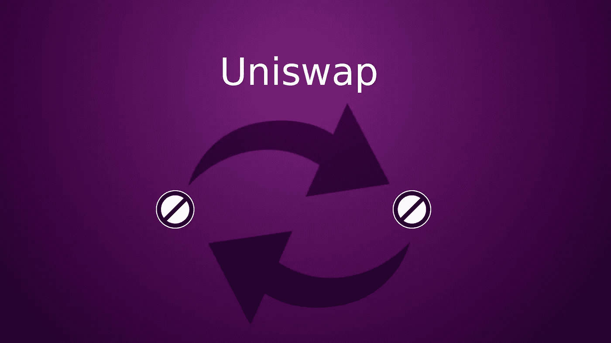
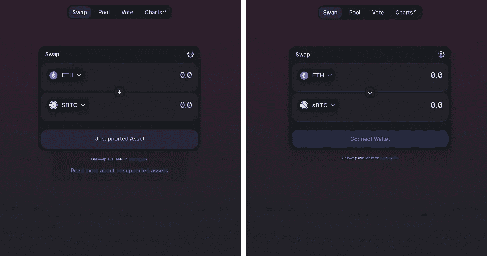

# 通过 web 界面通过 Uniswap 交换不支持的令牌

> 原文：<https://medium.com/coinmonks/swapping-unsupported-tokens-in-uniswap-via-the-web-interface-42cfeab8c1a5?source=collection_archive---------1----------------------->



Forbidden Tokens By Sebastião Teixeira

# **简介**

最近，[在 Uniswap 博客](https://uniswap.org/blog/token-access-app/)上宣布，由于监管环境的演变，通过[app.uniswap.org](http://app.uniswap.org)限制某些代币。该限制仅适用于 app.uniswap.org 域中作为普通用户图形界面的 web 应用程序。

智能合约是不可变的，因此，仍然可以通过接口、solidity 或 web3 库来执行不支持的令牌交换。

不支持的令牌列表主要由 Synthetix、UMA 和 Mirror 等协议中的合成令牌组成。还包括选项协议令牌，如 Opyn，以及其他治理令牌，如 dYdX。完整的最新的 app.uniswap.com 不受支持的令牌列表可以在这里找到。

大多数 DeFi 协议中的主要集中点正是在允许普通用户与协议交互的 webapp 中，然而，近年来出现了几个解决这个问题的解决方案，如 [IPFS](https://ipfs.io/) 、[蜂群](https://www.ethswarm.org/)、 [ENS](https://ens.domains/) 、[不可阻挡域](https://unstoppabledomains.com/)和 [Namecoin](https://www.namecoin.org/) 。

# IPFS 上空的 Uniswap

IPFS(星际文件系统)是一种对等超媒体协议，允许在分散的网络上存储和共享信息。2020 年 6 月 30 日，Uniswap 正式[在博客](https://uniswap.org/blog/ipfs-uniswap-interface/)上宣布分散使用 IPFS 托管 Uniswap 接口。

IPFS 使用基于内容的寻址，即根据文件中包含的信息生成哈希地址。因此，不同的文件与不同的地址相关联。为了解决这个问题，Uniswap 使用 DNSRecord 将[app.uniswap.org](http://app.uniswap.org)地址映射到 webapp 最新版本的地址，并使用 ENS 将 [app.uniswap.eth](http://app.uniswap.eth.link) 映射到该地址。

# 访问不支持的令牌

正如我们在下面看到的，令牌限制仅应用于 app.uniswap.org 域，如果域与此不同，`localUnsupportedListMap`将为空。

```
// ln. 35 [uniswap-interface/src/constants/misc.ts/](https://github.com/Uniswap/uniswap-interface/blob/07f52f02ff6cff7688c11548318d591881021227/src/constants/misc.ts)export window && = const IS_ON_APP_URL window.location.hostname === ‘app.uniswap.org’// ln. 120–121 [uniswap-interface/src/state/lists/hooks.ts/](https://github.com/Uniswap/uniswap-interface/blob/4078390a4890445d1ff0ed5196fd4cb56a44de87/src/state/lists/hooks.ts)// get hard coded unsupported tokens, only block on app url
const localUnsupportedListMap = useMe => (IS_ON_APP_URL ? listToTokenMap(UNSUPPORTED_TOKEN_LIST) : {}), [])
```

你可以在 https://github.com/Uniswap/uniswap-interface T2 找到完整的代码。

因此，可以通过 ENS 域或通过 IPFS 节点完全访问 Uniswap Dapp。例如:

[https://app.uniswap.eth.link/#/](https://app.uniswap.eth.link/#/)

[https://cloudflare-ipfs.com/ipns/app.uniswap.org/#/](https://cloudflare-ipfs.com/ipns/app.uniswap.org/#/)

[https://app-uniswap-org.ipns.dweb.link/#/](https://app-uniswap-org.ipns.dweb.link/#/)

[http://127 . 0 . 0 . 1:8080/ipns/app . unis WAP . eth . link/#/](http://127.0.0.1:8080/ipns/app.uniswap.eth.link/#/)(如果运行自己的 IPFS 节点)

## **更新提醒:**随着提交 [627a5d3](https://github.com/Uniswap/interface/commit/627a5d3a98e65fae431fed3d650f6e359890e523) 的实施，从 4.13.0 版(2021 年 9 月 6 日)起，对这些令牌的支持已被完全移除。使用早期版本可以访问不支持的令牌。为此，IPFS 网关可用于访问 4.12.18 版:

*   [https://bafybeifqmb 6 hcx 6 golqgb 6 lkr rwbf 3d 4 tccszynnhqc 7 ai 4 nd 2d 43 BOQ . ipfs . dweb . link/](https://bafybeifqmb6hcx6golqgb6lkrrwbf3d4tcotcszynnhqc7ai4nd2d43boq.ipfs.dweb.link/)
*   [https://bafybeifqmb 6 hcx 6 golqgb 6 lkr rwbf 3d 4 tccszynnhqc 7 ai 4 nd 2d 43 BOQ . ipfs . cf-ipfs . com/](https://bafybeifqmb6hcx6golqgb6lkrrwbf3d4tcotcszynnhqc7ai4nd2d43boq.ipfs.cf-ipfs.com/)
*   ipfs://qmad 9 obr 38 kdhi w5 t 69 ygka 2 hx X5 yzqxcxsgfoo 8 yet yxm/



https://app.uniswap.org vs ipfs://QmaD9oBr38KDhiw5T69ygkA2hxx5yZqXcxSGFoo8yeTYXm/

你也可以在 [github](https://github.com/Uniswap/uniswap-interface/releases/) 上找到不同 Uniswap 图形界面版本的 IPFS 地址。通过这种方式，您可以选择想要使用的界面版本，从而独立于未来的 GUI 更新。

## **结论**

由于技术和分布式网络的进步，在分布式应用中限制访问变得不切实际。

我希望这能帮助那些想了解更多关于 DeFi 宇宙的知识的人，以及那些希望分散互联网的人。

如果你在这篇文章中发现任何不准确的地方，请留下评论。

## 放弃

本文中提到的每一个例子都是为了教育，因为教育是它唯一的目的，所以它不应该被视为财务建议。

## **参考文献**

*Uniswap 博客文章:*

【https://uniswap.org/blog/token-access-app/】T5[T6](https://uniswap.org/blog/token-access-app/)

[*https://uniswap.org/blog/ipfs-uniswap-interface/*](https://uniswap.org/blog/ipfs-uniswap-interface/)

*IPFS 文件:*

[](https://docs.ipfs.io/) [## IPFS 文献

### 不管你是谁或你在创造什么，你都可以成为创造下一代的运动的一部分…

docs.ipfs.io](https://docs.ipfs.io/) 

> 加入 [Coinmonks 电报频道](https://t.me/coincodecap)，了解加密交易和投资

## 另外，阅读

[](https://blog.coincodecap.com/crypto-exchange) [## 最佳加密交易所| 2021 年十大加密货币交易所

### 加密货币交易所的加密交易需要了解市场，这可以帮助你获得利润…

blog.coincodecap.com](https://blog.coincodecap.com/crypto-exchange) [](https://blog.coincodecap.com/crypto-lending) [## 2021 年 9 大最佳加密借贷平台

### 当谈到加密货币贷款时，大量因素等同于良好的收入状况。此外，借款的一部分…

blog.coincodecap.com](https://blog.coincodecap.com/crypto-lending) [](/coinmonks/crypto-trading-bot-c2ffce8acb2a) [## 2021 年最佳加密交易机器人(免费和付费)

### 2021 年币安、比特币基地、库币和其他密码交易所的最佳密码交易机器人。四进制，位间隙…

medium.com](/coinmonks/crypto-trading-bot-c2ffce8acb2a)