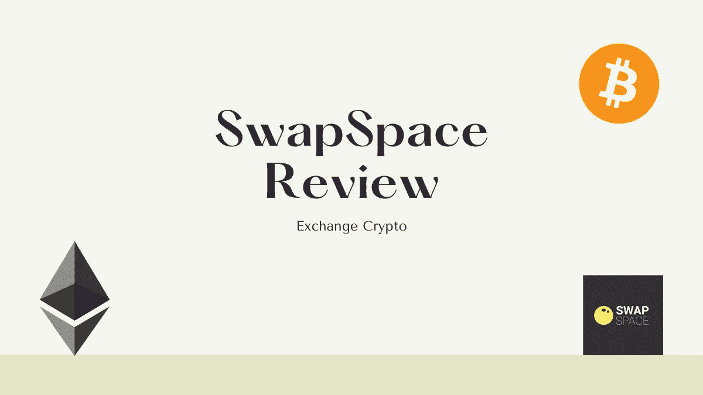
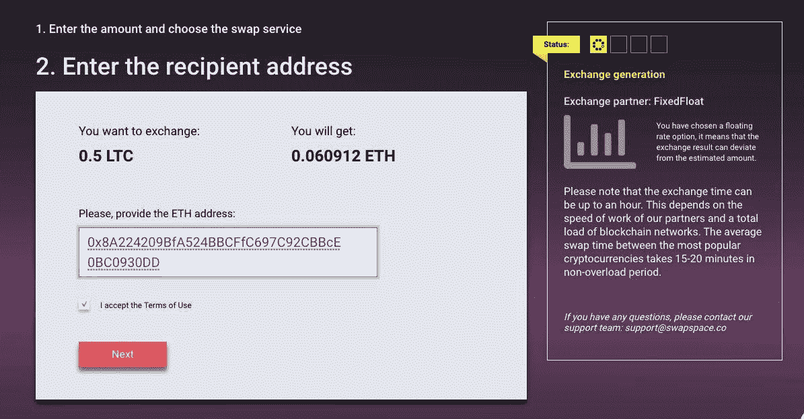
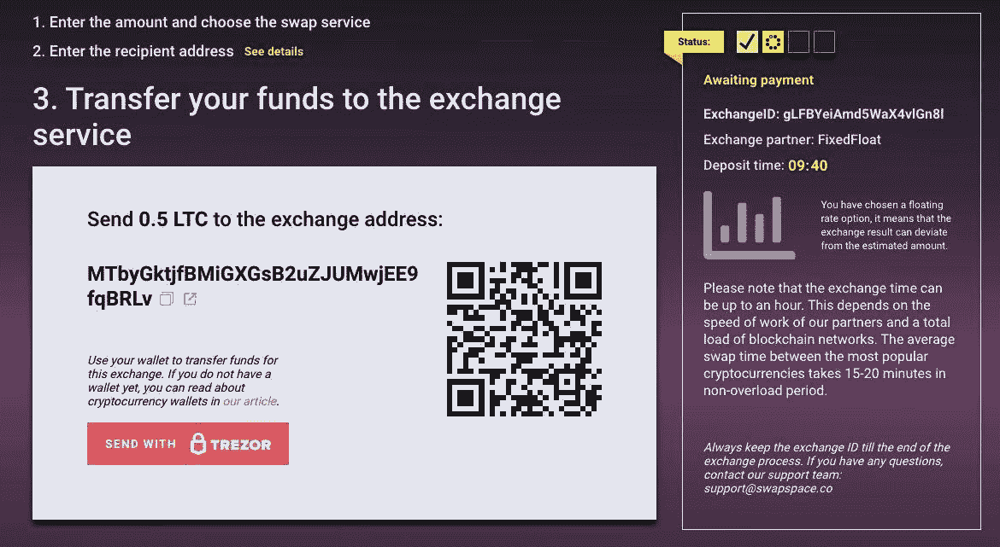

# 交换空间评论|立即交换您的密码

> 原文：<https://medium.com/coinmonks/swapspace-review-exchange-your-crypto-instantly-ccc7984fa18c?source=collection_archive---------4----------------------->

在本文中，我们将回顾 2019 年推出的即时加密货币交易聚合器 [SwapSpace](https://blog.coincodecap.com/go/swapspace) 。在快速变化的加密货币领域，它旨在通过简化兑换流程来打破新手的准入门槛，并使这一过程透明和有利可图，没有限制，没有额外费用，也没有冗长的注册。

# 什么是交换空间？

[SwapSpace](https://blog.coincodecap.com/go/swapspace) 是一个即时加密兑换聚合器，它在一个简单的界面中收集和比较来自许多即时兑换的汇率，为 [crypto](https://blog.coincodecap.com/tag/crypto) 用户提供轻松兑换 350 多个硬币的机会，并且不会多付。它在全球范围内运营，只与可靠的合作伙伴合作，不需要创建帐户，并允许通过简单的界面和直观的 4 步交换流程无限制地交换密码。作为一个非托管交易所，它不存储您的资金，这意味着您可以直接从您的[钱包](https://blog.coincodecap.com/tag/wallet)中兑换硬币和代币，并免受交易所黑客攻击和其他托管风险的影响。

# 交换空间特征

*   注册免费-你不需要注册使用交换空间-只需点击一下就可以开始交换。
*   **无额外费用**:平台不会将自己的费用加到合作伙伴的费用上。您在 SwapSpace 上看到的汇率将与原始汇率相同。汇率已经包含在价格中了。
*   超过 350 种加密货币和 60，000 个交换对。
*   固定汇率和浮动汇率。
*   在 SwapSpace 上，不需要预 KYC。但是，如果交易被标记为可疑，合作伙伴的风险管理系统可能会要求验证。
*   **限制** - SwapSpace 并没有对要交换的资金数量设置上限。许多硬币的下限从 2 美元开始，这是支付网络费用的必要金额。
*   24/7 聊天支持保证您可以随时获得帮助。
*   初学者友好的界面和直观的 4 步交流流程使交流变得容易，即使你刚刚开始在加密。
*   YouTube 影响者计划:SwapSpace 允许任何在 YouTube 或 T2 LBRY 上拥有博客的 crypto 粉丝将他们的努力货币化，并通过 T4 为视频评论付费来扩大受众。
*   [加盟计划](https://swapspace.co/affiliate)。在你的网站或社交网站上分享一个推荐链接，交换空间将与你分享一半的交换利润。通过 API 将 SwapSpace 整合到您的网站中，使您的客户无需离开您的平台即可轻松地以最优惠的价格交换加密。

# 交换空间是如何工作的？

这里是你如何使用交换空间交换加密。

1.  选择加密货币并输入您想要兑换的金额。选择交换交易。

2.输入您希望看到硬币的钱包。提交之前请仔细检查地址——加密货币交易开始后，您无法取消交易并获得退款。

3.转移你正在交换的硬币。二维码有助于您加快速度。

4.等到你看到钱包里的硬币。就是这样！检查交换跟踪器以了解您的硬币的情况，并在您觉得有问题时随时联系支持人员。

# 为什么 SwapSpace 不同于其他加密货币交易所？

SwapSpace 不仅仅提供了用不知道从哪里冒出来的费率和费用兑换硬币的机会，它还让你亲眼看到在每一个特定的案例中，哪些费率是真正有利可图的。为了努力使交易公平透明，它比较了许多领先即时交易所(包括 Changelly、 [ChangeNow](https://blog.coincodecap.com/changenow-review-a-secure-crypto-exchange) 、SimpleSwap 等)数百种硬币的汇率。

# 交换空间合法吗？

[SwapSpace](https://blog.coincodecap.com/go/swapspace) 是一种非托管交换，这意味着您可以直接从钱包中交换加密货币，并始终控制着您的私钥。

尽管是一个相对较新的交易所，SwapSpace 已经被它的客户认为是一个合法和值得信赖的服务。以下是 SwapSpace 上的 [Trustpilot 审查示例。](https://www.trustpilot.com/review/swapspace.co)

# 结论

SwapSpace 是一个期待已久的便捷解决方案，适用于所有想要快速无忧地交换加密货币的人。它提供大量硬币进行交换，包括稀有的硬币，不向客户收取额外费用，也不会收集您的个人数据。最后但同样重要的是，它在很大程度上得到了加密货币社区的认可。

## 另外，阅读

*   最好的[密码交易机器人](/coinmonks/crypto-trading-bot-c2ffce8acb2a)
*   [密码本交易平台](/coinmonks/top-10-crypto-copy-trading-platforms-for-beginners-d0c37c7d698c)
*   最好的[加密税务软件](/coinmonks/best-crypto-tax-tool-for-my-money-72d4b430816b)
*   [最佳加密交易平台](/coinmonks/the-best-crypto-trading-platforms-in-2020-the-definitive-guide-updated-c72f8b874555)
*   最佳[密码借贷平台](/coinmonks/top-5-crypto-lending-platforms-in-2020-that-you-need-to-know-a1b675cec3fa)
*   [最佳区块链分析工具](https://bitquery.io/blog/best-blockchain-analysis-tools-and-software)
*   [加密套利](/coinmonks/crypto-arbitrage-guide-how-to-make-money-as-a-beginner-62bfe5c868f6)指南:新手如何赚钱
*   最佳[加密制图工具](/coinmonks/what-are-the-best-charting-platforms-for-cryptocurrency-trading-85aade584d80)
*   [莱杰 vs 特雷佐](/coinmonks/ledger-vs-trezor-best-hardware-wallet-to-secure-cryptocurrency-22c7a3fd391e)
*   了解比特币的[最佳书籍有哪些？](/coinmonks/what-are-the-best-books-to-learn-bitcoin-409aeb9aff4b)
*   [3 商业评论](/coinmonks/3commas-review-an-excellent-crypto-trading-bot-2020-1313a58bec92)
*   [AAX 交易所评论](/coinmonks/aax-exchange-review-2021-67c5ea09330c) |推荐代码、交易费用、利弊
*   [Deribit 审查](/coinmonks/deribit-review-options-fees-apis-and-testnet-2ca16c4bbdb2) |选项、费用、API 和 Testnet
*   [FTX 密码交易所评论](/coinmonks/ftx-crypto-exchange-review-53664ac1198f)
*   [n 零审核](/coinmonks/ngrave-zero-review-c465cf8307fc)
*   [Bybit 交换审查](/coinmonks/bybit-exchange-review-dbd570019b71)
*   [3Commas vs Cryptohopper](/coinmonks/cryptohopper-vs-3commas-vs-shrimpy-a2c16095b8fe)
*   最好的比特币[硬件钱包](/coinmonks/the-best-cryptocurrency-hardware-wallets-of-2020-e28b1c124069?source=friends_link&sk=324dd9ff8556ab578d71e7ad7658ad7c)
*   最佳 [monero 钱包](https://blog.coincodecap.com/best-monero-wallets)
*   [莱杰 nano s vs x](https://blog.coincodecap.com/ledger-nano-s-vs-x)
*   [Bitsgap vs 3 commas vs quad ency](https://blog.coincodecap.com/bitsgap-3commas-quadency)
*   [莱杰 Nano S vs 特雷佐 one vs 特雷佐 T vs 莱杰 Nano X](https://blog.coincodecap.com/ledger-nano-s-vs-trezor-one-ledger-nano-x-trezor-t)
*   [block fi vs Celsius](/coinmonks/blockfi-vs-celsius-vs-hodlnaut-8a1cc8c26630)vs Hodlnaut
*   [bits gap review](/coinmonks/bitsgap-review-a-crypto-trading-bot-that-makes-easy-money-a5d88a336df2)——一个轻松赚钱的加密交易机器人
*   为专业人士设计的加密交易机器人
*   [PrimeXBT 审查](/coinmonks/primexbt-review-88e0815be858) |杠杆交易、费用和交易
*   [埃利帕尔泰坦评论](/coinmonks/ellipal-titan-review-85e9071dd029)
*   [赛克斯·斯通评论](https://blog.coincodecap.com/secux-stone-hardware-wallet-review)
*   [BlockFi 评论](/coinmonks/blockfi-review-53096053c097) |赚取高达 8.6%的加密利息

*原载于 2020 年 11 月 2 日 https://blog.coincodecap.com***。**