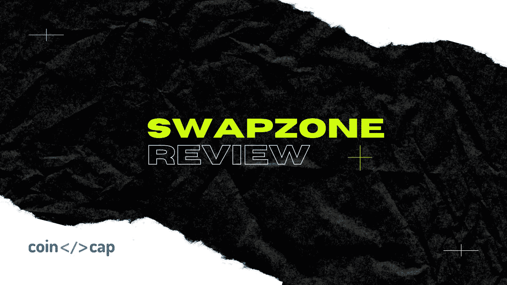

# 交换区评论|加密交换数据聚合器

> 原文：<https://medium.com/coinmonks/swapzone-review-crypto-exchange-data-aggregator-e0ad78e55ed7?source=collection_archive---------7----------------------->

[Swapzone](https://blog.coincodecap.com/go/swapzone) 已于 2019 年加入加密交换数据聚合器的行列。它充当用户和交换平台之间的中介，在一个地方收集所有相关信息，并实现即时的无托管交换。在本文中，我们将回顾 Swapzone 评论。

通过 Swapzone，您可以根据利率、交易时间和用户反馈来比较 SimpleSwap、Changelly 和 CoinSwitch 等 10 多种顶级交易所服务，从而为 300 多种加密货币资产选择最佳报价。

希望开始购买加密货币的用户被各种选择宠坏了。但是他们也非常谨慎。由于媒体对交易所的负面报道——这在早期是理所应当的——以及交易所之间存在的激烈竞争，潜在用户在试图确定前进方向时有些不知所措。

遵循自由和权力下放的理念，Swapzone 将控制权交还给人民，确保他们有更多的创收机会。

# 主要优势

加密交换数据聚合器的现象对行业来说已经不是什么新鲜事了，然而 Swapzone 拥有大量的功能，使其成为一项出色的服务，具有重塑区块链空间的巨大潜力:

*   支持的合作伙伴和资产范围不断扩大(目前 Swapzone 拥有 300 多项资产和 10 多个交换平台)；
*   免注册体验；
*   结合了用户评论、交换描述和 KYC 细节的有洞察力的聚合界面；
*   通过 Swapzone 合作伙伴的 API 进行的内部交换；
*   帮助解决交易问题的积极支持团队。

此外，Swapzone 开发人员通过编写统一的适配器极大地方便了即时交换所有者的 API 集成，这可以在他们详细的[集成指南](https://swapzone.gitbook.io/developer/)中找到。该聚合器也有自己的学习[部分](https://swapzone.io/learn/)，降低了加密新手进入该平台的门槛。

# Swapzone 如何工作

该平台布局简单，使整个过程尽可能简单和轻松。事情就是这么简单:

*   进入[主页](https://blog.coincodecap.com/go/swapzone)。
*   选择您希望收到的货币以及您希望兑换的货币。
*   输入您希望兑换的金额，以获得可用选项列表。
*   根据提供的费率类型、您可能收到的总金额、交易所需的时间以及服务提供商的声誉对它们进行筛选。
*   做出选择后，点击“交换”按钮确认。
*   填写他们的钱包信息，并将商定的金额转移到交换伙伴生成的钱包地址。
*   一旦指定的转账时间到了，资金就是你的了。

# 为什么选择 Swapzone？

今天的密码交易所本身就是一个完整的生态系统，一个权力集中的金融星球。一家大型交易所往往会向不同类别的交易者提供不同的价格，一份它认为适合其平台的货币清单，一份复杂的订单簿，甚至是它自己的内部货币，使用这些货币应该会使交易所对个人更有利可图。所有这些发展都可以被认为是健康的，但是，加密交易所的胜利在某种程度上给加密货币的基本愿景及其平衡金融竞争环境的潜力蒙上了阴影。

这并不是说交易所不好或者它们提供的服务受到操纵。但是 Swapzone 本质上分解了用户想要进行的交易的所有选项，并提供了密码行业发展所需的多样性。该服务旨在防止您的加密操作受到集中实体的密切监督，并帮助您了解整体情况，以找到您的完美交易。

## 另外，阅读

*   最好的[密码交易机器人](/coinmonks/crypto-trading-bot-c2ffce8acb2a)
*   [德里比特评论](/coinmonks/deribit-review-options-fees-apis-and-testnet-2ca16c4bbdb2) |选项、费用、API 和 Testnet
*   [FTX 密码交易所评论](/coinmonks/ftx-crypto-exchange-review-53664ac1198f)
*   最好的比特币[硬件钱包](/coinmonks/the-best-cryptocurrency-hardware-wallets-of-2020-e28b1c124069?source=friends_link&sk=324dd9ff8556ab578d71e7ad7658ad7c)
*   [加密复制交易平台](/coinmonks/top-10-crypto-copy-trading-platforms-for-beginners-d0c37c7d698c)
*   最好的[加密税务软件](/coinmonks/best-crypto-tax-tool-for-my-money-72d4b430816b)
*   [最佳加密交易平台](/coinmonks/the-best-crypto-trading-platforms-in-2020-the-definitive-guide-updated-c72f8b874555)
*   最佳[加密贷款平台](/coinmonks/top-5-crypto-lending-platforms-in-2020-that-you-need-to-know-a1b675cec3fa)
*   [block fi vs Celsius](/coinmonks/blockfi-vs-celsius-vs-hodlnaut-8a1cc8c26630)vs Hodlnaut
*   [莱杰 vs 特雷佐](/coinmonks/ledger-vs-trezor-best-hardware-wallet-to-secure-cryptocurrency-22c7a3fd391e)
*   Bitsgap 评论——一个轻松赚钱的加密交易机器人
*   [Quadency Review](/coinmonks/quadency-review-a-crypto-trading-automation-platform-3068eaa374e1) -为专业人士打造的加密交易机器人
*   [3 商业评论](https://blog.coincodecap.com/3commas-review-an-excellent-crypto-trading-bot) |一款优秀的密码交易机器人
*   [PrimeXBT 审查](/coinmonks/primexbt-review-88e0815be858) |杠杆交易、费用和交易
*   Bitmex 上的[保证金交易指南](/coinmonks/the-idiots-guide-to-margin-trading-on-bitmex-dbbd7742c6fc?source=friends_link&sk=7bfa99d2a181142510c8442c8ddb0786)
*   [加密摇摆交易权威指南](/coinmonks/the-definitive-guide-to-crypto-swing-trading-7e4af6496d4d?source=friends_link&sk=70448050bd9323b42f63bfc0bb1e60d1)
*   [Bitmex 高级保证金交易指南](/coinmonks/bitmex-advanced-margin-trading-guide-2270c195ce25?source=friends_link&sk=1d986cca731f5084b9a2db4a4bc4a7ad)
*   [开发人员的最佳加密 API](/coinmonks/best-crypto-apis-for-developers-5efe3a597a9f)
*   [加密套利](/coinmonks/crypto-arbitrage-guide-how-to-make-money-as-a-beginner-62bfe5c868f6)指南:新手如何赚钱
*   顶级[比特币节点](https://blog.coincodecap.com/bitcoin-node-solutions)提供商
*   最佳加密制图工具
*   了解比特币的[最佳书籍有哪些？](/coinmonks/what-are-the-best-books-to-learn-bitcoin-409aeb9aff4b)

> [直接在您的收件箱中获得最佳软件交易](https://coincodecap.com?utm_source=coinmonks)

*原载于 2020 年 11 月 18 日 https://blog.coincodecap.com**[*。*](https://blog.coincodecap.com/swapzone-review)*