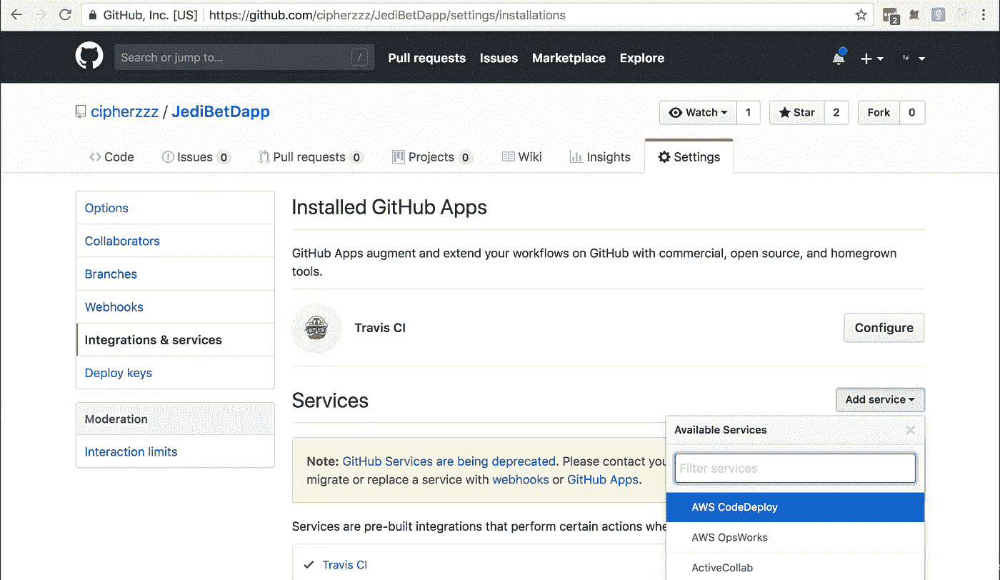
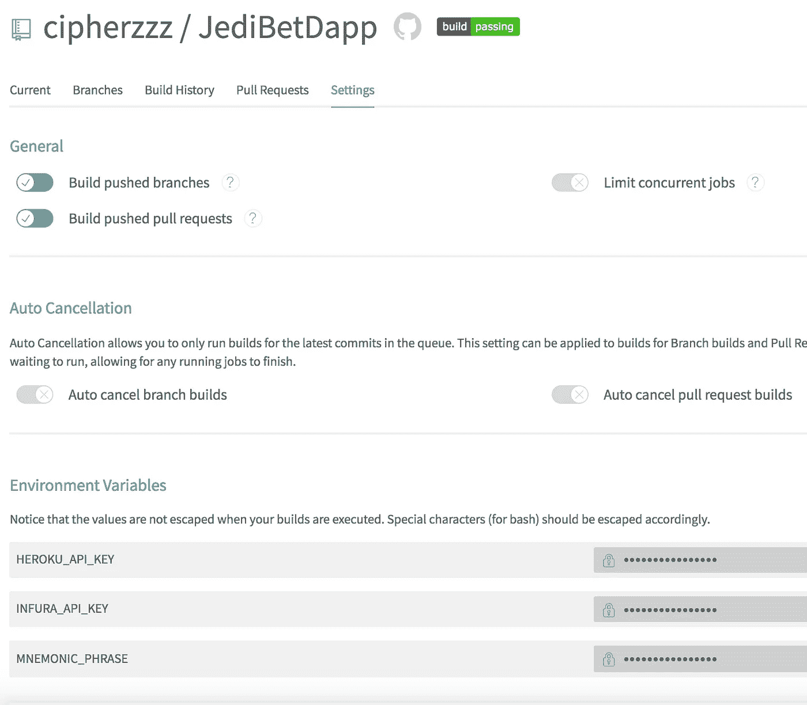
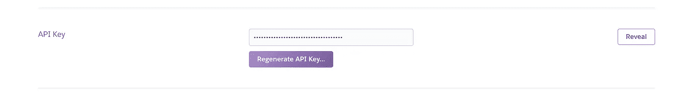
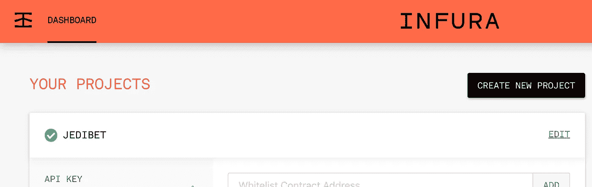

# 美化您的以太坊开发环境

> 原文：<https://medium.com/coinmonks/sweetening-up-your-ethereum-development-environment-db981588e94?source=collection_archive---------4----------------------->


这里有一些插件和小发明，可以让你的以太坊发展到一个全新的水平

## 背景

不久前，当我还是以太坊开发新手时，我写了一个多部分系列。这是一个很棒的系列，它将带您从建立一个本地私有 2 节点网络一直到在 Heroku 上部署一个 web3 react dApp。对你们感兴趣的人来说，这个系列在下面:

[第一部分](/@cipherz/super-simple-ethereum-part-1-7e363dbc1c65)、[第二部分](/@cipherz/super-simple-ethereum-part-2-6611721a391)、[第三部分](/@cipherz/a-jedis-guide-to-ethereum-part-3-67007e1876f3)、[第三部分](/@cipherz/a-jedis-guide-to-ethereum-part-3b-remix-1b8d98d909d4)、[第四部分](/@cipherz/a-jedis-guide-to-ethereum-part-4-web3-99d40af7346d)

现在我有了更多的经验，我想用我学到的一些技巧来给这个遗留项目增添一点甜蜜。

## 甜蜜

我们会在你的松露酱中加入以下材料

*   Solium —一种坚固的林挺工具
*   一个无头的以太坊区块链
*   [Husky](https://github.com/typicode/husky) —运行预提交钩子的简单方法
*   [Travis](https://travis-ci.com/) —一个 **CI** ( *持续集成*)服务器
*   Heroku——网络应用托管平台
*   一个连接到各种以太坊链(mainnet，kovan 等)的网络服务

## 最终游戏

在本文结束时，您应该已经为您的 dApp 增加了以下功能

*   编译、lint+修复和测试代码的预提交挂钩
*   一个 CI 流程，用于构建、测试和部署新的智能合同到链中
*   为 Heroku 构建和部署最新 dApp 代码的 CI 流程

这是一个非常棒的堆栈，可以自动运行*，并允许我们专注于实际的 dApp 开发，而不是 devOps。*

# *发展环境*

*我们将为我们的本地开发环境设置一些检查，以保持我们的一致性，并防止将垃圾签入我们的项目。*

*注意，需要将项目根目录下的 *.env.example* 复制到*中。env* 并使用您的实际值填充变量，这样就可以工作了。参见 https://github.com/motdotla/dotenv 的*

## *强壮的*

*对于我们来说，Husky 是一种执行预提交挂钩的简单方法，当我们试图向 git repo 添加新的提交时，它会为我们运行某些检查。让我们先安装模块。*

```
*npm i husky*
```

*接下来，让我们将预提交脚本添加到 *package.json* 中，以保存我们所有的定制检查*

```
*"precommit": "truffle compile",*
```

*注意，每次我们试图提交代码时，truffle 编译脚本都会运行。*

## *Solium*

*向你的项目添加 Solium 相当简单。首先，我们需要安装库*

```
*npm i --save-dev solium*
```

*接下来，我们需要定义几个文件，soli um*将使用这些文件来生成可靠性合同**

*创建*。soliumignore 项目根中的*文件如下*

*在项目根目录下创建 *.soliumrc.json* 文件，如下所示*

*将下面两行添加到 package.json 脚本中*

```
*"solium:lint:fix": "solium lint -d ./contracts --fix","solium:lint": "solium lint -d ./contracts",*
```

*编辑*预提交*脚本*

```
*"precommit": "truffle compile && npm run solium:lint:fix",*
```

## *加纳切-CLI*

*使用 ganache-cli，我们可以设置和拆除一个实际的以太坊链，以用于我们的测试。状态不会在会话之间持续，这使得它成为我们在干净的环境中运行所有测试的完美方式。让我们安装模块*

```
*npm i ganache-cli*
```

*在项目的根目录下创建以下两个文件*

*将以下内容添加到 package.json 中*

```
*"testChain": "./startGanache.sh && truffle test && ./stopGanache.sh"*
```

*编辑你的*包中的*预提交*脚本**

```
*"precommit": "truffle compile && npm run solium:lint:fix && npm run testChain",*
```

## *预期*

*太好了！现在，每当我们提交对回购协议的更改时，都会发生以下情况*

*   *我们的合同将被整理*
*   *我们的合同代码将被检查林挺错误*
*   *我们的合同将被部署到一个 headless ganache 实例并运行测试*

# *CI 环境*

*我们将配置我们的构建服务器(说“你好”，Travis)来运行与我们在本地预提交中运行的测试类似的测试，并将我们的 dApp 部署到 Heroku。*

**注意，本文的重点是智能契约——而不是 react 代码。我们可以也应该轻松地构建/lint/测试 react 代码。**

## *特拉维斯*

*如果您在此处还没有账户，您需要创建一个 Travis 账户。*

*接下来，您需要授权 Travis 访问您的 GitHub Repo，如下图所示:*

**

*现在我们准备将配置文件 *.travis.yml* 添加到我们的项目中，这是 travis 执行构建所需要的。将 *.travis.yml* 添加到项目的根目录中，内容如下*

## *配置*

*正如您在. travis.yml 文件中看到的，我们有一些环境变量依赖关系。有多种方法可以设置 env 变量，但是在这种情况下， *$HEROKU_API_KEY* 值是敏感的，应该隐藏在任何输出日志中。我们可以设置这个参数，如下所示，在我们的项目特拉维斯主页*

**

*这个 Travis 构建将在分支被推送到 repo、创建 Pull 请求以及 Pull 请求被合并到 master 时开始。*

*注意，我们还设置了*$助记符 _ 短语*和 *$INFURA_API_KEY* 变量，因为我们在 *truffle.js* 中的 *hd 钱包提供者*设置中使用了它们*

## *赫罗库*

*travis 构建脚本的 *deploy* 指令需要来自您的 [Heroku](https://www.heroku.com) 开发人员帐户的 HEROKU _ API _ KEY。你必须添加一种支付方式，以便从特拉维斯部署，但我相信你每个月有 1000 个免费的动态小时，然后才开始收费(我这个月用了 2 个小时)*

**

## *Infura*

*你将需要一个 Infura API 密钥来使用他们的服务连接到以太坊链。这里有免费的。*

**

# *摘要*

*虽然以太坊开发生态系统与该领域的其他项目相比是最成熟的，但它仍然非常新——即使是在软件领域。上面的设置为您提供了一个*同类最佳的*开发堆栈，在您创建下一个改变世界的应用程序时，让您的 dApp 坚如磐石。我希望你喜欢这篇文章，并随时纠正我或提出问题。*

*我们的杰迪贝特·戴普在这里—[https://jedibet.herokuapp.com/](https://jedibet.herokuapp.com/)*

*来源在这里—[https://github.com/cipherzzz/JediBetDapp](https://github.com/cipherzzz/JediBetDapp)*