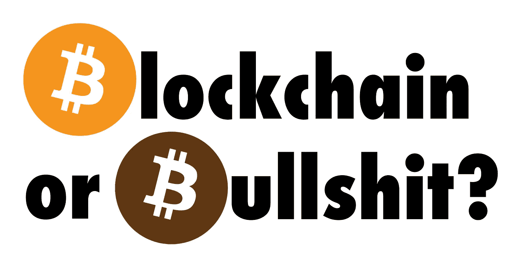

# 穿越谎言:区块链的五大支柱

> 原文：<https://medium.com/coinmonks/swimming-through-the-bullshit-the-5-pillars-of-blockchains-39be95d0839d?source=collection_archive---------2----------------------->

## 区分区块链和胡扯的标准指南。

## 区块链是有史以来最伟大的创新还是 T2 最大的炒作？

在过去的几年里，我们看到了各种基于区块链的项目的出现…