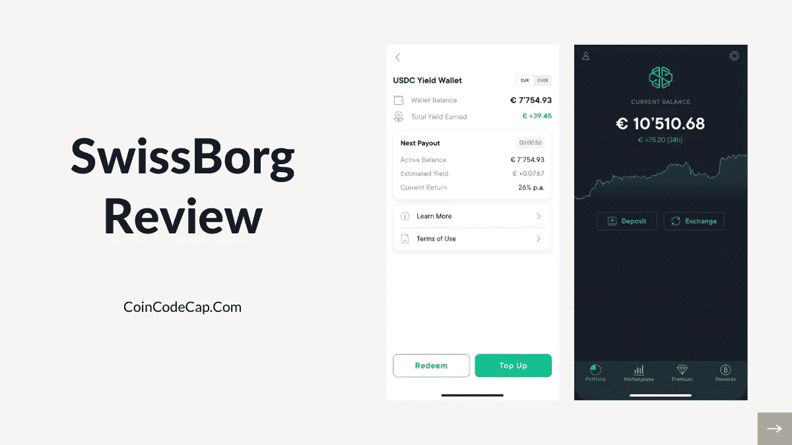
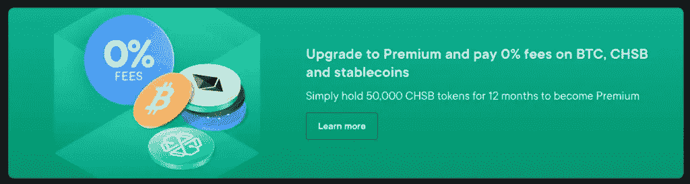
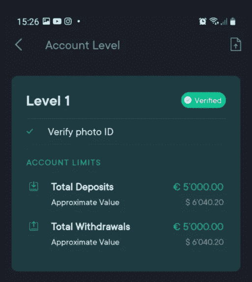
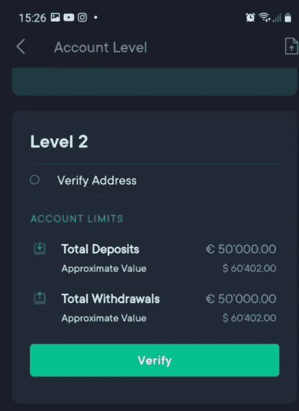
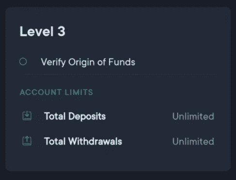
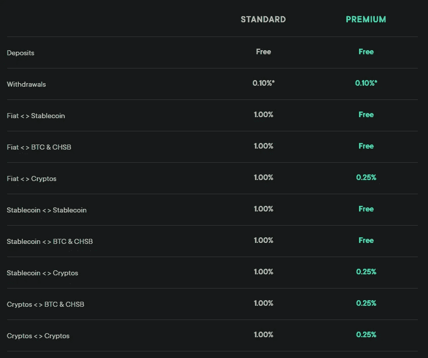
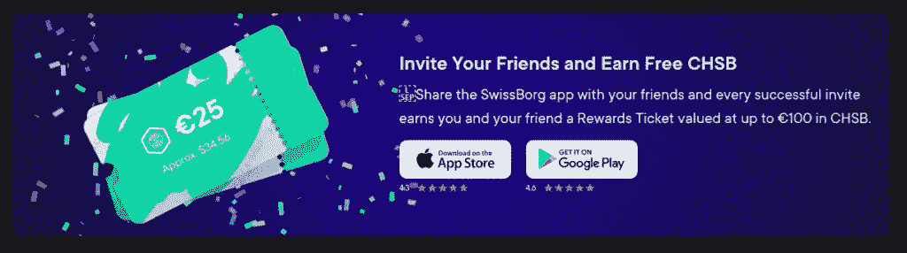
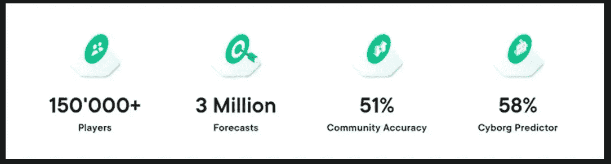
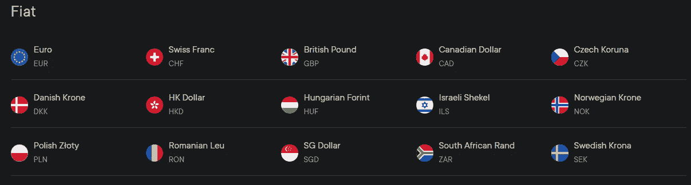
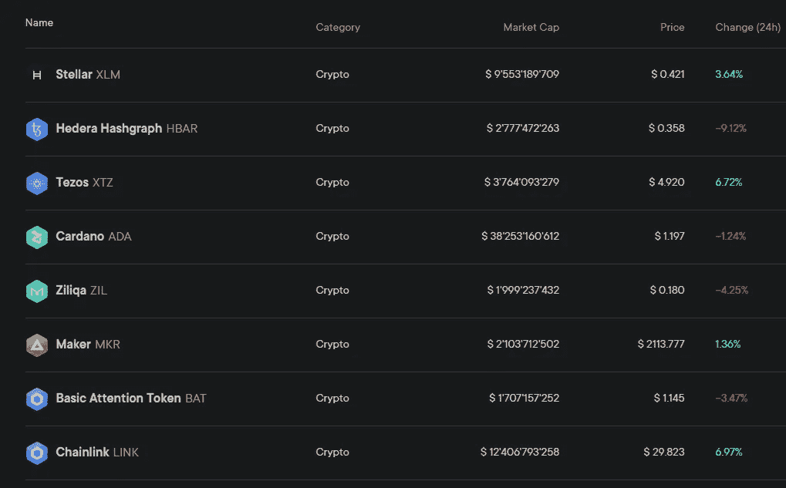

# 瑞士堡评论 2021 |今天就开始投资加密

> 原文：<https://medium.com/coinmonks/swissborg-review-3bad545c1585?source=collection_archive---------0----------------------->

在本文中，我们将回顾瑞士的加密货币投资平台**。**

# **瑞士堡是什么？**

**[**瑞士堡**](https://blog.coincodecap.com/go/swissborg) 是一种加密货币投资。它是在 2017 年 12 月加密货币反弹期间推出的。Anthony Lesoismer 和 Cyrus Fazel 筹集了 5300 万美元来支持这个总部位于瑞士的项目。然而，团队成员来自 20 多个不同的国家。**

**[**SwissBorg**](https://blog.coincodecap.com/go/swissborg) **的交易所**的目的是创建一个平台，提供一种更方便、更安全、更快捷的方式来交易和投资加密资产。根据安东尼的说法，他们希望允许普通人在没有任何专家的情况下处理他们的财富。他们通过几种方式做到这一点，包括与主要的[加密货币交易所](https://blog.coincodecap.com/go/crypto-exchange)整合。**

**该平台的重大成就包括:**

*   **成功地创建了一个大型社区。**
*   **增加比特币 [**瑞士堡**](https://blog.coincodecap.com/go/swissborg) **预测** app 的使用量。**
*   **CHSB(本地令牌)。**

# **摘要**

*   **它拥有超过 75 个来自世界各地的雇主。**
*   **[**瑞士堡**](https://blog.coincodecap.com/go/swissborg)2017 年成功融资 5300 万美元。**
*   **它支持两种不同的游戏化应用，这两种应用都适用于 Android 和 iOS 版本的智能手机。**
*   **瑞士堡币****硬币** CHSB 有超过 6 万名代币持有者。****
*   ****17 种法定货币可供用户提取和交易。****

# ****如何入门瑞士堡？****

****要在 [**瑞士堡**](https://blog.coincodecap.com/go/swissborg) 开始交易，你需要在他们的[网站](https://swissborg.com/)注册。按照以下步骤创建帐户:****

*   ****下载并安装 SwissBorg 应用。****
*   ****安装后，注册您的帐户，并通过输入您的电话号码和电子邮件地址进行验证。****
*   ****你还必须提供你的身份证件和你的国籍。****

****在注册之前，请检查该应用程序是否适用于您的国家。点击[这里](https://swissborg.com/supported-countries)找到可以下载的国家列表。****

## ****瑞士堡账户类型****

****[**瑞士堡**](https://blog.coincodecap.com/go/swissborg) 有两种不同类型的账户:**标准**和**高级**。尽管这两个版本都有很好的功能，但高级版给投资者带来了更多的便利和好处。拥有高级账户的用户可以享受 CHSB 0%的交易费、稳定硬币和 BTC 等好处，而且没有隐性成本。他们的日收入也会增加。****

****要激活您的 premium 帐户，请按照以下步骤操作:****

*   ****下载该应用程序，并按照上述步骤进行注册。****
*   ****现在，用你想要的货币购买 50，000 CHSB 币。****
*   ****最后一步是单击 premium 选项卡激活它。****

****请注意，用户必须在 12 个月内将 50，000 CHSB 作为赌注。在此期间，代币将被锁定，用户无法提现或兑换。但是，12 个月后，用户可以自由提取或更换它们。为了维持他们的高级帐户，用户必须保持他们的赌注。****

********

## ****核查进程****

****一般来说， [**SwissBorg**](https://blog.coincodecap.com/go/swissborg) 有三个层次的验证过程。基于这些级别，用户有不同的选项和限制。****

****第一级:第一级验证是在检查你的身份证件后进行的。在这个级别，您可以存取高达 5000 欧元的资金。****

********

******二级**:家庭住址验证后达到此级。你可以寄一份有你地址的文件，比如银行结单，来完成它。在这个级别，您可以存入和提取高达 50，000 欧元的资金。****

********

******第三级**:验证您的资金来源后即可使用。你在这个层次上没有任何限制。****

********

# ****瑞士堡财富应用****

******SwissBorg APK** 是该平台的主要卖点。它直观明了的功能已经赢得了超过 10 万用户，平均评分为 4.5 分。****

****它适用于 [iOS](https://apps.apple.com/in/app/swissborg-invest-in-crypto/id1442483481) 和[安卓](https://play.google.com/store/apps/details?id=com.swissborg.android)版本的智能手机。该应用程序的显著特点是:****

## ****1.智能引擎****

****不同平台中出现的价格差异是由于市场波动造成的，智能引擎会利用这一点，找到可能的最佳途径。这样，用户在搜索顶级交易平台如[币安](https://blog.coincodecap.com/go/binance)、HitBTC、LMAX 等后，在几秒钟内得到最好的价格。****

## ****2.投资组合分析****

****根据 [**SwissBorg**](https://blog.coincodecap.com/go/swissborg) ，用户可以通过他们的分析工具更深入地了解他们的投资组合表现。该工具可快速查看总存款、取款、损益和费用。在这些数据的帮助下，用户可以监控他们的投资组合表现，并可以明智地投资。Cyborg advisors 还使用深度学习算法预测趋势方向，帮助用户做出更好的投资决策。****

## ****3.高级安全****

****SwissBorg 最优先考虑的是用户的数据和交易安全。因此，为了加强和维护对他们的保护，他们不断投资于许多阶段，如平台压力测试、高级安全软件和 MPC 加密。这充分说明了用户资产的安全性。****

## ****4.透明的收费结构****

****许多[交易平台](https://blog.coincodecap.com/crypto-exchange)声称他们提供低费用或免费。但是他们没有任何透明度来支持他们的主张。鉴于 [**SwissBorg**](https://blog.coincodecap.com/go/swissborg) 专注于为用户提供无隐藏费用的最佳费率。这种透明性使用户能够确定他们的费用，并可以自由比较他们是否得到最好的费率。****

## ****5.一个捆绑包中的多项资产****

****通过投资 SwissBorg wealth 应用程序的加密捆绑包，您可以将猜测排除在密码货币市场的投资之外。捆绑包包含预先选择的加密资产，这些资产被分组以降低风险并增加盈利机会。****

# ****瑞士博格 CHSB 令牌****

****[**瑞士堡**](https://blog.coincodecap.com/go/swissborg) 平台有他们的原生币 CHSB。到目前为止，它的总供应量为 10 亿英镑。虽然大多数 CHSB 代币在 HitBTC 交易，但也有一些小额交易在 KuCoin 和 Uniswap 进行。像币安和比特雷克斯这样的顶级加密交易所不支持它。****

****在 2020 年，瑞士堡的代币价格出现了上涨。在此之前，2018 年 2 月仅为 0.10 美元，到 2018 年 8 月低于 0.01 美元。价格一直保持不变，直到 2020 年 1 月，价格上涨了两倍(约 0.02 美元)。2020 年 5 月之后，**瑞士堡硬币价格**再次上涨至 0.15 美元。2021 年 1 月，CHSB 币的价格约为 0.26 美元。****

## ****CHSB 代币的好处****

*   ******治理:**用户可以通过获得公投投票权来参与 [**瑞士堡**](https://blog.coincodecap.com/go/swissborg) 的未来。****
*   ****保护和烧毁机制:有了这个功能，你可以从令牌供应的减少中获益。这种机制有助于支持 CHSB 代币的价格，当价格趋于下降时回购并燃烧流通的代币。****
*   ******精英管理:**在精英管理下，用户可以为瑞士堡生态系统做出贡献以获得奖励。当你持有 CHSB 代币时，就会产生 RSB 代币。通过使用这些 RSB 代币，用户可以投票。****
*   ******高级会员**:如果你购买并下注 50，000 CHSB 币，你将为你启用会员账户。****

# ****瑞士堡评论:智能收益账户****

****这是瑞士堡交易所平台到财富 App 的新功能。SwissBorg 收益率钱包是从用户最喜爱的加密令牌中获取收益的安全而直接的方式。它提供两类收益钱包:智能收益和 CHSB 收益计划。每一种都有不同的机制来计算收益。用户可以在稳定币上获得高达 32%的年利率。****

****作为更新， [**瑞士堡**](https://blog.coincodecap.com/go/swissborg) 也于 2021 年 3 月在智能收益率钱包中增加了以太坊，它提供高达 17.5% p.a .的收益率，每天有超过 5000 万 USDC 在瑞士堡智能收益率钱包中产生回报。与此同时，高级用户在过去 90 天里享受着 20.77%的平均年回报率。****

# ****瑞士堡费用结构****

## ****押金费用****

****将资金存入法定资产、虚拟货币、CHSB 代币和稳定硬币是免费的。然而，用户在使用中间银行时可能需要付费。****

## ****取款费****

****[**瑞士堡**](https://blog.coincodecap.com/go/swissborg) 收取法定资产和虚拟货币总额 0.10%的最低提现费。如存款费用中所述，您可能需要支付由中介银行收取的额外操作费用。****

## ****交易费用****

****交易费根据您持有的账户类型而有所不同:标准或高级。查看下表以获得费用结构的整体概念，或者直接从他们的[网站](https://swissborg.com/legal/swissborg-app-fees)查看。****

********

# ****瑞士堡评论:安全****

****说到安全性、速度、稳定性，很难打败 [**SwissBorg**](https://blog.coincodecap.com/go/swissborg) 财富 app。使其脱颖而出的安全功能有:****

*   ******离线冷钱包存储:**本交换平台使用一个[多重签名](https://blog.coincodecap.com/multi-signature-wallet)离线冷钱包存储系统来存储用户的资产。它确保保护个人免受黑客和其他风险。****
*   ******2FA 安全:**财富 app 的双因素认证功能作为额外的安全层，保护用户免受任何危害。用户可以从设置中启用 2FA。****
*   ******账户恢复:**当用户更换设备、忘记密码或丢失设备时，他们可以快速恢复账户。点击[这里](https://help.swissborg.com/hc/en-gb/articles/360006639237-Recovery-Process)查看如何找回你的账号的全过程。****

# ****瑞士堡评论:奖金****

****瑞士堡奖金或奖励计划是一个推荐计划。每位用户在注册应用奖励计划时都会获得一枚价值 100€的比特币。****

****您可以使用瑞士堡推荐代码邀请您的朋友，你们两人都可以获得价值从€1 英镑到€100 英镑的奖励机票。按照以下步骤赢取推荐奖励:****

*   ****分享您的 SwissBorg 应用程序的奖励标签中生成的独特奖励链接。****
*   ****让您的朋友下载瑞士堡应用程序，并完成最低存款 50€。****
*   ****一旦你的朋友完成第二步，你们两个都会收到一张奖励券。****

********

# ****瑞士堡社区应用****

****瑞士堡(Swiss Borg)的社区应用是一个有趣的概念，它允许用户猜测[比特币](https://blog.coincodecap.com/a-candid-explanation-of-bitcoin)的未来价格。如果假设是正确的，他们将[赚取比特币](https://blog.coincodecap.com/earn-bitcoin)。瑞士堡通过游戏化的过程来促进对比特币的了解。这个应用在 [iOS](https://apps.apple.com/in/app/swissborg-invest-in-crypto/id1442483481) 和 [Android](https://play.google.com/store/apps/details?id=com.swissborg.android) 版本中都有，整个安装和注册过程最多只需要 90 秒。****

********

# ****瑞士堡评论:支持的货币****

****SwissBorg Wealth 应用程序支持 15 种不同的法定货币，包括欧元、英镑、罗恩、HUF、瑞士法郎、美元、BGN、SEK、CZK、挪威克朗、冰岛克朗、HKD、波兰兹罗提、DKK 和加拿大元。通过这些法定货币，该应用程序支持 15 种加密法定货币对。用户也可以在应用程序上创建他们的密码-菲亚特对。他们必须选择一种法定货币，并与现有的加密货币合并。****

****************

# ****瑞士堡评论:客户支持****

****为了解决客户的疑问， [**SwissBorg**](https://blog.coincodecap.com/go/swissborg) 网站包含大量关于帮助中心的文章。这一部分回答了几乎所有的问题。然而，如果用户仍然有疑问，那么他们提交一个请求。用户还可以加入不同社交平台上的不同社区，如 [Instagram](https://www.instagram.com/swissborg/) 、 [Reddit](https://www.reddit.com/r/swissborg/) 、 [Telegram](https://t.me/SwissBorgChat) 等。该平台还在瑞士、加拿大、伦敦和东京设有办事处。所以，这些国家的人可以直接联系他们。****

# ****瑞士堡评论:利弊****

## ****赞成的意见****

*   ****它支持 15 种法定货币和加密存款/取款。****
*   ****它持有多种加密货币。****
*   ****用户资产和数据安全是重中之重。****
*   ****相对于其他平台收费较低。****
*   ****它有一个有趣的奖励计划。****
*   ****该应用程序有 Android 和 iOS 两个版本。****
*   ****在玩游戏的同时促进学习。****

## ****骗局****

*   ****它没有桌面应用程序。****
*   ****KYC 是必修课。****
*   ****它不接受美国公民。****

# ****瑞士堡评论:结论****

****瑞士堡 成功创造了一种独特的产品，解决了许多与财富管理相关的问题。不仅如此，它使投资加密货币变得简单、有趣，并且人人都可以使用。它在社区应用程序上有超过 15 万用户，这充分说明了人们对它的支持和喜欢。****

****由 [**SwissBorg**](https://blog.coincodecap.com/go/swissborg) 开发的财富应用是加密货币投资的又一个强大、创新而简单的解决方案。有了这个 app，用户可以快速进行操作。它提供的工具帮助个人在没有任何专家的情况下使他们的投资组合变得更强更好。****

****假设 SwissBorg 不断更新和维护其功能、客户支持和安全性。在这种情况下，它将成为未来几十年继续引领财富管理步伐的基础加密项目之一就不足为奇了。****

# ****常见问题****

******瑞士堡是否适合美国投资？******

****由于美国的金融法规，他们的公民不能在瑞士堡注册或使用他们的应用程序。****

******瑞士堡安全合法吗？******

****是的，SwissBorg 是一个值得信赖的区块链投资平台，旨在让所有人都可以使用它。这是一个公平、安全、简单的加密货币投资平台。****

******瑞士堡对哪些国家开放？******

****你可以点击[这里的](https://swissborg.com/supported-countries)获取可以访问瑞士堡的国家的完整列表。****

******瑞士堡存款需要多长时间？******

****菲亚特提款和存款可能需要几个小时到几天(1-5 个工作日)。具体时间取决于内部银行流程。****

*   ****[低产农业和流动性采矿](https://blog.coincodecap.com/defi-yield-farming-and-liquidity-mining)****
*   ****[DeFi 货币市场项目回顾](https://blog.coincodecap.com/a-review-of-defi-money-market-project-dmm)****
*   ****[币安保证金交易 2021 |你需要知道的一切](https://blog.coincodecap.com/binance-margin-trading)****
*   ****[币安费用:完整指南(适用于美国币安和币安)](https://blog.coincodecap.com/binance-fees)****
*   ****[印度购买比特币的 7 大最佳应用【2021 手机版】](https://blog.coincodecap.com/buy-bitcoin-app-india)****

> ****加入 Coinmonks [Telegram group](https://t.me/joinchat/EPmjKpNYwRMsBI4p) 学习加密交易和投资****

## ****另外，阅读****

*   ****[什么是融资融券交易](https://blog.coincodecap.com/margin-trading)****
*   ****最好的[密码交易机器人](/coinmonks/crypto-trading-bot-c2ffce8acb2a) | [网格交易](https://blog.coincodecap.com/grid-trading)****
*   ****[3 商业评论](/coinmonks/3commas-review-an-excellent-crypto-trading-bot-2020-1313a58bec92) | [Pionex 评论](/coinmonks/pionex-review-exchange-with-crypto-trading-bot-1e459d0191ea) | [Coinrule 评论](/coinmonks/coinrule-review-2021-a-beginner-friendly-crypto-trading-bot-daf0504848ba)****
*   ****[AAX 交易所评论](/coinmonks/aax-exchange-review-2021-67c5ea09330c) | [德里比特评论](/coinmonks/deribit-review-options-fees-apis-and-testnet-2ca16c4bbdb2) | [FTX 交易所评论](/coinmonks/ftx-crypto-exchange-review-53664ac1198f)****
*   ****[n 零复习](/coinmonks/ngrave-zero-review-c465cf8307fc) | [Phemex 复习](/coinmonks/phemex-review-4cfba0b49e28) | [PrimeXBT 复习](/coinmonks/primexbt-review-88e0815be858)****
*   ****[Bybit Exchange 审查](/coinmonks/bybit-exchange-review-dbd570019b71) | [Bityard 审查](/coinmonks/bityard-review-7d104239be35) | [CoinSpot 审查](https://blog.coincodecap.com/coinspot-review)****
*   ****[3 commas vs crypto hopper](/coinmonks/3commas-vs-pionex-vs-cryptohopper-best-crypto-bot-6a98d2baa203)|[赚取加密利息](/coinmonks/earn-crypto-interest-b10b810fdda3)****
*   ****最好的比特币[硬件钱包](/coinmonks/the-best-cryptocurrency-hardware-wallets-of-2020-e28b1c124069?source=friends_link&sk=324dd9ff8556ab578d71e7ad7658ad7c) | [BitBox02 回顾](/coinmonks/bitbox02-review-your-swiss-bitcoin-hardware-wallet-c36c88fff29)****
*   ****[莱杰 vs n rave](/coinmonks/ledger-vs-ngrave-zero-7e40f0c1d694)|[莱杰 nano s vs x](/coinmonks/ledger-nano-s-vs-x-battery-hardware-price-storage-59a6663fe3b0)****
*   ****[加密复制交易平台](/coinmonks/top-10-crypto-copy-trading-platforms-for-beginners-d0c37c7d698c)****
*   ****[CoinLoan 审查](/coinmonks/coinloan-review-18128b9badc4) | [YouHodler 审查](/coinmonks/youhodler-4-easy-ways-to-make-money-98969b9689f2) | [BlockFi 审查](/coinmonks/blockfi-review-53096053c097)****
*   ****最好的[加密税务软件](/coinmonks/best-crypto-tax-tool-for-my-money-72d4b430816b) | [CoinTracking 评论](/coinmonks/cointracking-review-a-reliable-cryptocurrency-tax-software-5114e3eb5737)****
*   ****最佳[加密借贷平台](/coinmonks/top-5-crypto-lending-platforms-in-2020-that-you-need-to-know-a1b675cec3fa) | [杠杆代币](/coinmonks/leveraged-token-3f5257808b22)****
*   ****[block fi vs Celsius](/coinmonks/blockfi-vs-celsius-vs-hodlnaut-8a1cc8c26630)|[Hodlnaut Review](/coinmonks/hodlnaut-review-best-way-to-hodl-is-to-earn-interest-on-your-bitcoin-6658a8c19edf)****
*   ****[Bitsgap 审查](/coinmonks/bitsgap-review-a-crypto-trading-bot-that-makes-easy-money-a5d88a336df2) | [Quadency 审查](/coinmonks/quadency-review-a-crypto-trading-automation-platform-3068eaa374e1) | [Bitbns 审查](/coinmonks/bitbns-review-38256a07e161)****
*   ****[埃利帕尔泰坦评论](/coinmonks/ellipal-titan-review-85e9071dd029) | [赛克斯斯通评论](/coinmonks/secux-stone-hardware-wallet-review-15-discount-coupon-2020-7577032faa6e)****
*   ****[本地比特币审核](/coinmonks/localbitcoins-review-6cc001c6ed56) | [加密货币储蓄账户](https://blog.coincodecap.com/cryptocurrency-savings-accounts)****
*   ****最佳[区块链分析](https://bitquery.io/blog/best-blockchain-analysis-tools-and-software)工具| [赚比特币](/coinmonks/earn-bitcoin-6e8bd3c592d9)****
*   ****[加密套利](/coinmonks/crypto-arbitrage-guide-how-to-make-money-as-a-beginner-62bfe5c868f6)指南| [如何做空比特币](/coinmonks/how-to-short-bitcoin-568a2d0b4ae5)****
*   ****最佳[加密制图工具](/coinmonks/what-are-the-best-charting-platforms-for-cryptocurrency-trading-85aade584d80) | [最佳加密交易所](/coinmonks/crypto-exchange-dd2f9d6f3769)****
*   ****[如何在印度购买比特币？](/coinmonks/buy-bitcoin-in-india-feb50ddfef94) | [WazirX 审查](/coinmonks/wazirx-review-5c811b074f5b)****
*   ****[印度比特币交易所](/coinmonks/bitcoin-exchange-in-india-7f1fe79715c9) | [比特币储蓄账户](/coinmonks/bitcoin-savings-account-e65b13f92451)****
*   ****[CoinDCX 评论](/coinmonks/coindcx-review-8444db3621a2) | [加密保证金交易交易所](https://blog.coincodecap.com/crypto-margin-trading-exchanges)****

> ****[直接在您的收件箱中获得最佳软件交易](/coinmonks/newsletters/coinmonks)****

********

*****原载于 2021 年 4 月 1 日 https://blog.coincodecap.com**[*。*](https://blog.coincodecap.com/swissborg-review)*****