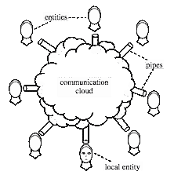
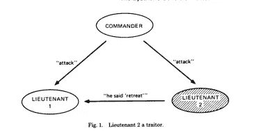
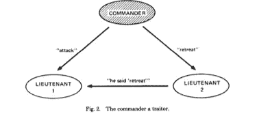
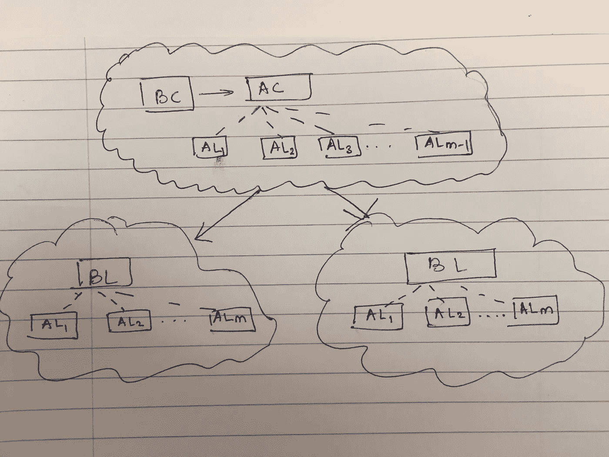

# 西比尔袭击与拜占庭将军问题

> 原文：<https://medium.com/coinmonks/sybil-attack-and-byzantine-generals-problem-2b2366b7146b?source=collection_archive---------2----------------------->

Byzantine Generals working together to attack the castle and Multiple identities of Sybil

## 介绍

随着我对比特币研究的深入，相关架构中不断出现两种不同类型的攻击。所以，我想我会更详细地介绍这两个。因此，我将涵盖两份不同的论文，但我将在较高的层次上涵盖它们，而不涉及解决方案。在每篇文章的最后，我都试图强调它们与比特币网络的关系。第一份是[西比尔攻击](https://dl.acm.org/citation.cfm?id=687813)的论文，第二份是由兰波特等人就[拜占庭将领](https://people.eecs.berkeley.edu/~luca/cs174/byzantine.pdf)的问题撰写的。

# 西比尔袭击

## 问题定义

在对等系统中，节点经常为了更好的安全性、可用性等而复制数据。为了复制这些数据，重要的是将这些数据放在唯一/不同的节点上，其中大部分是正确/诚实/行为良好的节点。但是本地节点不能知道远程节点是否诚实。此外，一个本地节点如何知道同一个远程节点没有呈现多个身份——让本地节点认为它实际上正在与多个远程节点通信——因此得名，可能出自《T4》一书。

本文试图提出的中心问题是:在没有中心机构的情况下，一个正确的节点(c)能否建立另一个远程节点所呈现身份的唯一性。该远程节点可以是正确的/诚实的节点(c)或有故障的节点(f)，即对于系统的正确运行，不希望远程节点能够呈现多个身份。

传统上，系统依赖于中央权威机构，如 ICANN、IANA 来获取 IP 地址，或者 Verisign 来获取嵌入设备硬件中的证书或密钥。这些中央机关可以确保和担保身份的唯一性。但是，如何在分布式系统或不可信的环境中建立这种关系呢？

## 系统模型

本文采用了一个较高层次的系统模型来建立攻击环境。基本上，有一群节点/实体、向云发送消息的管道和能够可靠地向所有机器传送消息的云网络。这是纸上的图表:

A simple distributed system model

有些节点可能有故障(f)，有些将是正确的/诚实的(c)。再次说明问题:本地实体能否可靠地验证远程实体提供的身份的唯一性？本地实体(l)如何确定身份 i1、i2、i3 不是由故障节点呈现的？

## 使用资源使用进行直接验证的关键思想

在缺乏中央权威的情况下，似乎有两种方法来验证身份。一种是通过直接验证，即 l 之前已经验证了某个远程实体并且知道它。其次是间接验证:我验证了一些实体，他们验证了一些其他远程实体。所以那些远程实体是可信的。

所以让我们从直接验证开始。我如何验证远程实体的唯一性？本文提出的简洁思想是:本地实体可以同时向所有实体*分发足够大的工作，并确保在给定时间内返回答案。假定工作消耗每个实体的足够资源，单个实体不能在给定时间内完成多于一个的工作。这可以在 CPU、网络或磁盘等任何资源上完成。*

1.  *因此，如果 CPU 是受限资源，则向所有远程实体发送一个难题—类似于工作证明，例如，给定 y，找出 x 和 z，使得(hash(x || y || z))的 n 个最低有效位都为零。*
2.  *对于网络，本地实体可以广播一个消息并期望在某个时间内得到响应。*
3.  *对于磁盘，我可以发送一些不可压缩的大消息进行存储，稍后再检查摘录。*

*因为该解决方案依赖于资源使用验证，所以可以有具有足够资源的 f 个节点成功地向 l 呈现多个身份。这实际上归结为资源奇偶校验的问题。在异构系统中，这是一个可能的场景。如果 f 有比 l 多 G 倍的资源，那么假设 f 至少表示 G 个恒等式是微不足道的。*

*上一节强调的另一个关键项目是“**同步验证**”。如果本地实体不能同时验证发出的所有谜题的答案，那么单个远程实体可以一个接一个地解决相同的谜题并发出响应。这似乎在实际的分布式系统中很难实现。*

## *间接验证*

*本地节点可以委托给远程节点的服务之一是身份本身的验证。因此，一旦本地节点确定远程节点 I 的身份有效，它就可以接受身份 i1、i2 等。一个明显的问题是一群有缺陷的实体可以串通起来为错误的身份担保。因此，假设一个本地实体 l 接受由 q 个其他被接受的实体担保的身份，那么拥有比 q 多的资源的错误身份可以相互勾结并得到更多被接受的身份。另一个不切实际之处是需要“同时验证”——因此所有 a 实体需要同时提出验证挑战。*

## *比特币和西比尔攻击*

*我读过很多关于身份的真实性和完整性的文献，但很少深入思考身份的唯一性及其在不可信的分布式环境中的含义。在这方面，这篇论文令人大开眼界。这也清楚地表明，在没有中央权威的情况下，建立独特的身份是不切实际的。我们依赖中央机构来获得 IP 地址，比如唯一身份，因为这似乎是获得唯一身份的最实用的方法。比特币和西比尔攻击的简单解释者是这里的。看起来比特币网络依赖于基于 IP 地址的身份，然后只允许一个出站连接到/16 子网进行出站连接，从而降低了诚实节点连接到完全不诚实的对等节点的概率。*

# *拜占庭将军——不信任环境中的共识*

*兰波特对讲故事的着迷一直持续着，我非常喜欢他的方式。这确实是一本非常有趣的读物。下面是兰波特对基于讲故事的方法和[评估](https://www.microsoft.com/en-us/research/publication/byzantine-generals-problem/)哲学家与读者-作家的解释。*

*在前一篇文章中，我讨论了在分布式环境中建立信任的必要性。在这种情况下，示例环境是由一家中央银行控制的一组服务器—传统上，这被认为是一个没有敌意的环境。但是，如果需要在一组不可信的节点之间建立共识呢？这与比特币的世界非常相关，在这个世界中，许多节点可能不会总是合作，很多时候可能会为了少数人的利益而勾结在一起改变网络的行为。*

## *设置*

*Lamport 使用一个战争场景来设置这一点，在这个场景中，你有一支军队的 m 个将军，每个将军控制自己的军队。将军们在外面扎营，需要就进攻/撤退的决定达成共识。因为是战时，周围可能有间谍，一些将军自己可能是叛徒。于是问题就变成了在忠诚的将军们之间建立共识——只要有足够多的忠诚将军。由于环境充满敌意，叛徒将军无论如何都会为所欲为，并试图阻挠忠诚将军达成共识。因此，算法需要遵循两个重要的约束条件:*

1.  *IC1:所有忠诚的将军必须同意一个共同的决定，即进攻/撤退*
2.  *IC2:如果一个忠诚的将军要求另一个将军“进攻”，那么这个忠诚的将军会服从这个命令。从一个忠诚的将军到另一个忠诚的将军的“撤退”命令也是如此。*

## *术语*

*为了解决这个问题，让我们假设一些术语。有些术语以后才会用到，但现在先过一遍:*

1.  *让我们称这位发送信息的将军为“拜占庭指挥官”(公元前)*
2.  *让我们称接收的将军为“拜占庭中尉”(BL)*
3.  *稍后会有一个矛盾的证明——所以让我们用阿尔巴尼亚指挥官(AC)和阿尔巴尼亚中尉(AL)*
4.  *只是强调一下:这些是需要达成共识的不同类型的将军*

## *三位将军的奇案*

*我将让图表在这里说话。在三个将军的情况下，如果有一个叛徒，看起来没有办法达成共识并满足上面提到的 IC1 和 IC2。叛徒可以是指挥官(BC)或中尉(BL1/BL2)*

**

*BL — byzantine lieutenant (BL2) is the traitor*

**

*BC — byzantine commander is the traitor*

*在图 1 中，BL1 必须服从“攻击”命令，尽管 BL2 发出了令人困惑的“撤退”信息。在图 2 中，BL1 将服从“攻击”的命令，BL2 将“撤退”——因此违反了 IC1。因此，BL1 不知道该相信谁，即 BC 还是 BL2。这就是为什么在图 1 中，它不知道什么是正确的顺序，也不能盲目信任 BC。因此，在这两种情况下，BL1 和 BL2 都不知道该相信谁。因此，在三个将军的情况下，如果至少有一个叛徒，就不可能达成共识。显然，这可以很好地概括为:如果有 m + 1 个将军，那么这个团队中最多有 m/3 个叛徒。否则，共识是不可信的。*

## *证明*

*这个证明可以用反证法来证明。这种方法是假设存在 300 万阿尔巴尼亚将军的解决方案，而那里至少有 300 万叛徒。使用阿尔巴尼亚将军只是为了更简单的术语。然后，我们可以将假设的解决方案简化为三个拜占庭将军的情况，并在一个叛徒面前达成共识。但是我们在上一节中已经看到这是不可能的。所以我们达成了一个矛盾。*

**

*看看这个数字，我们说的是我们有 300 万阿尔巴尼亚将军。分为三组，每组大约有 100 名将军.我们可以假设高层有一个将军同时担任 AC 和 BC 的角色。其他的 m-1 阿尔巴尼亚将军扮演 AL 的角色。另外两组由 m 个阿尔巴尼亚将军组成，每个将军扮演 al 的角色，我们可以说有一个 BL 模拟了所有这些 AL 的角色。相同的消息被发送到组内的所有实体，如箭头和线所示。*

*假设现有解决方案在这种情况下存在“m”个叛徒，我们可以假设 BC/AC 组是叛徒组。但是 IC1 和 IC2 仍然服从，因为假设解。实际上，这意味着由 BC 发送到两组 B1 的消息遵守 IC1 和 IC2 约束。我们知道这不是真的，因此阿尔巴尼亚将军的假设解决方案并不存在。*

## *比特币和拜占庭将军*

*该论文基于一个重要的结果，该结果表明，在 m 个节点行为不端的情况下，至少需要 3m + 1 个级别的好节点来最终确保系统的正确运行或达成结论性共识。这对比特币网络有什么影响？*

*正如我们在[过去的论文](/@ameya_s/bitcoin-a-fully-decentralized-electronic-cash-network-using-trustless-nodes-23ee9874f969)中所看到的，可能有许多节点可以合谋进行双重花费，并形成自己的区块链版本，该版本成为网络使用的最终版本。我读过的关于这一点的最好解释来自 Satoshi，是这里的。更高层次的想法是依靠区块链的精髓:工作的严格证明和每一个扩展前一个的新动力。由于每 10 分钟生成一个块，2 小时后，将生成 12 个块，并且最长的块将确保最诚实的节点已经花费了最大的努力并落在该公共链接链上，即共识。即使读了这个解释，我也不太清楚多数是否足够，或者网络的 2/3 是否需要诚实，以保持一致的分类账。我看过一些[和其他论文](https://www.cs.cornell.edu/~ie53/publications/btcProcFC.pdf)提到了这些场景，我将在后面的文章中深入探讨。*