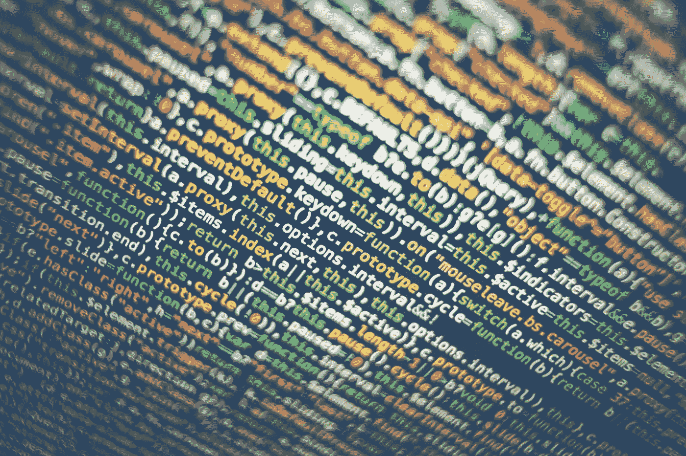

# 将 Geth 同步到以太坊区块链

> 原文：<https://medium.com/coinmonks/syncing-geth-to-the-ethereum-blockchain-9571666f3cfc?source=collection_archive---------0----------------------->

Photo by [Markus Spiske](https://unsplash.com/photos/8OyKWQgBsKQ?utm_source=unsplash&utm_medium=referral&utm_content=creditCopyText) on [Unsplash](https://unsplash.com/?utm_source=unsplash&utm_medium=referral&utm_content=creditCopyText)

(更新于 2018 年 5 月 29 日:我已经写了这篇文章的更新。考虑改读 2018 年[以太坊 Geth 同步 101](/coinmonks/ethereum-geth-syncing-101-in-2018-21368b1c77fd) 。)

我在我的云服务器上运行 geth 与以太坊区块链同步。每当我编码时，我都会启动 geth，它会与区块链进行一轮重新同步。这需要几分钟(如果我上次编码是在昨天)或几小时(如果我上次…