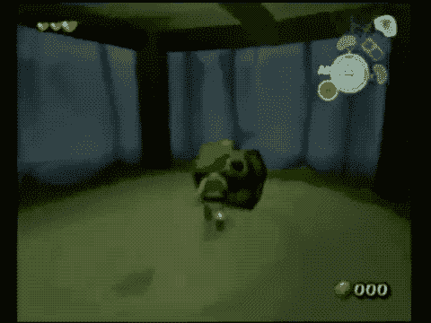
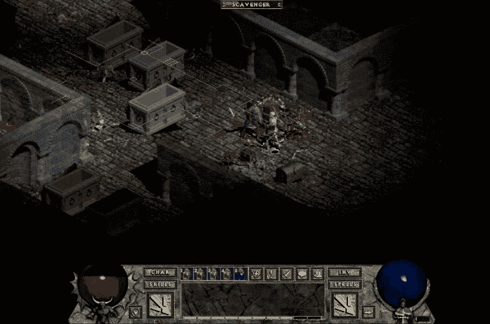
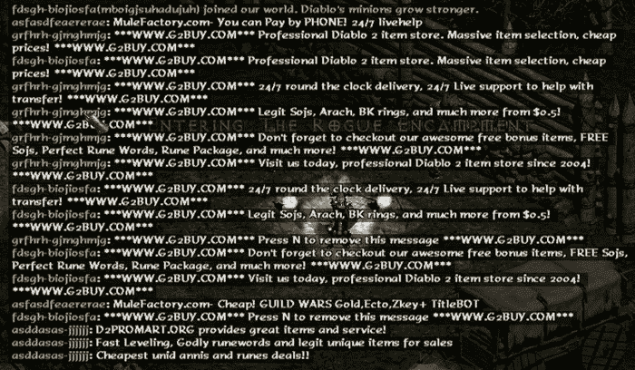
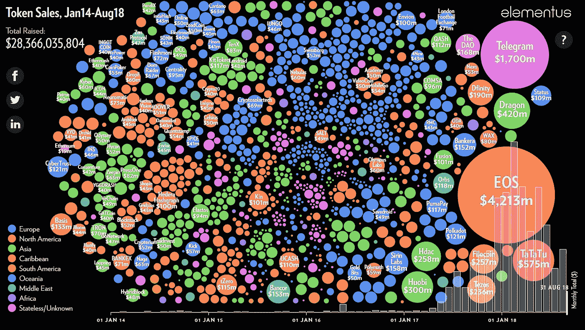
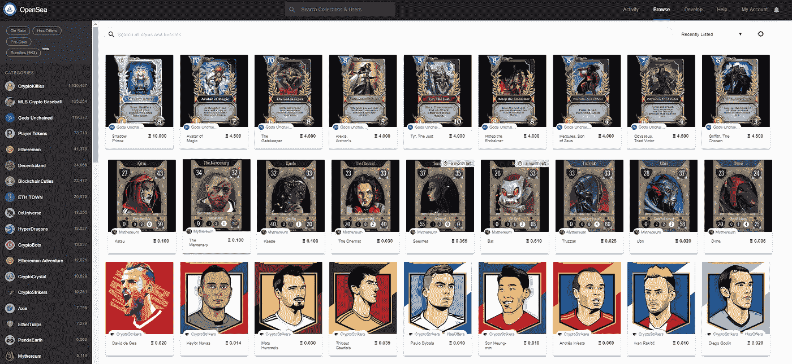
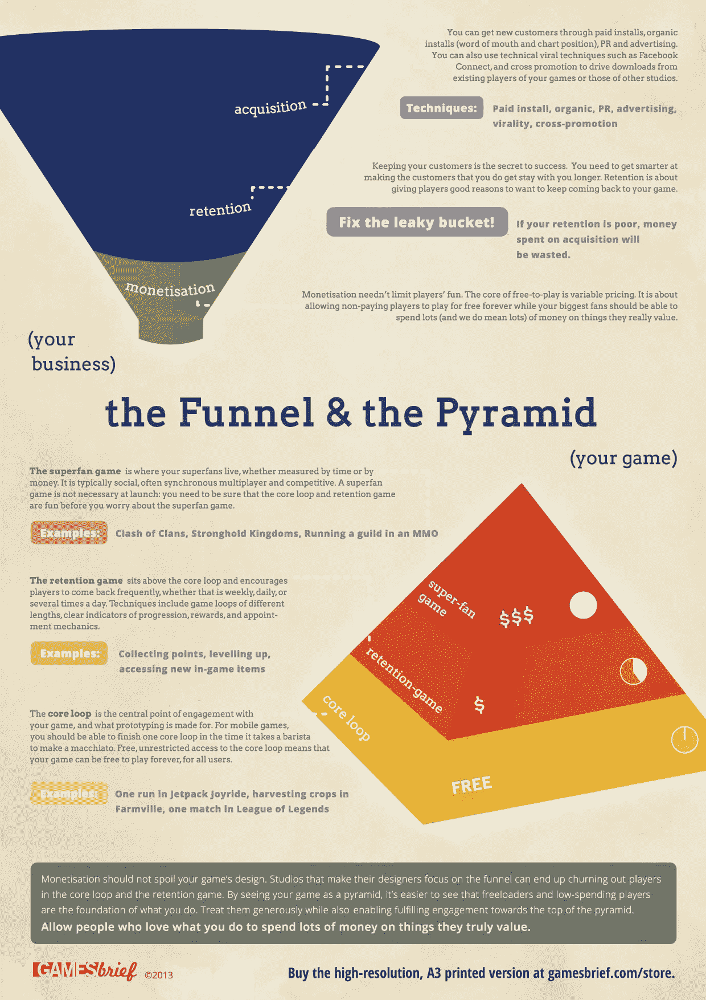
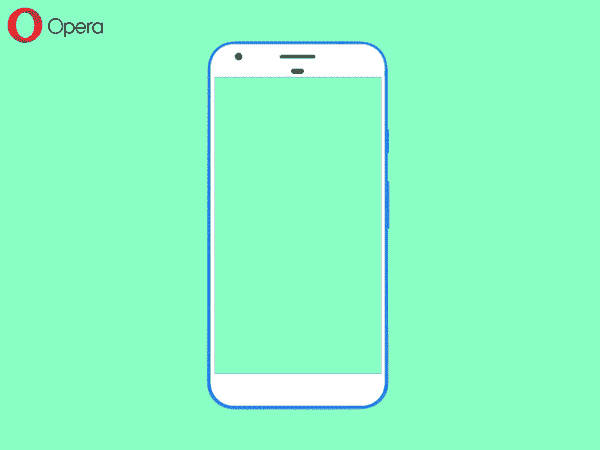
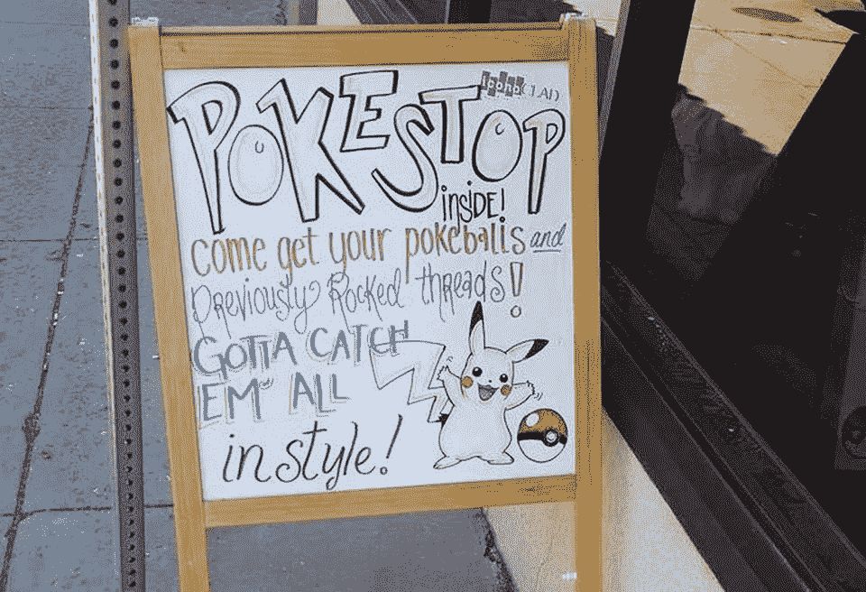

# 应对游戏和 Web 3.0 中最重要的挑战——互操作性

> 原文：<https://medium.com/coinmonks/tackling-the-most-important-challenge-in-games-and-web-3-0-interoperability-c8441c2091f5?source=collection_archive---------2----------------------->

*作者注:一年多前(2018 年 12 月)写的这篇文章。一些参考或链接可能不再准确，但我相信这篇文章的主旨仍然是正确的。*

*如今，游戏开发商被迫为注意力经济进行优化。这一不可避免的现实扼杀了创新——在封闭的平台、激励性广告和战利品盒子后面建立了限制虚拟经济的人为壁垒。*

***互通*** *是将推倒这些城墙的大锤。*

Cue Item Fanfare ♫♪♩ (Source: [https://www.youtube.com/watch?v=3r7HiGl1drw](https://www.youtube.com/watch?v=3r7HiGl1drw))

## 不久前，有一段时间

游戏没有微交易的时候。

那时候，唯一能赚钱的方法就是玩游戏。玩家完成任务，击败敌人，打开宝箱，获得他们辛苦赚来的[卢比](https://zelda.gamepedia.com/Rupee)、[吉尔](http://finalfantasy.wikia.com/wiki/Gil)和[泽尼](http://capcom.wikia.com/wiki/Zenny)。

游戏被设计成主要是单人游戏——赢得游戏意味着完成游戏的故事。反过来，虚拟货币也有一个单一的目的:购买更强大的虚拟物品，我们的英雄需要击败最后的老板。

***然后互联网就发生了。***

互联网将游戏从物理墙壁中解放出来。我们现在可以在任何地方和任何人一起玩。随着游戏成为相互联系的体验，我们的虚拟物品现在不仅仅存在于我们自己的实例空间中——它们现在对其他玩家也有价值。

游戏开发商接受了这种新的范式，允许玩家相互交易物品，并创造了一个有供求关系的自由市场。

***虚拟物品已经演变成虚拟经济。***

Gotta get that loot before the other player does! (Source: [https://www.youtube.com/watch?v=eRNx-ymdoRM](https://www.youtube.com/watch?v=eRNx-ymdoRM))

然而，事实证明，虚拟经济就像现实世界一样，容易受到剥削。

博弈论有理性选择的概念——在有足够多代理人的经济中，代理人会倾向于做自私的事情。玩家在一个游戏中必然会找到性价比最高的获胜方式。

这种人类行为导致了灰色市场的出现。非官方的第三方网站，玩家用现实世界的钱购买虚拟物品，而不是花费时间和注意力来获得它们。

Chat rooms flooded with item selling offers (Source: [https://hackerbot.net/wiki/276-online-game-spam-bots](https://hackerbot.net/wiki/276-online-game-spam-bots))

游戏开发者没有为这种颠覆做好准备。

游戏仍然是围绕一个基本原则设计的:*玩家***玩游戏越多，就应该赚取更多强大的虚拟物品。灰色市场允许玩家绕过这一规则——这就像是把扳手扔进了一个游戏中微妙平衡的经济系统。**

*当这一切发生时，Web 2.0 在注意力经济中的主导地位已经完全显现。谷歌、苹果和脸书，通过有效使用可变奖励，已经成功地让用户在他们的应用上花费最长的时间。特里斯坦·哈里斯注:*

> *如果你是一个应用程序，你如何让人们着迷？把自己变成老虎机。*

*游戏开发不是在真空中发生的，游戏也开始慢慢地但肯定地为注意力经济而优化。*

*为了让越来越多的玩家玩游戏，游戏开始变得免费。像吃角子老虎机一样，应用内购买围绕着**战利品盒**——用现实世界的钱支付的虚拟物品，有可变的奖励。此外，为了让数百万不想花一分钱的玩家赚钱，植入了激励性广告，从愿意为玩家的注意力付费的广告商那里赚钱。*

**

*Treasure is now opened via real money, with variable rewards (Source: [https://www.youtube.com/watch?v=vrSUpFKZdxY](https://www.youtube.com/watch?v=vrSUpFKZdxY))*

*游戏开发商开始在他们的虚拟经济周围建造围墙。*

*物品和货币现在是不可交易的，是受账户限制的。游戏不再是围绕一个引人注目的故事设计的，而是围绕一个元游戏设计的，旨在让玩家永远玩下去。*

*游戏开发者的理性选择是追随注意力经济的趋势，而不是解决开放市场的复杂问题。*

*Lehdonvirta 和 Castranova 关于虚拟经济的书说得更好:*

> *在许多情况下，虚拟经济的主要目的甚至不是直接赚取收入，而是更微妙但同样强大的东西:吸引、保持和管理注意力*

# *Web 3.0 和互操作性*

> *当游戏开发商在虚拟经济周围筑起高墙时，区块链的先驱们正在拆除它们。*

*当前的 [Web 3.0](/@matteozago/why-the-web-3-0-matters-and-you-should-know-about-it-a5851d63c949) [去中心化](https://ruben.verborgh.org/blog/2017/12/20/paradigm-shifts-for-the-decentralized-web/) [运动](https://breakermag.com/why-we-need-web-3-0/)是对困扰 Web 2.0 的问题的反应。企业家和技术专家已经意识到，互联网当前的权力结构是不可持续的，通过区块链和开放协议来重塑它是将权力交还给用户的一种方式。然而，由于现有公司控制着网络和新生的区块链技术，这是一场艰苦的战斗。*

*去年，随着加密货币的兴起，发生了一个重大转变——这种新型虚拟货币允许现实世界的价值开始流入 Web 3.0 创业公司，模糊了虚拟和现实世界经济之间的界限。*

**

*Funds raised from token sales from Jan 2014 to Aug 2018\. Source: [https://elementus.io/token-sales-history](https://elementus.io/token-sales-history)*

*象征性标准 ERC-20 的采用是分隔虚拟货币和法定货币的又一个重大突破。*

*通用开放标准带来了互操作性。 ERC-20 允许用户将一种加密货币兑换成另一种，通过[网络效应](/@nfx/the-network-effects-bible-c6a06b8ae75b)增加它们的价值。该标准的开放性进一步允许区块链开发者更容易地创建工具和应用程序来利用加密货币。*

*现在，Web 3.0 公司和先锋游戏开发商开始在虚拟物品上应用相同的技术和原则。这种新的虚拟物品类别， **Cryptoitems，**也具有现实世界的价值，并且可以在不同的游戏经济中互操作。*

**

*An example of interoperability — [Opensea.io](https://opensea.io/]), A marketplace of cryptoitems from different games*

***加密货币和 ERC-20 标准削弱了注意力经济墙的基础。加密物品的第三次攻击可能会最终使它们崩溃。***

# *创造一个密码物品的未来*

*加密物品将影响游戏虚拟经济，就像 ERC 20 影响代币经济一样，游戏和区块链开发者都必须做好准备。虽然游戏开发者有很大的潜力，但一旦我们将加密技术应用于虚拟物品，它的阴暗面也会抬头。*

*这将是一条艰难的道路——区块链和 Web 3.0 的参与者是出了名的部落主义( [Tony Sheng 关于群众运动的文章](https://www.tonysheng.com/mass-movement)完美地解释了这种部落主义)，建立互操作性将需要整个行业的共识。*

*公司和开发人员都需要克服四个常见障碍，以实现技术和用户采用:*

## ***1。创建开放协议和游戏开发工具***

*与 ERC-20 类似，加密项目将需要一个开放的协议来实现互操作性。我们[现在有几个竞争标准](/sandbox-game/token-standards-in-the-sandbox-61832992b45b)ERC-721、ERC721X 和 ERC-1155，但我们需要一个开放的协议，允许游戏在彼此之间进行。*

*理想情况下，这个协议是区块链不可知的，由区块链和游戏开发者以开源的方式维护。这是一项艰巨的任务，拥有一个类似于 [Khronos 集团](https://www.khronos.org/)的企业联盟可能是一个很好的模式。*

*此外，游戏开发者将需要工具来围绕这些项目构建游戏。它们将需要像 AWS 和谷歌平台一样易于使用，以实现大规模采用，并与 Unity 和 Unreal 等流行的游戏引擎集成。*

## ***2。从漏斗式思维转向创造可持续的游戏经济***

*今天的游戏是围绕漏斗建立的:大多数玩家预计会流失，目标是让留下来的人赚钱。一款游戏的可持续性来源是通过广告和应用内购买获得的点滴收入。*

**

*Free-to-play game design, Source: [Nicholas Lovell on Gamasutra](https://www.gamasutra.com/blogs/NicholasLovell/20130919/200606/The_Pyramid_of_FreetoPlay_game_design.php)*

*Cryptoitems 将迫使我们重新思考这种模式——玩家现在进入一个全新的游戏，拥有一整套虚拟物品。不同游戏的经济现在可以互通了。*

*有了这些新的变量，我们如何确保游戏保持平衡和有趣？*

*我们可以参考过去的游戏，其中一个很适合的是 ***收藏卡牌游戏流派*** 。这种类型在历史上一直是先获得虚拟物品(在这种情况下，是可收集的卡片)，然后小心翼翼地平衡游戏，更注重技能而不是你有多少虚拟物品。*

*游戏开发者和玩家都认识到了这一点，一些早期的成功密码游戏如[僵尸战场](https://loom.games/)和[被解放的神](https://godsunchained.com/)都是可收藏的卡牌游戏。*

*尽管有了 cryptoitems，设计并没有随着游戏类型而停止。*

*在可互操作的游戏经济中，代理商比玩家多。**交易者**会更多的玩市场而不是游戏，目的是从商品的移动中赚取利润。**收藏者**为成套所驱使，为稀缺性所激励。*

*对他们来说，经济也需要可持续发展。*

**

*Cryptoitems will make us rethink our funnels and core loops*

*在经济中，我们还可以发挥其他代理人的作用。例如，**创作者**能够给游戏添加内容，特别是如果他们被激励这样做的话(T2 的 Steam Workshop 就是一个很好的参考)。*

*随着游戏设计师从漏斗转向经济设计，我们可能会发现更多。*

## *3.构建用户友好的界面*

*自从 6 个月前的以来，Crypto UI 已经有了很大的改进，用户体验问题正在稳步解决。*

*但是要让互用性大规模上市，用户界面必须非常简单。我不需要复制粘贴一长串难以理解的字符串来移动加密物品。钱包的这一核心设计需要改进，否则加密物品可能会步 RSS 阅读器的后尘。*

*最终，浏览器和手机将拥有自己的钱包，就像 IP 地址让位于 URL 一样，公钥将让位于用户名。*

*我们看到了这方面的开端，像 Brave 和 Opera 这样的浏览器集成了加密钱包，EOS 区块链使用了人类可读的帐户名。我们需要继续保持这种势头，直到 UI 像发送文本消息一样简单和安全。*

**

*Sending Cryptokitties from an in-browser wallet in Opera ([Source](https://blogs.opera.com/mobile/2018/09/opera-crypto-wallet-update-opera-send-crypto-collectibles-directly-from-wallet/))*

*4.**重新想象游戏设计和讲故事***

*最后，也是更重要的一点，我们需要反思我们制作游戏和在游戏中形成叙事的方式，考虑到开放经济的新现实。*

***加密游戏必须不仅仅是可收藏的纸牌游戏和投机交易。***

*互用性将物品从游戏中分离出来，并使它们更接近真实世界。这些物品不属于我们的虚拟角色，而是属于我们自己。我们现在是故事中的英雄。有了这样的世界，我们能创造出哪些故事？*

*两年前，数百名怪物训练员聚集在中央公园捕捉一只罕见的神奇宝贝。这不是一个有虚拟人物的虚拟中央公园，这些都是真实的人在扔扑克球(虽然现在承认是虚拟的！)在纽约市。*

*虚拟经济开始渗透到实体经济中——因为小卖部是现实生活中的场所，被贴上小卖部的标签会对商店或餐馆产生积极的经济影响。*

**

*Taking advantage of being a Pokéstop, [Source](https://www.forbes.com/sites/jasonevangelho/2016/07/09/how-pokemon-go-can-lure-more-customers-to-your-local-business/#2120cc107cd4)*

*现在口袋妖怪 Go 的开发者将开始允许玩家 n [指定口袋妖怪站](https://pokemongolive.com/en/post/poi-submission-beta/)，增加了一个有趣的管理级别，并将权力放在玩家手中。*

*Pokémon Go 向我们展示了一旦现实和虚拟之间的墙被打破，可能会发生什么。一旦我们引入开放经济，我们将会发现什么样的新游戏和经济系统？*

*想象一下 15-20 年后——所有虚拟物品都是可互操作的加密物品，游戏由玩家和开发者共同管理，虚拟世界不仅相互交织，还与真实世界交织。*

*这只有在我们解决了互操作性问题后才能实现，这将取决于游戏和 Web 3.0 开发者来实现这个充满希望的新未来。*

*

[Get Best Software Deals Directly In Your Inbox](https://coincodecap.com/?utm_source=coinmonks)* **