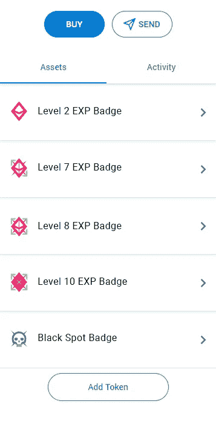

# 夺回你的数字声誉

> 原文：<https://medium.com/coinmonks/take-back-your-digital-reputation-98c94d68ef60?source=collection_archive---------3----------------------->

[https://www.searchenginejournal.com/best-online-reputation-monitoring-tools/250769/](https://www.searchenginejournal.com/best-online-reputation-monitoring-tools/250769/)

# **声誉的重要性**

声誉是所有关系的基石。这是我们评判彼此的基础。此外，我们利用声誉来辨别谁是值得信任的，谁应该受到更多的怀疑。

从历史上看，大学和老牌公司等机构是你社会地位的主要把关者。尤其是在我们的父母成长过程中，这些守门人控制着地位和尊严的获取。

想快速晋升为受人尊敬的律师吗？获得常青藤联盟大学的学位。在开发者行列中前进呢？在你的简历中加入 IBM。你是说你有天赋？打动派拉蒙电影制作人。

# **互联网使声誉民主化，但也付出了代价**

随着互联网的出现，我们看到这些传统的看门人失去了作为尊严和声誉的唯一仲裁者的霸权。

世界各地的人们现在能够积累影响力和追随者，在这个过程中为自己建立一个有价值的身份。互联网允许创作者绕过过去最初的把关者和媒体制作人。

然而，允许大型科技公司控制我们的新身份系统是有代价的。**这些公司现在是新的中央集权的霸主，控制着你的声誉。他们隔离创作者的作品和他们从作品中获得的声誉，确保创作者总是不得不回到他们的平台来提高他们的地位。**

**脸书、Twitter、LinkedIn，其余都是闭园；你播种的所有植物都藏在门后，你收获的所有庄稼都归上市公司所有的花园。**

是时候我们打开大门，宣布我们在互联网上的身份的合法所有权了。

# **用户理应拥有自己的数字声誉**

我们需要一个通用和开放的用户数据库；在这里，用户拥有自己的身份，而不是被锁定在一个封闭的、以盈利为目的的平台上。用户必须拥有平台，平台必须服务于用户的利益，而不是为用户数据付费的第三方。

我们知道，如果用户自己拥有自己的数字角色，这个世界将会变得更加美好。用户应该能够将他们从一个平台获得的声誉带到他们选择的任何其他平台。**声誉不应该被关闭，保存在社交媒体公司的集中保管库中。用户应该拥有自己的声誉。**

正是因为这些原因，我们才如此兴奋地宣布创建一个新系统的第一步，该系统允许用户在网上拥有自己的声誉。我们正在将以太基于洞察力的声誉系统 XP 转变为不可转让的声誉令牌。

用户将能够把他们在以太网上获得的 XP 带到任何 Web 3.0 应用程序中。这个信誉系统将作为一个名为 eXP 的令牌存在于用户的钱包中。**作为用户，你将拥有自己的名誉。**

Example of how EXP Badges will appear in your wallet

我们正在创建的信誉令牌基于以太坊的 NFT ERC-721 智能合约标准。

以下是原型模型:

(如[www . the ether . io](http://www.theether.io)XP→EXP ERC 721 NFT)

原型将由 theether.io 开发和使用。此外，随着项目的发展，将增加对令牌可操作性和分散治理的改进。**简而言之，EXP 是更大的令牌化声誉愿景的首次实现。**我们能够也将会重塑数字所有权的声誉。

# 加入我们

如果您有兴趣关注我们的进展，我们将这个项目提交给 [ETHOnline hackathon](https://ethonline.org/) 。**你可以在这里** **找到我们的开源回购** [**。**](https://github.com/www-theether-io/etherxp)

**如果你认为用户，而不是大型科技公司，值得拥有他们的网络数字声誉，** [**加入我们**](https://theether.io/) **。**

[MC Masher](https://theether.io/profile/MC%20Masher)(mattis on Asher)[green fan](https://theether.io/profile/greenfan)(Russell Dwyer)[MC Derek](https://theether.io/profile/MC%20Derek)(Derek Sturman)