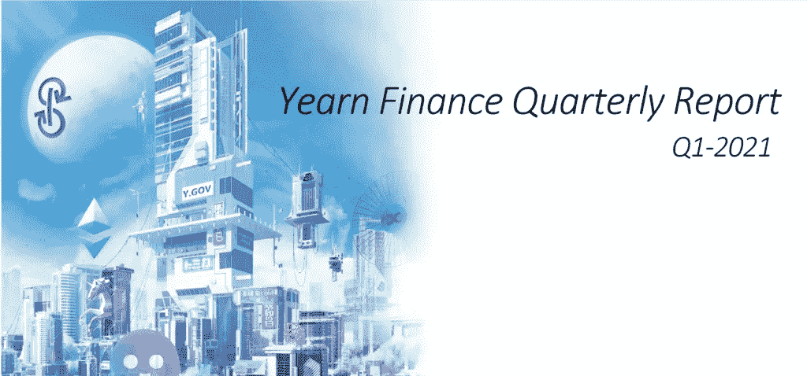
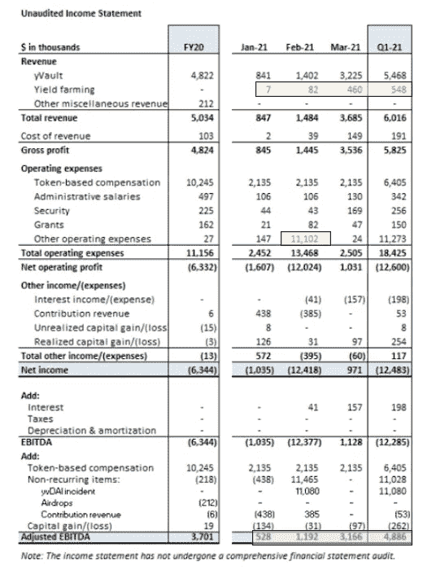
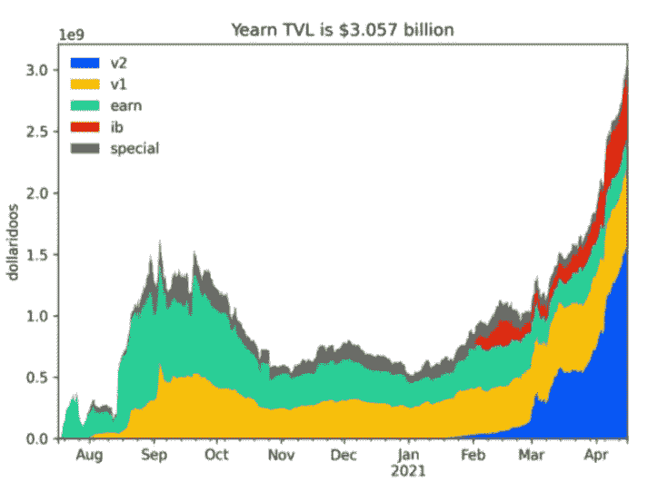
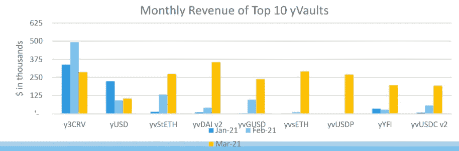

# 从《渴望金融》中获得的信息$ YFI 2011 年第一季度收益报告

> 原文：<https://medium.com/coinmonks/takeaways-from-yearn-finance-yfis-1q21-earnings-report-a4df4fe2065a?source=collection_archive---------6----------------------->

2021 年 4 月 26 日，向往金融发布了其最详细的季度报告之一。我们深入研究了细节，以评估 crypto 世界顶级自动化资产管理器的表现如何。

**总结**

总的来说，渴望在 1Q21 的表现非常出色，超出了所有人的预期。仅在 1 月 21 日至 3 月 21 日期间，收入就增长了约 300%,主要由 yVaults 带动。该公司还推出了一种高产农业产品，通过在 Curve finance 上抵押美元 YFI 代币，获得了启动资金。虽然仍处于萌芽状态，但这种农产品的产量在 1 月 21 日至 3 月 21 日之间增长了 65 倍。3 月份净利润约为 30%，而当月调整后的 EBITDA 约为 90%。这使得本季度调整后的 EBITDA 平均为 83%,比 2010 财年的 76%高出 700 个基点。按市值计算，YFI 仍排在第 76 位；如果它保持这种水平的性能，我们不希望它保持很长时间。

**分解数字**

Source: Yearn Finance 1Q21 Quarterly Report

**收入**

—1 月至 3 月，收入增长约 300%，Q1 的收入超过了 2010 财年全年

— yVault 表现强劲，约占 3 月份收入的 88%

— yVault 收入从 1 月和 2 月集中在 y3CRV，到相对均匀地分布在 v2 yVaults 下的 9 个存储库中

—高产农业将是一项值得关注的战略，在 1 月至 3 月间增长了约 65 倍(收入从约 1%增长到约 12%)

—产量框架策略导致年度平均利润约为 36%-52%

**净收入**

——3 月份，向往的净利润约为 30%,这是非常积极的

—由于恶意行为者对 yVaults 的一次性利用导致了约 1100 万美元的损失，该季度的净收入变为负值

**调整后的 EBITDA**

—调整后的 EBITDA 从 1 月份占收入的约 62%增长到最近 3 月份的约 90%

—第一季度调整后的 EBITDA 占收入的比例约为 83%，而 2010 财年为 76%

其他亮点

——这一财务表现是在令人印象深刻的 TVL 增长的支持下取得的。在 v2 yVaults 的带领下，TVL 的增长在 3 月份进入指数增长区域

Source: Yearn Finance 1Q21 Quarterly Report

—随着 v2 yVaults 的推出，到 3 月份，收入分布也变得更加分散，这对系统的稳定性和可持续性是一个积极的信号。

Source: Yearn Finance 1Q21 Quarterly Report

—在这份报告中，向往宣布与 Curve Finance 达成协议，向往将“保留通过 Curve Finance 策略从 yVault 获得的所有 CRV 奖励的 10%，并将其锁定在向往的 yveCRV 金库(“Backscratcher”)中，但其 yvUSDN 金库除外。对于 yvUSDN 金库，向往保留并锁定 50%的 CRV 收入到“Backscratcher”金库由于锁定的 CRV 无法收回，这将对 CRV 供应产生下行压力，使其更有价值。这不仅有利于 CRV，也有利于向往未来与曲线金融的关系。

**结论**

2011 年第一季度，向往金融表现强劲，现有产品和新产品均呈现强劲增长。如果它能够继续这种表现，我们预计未来对 YFI 元的需求将会非常强劲。