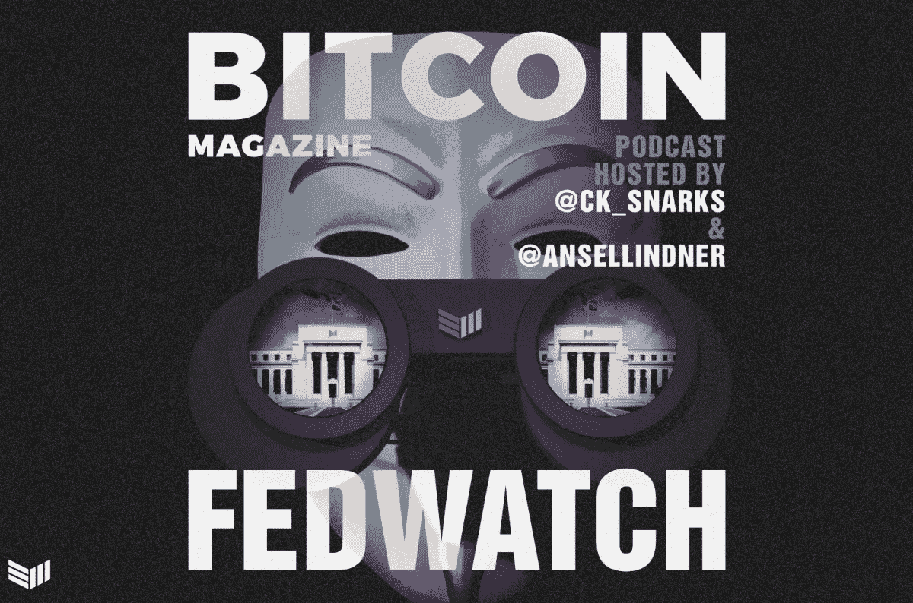
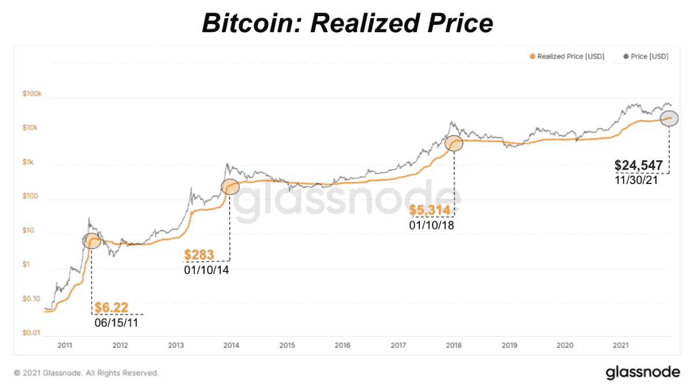
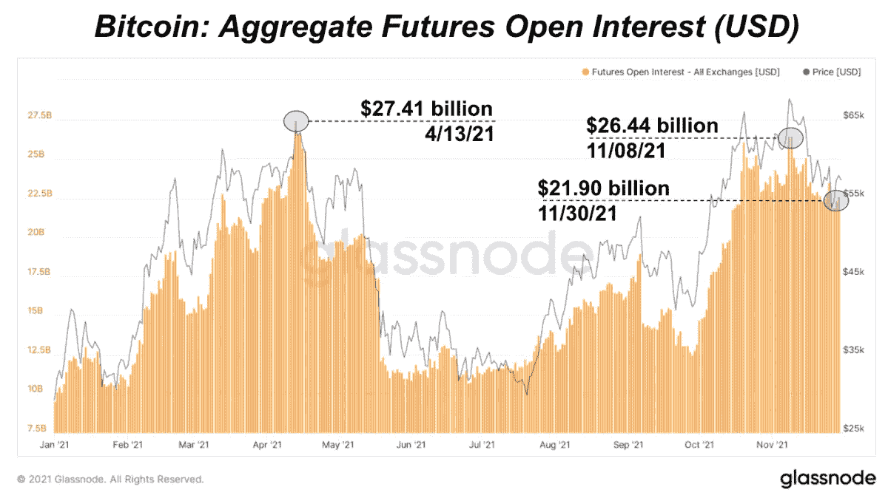
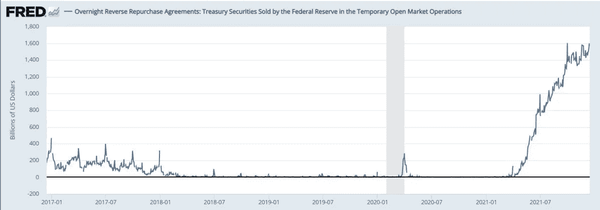

# 深入研究比特币周期

> 原文：<https://medium.com/coinmonks/taking-a-deep-dive-on-bitcoin-cycles-fb54ba18ad4d?source=collection_archive---------8----------------------->

讨论比特币的价格周期以及宏观经济发展如何塑造市场。

[**在 YouTube 上看这一集**](https://youtu.be/DsBS1IUiRHg)

**听这一集:**

*   苹果
*   [Spotify](https://open.spotify.com/episode/69s0HadKotRL7tjJbXPVVE?si=bf61d60442a44ea3)
*   [谷歌](https://podcasts.google.com/feed/aHR0cHM6Ly9mZWR3YXRjaC5saWJzeW4uY29tL3Jzcw/episode/NmEyODk4OTctMTVlNS00NWVmLTg4MjEtMjJkOWY3YjQ1NzE3?sa=X&ved=0CAUQkfYCahcKEwjAzL-Nveb0AhUAAAAAHQAAAAAQIw)
*   [Libsyn](http://fedwatch.btc.libsynpro.com/deep-dive-on-bitcoin-cycles-ft-dylan-leclair-fed-74)
*   [阴天](https://overcast.fm/+m2ae6LEd0)

在这一集《比特币》杂志的“美联储观察”播客中，我和克里斯蒂安·克罗勒斯与迪伦·勒克莱尔一起讨论了他广受欢迎的《深度探索》时事通讯中的连锁数据。我们还将其与一些涉及比特币和央行的宏观话题联系起来。这又一次被现场录制在了*比特币杂志* [YouTube 频道](https://youtu.be/sL66FuIjKYI)上。如果你想看现场直播，请在那里订阅，并在 Twitter 上关注我们，以获得我们将在的时间更新。随着我们对直播节目的掌握，我们将能够回答观众互动聊天中的直播问题。

# 潜入，实现了比特币的价格

在勒克莱尔的个人介绍之后，我们进入了他最近一次每月深度潜水的一些图表。首先是比特币的实际价格。

*Source: Deep Dive*

《深潜》中许多图表的有趣之处在于，它们是对网络基本面进行的技术分析。这个实现的价格就像一个移动平均线，但是是连锁数据。特别是，变现价格是比特币最后一次消费时的平均价格，或者换句话说，是比特币的平均成本基础。已实现价格线的斜率表明市场周期时间。当坡度较陡时，随着新进入者进入市场，硬币会迅速易手，因此这是一个牛市。当坡度平缓时，价格处于熊市或积累阶段。

# 合计期货未平仓合约

这些是我在这个月的深潜中看得最久的图表，所以我不得不具体询问 LeClair 关于未来的未平仓头寸。

*Source:* [*Deep Dive*](https://deepdivebtc.substack.com/p/the-deep-dive-monthly-recap-november)

这张图表是过期的，来自 11 月份的时事通讯，但 LeClair 从 Glassnode 调出了实时图表并分享了他的屏幕。乍一看，未平仓合约似乎只是跟随价格。然而，经过更仔细的检查，我开始注意到差异。

第一个是 2021 年 7 月。你看到黑色的价格线和橙色的未平仓利息线——价格下降，但未平仓利息上升，这是一种背离。此外，在勒克莱尔向我们展示的实时图表上，同样的背离今天再次发生。上周价格有所下跌，但未平仓合约正在增加。

# 比特币的下一阶段

随着我们讨论的深入，我们开始谈论比特币的下一步。深潜的许多指标表明，这并不是这个市场周期的结束。Keroles 和我讨论了为什么我们认为市场动态已经改变，也许四年周期已经死亡。

勒克莱尔的回应是，比特币正在等待下一个催化剂，无论是新一轮的量化宽松(QE)还是刺激措施，都需要一些东西来启动下一轮上涨。这引出了一个非常重要的话题，我在其他任何地方都没有听到过:比特币是一种风险资产吗？作为可靠的货币，它最终会变成一种风险规避资产吗？我问勒克莱尔，我们正处于这一转变的哪个阶段。

# 宏观，日本回购，美联储逆回购

在节目的最后，我们将迎来直播的下一个环节。我有一些宏观新闻要看，所以我们快速浏览了一下，并询问了勒克莱尔的想法。

第一项是日本银行向回购市场紧急注入流动性。这是自 2006 年以来，日本央行首次在宣布政策的同一天实施该政策。问题在于，市场回购利率正在飙升，这表明日本市场并非一切正常。日本央行介入提供 2 万亿日元(约 180 亿美元)，回购利率仍在上升。

我的想法是，这可能是与日本隔海相望的中国房地产崩盘的蔓延，日本投资者可能高度参与其中。

然后，我们快速看一下美联储的逆回购总额，它再次飙升至 1.6 万亿美元的新高。这代表银行、货币市场基金或一级交易商借钱给美联储，并获得美国国债作为抵押品。它显示了全球管道和风险规避中普遍的抵押品短缺。有趣的是，日本市场正面临着非常相似的问题。我们会继续关注，以后会有更多的报道。

*Source:* [*FRED*](https://fred.stlouisfed.org/series/RRPONTSYD)

# 链接

*   [深潜](https://deepdivebtc.substack.com/p/the-deep-dive-monthly-recap-november)
*   [日本央行回购救市](https://www.zerohedge.com/markets/boj-panics-unleashes-liquidity-first-time-2006-amid-repo-spike)
*   [福瑞德逆回购合计](https://fred.stlouisfed.org/series/RRPONTSYD)

*原载于 2021 年 12 月 15 日*[*https://bitcoinmagazine.com*](https://bitcoinmagazine.com/markets/taking-a-deep-dive-on-bitcoin-cycles)*。*

> 加入 Coinmonks [电报频道](https://t.me/coincodecap)和 [Youtube 频道](https://www.youtube.com/c/coinmonks/videos)了解加密交易和投资

# 另外，阅读

*   [Bookmap 评论](https://coincodecap.com/bookmap-review-2021-best-trading-software) | [美国 5 大最佳加密交易所](https://coincodecap.com/crypto-exchange-usa)
*   [如何在 FTX 交易所交易期货](https://coincodecap.com/ftx-futures-trading) | [OKEx vs 币安](https://coincodecap.com/okex-vs-binance)
*   [CoinLoan 评论](https://coincodecap.com/coinloan-review) | [YouHodler 评论](/coinmonks/youhodler-4-easy-ways-to-make-money-98969b9689f2) | [BlockFi 评论](https://coincodecap.com/blockfi-review)
*   [XT.COM 评论](https://coincodecap.com/profittradingapp-for-binance) | [币安评论](https://coincodecap.com/xt-com-review)
*   [SmithBot 评论](https://coincodecap.com/smithbot-review) | [4 款最佳免费开源交易机器人](https://coincodecap.com/free-open-source-trading-bots)
*   [比特币基地僵尸程序](/coinmonks/coinbase-bots-ac6359e897f3) | [AscendEX 审查](/coinmonks/ascendex-review-53e829cf75fa) | [OKEx 交易僵尸程序](/coinmonks/okex-trading-bots-234920f61e60)