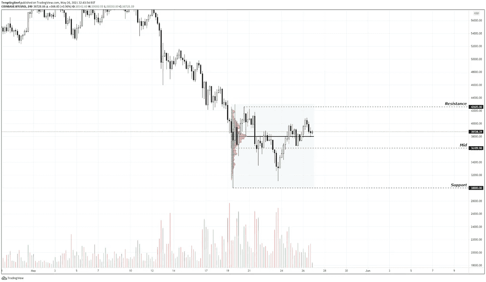
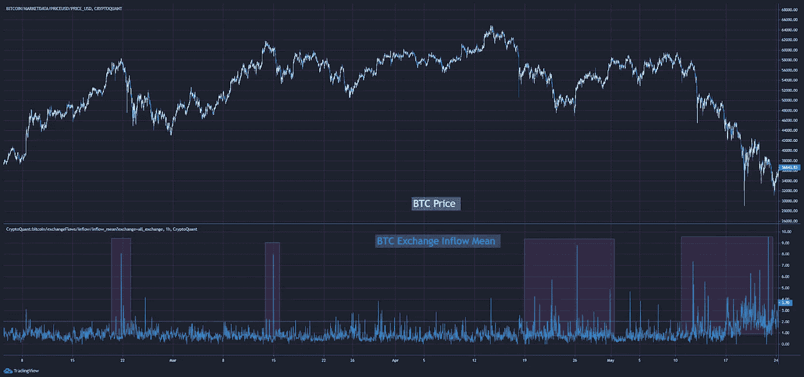
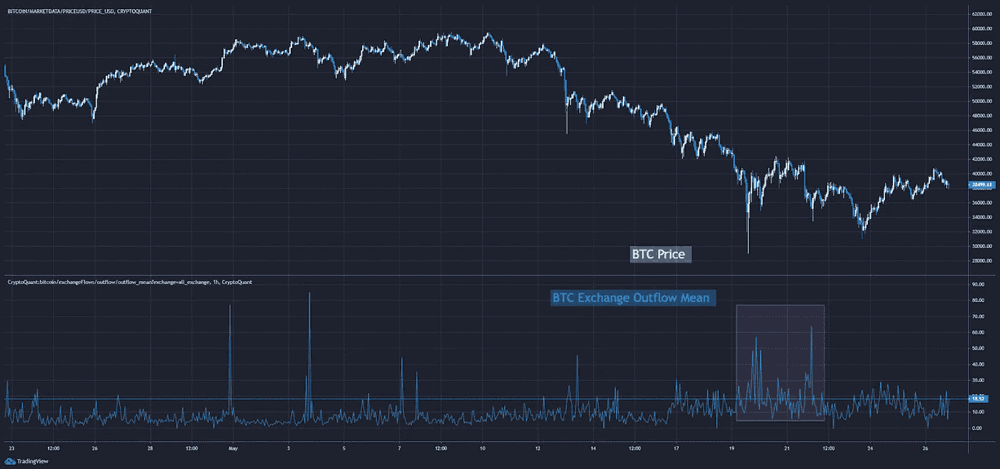
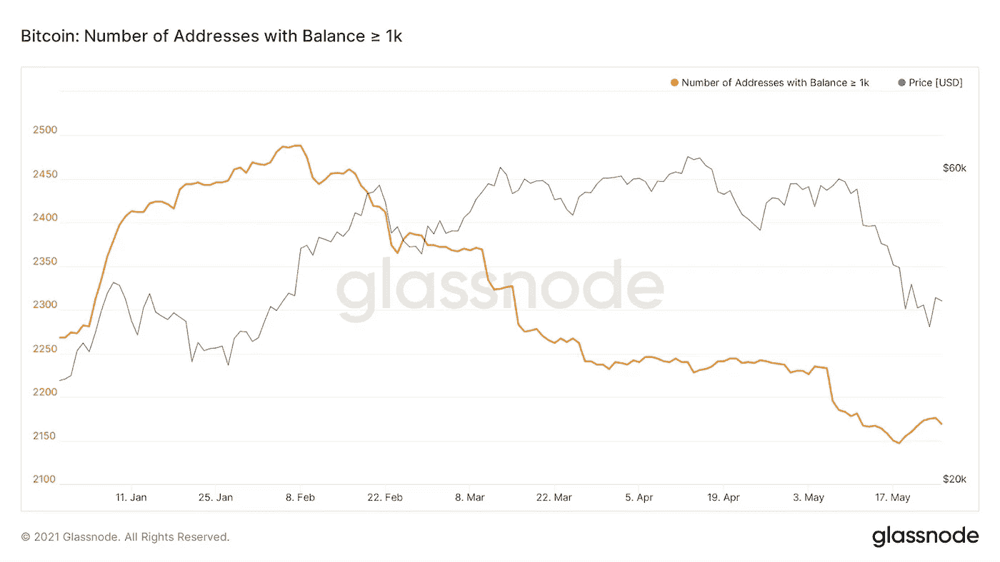
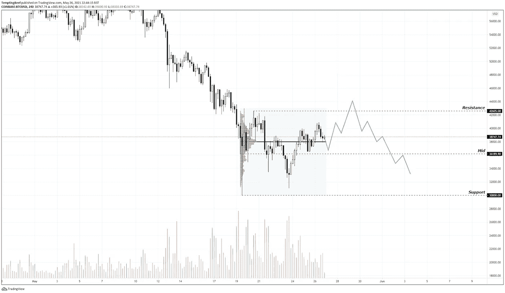
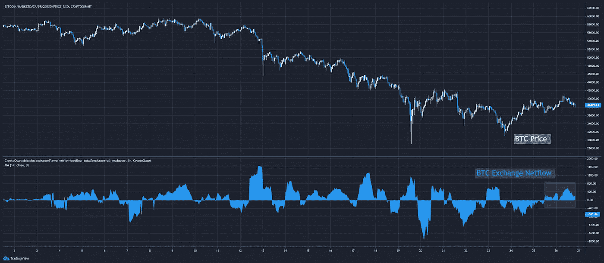

# 上钩了

> 原文：<https://medium.com/coinmonks/taking-the-bait-62187ad22f55?source=collection_archive---------1----------------------->

我的猫讨厌被刷。

主要是我的错。我没把他们当小猫刷。所以他们从来没有习惯这个过程。

对其中一只来说，这是必要的努力，因为它的长毛很容易打结。

但是这并不容易。

要做到这一点，需要一些巧妙的哄骗，直到珊莎意识到发生了什么，却为时已晚。这是一个点，当我加强了我的抓地力，夫人牛肉抓住了刷子。

但是在经历了几次这种舞蹈之后，她已经有了一种第六感，知道什么时候会发生。

所以我们必须更狡猾一点…

我经常会抓一盆零食，引诱她过来。轻轻地摇着它，让她靠近。等珊莎享受了几样美食后，我会把她抱起来。

鬼鬼祟祟的部分是，当我用美味的小吃引诱她时，牛肉女士拿起刷子。直到最后一刻，我们都不会去想它。

一旦开始，我们就迅速而温和地行动。

之后……她得到了奖励。

在比特币下跌后的最初几天，我开始对市场产生这种感觉。我怀疑自己被诱人的看涨价格行为所诱惑。

但是今天我要向你们展示的是一个不同的故事…

大家好，@这里诱惑 _ 牛肉。我又回来了，带来了更多的上链切割。

今天我关注比特币，现在重要的是要密切关注整个市场的走向。

在如此激进的抛售和仍有待证实的看涨结构之后，我们需要保持警惕。

正如你在下面看到的，BTC 目前处于 30k 到 42k 的交易区间。目前，它在交易区间的上半部分表现良好。

这些都是较高的低点，作为我刚才说的诱人的小吃。这让许多人对牛市的重新点燃感到非常兴奋……但我对此表示怀疑。

我之所以怀疑，是因为我们已经知道，在最近的抛售中，大玩家抛售了大量股票。而且他们需要更多的时间来重新积累。

现在的任何反弹都为时过早，而且会很快遭遇强大阻力。

让我用链上数据向你们展示我所指的阻力。

在抛售期间，我们看到大量 BTC 进入交易所。下图的下半部分显示了 BTC 外汇流入的平均值。这是查看进入交易所的比特币数量的一种方式。随着价格一路走低，我们看到了许多大幅上涨。

这表明大量比特币被送往交易所。

然而，我们只看到了少量的外流高峰。

显然有一些逢低买入，但从下图的低点以来并不多。

此外，当我们跟踪余额大于 1k 的地址数量时，我们看到鲸累积钱包的增长有限。

为什么？

可能是因为他们需要更多的时间，希望以更低的价格购买。鲸鱼不打算在交易区间的上半部分买入。

这就是为什么当我看到某种上升趋势从区间顶端伸出头来并被拒绝时，我不会感到惊讶。

这正是那种会以相当高的价格困住许多散户交易者，随后一些激进的下跌抛售将触发止损，造成更多抛售压力和恐慌的事情。

和更好的积累价格。

我在成交量曲线上加了一层，只是为了强调，到目前为止，大部分成交量都出现在交易区间的顶部。这意味着随着我们在这个范围内前进，分配多于积累。

我们也仍然得到一些相当显著的流入均值峰值，根据下图，目前整体净流量为正。

这告诉我耐心在这里仍然至关重要。

如果你能这样做，我相信你会得到一个更好的机会。

现在不要被美味小吃的承诺所诱惑，否则接下来只会是粗略的刷牙。

提供链上切割

@诱人 _ 牛肉

附:我是本·莉莉。希望你喜欢@诱人 _ 牛肉的短文。我总是期待他写的每周随笔。

我想很快地告诉大家，如果你认为你能写得和“诱人的牛肉”一样好，或者你认为你有全世界都需要阅读的分析，请把它发过来。浓缩咖啡是一个分享想法的地方，因此我们都可以改进我们的决策。我们鼓励像这样的客座博文！

## 另外，阅读

*   [CoinLoan 点评](/coinmonks/coinloan-review-18128b9badc4)|【Crypto.com】点评 | [火币保证金交易](/coinmonks/huobi-margin-trading-b3b06cdc1519)
*   [尤霍德勒 vs 科恩洛 vs 霍德诺特](/coinmonks/youhodler-vs-coinloan-vs-hodlnaut-b1050acde55a) | [Cryptohopper vs 哈斯博特](https://blog.coincodecap.com/cryptohopper-vs-haasbot)