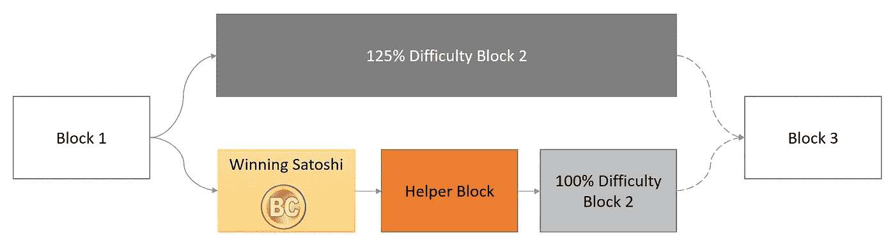
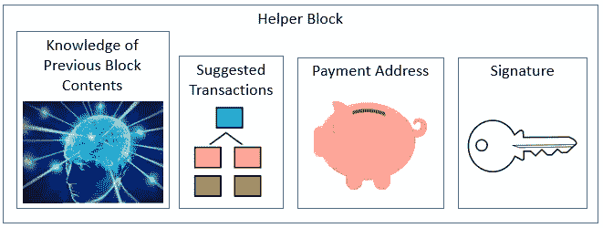
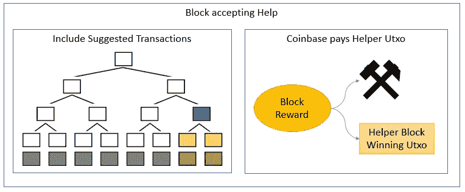

# 用辅助块驯服大矿工

> 原文：<https://medium.com/coinmonks/taming-large-miners-with-helper-blocks-6ae67ac242f6?source=collection_archive---------12----------------------->

矿工集权带来的两个严重威胁是审查和自私的开采。审查削弱了比特币作为控制自己财富的一种方式的基本价值主张。自私的采矿给大型矿商带来了竞争优势，导致了一个不受欢迎的反馈循环，即更大的集中化压力。极端版本的审查和自私的挖掘也可以用来攻击一个链，例如通过挖掘空块，或通过强制大重组。

辅助区块可能是一种减少审查和自私采矿所带来的威胁的方法，它给矿工提供了额外的激励，让他们立即发布解决的区块，并为各种各样的非矿工创造了一种影响下一个区块将包括哪些交易的方式。

## 基本思想是:

当一个方块被解决时，它会从 utxo 集合中随机选择一个 satoshi，并赋予控制该 satoshi 的人生成“辅助方块”的权力。助手块提交包含在下一个块中的事务子集。挖掘者可以通过包括建议的交易并将相关的交易费用支付给帮助者块中指定的支付地址来接受帮助者块。不使用辅助块的矿工必须满足 25%的高难度。

## 更详细的描述:

每当发现一个块时，就由块散列来确定一个获胜的 satoshi。获胜的 satoshi 的所有者能够产生有效的辅助块。

*辅助程序块将由以下部分组成:*

1.  建议交易的 Merkle 树的根
2.  证明助手可以访问整个前一个块(不仅仅是头)
3.  付款地址
4.  包含获胜的 satoshi 的 utxo 中指定的签名

*一旦助手块发布，矿工可以通过以下方式使用它:*

1.  他们确保事务 Merkle 树中的一个散列与助手块提供的建议树的根相匹配。
2.  他们向支付地址支付至少与从助手块建议的交易中收取的费用一样多的费用。

***建议选择获胜方式的智:***

给每个区块***【B】***分配一个数字***【N】***，该数字等于在高度低于 ***B*** 的区块中开采的 utxos 中保存的成熟 satoshis 的数量。计算 ***T*** ，所有 utxos 中成熟的 satoshis 总数。取最近块的 hash，用 ***T*** 取模，得到获胜的 satoshi 对应的一个数 ***W*** 。具有最大的 ***N*** 使得***N***≤***W***的块是包含获胜的聪的块。为了找到正确的 utxo，你从左到右向下走过 Merkle 树的根部，直到你累加了***W***-***N***未用完的 satoshis。

***前一块内容观察证明***

为了鼓励挖掘者立即发布整个块，而不仅仅是头，辅助块还将证明辅助块的创建者可以访问整个前一个块。为了证明这一点，助手对先前的块散列进行签名，将签名附加到先前的块内容，将两者散列在一起，并将该散列包括在其签名的助手块中。

***建议给助手块签名的方式:***

为了支持旧的 utxo，可以用使用 utxo 所必需的相同密钥对助手块进行签名。为了允许冷存储，可以使用 taproot 隐藏一个特殊的脚本，该脚本可以使签名计算机在不花费硬币的情况下创建助手块。

***软叉:***

这个规则可以作为一个软分叉来实现。升级后的节点将检查这些块是否满足 25%的高难度，或者是否使用了有效的辅助块。这种软分叉可以在一年或其他合适的试用期后自动恢复，除非第二个软分叉使其永久化。

***矿工的选择与激励:***

如果一个助手块可用，矿工必须选择是否使用它。为了决定哪一个更有利可图，矿工可以计算 25%低难度的期望值，并将其与助手区块要求的费用进行比较。如果有利可图的帮助区块包含矿商更愿意审查的交易，矿商可能仍会拒绝它们，但它们将把钱留在桌面上。有审查政策的池可能会发现很难像没有审查政策的池那样支付给哈希用户。

解决一个区块后，矿工必须决定是立即发布还是延迟发布。如果他们立即发布它，有可能会创建一个辅助块，并以较低的难度挖掘下一个块。如果他们拖延，那么(假设他们不能控制胜利的聪)，他们必须在更高难度的下一个街区工作。如果其他人在此期间发布了一个已解决的块，自私的矿工将处于潜在的劣势，因为竞争者的块可以由帮助者构建，但他们的块不能。私人区块链越长，自私的矿商面临的问题就越严重。

***对帮手的奖励:***

当一个新的块被挖掘时，它的散列选择一个获胜的 satoshi，并且包含该 satoshi 的 utxo 定义一个签名规则，该规则是创建一个有效的帮助块所必需的。如果一个人希望创建辅助块，他必须确保提前建立一个节点来接收新的块，认识到他可以创建一个辅助块，创建该块，并发布它。这个过程必须尽可能快地进行，因为任何延迟都可能导致在不使用辅助块的情况下很难找到一个块。每个拥有任何 satoshis 的人都有参与这次抽奖的经济动机。

如果他们选择建立这样一个节点，他们必须决定选择交易的策略。如果他们选择的交易费用总额太小，他们就冒着把钱留在桌上的风险。如果他们选择的交易费用总额过高，他们就有可能让他们的助手无利可图，让矿商无法接受。如果他们选择了他们知道 hashpower 致力于审查的事务，他们就有可能这个 hashpower 不会接受他们的助手块。

***对带外矿工费用的影响:***

当有人以某种方式而不是通过使用正常的费用机制(使输出总和小于输入)对矿工的交易进行补偿时，就会发生带外矿工费用。如果助手块存在，带外挖掘器费用就不那么有吸引力，因为助手块减少了挖掘器可以自由支配的块空间，并且补偿带外助手是不实际的。出于同样的原因，除了“每块最大费用”之外，所有矿工交易包含政策的影响较小。

***对羽叉审查制度的影响:***

当大型矿商避免在有黑名单交易的区块上进行建设，希望他们或其他人会在相同高度开采替代区块时，就会发生羽叉审查。助手块的可能存在使得这种策略不太可能成功，因为它创建了黑名单事务可以进入的额外场景。

*场景:*

1.  高度为 H 的块上的帮助程序块包含一个黑名单事务。在这种情况下，假设矿工不希望接受辅助块，他们可以在高度 H+1 以 125%的难度采矿，或者在高度 H 采矿以获得不同的辅助块。这两种选择都没有吸引力。在没有辅助块的情况下工作，他们需要 55.5%的哈希拉特来压倒剩下的 44.4%接受辅助块的哈希拉特，以便有 50%的机会击败他们到 H+1。如果他们选择开采 H，他们可能能够以 100%的难度完成，或者他们可能能够以 125%的难度完成，这取决于 H-1 是否有辅助块。此外，他们可能会找到 alt H，然后令他们沮丧的是，可能会创建一个助手块，再次挖掘黑名单中的事务。或者它们可能在网络的其余部分找到 H+1 之前找不到 alt H。同样，如果他们用黑名单交易挖掘 H，他们肯定只需要达到 100%的难度。
2.  高度为 H 的块包含一个黑名单事务，并且已经创建了一个助手块。矿工希望羽叉块 H，所以他们在 alt H 工作。但这里的问题。我们已经知道 H 块产生了一个辅助块。Alt H 产生辅助程序块的概率小于 100%。所以 H+1 肯定可以在 100%难度下开采，但是 alt H+1 可能只能在 125%难度下开采。无法提前知道。
3.  高度为 H 的块包含一个列入黑名单的事务，并且尚未创建任何帮助程序块。在这种情况下，恶意挖掘者在某种程度上处于执行羽毛分叉的“更好”位置，因为 alt H 可能会产生一个助手块，因此是一个更好的构建技巧。(当然，帮助者块也可能包括黑名单交易，毁了这个优势！！)这种有利的存在(？)场景实际上不允许羽叉攻击成功，因为成功的羽叉必须在多个块上进行。一旦黑名单上的交易得到 1 个以上的确认，执行羽毛叉的成本和赔率就会快速上升。

***对攻击者信心的影响:***

该方案引入的动力是给挖掘过程注入一种新的有益的不确定性。当最近挖掘的块已经用辅助块扩充时，希望避免在辅助块上构建的攻击者对可能发生的事情比他们在当前设置中更不确定。

在当前的设置中，矿工知道他们自己的哈希值，可以估计网络哈希值，并可以计算成功开采最近区块的替代方案的几率。相比之下，如果最近的块已经用助手块增加，寻求用他们自己的块替换它的矿工不知道他们创建的块是否能够用助手增加。他们很可能直到他们真正挖掘并发布该块之后才能了解这一点——到那时，要么有人会用助手来扩充它，要么没有人会。

***对能量消耗的影响:***

因为在这个方案中，帮助者消耗高达 25%的块奖励，所以可用于花费在能量上的块奖励减少高达 25%。与此同时，我认为安全性并没有下降，而是上升了，因为剩余的 75%以上的能源消耗是由一群更加分散的人控制的。

没有花在电力上的 25%的块奖励被分配给持有者。

***助手池:***

拥有获胜的 satoshi 是一个罕见的事件，需要保持一个活跃的节点，因此可以预期会出现助手池。我还没有想出如何以一种最小化信任的方式来共享。

***限制胜聪候选人:***

对每一个成熟的 satoshi 进行同等的加权是有道理的。这样做的好处是避开了关于限制会有什么神奇参数的政治，而且似乎是最纯粹和公平的。在这个计划中也没有诱惑定期花硬币只是为了留在彩票。最后，如果候选人的数量尽可能多(都是 satoshis ),就可以最大限度地减少试图成为矿工的可能性，并让大部分候选人处于你的控制之下。

或者，可以应用一些函数来将来自最近块的 satoshis 加权得更高。这种方法将允许丢失的硬币最终从彩票中消失，这是一个好主意，因为丢失的硬币不能产生辅助块。例如，硬币可以在超时后简单地停止成为候选，或者它们可能基于某种线性或指数衰减而变得不太可能赢得时间。

我的建议是两个⁹街区的简单暂停，略少于 10 年。绝大多数没有丢失的硬币可能会比每 10 年更频繁地移动，因此不需要考虑超时。一些人估计现在已经丢失了几百万个硬币，随着时间的推移，希望自私采矿的矿工可能会开始估计某个特定的获胜的 satoshi 丢失的可能性有多大，从而无法产生辅助块。到 2022 年，10 年的暂停将使 50 硬币时代未用完的硬币退出竞争。这些 utxos 很可能包含了很多丢失的硬币。还有，说实话，Satoshi 不太可能播辅助块。

***中奖几率:***

如果所有的 satoshis 的权重相等，并假设每 10 分钟产生一个区块，那么平均每 400 年就会有一个比特币被选中。如果我们放弃旧的 utxos，将该值降低到大约每 300 年一次是合理的。重要的经济参与者(例如，控制至少 100 个比特币的人)预计只会等待大约 3 年才能产生一个辅助块。

***辅助块大小:***

辅助块具有如下元素:

element _ 1 = signature of(hash _ of _ previous _ block _ header)[71 字节]

element _ 2 = hash of(full _ previous _ block+element 1)[32 字节]

Element_3 =事务子树的 Merkle 根[32 字节]

Element_4 = paymentAddress [20 字节]

Element _ 5 = signature of(Element _ 1+Element _ 2+Element _ 3+Element _ 4)[71 字节]

总大小=226 字节

当助手块被发布时，如果助手想要矿工实际使用它，他们还需要发布如何构建生成 Merkle 根的事务子树的指令。但是，这些信息不会存储在任何地方。

矿工们应该愿意接受帮助者区块，如果他们要求的金额少于没有帮助者区块时所能得到的区块奖励的 25%。现在，不到 25%的块报酬是交易费，所以矿工应该愿意接受具有非常大的子树的帮助块——甚至达到块大小的限制。将来，当费用占区块奖励的 25%以上时，矿工将只愿意使用较小的辅助区块，直到最终辅助区块倾向于指定约 25%的区块空间。

***对延迟敏感度的影响:***

根据这一提议，采矿分两个困难阶段进行。阶段 1 在接收辅助块之前难度很高。阶段 2 在收到一个助手块后难度较低。这减少了延迟差的挖掘器所具有的缺点，这是好的，因为大型的集中式挖掘器往往比小型的分散式挖掘器具有更低的延迟。当接收到帮助块时，可以完全验证先前挖掘的块。助手块可以比挖掘块更快地被验证，部分原因是它们包含更少的事务。辅助块也可以被所有矿工或多或少同时看到，而不是被开采前一个块的矿工提前看到，这是目前的不幸情况。

***选择性帮助:***

我已经把助手描述为立即向每个人广播助手块，但是如果助手只把助手块给了一些矿工而没有给其他人，会发生什么呢？这是否会产生一个漏洞，让大矿工可以付钱给助手，让助手专属于大矿工，并以这种方式帮助矿工获得更多的力量？

*选择性帮助不成问题的原因 1:*

假设一个矿工希望尝试这种策略。他们公开表示，他们愿意补偿合作的帮助者。(并通过推特向他们发泄无尽的愤怒。)如果帮助者通常期望 X 的报酬，这个矿工告诉他们他们将支付 X + Y，其中 Y 是仅仅因为独占而增加的钱。帮手是否应该排外？

我认为在这种情况下，帮助者应该会作弊。帮助者通常是匿名的，不太可能很快再有一个获胜的聪。他们可能没有名誉可言。在这种情况下，大多数帮手的合理选择是私下把帮手块送给矿工，但也私下送给他们的竞争对手。对于可以与大型矿商保持持久友好关系的助手池来说，这可能不是真的——但助手池比矿商池更容易被关心的霍德尔建立和拆除。

*选择性帮助不成问题的原因之二:*

一个矿工需要多少额外的钱来提供一个帮手才值得？例如，假设矿工拥有 45%的网络散列功率。假设网络在低难度下挖掘需要 540 秒，在高难度下挖掘需要 540 * 125% = 675 秒。我们的坏家伙矿工可以在 1200 秒时用辅助块采矿。一起工作的其他矿工可以在没有助手的情况下在 1227 秒内开采区块*。因此，如果我们的坏人矿工可以获得一个助手块的独占权，他们就有略高于 50%的有效散列率。*

控制获胜的聪的人必须决定怎么做。他们可以立即将他们的助手块发布到整个网络，产生它将被包括在下一个块中的高概率。或者，他们可以接受排他性交易，在这种情况下，有 50%的机会他们将一无所获。如果我们假设一个正常的助手区块价值高达区块奖励的 25%,那么与坏矿工上床的奖励从区块奖励的 25%左右开始，并根据助手对增加的不确定性的价格而增加。

所以矿工必须支付超过 25%的区块奖励才能获得相当于网络 10%的额外哈希值？对矿商来说，这开始听起来像是一笔糟糕的交易。感谢上帝，他们没有把钱花在更多的电力和矿工上，这大概可以为他们购买接近 25%的额外 hashrate！此外，想想他们的优势有多短暂？要让这种威胁达到真正的 51%攻击，他们需要一个接一个地控制网络。他们无法做到这一点，除非他们每次都能获得帮助程序块，而这是不可能的。

鉴于上述理由，我认为选择性帮助不会对该计划构成重大威胁。

*有人可能会从抽象的原则上反对助手块，认为它把网络控制权交给了不需要工作也没有风险的人。这种观点认为，工作证明需要购买硬件和消耗电能。它涉及到成本和风险，以及游戏中的皮肤。潜在的帮助者有什么风险？*

*为了使事情更具体，考虑一个对肥皂非常有热情的助手，他希望用他们最喜欢的肥皂的广告填满区块链的 1%。他们需要持有多少比特币才能实现这一目标？他们会损失多少费用？*

*在撰写本文时，假设随着时间的推移，satoshis 的权重相等，他们将需要控制至少 171，000 个比特币，价值超过 10 亿美元。这是假设他们可以提交指定了块中所有*事务的助手块。在未来的稳定状态下，当每个助手块只控制 25%的交易时，将需要 4%的所有 satoshis 只控制 1%的块空间，并且他们将每天损失相当于块奖励的 1.44%的费用。**

*在上面的例子中，有人希望只控制块空间的 1% ,有人能合理地得出结论说他们没有承担风险和成本吗？*

*助手块不会无缘无故地授予控制权和金钱，但它们确实会基于人们已经拥有的东西授予控制权和金钱，以实现另一个目的:省钱。这是典型的控制系统，它以次线性方式对用于获得它们的资源作出反应，这种次线性有利于去中心化。*

****与股权证明的对比:****

*一个表面的分析可能会得出结论，这是一个股权证明计划，帮助者确实有资格证明股权，但有关键的区别。*

1.  *助手块没有无关紧要的属性。事实上恰恰相反——用辅助程序块来研磨另一个历史会非常昂贵。首先，你需要拥有相当数量的智，其次，你需要挖掘多个有效的能量块，直到你得到一个指向你控制的智。例如，如果你拥有 100 个比特币，你将期望挖掘 170，000 个有效块(！)以便找到一个有效的帮助程序块，您有要签名的密钥。*
2.  *对股权证明的批评者担心，链条的控制权将最终集中在大股东手中。相比之下，辅助程序块并不授予辅助程序对构建哪些块的重要控制权。如果你发现你有能力在最后一个被开采的砖块上建造一个助手砖块，这种能力不能转移到其他的砖块上。*

****与机密事务的交互****

*对我来说，它看起来像 CT 输出将无法参与赢得 satoshi 的竞争，因为这些输出的数量被蒙蔽了。这个方案依赖于每个人能够计算哪个 utxo 包含获胜的 satoshi 的能力。虽然我们可以计算所有 CT 输出中总共有多少个 satoshi，但我们无法计算出哪个 CT 输出中有哪个 Satoshi。*

****如果你挖矿一个区块，你有胜聪怎么办？****

*控制大量 hashpower 和大量比特币的矿工有时可能会找到一个区块，他们可以为其生产助手区块。在这种情况下，自私挖矿的回报和风险都比平时高。奖励更高，因为在难度为 75%的辅助块上成功采矿的预期更高。风险更高，因为 Helper Block 以其声称的交易费的形式是有价值的。如果一个竞争者先找到一块积木，自私的矿工可能会失去他们的旧积木和助手积木。*