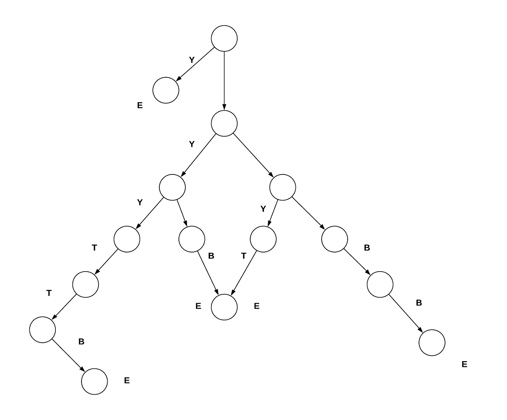

# 缠结途径

> 原文：<https://medium.com/coinmonks/tangle-pathway-58fb13e19eff?source=collection_archive---------1----------------------->

IOTA 缠结的节省空间的子图描述。

引用塞尔吉·波波夫的问题陈述，如何最好地描述我的意图？

来自 2018 年 11 月 20 日#tangle-math discord 频道:

> 塞尔吉·波波夫[IF]2018 年 11 月 20 日:我姑且称之为“半永久问题”。当然，从一开始就存储所有的事务是很困难的，因为这需要很大的空间。另一方面，这些事务中有许多不需要存储，因为它们几乎/完全无用(例如垃圾邮件)。假设您只想存储一组特定的事务:比如，在慕尼黑市中心捕获的来自温度传感器的历史数据(这当然很重要，并且需要永久存储，因为您相信将来会有许多人或实体需要它)。为了让*证明*数据是真实，您不需要存储所有的数据；您只需要一个包含感兴趣的事务的 Tangle 的连接(到“当前时间”)子图。所以，问题:如何有效地构建和维护包含“有趣”信息的连通子图？此外，我们可能需要一些“快速时间穿越链”(以便可以沿着它们“快速”回到过去)，但这些可以由 semipermanode 所有者发布。并且，半永久节点可以对访问数据收取一些费用。“在比特币中，你为交易付费，但访问账本是免费的。在 IOTA 中，交易是免费的，但您可能需要为访问分类账付费(以防您不想自己存储它)”—这看起来是一个合理的一般原则。

挑战由多个子问题组成，其中之一是实际的数据存储。为此，我开始深入研究 IRI 的内部工作方式，并创建了一个 couchbase 数据库适配器，对数据存储的“持久性”进行更细粒度的控制。你可以在这里阅读文章。

## [数]子图

正如波波夫博士所说，我们需要连通子图，这是我在这里描述的编码机制的焦点。

具体来说:“空间高效的路径描述”

这里的空间效率部分非常重要。因为如果你想存储一个特定的事务，如果你需要 100 倍的空间来描述你真正想存储的东西，那就太荒谬了。

还有一个要求是，给定一个想要获得数据的节点，它可以立即从持有数据的节点请求并验证事务(带有连接的子图)。

为了实现这一点，我确定了 4 个独特的描述符，可以描述整个纠结。只有 4 个描述符的好处是每个描述符只需要 2 位:

*   B[0，1] =跟随分支
*   T[1，0] =跟随主干
*   Y[1，1]=跟着树干，记住我。
*   E[0，0] = End，转到最近记忆的 Y，跟随分支。

编码器必须跟踪它“访问”了哪些事务，以防止多次遍历这些路径。

Example sub-graph(left=trunk, right=branch): yEyyttbEbEytEbbE

给定一个 start 事务，描述如下(我使用字母进行解释，但实际上这些是它们的位表示)

yEyyttbEbEytEbbE = 1100111101001000100111000010100

为了直观地了解这种编码方式的效率，请浏览视频的结尾:[https://www.youtube.com/watch?v=iOuwzFS4AiY](https://www.youtube.com/watch?v=iOuwzFS4AiY)

该视频中走过的路径如下所述，仅用 709 个字节就解码了 2698 个节点(so *2 条边)。(然而，考虑到某些模式在大型图上的重复出现，gzip 压缩甚至可以进一步降低存储需求。)

见视频开头第一个冗长的‘叶烨’=长尾。

a) a) a) a) a) a) a) a) a) a) a) a) a) a) a) a) a) a) a) a) a) a) a) a) a) a) a) a) a) a) a) a) a) a) a) a) a) a) a) a) a) a) a) a) a) a) a) a) a) a) a) a) a) a) a) a) a) a) a) a) a) a) a) a) a) a) a) a) a) a) a) a) a) a) a) a) a) a) a) a) a) a) a) a) a) a) a) a) a) a) a) a) a) a) a) a) a) a) a) a)

(注意,没有 B 和 T,因为它是加载所有中继和分支事务的图的完整描述,而不仅仅是路径)

喜欢这份工作吗？随意捐！rcbwjzskaspdeiojtfgwmbjavncv 9 gjvpyhfqqokkeqdvlhsigmgjbao 9 fjwlnucdknhdmndunwkpmahtvamgqud

不和:奥拉夫·范·韦克#1273

推特:[https://twitter.com/@ovanwijk](https://twitter.com/@ovanwijk)

https://github.com/ovanwijk/tangle-pathway

> [在您的收件箱中直接获得最佳软件交易](https://coincodecap.com/?utm_source=coinmonks)

