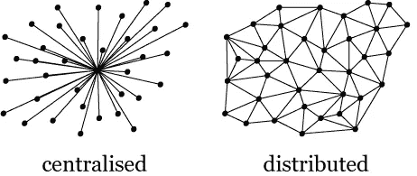
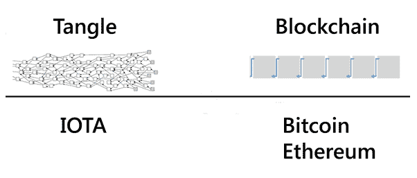
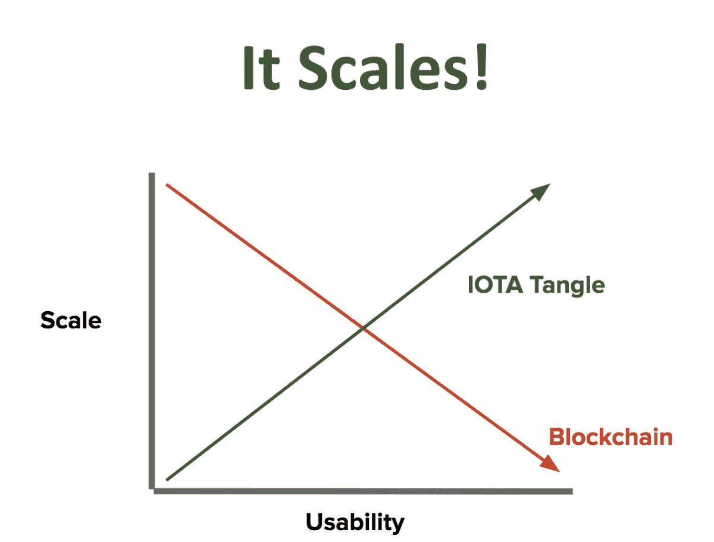
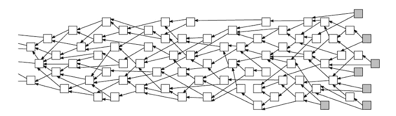

# 纠结——物联网和 Web 3.0 的缺失环节

> 原文：<https://medium.com/coinmonks/tangle-the-missing-link-for-iot-and-web-3-0-6519f22ebc81?source=collection_archive---------4----------------------->

要理解什么是 Tangle，为什么我们需要它，我们需要事先知道两个概念。它们是分布式总账和区块链。对于那些知道什么是分布式分类账和区块链的人来说，你可以跳过接下来的两个部分，其他人继续，你会发现对这两个概念的简要介绍。

## 分布式分类帐

Ledgers

任何拥有银行账户的人都会知道分类账。分类账是记录经济交易的一本书或一个计算机文件。现在，这些分类账是集中的，也就是说，它们由一个被称为银行的可信机构来维护。集中式账簿的问题在于，可信机构对它们拥有完全的控制权，他们可以决定对你的账户进行罚款，或者未经你的同意就从你的账户中取走资金。他们也可以在没有任何通知的情况下关闭。集中式分类账的另一个大问题是，它们非常容易受到攻击，任何具有高计算能力和恶意的人都可以危及整个系统。因此，针对该问题提出的解决方案是分布式分类账，即每个参与者都有一个相同的分类账，并且新的交易通过参与者的一致同意而被批准。因此，现在不需要中间人来批准交易，因此权力被分配给参与者。与集中式分类帐不同，分布式分类帐更能抵御网络攻击，因为攻击者必须同时控制超过 51%的分布式网络。分布式分类帐不允许个人改变分类帐，因为它们是不可变的。

## 区块链

区块链是完全向任何人开放的分布式分类账。在基本层面上，区块链是一种链表！很多区块连在一起形成区块链(咄！).第一个块被称为起源块，每个块有三样东西，数据、散列和前一个块的散列。一个块通过它的散列来识别。哈希对于每个数据块都是唯一的，它类似于数据块的指纹。数据的任何变化也会改变块的散列。因此，这可用于发现数据是否被更改。当恶意用户试图改变块的数据时，他将固有地改变块的散列，因为区块链是使用类似链表的技术形成的，这将使所有随后的块无效。为了确保额外的安全性，增加了另一种缓解技术，称为工作证明，即需要 10 分钟向链中添加一个新块。这使得它对攻击有很强的抵抗力。数字加密货币比特币使用区块链来维护其交易。

我知道你们大多数人都在想，为什么我们都还没有适应区块链！！我知道，但是区块链也有它的缺点。我认为还有另一种技术可以克服区块链的困难，它叫做 Tangle。在继续纠缠之前，让我们讨论一下区块链中存在的问题。

## 区块链的问题

*   每笔交易都有费用。比特币交易费用约为 20 美元，小额支付受此影响最大，因为低于此金额的任何交易都是无价值的，因为你将支付比实际交易金额更多的费用。

*   可扩展性是区块链的另一个巨大问题。从上图中可以看出，比特币每秒批准约 5-7 笔交易，而 Visa 每秒批准约 2000 笔交易。被称为 Visa 替代品的比特币必须能够跟上这种交易水平。目前，每笔比特币交易需要 10 分钟才能获得批准，还有数千笔未经确认的交易。点击此[链接](https://blockchain.info/unconfirmed-transactions)可以查看区块链上的未确认交易直播。
*   区块链的另一个问题是，它已经集中到少数几个强大的参与者手中。随着网络规模的增加，区块链需要巨大的计算能力。矿工通过支付费用来验证网络上的交易，从而提供这种计算能力。所以现在，拥有巨大计算能力的人变成了强大的玩家，似乎控制了网络。现在，这是集中化，违背了区块链的目的。
*   拥有传统计算机的矿工必须通过 2⁶⁸随机数(只使用一次的数字)来生成块的散列。如果一个怀有恶意的人使用量子计算机，那么他/她将只需要通过 2 个⁴随机数，即量子计算机比经典计算机快大约 170 亿倍。尽管量子计算机现在还没有普及，但再过 15-20 年，它们可能会普及。量子计算机正处于研究阶段，像 IBM 这样的企业已经建造了 T2 原型，并致力于将其商业化。区块链称赞未来不能抵抗这些量子攻击。

现在你可能会问，那么区块链不就是一个美化了的链表吗？是啊！

## Tangle 是如何克服这些问题的？

区块链和 Tangle 的主要区别在于它们的结构。区块链是顺序添加的块，而 Tangle 是 DAG(有向无环图)。

DAG 是没有任何循环的节点层次结构，DAG 的其他应用是 Git 协议，它使用 Merkle DAG， [IPFS](/coinmonks/interplanetary-file-system-ipfs-future-of-the-web-c45c955e384c) 等。IOTA 是 Tangle 用来处理交易的加密货币。

随着用户数量的增加，与区块链相反，Tangle 实际上变得更快。Tangle 的另一大优势是没有矿工。那么，现在的交易是怎么审批的呢？要进行一项交易，你必须批准两项随机选择的交易，这消除了对矿工和费用的需要。

在上图中，灰色节点表示未确认的交易。要进行您自己的交易，您必须批准随机选择的两个未经确认的交易。这两个交易是使用马尔可夫链蒙特卡罗(MCMC)算法选择的，该算法确保一个人不会选择他自己的交易来批准。所以共识和交易生成不是纠结中的解耦，不像区块链。Tangle 还可以抵抗量子攻击，因为它使用了 [winternitz 一次性签名](https://crypto.stackexchange.com/questions/8979/winternitz-one-time-signature)。

## 缠结的缺点

Tangle 的唯一问题是，当网络规模很小时，它很容易受到攻击，并且随着用户数量的增加而变得越来越强大。为了帮助启动 Tangle 的开发，它的创建者开发了一个协调器来保护它免受攻击。协调器可以被认为是网络的训练轮，一旦用户数量达到阈值，就可以将其移除。

## 泰戈的应用

想象一下，我们的每个设备都能够在没有人类干预的情况下相互通信。以汽车为例，每辆车都有自己唯一的 ID 和钱包。这辆车可以自己支付过路费、停车费等。随着自动驾驶汽车的到来，我们可以拥有一支无人驾驶汽车车队，每辆汽车都要支付自己的通行费和停车费，并向用户收取费用。Tangle 还将彻底改变供应链管理和许多其他领域。

## 结论

Tangle 是缺失的一环，它帮助将每个设备连接在一起，并允许每个设备在没有人类帮助的情况下与另一个设备通信。我们现在所处的时代确实令人惊叹，因为每个周末都有人工智能的新进展，可以彻底改变我们生活方式的新技术也在不断发明。对于一个人工智能爱好者来说，我认为没有也不会有一个更令人兴奋的时代。