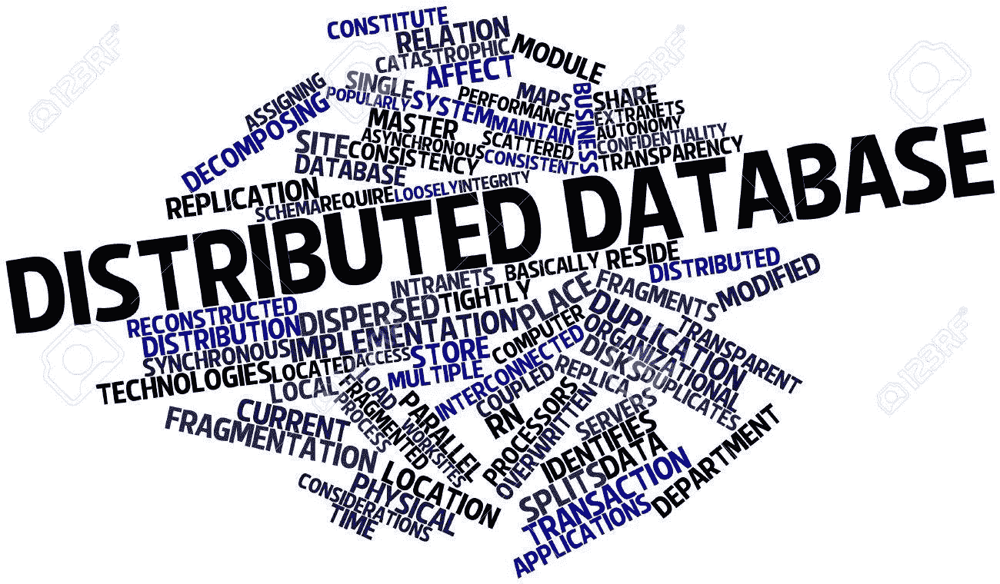

# 陶——的分布式社会图数据库

> 原文：<https://medium.com/coinmonks/tao-facebooks-distributed-database-for-social-graph-c2b45f5346ea?source=collection_archive---------0----------------------->

[Image Source](https://www.google.co.in/url?sa=i&source=images&cd=&cad=rja&uact=8&ved=2ahUKEwiBqoPxp8fcAhWLuY8KHW-5CDQQjxx6BAgBEAI&url=https%3A%2F%2Fwww.123rf.com%2Fphoto_16580130_abstract-word-cloud-for-distributed-database-with-related-tags-and-terms.html&psig=AOvVaw1_Dmn6-gLmOtU1vlt2lOdw&ust=1533056790763776)

## 介绍

我将介绍脸书关于图数据库的论文中概述的架构和关键设计原则。本文试图总结一个高度可扩展的图形数据库的体系结构，该数据库可以支持对象及其关联，适用于由每秒数十亿个事务组成的大量读取工作负载。在 facebook 的例子中，读取占了超过 99%的请求，而写入不到 1%。

> 交易新手？试试[密码交易机器人](/coinmonks/crypto-trading-bot-c2ffce8acb2a)或者[复制交易](/coinmonks/top-10-crypto-copy-trading-platforms-for-beginners-d0c37c7d698c)

## 背景

脸书有数十亿用户，其中大多数用户消费内容的次数比他们创造内容的次数多。所以很明显他们的工作量很大。因此，他们最初使用 [memcach](https://www.usenix.org/system/files/conference/nsdi13/nsdi13-final170_update.pdf) ed 实现了一个分布式后备高速缓存，本文对此做了大量参考。在此工作负载中，后备缓存用于支持对数据库的所有读写操作。良好的缓存命中率可以确保良好的性能，并且不会使数据库过载。下图显示了 facebook 如何使用基于 memcache 的 lookaside 缓存来优化读取。

Look aside cache from the Memcache paper

虽然这非常有用，但脸书的大多数信息最好使用社交图来表示，页面上呈现的内容是高度可定制的，取决于用户的隐私设置，并且对每个用户都是个性化的。这意味着数据需要按原样存储，然后在查看/呈现时进行过滤。

看看在一个典型的简单活动中生成的社交图，比如:“有人和其他人一起参观了金门大桥，然后一些人对它进行了评论”

Social graph between users

在像 lookaside cache 这样的键值存储中表示这些信息变得非常棘手和麻烦。拥有基于原生图形的商店的一些关键动机是:

1.  一种可能的实现是使用格式化的边列表作为单个值。但是这意味着每次访问都需要加载整个边缘列表，并且需要对边缘列表进行更多的修改。可以引入可以与一个键相关联的本地列表类型。但是这仅仅解决了有效的边缘列表访问查找的问题。在社交图中，许多对象是相互关联的，通过边列表协调这样的更新是很棘手的。
2.  在脸书的 memcache 实现中，memcache 发布租约，告诉客户等待一段时间，防止蜂拥而至(在相同的流行对象上读写会导致缓存中的未命中，然后进入数据库)。这将控制逻辑移到了客户端，由于客户端之间不进行通信，这就增加了复杂性。在对象和关联的模型中，一切都由道系统控制，道系统可以有效地实现这些，因此客户可以自由地快速迭代。
3.  使用图语义，实现写后读一致性模型变得更加有效。

所以道提供了对象和关联作为系统中的基本访问单位。它还针对大量读取进行了优化，并且在大多数情况下保持一致，但在出现故障的情况下，它会提供最终的一致性。

## 数据模型

数据模型由两个主要实体组成:

Object:将*“id”*映射到*“Key，ObjectType，Value”*

在上面的例子中，爱丽丝是类型为*用户的*对象*。*Cathy 添加的另一个注释是一个类型为 *comment* 的*对象*，其文本为*“希望我们在那里”。*对象更好地代表了可重复的东西，比如评论。

关联:它将“Object1，AssociationType，Object2”映射为“time，Key，Value”。关联表示最多发生一次的关系——两个朋友使用关联最多连接一次。在下面关于查询如何工作的部分中，时间字段的用处将变得更加清楚。

在上面的例子中，Alice 和 Cathy 使用关联类型 *friend 相互关联。*同样*检入*和金门*位置*这两个对象也是相互关联的。关联的类型在每个方向上都是不同的。金门*位置对象*使用*签入关联类型*连接到*签入对象*。而*签到对象*使用*位置关联类型*连接到*金门位置对象*。

## 对象和关联上的 API

对象 API 很简单，它们允许使用对象的 id 来创建、修改、删除和检索对象。

关联创建、修改和删除 API 基本上相应地改变具有关联的两个对象 id 之间的链接。

更有趣的是关联查询 API。这就是图语义发挥作用的地方。考虑以下查询:

*“给我最近 10 条关于 Alice 签入的评论”*

这可以建模为 ***assoc_range(CHECKIN_ID，COMMENT，0，10)*** 。这也是关联的时间字段派上用场的地方。时间字段可以用来像这样轻松地对查询进行排序。

“凯茜的评论有多少个赞？”

***assoc_count(COMMENT_ID，LIKED_BY)*** 该查询将返回与签入相关联的“赞”数量。

# 陶建筑

## 持久存储

在高层次上，TAO 使用 mysql 数据库作为对象和关联的持久存储。通过这种方式，他们可以获得数据库复制、备份、迁移等所有功能。在这方面，LevelDB 等其他系统无法满足他们的需求。

系统的整体内容被分成多个碎片。每个 object_id 包含一个 shard_id，反映了该对象的逻辑位置。这转化为定位该对象的主机。关联也和它的原始对象存储在同一个片上(记住关联被定义为 Object1，AssociationType，Object2)。这确保了更好的局部性，并有助于从同一主机检索对象和关联。系统中的碎片数量远远超过托管 mysql 服务器的主机数量。如此多的碎片被映射到一个主机上。

所有属于对象的数据都根据 id 进行序列化和存储。这使得 mysql 数据库中的对象表设计非常简单。关联以类似的方式存储，id 作为键，数据被序列化并存储在一列中。给定上述查询，进一步的索引建立在关联表上，用于:始发 id(Object1)、基于时间的排序、关联类型。

## 缓存层

与 memcache 文章中一样，使用缓存层来卸载数据库工作负载仍然非常重要。请求信息的客户端首先连接到缓存。这个缓存属于由多个这样的缓存和数据库组成的层。它们共同负责服务对象和关联。

如果存在读未命中，则缓存可以联系附近的缓存或转到数据库。在写入时，缓存会对数据库进行同步更新。在大多数情况下，这有助于写后读的一致性；在接下来的章节中会有更多的细节。

## 扩展缓存服务器:区域、层级、领导者和追随者

Regions consisting of many follower tiers and a leader tier connected to the database. Slave region then connect to this master region

显而易见，人们可以继续向一个层添加更多的缓存服务器。但这会使给定层变得非常厚，从而容易出现热点。此外，随着层级变得越来越多，沟通成本也会呈二次方增长。

因此，这个想法是有两个层次。一个区域将由多个层级组成，但只有一个层级是领导者层级，其余的是追随者层级。读取未命中(无法满足共处一地的对等方的要求，可进入从者层)和写入将始终进入该区域的领导者层。读取命中将由从客户端发出请求的跟随器层或另一个跟随器层来处理。通过这种方式，热点可以通过[一致性哈希](https://www.akamai.com/es/es/multimedia/documents/technical-publication/consistent-hashing-and-random-trees-distributed-caching-protocols-for-relieving-hot-spots-on-the-world-wide-web-technical-publication.pdf)来缓解，这使得添加层更加容易，而无需重新平衡大量缓存。此外，追随者可以将流行对象的读取工作负载一直卸载到客户端，客户端可以缓存它们更长时间。

使用这种层次结构，一个很大的优势是只有一个领导层来协调对数据库的所有访问。所以领导层自然是一致的，并且总是最新的。此外，它可以在大量查询到达时保护数据库，并限制对数据库的未决查询，还可以避免对性能有害的重叠范围扫描。

在这个架构中，有多个相互独立运行的追随者层。第 1 层可以更新一个值，而第 2 层无法知道新值。因此，跟随者层需要知道源自其他跟随者层的变更。这是通过领导者异步发送给追随者的缓存维护消息来实现的。这意味着跟随者最终只会是写后读一致的。

## 缩放和地理

虽然最后一节介绍了给定数据中心的扩展，但 facebook 拥有数十亿用户，广泛分布在多个大洲和地理区域。如果有一个来自亚洲的流行碎片请求，但是这个碎片是由一个托管在美国数据中心的追随者提供服务的，那么这种对象的读取延迟将会很大。为了解决这个问题，一个碎片可以由亚洲的一个从属区域托管，该区域有一个副本数据库、追随者和领导者。

从高层次来看，从机区的工作目的如下:

1.  从跟随器可以继续从它们自己的缓存中提供读取命中。
2.  对于读未命中，从跟随器需要访问从领导者，从领导者将访问副本数据库以获取值
3.  写操作同步进行到从属主机，然后到主主机，再到主数据库。主数据库被复制到从数据库。
4.  复制链接触发从领导者更新，这反过来触发这个从追随者失效消息。

## 故障处理

既然前面已经详细讨论了一致性，那么让我们看看当这些主要组件中的任何一个出现故障时会发生什么。

**网络故障:**

如果没有响应，则通过积极的超时和绕过超时进行处理。主机被标记为关闭，如果没有响应，将接受进一步的诊断。

**数据库故障:**

如果主服务器关闭，其中一个从服务器将提升为主服务器角色。从数据库故障可以通过找到主区域中的主数据库来解决。

**首领失败:**

当领导服务器出现故障时，领导层中的其他服务器用于绕过它进行路由。追随者只需向该层级中的随机领导者发送请求。读取未命中也可以通过访问本地数据库来解决。

**跟随者失败:**

当一个追随者失败时，其他层可以帮助服务碎片。每个客户端都配置有一个主层和一个备份层。

## 结论

我看到了很多关于不同类型的键值存储的文献，比如 Cassandra、BigTable、C-store 等等。，但并没有真正详细了解挑战和对图形数据库的需求。这篇论文总结得很好。此外，对于真正的分布式数据库来说，基于地理的扩展似乎是一个好方法。总的来说，我在业内听到更多的是 Kafka for pub-sub 和 Cassandra，而不是 Neo4j 或 TAO 等图形数据库。鉴于网络变得越来越个性化，这对我来说似乎有悖直觉。

> 加入 Coinmonks [电报频道](https://t.me/coincodecap)和 [Youtube 频道](https://www.youtube.com/c/coinmonks/videos)获取每日[加密新闻](http://coincodecap.com/)

## 另外，阅读

*   [复制交易](/coinmonks/top-10-crypto-copy-trading-platforms-for-beginners-d0c37c7d698c) | [加密税务软件](/coinmonks/crypto-tax-software-ed4b4810e338)
*   [网格交易](https://coincodecap.com/grid-trading) | [加密硬件钱包](/coinmonks/the-best-cryptocurrency-hardware-wallets-of-2020-e28b1c124069)
*   如何在 Uniswap 上交换加密？ | [A-Ads 评论](https://coincodecap.com/a-ads-review)
*   [WazirX vs CoinDCX vs bit bns](/coinmonks/wazirx-vs-coindcx-vs-bitbns-149f4f19a2f1)|[block fi vs coin loan vs Nexo](/coinmonks/blockfi-vs-coinloan-vs-nexo-cb624635230d)
*   [本地比特币回顾](/coinmonks/localbitcoins-review-6cc001c6ed56) | [密码货币储蓄账户](https://coincodecap.com/cryptocurrency-savings-accounts)
*   [密码电报信号](http://Top 4 Telegram Channels for Crypto Traders) | [密码交易机器人](/coinmonks/crypto-trading-bot-c2ffce8acb2a)
*   [最佳加密交换机](/coinmonks/crypto-exchange-dd2f9d6f3769) | [印度最佳加密交换机](/coinmonks/bitcoin-exchange-in-india-7f1fe79715c9)
*   [开发人员的最佳加密 API](/coinmonks/best-crypto-apis-for-developers-5efe3a597a9f)
*   最佳[密码借出平台](/coinmonks/top-5-crypto-lending-platforms-in-2020-that-you-need-to-know-a1b675cec3fa)
*   [杠杆令牌](/coinmonks/leveraged-token-3f5257808b22)终极指南