# TAPS 1.0 发布！

> 原文：<https://medium.com/coinmonks/taps-1-0-released-19aff984f484?source=collection_archive---------1----------------------->

## Tezos 自动支付系统

里约热内卢，2019 年 2 月 28 日。TezosRio 已经向公众推出了继 TezosJ_SDK 库之后的第一个项目。对我们来说是一个重要的里程碑。

TAPS 旨在帮助 Tezos 面包师实现任务自动化。它的主要特点是将奖励自动分配给委托人。TAPS 通过每隔一段时间(每 60 分钟)运行一次获取任务来从 TzScan.io 获取信息，并将 Tezos 网络奖励等待周期与 TAPS 本地数据库中注册的奖励等待周期进行比较。

如果不一样，说明网络给面包师输送了奖励。到目前为止，面包师应该手动将奖励转移给委托人，这是一项耗时的任务。通过使用 TAPS，周期变化事件会自动触发奖励分配，并允许在此过程中进行一些计算。比如收费。

TAPS 的第一个 alpha 版本已经在几周前推出，并得到了用户的良好反馈。尽管如此，正如所料，还是提出了一些建议。其中最主要的是在 TAPS 中添加了一个本地钱包。

通过拥有自己的嵌入式本机钱包，TAPS 可以独立于 Tezos 节点运行。第一个版本使用 tezos-client 命令进行传输，这可能很难设置，因为更高的安全性可能意味着更低的灵活性——总是有所取舍。

TAPS native wallet 就像一个水箱。向授权人转移奖励款项的资源将来自该账户(而不是 Tezos node 主钱包)。这意味着即使代码被错误地编程并进入 infinit 循环，它也不会损害节点资源。

这具有安全优势并提高了灵活性，尽管降低了自动化程度，因为它要求这个“水箱”保持充满足够的资源来进行支付。因此，通过使用这一功能，面包师最终应该会将资金转移到 TAPS native wallet。

无论如何，这是一个重要的工具，将减轻贝克的工作。TAPS 也使用我们的主项目 TezosJ_SDK 库来创建、导入和控制原生 wallet。

这个新版本的 TAPS 还允许面包师打印带有奖励分配历史的 PDF 报告。

要开始使用 TAPS，请遵循我们上一篇文章中写的安装说明，因为它有一些设置要求:

 [## 安装 Tezos 水龙头

### 一步一步的入门指南

medium.com](/@lmilfont/installing-tezos-taps-382adedd6a0f) 

然后使用 http//127 . 0 . 0 . 1:8888/taps/index . cfm，通过您的 web 浏览器登录系统，第一次使用 admin/admin 作为用户名和密码组合:

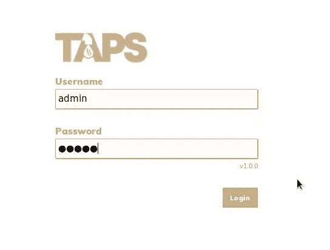

TAPS authentication page

您将看到设置配置页面，您可以在其中输入面包师的详细信息，以使 TAPS 正常工作。

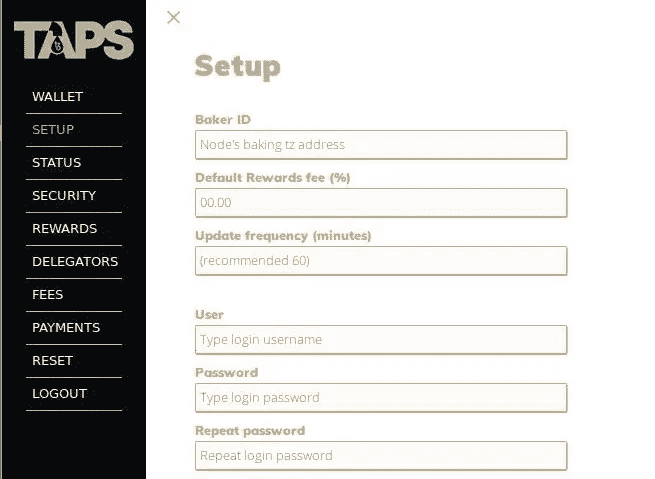

Baker’s configuration setup

新版本的主要区别可以在页面底部看到。您将看到一个单选按钮，通过它您可以选择是希望 TAPS 像以前一样工作(直接使用 Tezos 节点资源进行传输)，还是希望 TAPS 从其自己的本机钱包中获取资源。

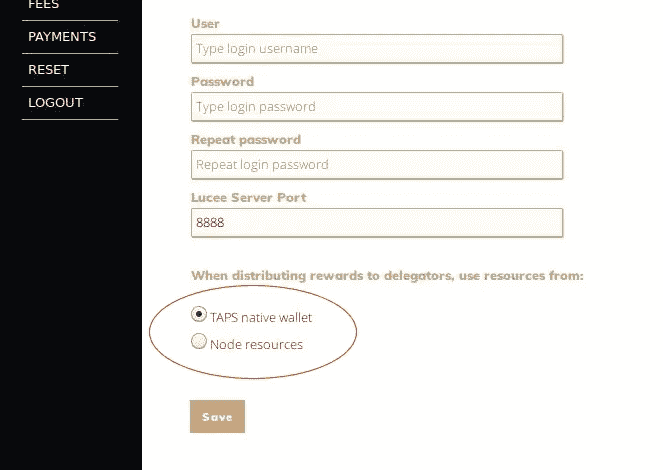

如果一切顺利，您将看到祝贺页面，确认您已成功配置 TAPS。

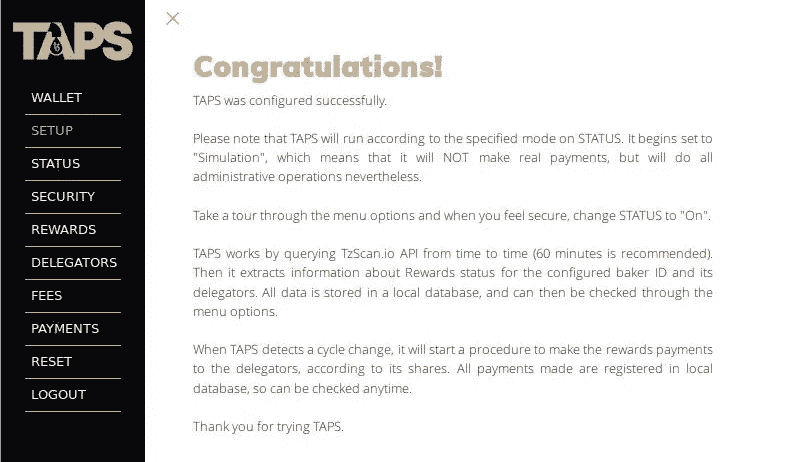

但如果你选择使用原生钱包，还有一步要走。您必须创建一个新的钱包，并用资源为其提供资金。这可以在钱包菜单选项中完成:

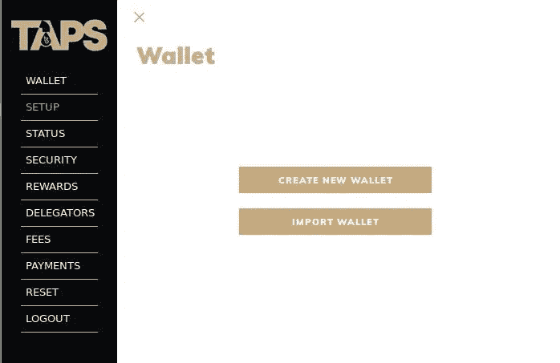

您可以创建新的钱包或导入现有的钱包。不要忘记遵循钱包创建中所有众所周知的良好实践:在一张纸上写下密码短语、助记词，并将其存储在一个安全的地方。

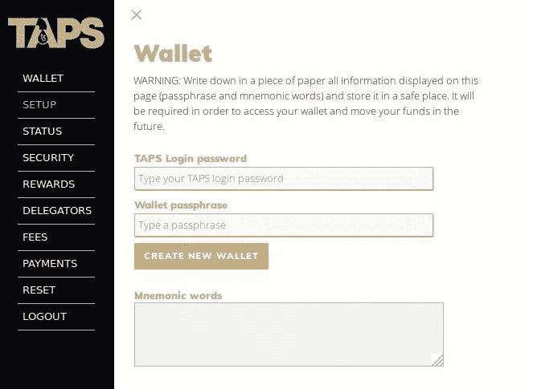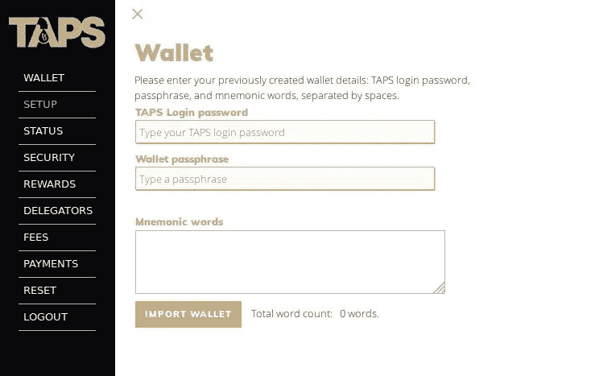

此外，通过向钱包进行小额转账(如 1 xtz ),然后从钱包转到另一个地址，来测试钱包。

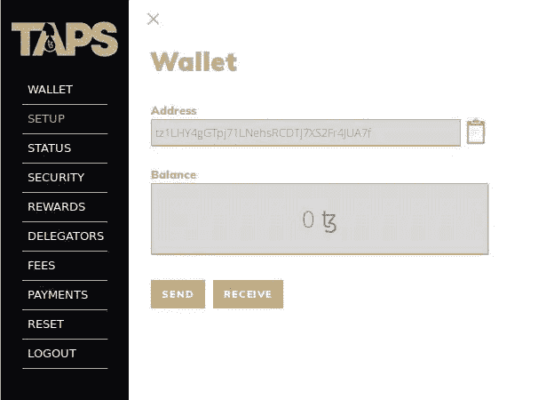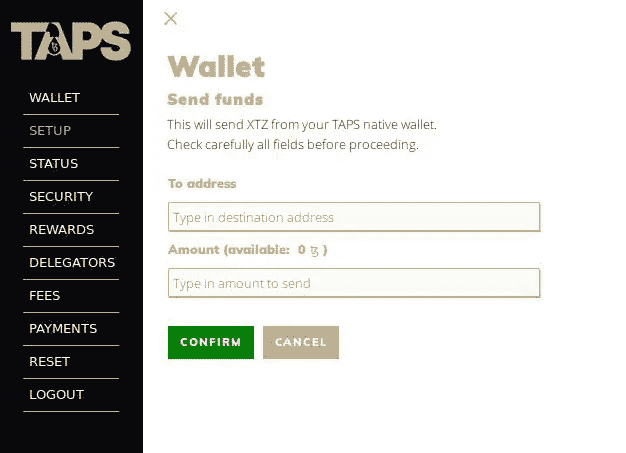

如果你点击接收按钮，点击将显示一个二维码，允许移动钱包应用程序读取钱包地址。

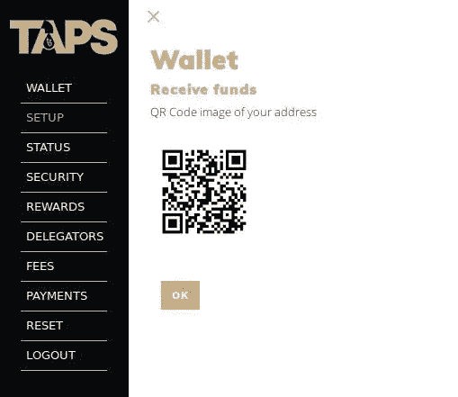

如果您创建或导入了本机钱包，您将只能使用所有 TAPS 功能。有了一个功能钱包后，现在是时候设置 TAPS 的工作模式了:关闭、模拟或打开。如果您将其设置为 *OFF* ，TAPS 将不会运行计划任务，因此不会获取 TzScan.io，也不会进行任何支付。如果你设置为*模拟*，TAPS 将完成所有工作:从网络获取信息，检查和注册事件，但不会使用任何实际资金。只有当您在将状态设置为*时，才会发生这种情况。通过这种方式，TAPS 将查询 TzScan.io，检测周期变化，并在周期变化时将奖励分配给委派者，即使您已从其中注销(计划任务将保持运行)。*

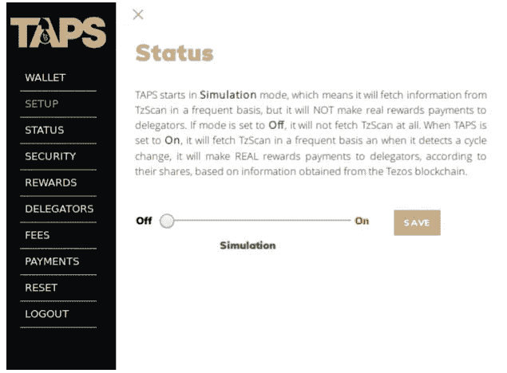

您可以通过选择“委托人”菜单选项来查看您的委托人列表。它还将显示他们的个人余额、份额、待分配周期的奖励、配置费用和实际接收价值。请注意，只有份额高于或等于 0.01%且奖励高于 0.10 xtz 的授权者才会被考虑。

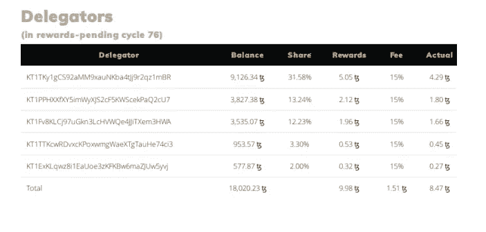

通过选择“费用”菜单选项，您可以单独更改每位委托人的收费。

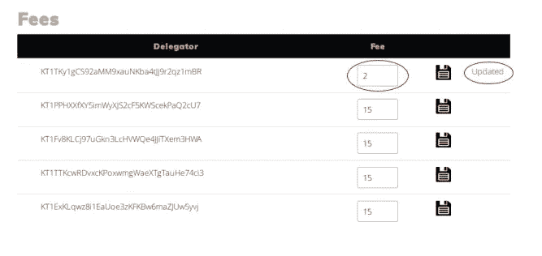

在一个循环之后，当 TAPS 完成其工作，自动进行奖励支付时，您将能够通过支付菜单选项看到结果:

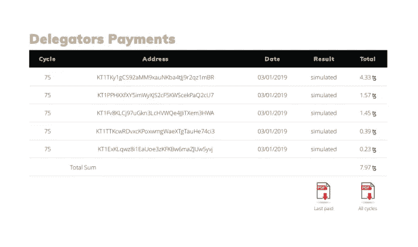

Payments history page

如果 TAPS 被配置为*模拟，*则不会进行实际支付，但您可以看到模拟支付的历史记录。否则，如果设置为开，那么付款将是真实的，你会看到“已支付”显示在结果栏。请注意，有两个 PDF 报告可用:其中一个将允许您打印整个付款历史，包括所有周期。另一个将只打印最后一个支付周期，用于存档:

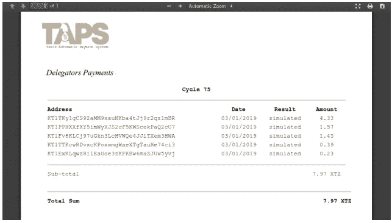

Example of TAPS PDF report

我们真的认为这项工作可能会帮助面包师在管理他们的节点方面有更好的体验，并改善 Tezos 环境，以便奖励有一个更强大的方式来交付，减少人工干预。

用户的反馈总是很重要的，这样我们就能知道事情的轻重缓急。我们已经在研究实现批量支付的最佳方式，因为其他面包师向我们建议这一点很重要。

如果你使用 TAPS 并对此有什么要说的，请告诉我们。我们真的希望用我们拥有的知识和经验为 Tezos 环境做出贡献。

路易斯·米尔丰特

泰佐斯。里约

> [在您的收件箱中直接获得最佳软件交易](https://coincodecap.com/?utm_source=coinmonks)

