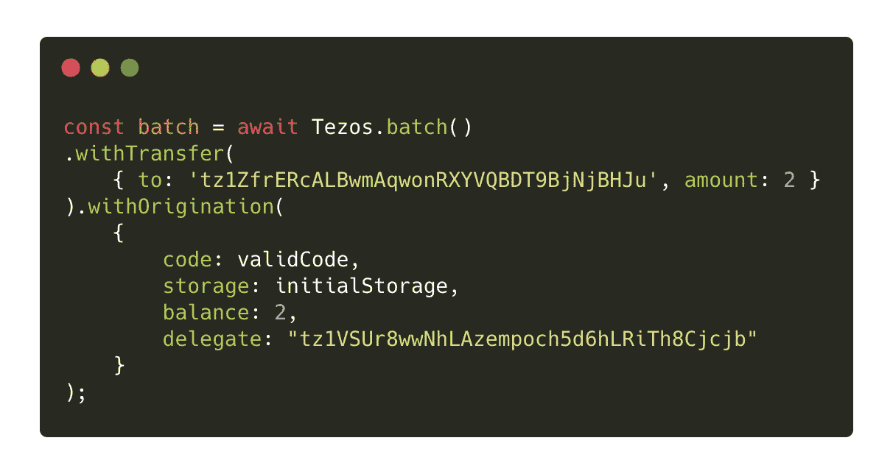

# Taquito 批处理 API 教程

> 原文：<https://medium.com/coinmonks/taquito-batch-api-tutorial-fe2957057d3e?source=collection_archive---------2----------------------->

## 如何使用 Taquito Batch API 在同一个 hash 下发送多个事务


当您开始为您的智能合约开发更复杂的 dapps 时，您会遇到的一个摩擦点发生在连续创建多个新交易时。每个 Tezos 帐户都有一个计数器，每当网络上的一个块中包含一个操作时，计数器就会增加。这意味着如果你已经有一个未决的事务，你不能伪造一个新的事务，否则你将得到现在臭名昭著的错误消息`Counter 12345 already used for contract tz1...`

当您想要同时发送多个事务时，有不同的场景:例如，您可以在 dapp 中保存来自用户的每个更新请求，然后要求他们确认并一次发出它们。Taquito 创建了[批处理 API](https://tezostaquito.io/docs/batch_API) 来简化这个过程。这是本教程的主题。

# 什么是批处理 API？

Taquito 提供了一种简单的方式来伪造交易并将其发送到区块链，无论您希望将几个 tez 发送到某个地址还是与智能合同进行交互。每当 Tezos 帐户签署一项交易，其交易计数器就增加 1。此功能可防止用户连续发送两个或多个事务，如以下代码片段所示:

```
/*  
* ONE OF THESE TRANSACTIONS WILL FAIL  
* AND YOU WILL GET AN ERROR MESSAGE  
*/ const op1 = await contract.methods.interact("tezos").send();
const op2 = await contract.methods.wait([["unit"]]).send();await op1.confirmation();
await op2.confirmation(); /*  
* Error Message returned by the node:  
* "Error while applying operation opWH2nEcmmzUwK4T6agHg3bn9GDR7fW1ynqWL58AVRAb7aZFciD:  
* branch refused (Error:  
* Counter 1122148 already used for contract tz1VSUr8wwNhLAzempoch5d6hLRiTh8Cjcjb (expected 1122149))"  
*/
```

跟踪交易的确认和交易计数器的更新可能会非常令人沮丧和繁琐，这就是 Taquito 提供 Batch API 的原因。Batch API 允许您将所有事务组合在一起，并在相同的事务计数器值下一次发出它们。

# 它是如何工作的？

对象公开了一个名为`batch`的方法。随后，返回的对象公开了 6 种不同的方法，这些方法可以根据要发出的事务数量进行连接。


将不同的方法连接在一起进行批处理操作后，将创建一个事务，并通过返回的一个操作散列进行广播。对于 Taquito 创建的任何其他交易，您需要等待确定数量的确认。

# withTransfer 方法

此方法允许您将 tez 转移添加到批处理操作中。它将一个对象作为具有 4 个属性的参数。其中两个是强制的:`to`表示转账的收款人，`amount`表示要转账的技术开发区金额。另外两个属性是可选的:如果`mutez`被设置为`true`，则`amount`中指定的值被认为是 mutez。


# `withOrigination`方法

此方法允许您将一个或多个合同的来源添加到现有的一批操作中。它将一个对象作为具有 4 个属性的参数。`code`属性是强制的，可以是表示普通迈克尔逊代码的字符串，也可以是迈克尔逊契约的 JSON 表示。参数对象还必须包含一个`init`或`storage`属性:当指定了`init`时，`storage`是可选的，反之亦然。`init`是初始存储对象值，可以是 Micheline 或 JSON 编码的。`storage`是存储对象的 JavaScript 表示。可选地，您还可以为新创建的合同指定一个`balance`和一个`delegate`。



# `withDelegation`方法

这个简单的方法允许批处理多个委托事务。该方法将一个对象作为具有单一属性的参数:委托的地址。


# `withContractCall`方法

这个方法可能是最有用的方法之一，因为它允许您在一个事务下批处理和发出多个契约调用。这个参数也非常简单:如果您要发送一个事务，那么它接受您在契约抽象对象上调用的函数。


# `with`方法

如果您希望拥有一个数组，其中包含您想要发出的不同事务的对象，那么您可以使用`with`方法。它允许您将事务作为对象分组，而不是连接函数调用。您使用的对象期望与相应方法的参数具有相同的属性，并具有一个额外的`kind`属性，该属性指示您想要发出的事务类型(一个方便的`opKind`枚举是从 Taquito 包中导出的[，带有`kind`属性的有效值)。](https://github.com/ecadlabs/taquito/blob/master/packages/taquito-rpc/src/opkind.ts)


> 注意:您不能使用此方法进行约定调用。

# `send`方法

将所有必要的操作批处理在一起后，必须使用`send`方法来发出它们。这一步与发出单个事务非常相似。


与 Taquito 创建的其他操作一样，`send`方法是一个承诺，它返回一个对象，在该对象中操作散列在`hash`属性下可用，并且您可以在该对象中等待，直到用`confirmation`方法确认交易(将您希望接收的确认数作为参数)。

# 有哪些局限性？

分批操作的限制在单次操作的限制之内，例如，一起分批操作的数量受到 Tezos 区块链的气体限制。
除此之外，批量操作只能由一个账户签名。

# 参考

*   [集成测试](https://github.com/ecadlabs/taquito/blob/master/integration-tests/batch-api.spec.ts)
*   [文档](https://tezostaquito.io/typedoc/classes/_taquito_taquito.walletoperationbatch-2.html)

# 另外，阅读

*   最好的[密码交易机器人](/coinmonks/crypto-trading-bot-c2ffce8acb2a)
*   [Deribit 审查](/coinmonks/deribit-review-options-fees-apis-and-testnet-2ca16c4bbdb2) |选项、费用、API 和 Testnet
*   [FTX 密码交易所评论](/coinmonks/ftx-crypto-exchange-review-53664ac1198f)
*   最好的比特币[硬件钱包](/coinmonks/the-best-cryptocurrency-hardware-wallets-of-2020-e28b1c124069?source=friends_link&sk=324dd9ff8556ab578d71e7ad7658ad7c)
*   [密码本交易平台](/coinmonks/top-10-crypto-copy-trading-platforms-for-beginners-d0c37c7d698c)
*   最好的[加密税务软件](/coinmonks/best-crypto-tax-tool-for-my-money-72d4b430816b)
*   [最佳加密交易平台](/coinmonks/the-best-crypto-trading-platforms-in-2020-the-definitive-guide-updated-c72f8b874555)
*   最佳[加密贷款平台](/coinmonks/top-5-crypto-lending-platforms-in-2020-that-you-need-to-know-a1b675cec3fa)
*   [莱杰 vs 特雷佐](/coinmonks/ledger-vs-trezor-best-hardware-wallet-to-secure-cryptocurrency-22c7a3fd391e)
*   [block fi vs Celsius](/coinmonks/blockfi-vs-celsius-vs-hodlnaut-8a1cc8c26630)vs Hodlnaut
*   Bitsgap 评论——一个轻松赚钱的加密交易机器人
*   为专业人士设计的加密交易机器人
*   [PrimeXBT 审查](/coinmonks/primexbt-review-88e0815be858) |杠杆交易、费用和交易
*   [哈森在线评论](/coinmonks/haasonline-review-d8d1a3400419)享受九折优惠
*   Bitmex 上的[保证金交易的白痴指南](/coinmonks/the-idiots-guide-to-margin-trading-on-bitmex-dbbd7742c6fc?source=friends_link&sk=7bfa99d2a181142510c8442c8ddb0786)
*   [eToro 评论](/coinmonks/etoro-review-78807ddeb33c) |交易股票、密码、交易所交易基金、差价合约和商品
*   [Bitmex 高级保证金交易指南](/coinmonks/bitmex-advanced-margin-trading-guide-2270c195ce25?source=friends_link&sk=1d986cca731f5084b9a2db4a4bc4a7ad)
*   [面向开发人员的最佳加密 API](/coinmonks/best-crypto-apis-for-developers-5efe3a597a9f)
*   [加密套利](/coinmonks/crypto-arbitrage-guide-how-to-make-money-as-a-beginner-62bfe5c868f6)指南:新手如何赚钱
*   顶级[比特币节点](https://blog.coincodecap.com/bitcoin-node-solutions)提供商
*   最佳[加密制图工具](/coinmonks/what-are-the-best-charting-platforms-for-cryptocurrency-trading-85aade584d80)
*   了解比特币最好的[书籍有哪些？](/coinmonks/what-are-the-best-books-to-learn-bitcoin-409aeb9aff4b)

> [直接在您的收件箱中获得最佳软件交易](https://coincodecap.com?utm_source=coinmonks)

[](https://coincodecap.com?utm_source=coinmonks)