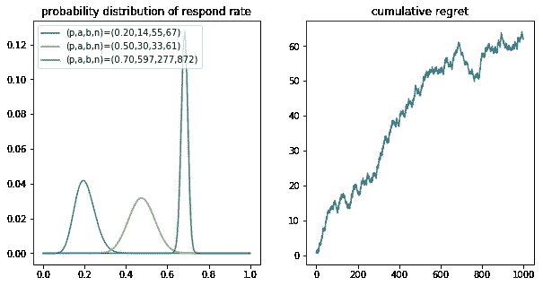
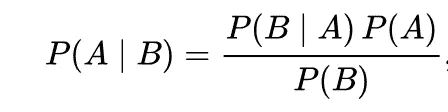
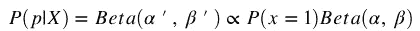
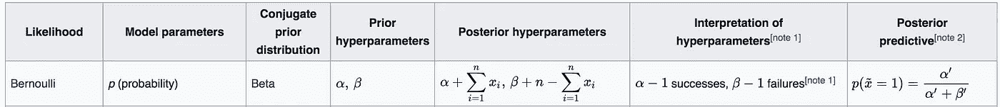
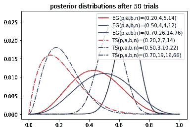
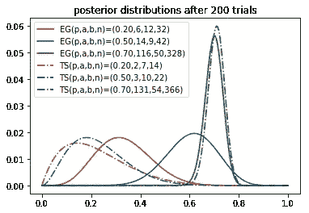
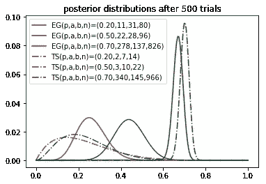
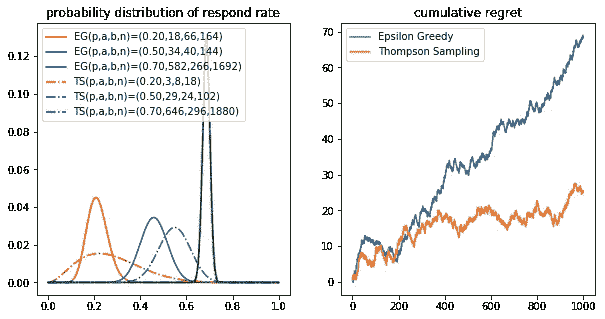

# 目标客户，潇洒！

> 原文：<https://medium.com/coinmonks/target-customers-smartly-5c3f49add85d?source=collection_archive---------3----------------------->

## ε贪婪算法和 Thompson 采样简介

在台湾数据专业人士 7 月的 meet up 中，美国证券交易所的陈美威对生存偏差和应对挑战的算法、*ε贪婪算法*和*汤普森抽样*做了精彩的介绍。在这篇文章中，我将从头开始解释它是如何工作的。一些代码是从 Udemy.com 的[贝叶斯机器学习](https://www.udemy.com/bayesian-machine-learning-in-python-ab-testing/)课上修改的。我强烈推荐这份详尽而简洁的材料。

好了，我们走吧！

# 问题定义

想象一下，你的公司正在开展基于电子邮件的营销活动。自然，有些客户更有可能打开电子邮件，而有些则不会。但是在开展任何活动之前，你对你的顾客一无所知。了解客户打开电子邮件的可能性的唯一方法是通过向他们发送整批电子邮件来收集数据，并观察回复率。问题是，我们需要向所有客户发送多少封电子邮件才能确定统计意义？

如果我们给每个客户发 100 封电子邮件，我们可能会知道谁是我们的最佳目标。但是效率很低！随着活动的进行，我们希望接触尽可能多的顾客。与此同时，我们也要瞄准那些回复率最高的客户，那些是我们给予最佳回报的最佳客户。这是一个 ***探索-利用权衡*** *。*

探索、开发和取舍是我们在选择时经常面临的两难境地。你应该选择你所知道的并得到你所期望的东西(“利用”)还是选择你不确定的东西并可能学到更多(“探索”)？

挑战可以存在于许多不同的环境中。例如营销活动、网站 A/B 测试或您的赌博策略。挑战的核心本质上是一样的。

# ε贪婪

为了解决剥削和探索问题，ε贪婪算法分配一个概率 **ε** ，我们随机探索更多的客户。在剩下的时间里，我们根据目前已知的情况，利用概率最高的客户。伪代码可以写成如下形式:

```
*while True:*
 *r = random.random()*
 *if r < eps:*
 *#explore*
 *#show ads to random customer*
 *#update* ***p***
 *pass*
 *else:*
 *#exploit*
 *#show ads customer with highest* ***p***
 *break*
```

为了建立实验，我编写了一个 python 类来恢复客户的内在概率和过去的反应记录。注意，固有概率被假设为高斯分布，其特征在于 **p_mean** 和 **p_sigma** 。因此，每次我们联系到客户时，打开链接的概率不是一个恒定的概率，而是从高斯分布中抽取的一个随机数。

```
class Target(object):
    def __init__(self,p_mean,p_sigma):
        self.p_mean = p_mean
        self.p_sigma = p_sigma
        self.a = 1
        self.b = 1
        self.n = 0

    def trigger(self):
        return np.random.random() < np.random.normal(loc=self.p_mean, scale=self.p_sigma)

    def sample(self):
        return np.random.beta(self.a, self.b)

    def prob(self):
        return self.a/(self.a + self.b)

    def update(self, x):
        self.a += x
        self.b += 1 - x
        self.n += 1
```

类构造器 ***__init__*** 接受两个参数 **p_mean** 和 **p_sigma** 。我们也初始化 ***self.a = 1*** 和 ***self.b = 1*** ，分别表示总成功和总失败。 **a** 和 **b** 开始时设置为 1，方便后面的实验。类方法***trigger()****将通过比较均匀随机数和从高斯分布中抽取的样本来返回测试结果。 ***prob()*** 方法将返回基于先前测试的经验概率。最后， ***update()*** 方法记录一个目标的测试历史。*

```
*def experiment():
    #Create target objects for epsilon greedy
    Targets = [Target(p,s) for p,s in zip(p_means,p_sigmas)] 
    n_pulling = [0,0,0]
    regret = 0
    cumulative_regret = []

    for i in range(num_trials):
        best_target = None
        max_prob = -1 #with probability epsilon, we explore more data
        r = np.random.random()        
        if r < epsilon: #
            index = np.random.randint(0,len(Targets))
            best_target = Targets[index]
        else: 
            for n,target in enumerate(Targets):
                prob = target.prob()
                if prob > max_prob:
                    maxprob = prob
                    best_target = target
                    index = n

        x = best_target.trigger()
        best_target.update(x)
        regret += optimal-x
        cumulative_regret.append(regret)
    plot(Targets, cumulative_regret, cumulative_reward, num_trials)num_trials = 1000
p_means = [0.2, 0.5, 0.7]
p_sigmas = [0.1, 0.1, 0.1]
optimal = max(p_means)
epsilon = 0.2
experiment()*
```

*这是一段 python 代码，实现了ε贪婪算法。为了方便起见，我们把实验简化为三个选项。我们还引入了一个新的变量*后悔*来评估性能。后悔被定义为与最佳选择相比的损失。换句话说，如果我们总是以最高的概率锁定客户，那么我们就不会后悔。因此，我们的目标是尽量减少累积的遗憾。*

**

*左手边是 1000 次试验后每个选项的 **p** 的概率分布。我们观察到的第一件事是绿线的分布比其他线窄得多，这意味着我们非常确定绿线是一个更好的目标，因此我们在 1000 次试验中有 872 次选择了绿色目标。*

*同时，由于勘探的随机性，另外两个目标也得到较好的勘探。随机探索的结果是，累积的遗憾总是在增加！一个解决方案是[上置信结合](http://banditalgs.com/2016/09/18/the-upper-confidence-bound-algorithm/)。UBC 算法将决定我们何时可以用收集到的数据自信地停止随机探索。或者，我们可以考虑一种更聪明的方法，在不增加遗憾的情况下无缝地探索客户。*

# *汤普森取样*

**

*The Bayes’ Theorem*

*汤普森抽样是贝叶斯定理的一个应用。贝叶斯定理为估计参数的概率分布提供了强有力的工具。等式的左侧是后验概率，通常解释为参数给定数据的概率分布。右手边是可能性倍数先验除以边际概率。*

*在我们的例子中，似然函数是 [**伯努利分布**](https://en.wikipedia.org/wiki/Beta_distribution) 。伯努利分布给出了两种可能的结果(0，1)，并由 **p.** 参数化，也就是说，每次我们联系到客户时，他/她都有内在概率 **p** 打开链接(输出= 1)和概率 **1-p** 忽略它(输出=0)。*

**

*对于先验分布，我们用 [**贝塔分布**](https://en.wikipedia.org/wiki/Beta_distribution) **。**在贝叶斯统计中，我们经常为似然函数选择一个[共轭先验](https://en.wikipedia.org/wiki/Conjugate_prior)，以确保后验分布与先验分布相同。因此，我们可以减少计算量。*

**

*Wikipedia : Conjugate Prior*

*这听起来很复杂，但实际上很简单。β分布由两个参数表征，⍺和β。开始时，我们从 Beta(⍺=1,β=1 抽取样本并进行测试。如果结果是头(x=1)m，我们更新后验 Beta(⍺'=⍺+1,β'=β).我们运行另一个测试，使用新 Beta 作为先验，更新超参数。一次又一次，最终，后验函数会给我们 **p** 的真实分布。在伪代码中:*

```
*⍺1=β1=⍺2=β2...⍺k=βk=1
while True:
 *# draw samples from Beta_i(*⍺i,βi) i=0-k
    # *show ads to sample with largest number
    # receive response x = 0 or 1    
    # update posterior* ⍺'= ⍺+x,β'= β+(1-x)*
```

*要实现 Thompson 采样，我们只需在前面的实验()函数中添加几行代码:*

```
*#Thompson Sampling
        for n, target in enumerate(Targets):
            sample = target.sample()
            if sample > max_prob:
                max_pro = sample
                best_target = target
                index = n*
```

*请注意，唯一的区别是我们比较的样本来自贝塔分布，而不是直接比较经验概率。*

******

*The posterior distribution of **p.** The solid line EG stand for epsilon greedy algorithm. The dash line TS stand for Thompson sampling. From left to right is the posterior after [50, 200, 500] trials.*

*成绩有了明显的提高！通过 Thompson 采样，该算法很快就知道哪个是最佳目标，并坚持下去，而不会浪费时间随机探索更多数据。*

**

*从累积遗憾图中，我们清楚地看到，累积遗憾在 300 次尝试后显著降低，并变为平坦，这意味着算法已经学会总是选择最优目标。*

*我们可以从 Thompson 抽样中受益，用更少的试验和最大的回报。*

# *结论*

*在现实世界中，打开链接的可能性通常在 3-5%左右，甚至更低。此外，客户群要大得多。下周，我将在更大的目标数量和更低的概率下对这两种算法的性能做更多的实验。我还将尝试其他想法来改进算法，例如设置不同的初始先验或不同的ε。*

*完整的 python 代码可以在我的 [github](https://github.com/easonla/ABTesting/blob/master/GreedyVSThompson.ipynb) 上找到。希望这篇文章可以帮助你更好地理解 epsilon 贪婪算法和 Thompson 采样。如果你有任何问题，给我留言。谢谢！*