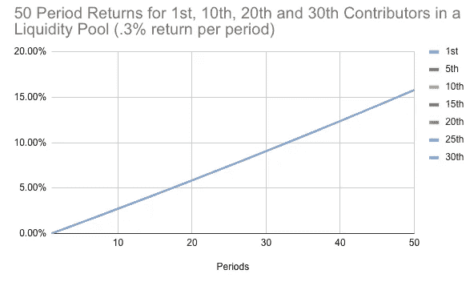
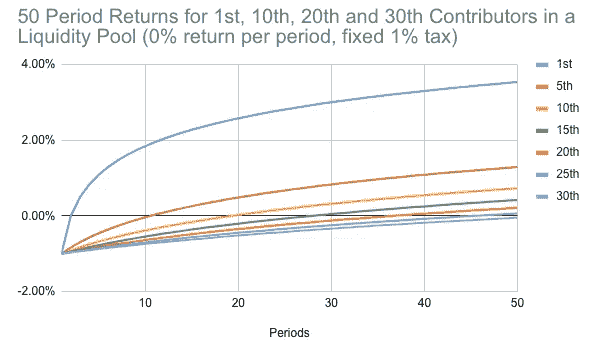
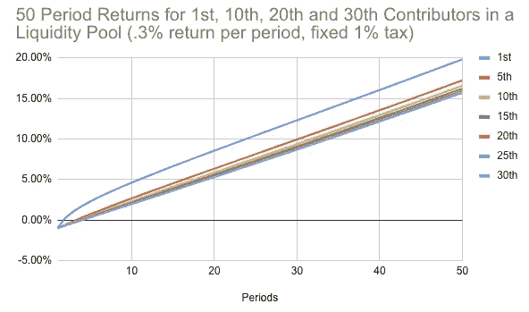
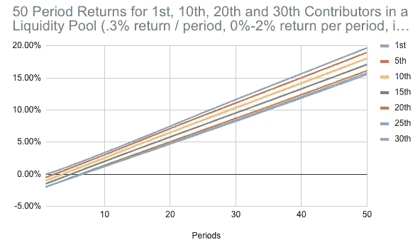

# 纳税流动性池

> 原文：<https://medium.com/coinmonks/taxed-liquidity-pools-7889de2236ea?source=collection_archive---------1----------------------->

像 uniswap、compound、pooltogether 和其他基于资产池的应用程序的激增表明，发行代币作为用于某种目的以提供收益的资产池的代表性所有权的结构对用户和流动性提供者都有吸引力。使用这些结构可以大大降低应用程序的复杂性，但是为了获得最佳的用户体验，应用程序需要吸引流动资金(最好是一大堆)并保持流动资金。大多数应用程序(或协议，交易商选择)对流动性提供者有一个内置的激励机制，如流向流动性提供者的一些费用(uniswap)或收益(复合),但从 Y 到 Y+1 的增量回报是相同的，无论您是在 Y-1 时间还是 Y-100 投入资本。这也意味着你可以拿走资本，重新部署，而不会有任何负面影响。

they’re all behind the blue one, same return

虽然它并不适用于所有用例，但我认为可以通过对新存入的资本增加税收来改善这种结构。早期贡献者通过使用未经测试的平台冒了更多的风险，所以如果回报等于风险调整后的回报，他们实际上比后来者低。此外，作为一个推出产品的人，你希望流动性越快越好，在这种模式下，如果有人无论如何都要出资，他们就应该尽早参与进来。此外，除非收取退出费，否则资本提供者可以随时退出，然后重新出资，这可能会给你的申请带来更多波动。在正常的流动性池示例中，您收到的代币数量为:

> 新令牌=(贡献的金额/池中的值)*未兑现的令牌

在一个纳税的池子里

> 新代币=(贡献的金额/池中的价值)*未兑现代币*(1-税)

让我们来看一些交易税的例子。

This shows the performance after 50 periods for each contribution position so 51 for 1, 65 for 15, 80 for 30.

也就是说，如果所有参与者都被征收 1%的税，那么每期都会有一个新的参与者加入(所有参与者都贡献 1%的基础资产),并且没有回报。在这个模型中，有一个很大的激励去早，但是然后可能会鼓励他们在早到并获得回报后撤出他们的资本，即使应用程序没有回报。

再加上 0.3%的回报率，我们现在可以看到，与第一张图表相比，早期贡献者是如何受益的。它仍然对第一个贡献者有很大的权重，尽管因为新参与者的每个随后的总税收在总税收中只占较小的一部分。为了在更大的早期贡献者群体中分配收益，可以增加费用。

从 0 开始收费，然后每期增加 0.1%，直到达到 2%的最大值，这样可以在早期缴费者中实现更平均的收益分配，一旦达到上限，收益就会下降。增税可以基于时间(区块)或增加的总量(可能通过铸造的代币跟踪)。很难将所有的场景都绘制成一张漂亮的图表，但我希望这能充分说明这个概念。我有几个应用程序即将推出，这可能会付诸实践，如果你认为它可能对你的需求有用，并有问题，我很乐意与你聊天。

如果你对模型和设置感兴趣，请在这里或 Twitter([https://twitter.com/Tompkins_Jon](https://twitter.com/Tompkins_Jon))上给我发消息，我会分享一份我使用过的电子表格。

> [在您的收件箱中直接获得最佳软件交易](https://coincodecap.com/?utm_source=coinmonks)

Coinmonks