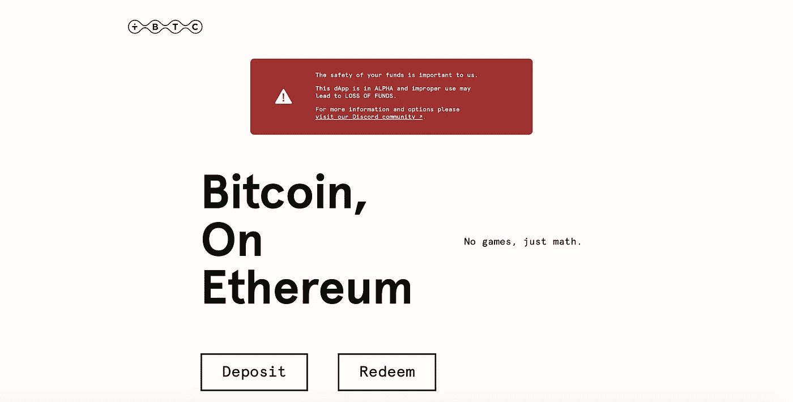

# tBTC 和 Keep:桥

> 原文：<https://medium.com/coinmonks/tbtc-and-keep-the-bridge-352b47c3310?source=collection_archive---------0----------------------->

当你有一些比特币，但不能在以太坊区块链上使用时，这可能会令人沮丧和迷惑，因为以太坊有这么多不同用途的分散应用，包括分散的金融系统。然而，区块链已经走过了漫长的道路，随之而来的是创造了过多的可能性，包括能够在以太坊链上使用比特币。

很多比特币用户对 DApps 和 DeFi 系统持怀疑态度有几个原因；除了这些以太坊项目的复杂性，一个主要问题是比特币用户无法在基于以太坊区块链的平台上交易或使用他们的比特币。

# tBTC 前来救援

ERC-20 令牌具有很大的灵活性，总是为用户提供不同的可能性。为了获得 BTC 的支持，tBTC 成立了，它的主要作用之一是消除第一次加入 DeFi 社区时的不确定性。您可能也有兴趣知道以太坊和比特币区块链都有其独特之处和优势，它们的优势结合起来为比特币用户提供了一种安全可靠地参与 DeFi 生态系统开发的简单方法。比特币用户不需要被排除在 DeFi benefits 的高效收益之外。以下是一些值得期待的 tBTC 特性:

## **比特币后盾**

为了加强比特币和以太坊之间的桥梁，tBTC 与 BTC 1:1 挂钩。

## **简单流程**

简化将 BTC 转化为 tBTC 的过程是该协议的亮点之一，它可以通过 3 个简单的步骤来实现。

## **增强的安全性**

定期审计开源协议是其安全框架之一。除了组成安全架构的不同组件之外，该协议还使用 t-ECDSA 算法，该算法以其改进的安全实现过程而闻名。

## **无权限**

用户享受无缝的个人对个人的交易，而没有中央机构的干预，就像中央系统的情况一样。它使随时随地进行交易变得简单。

## **分散系统**

以太坊区块链的分散化为分散化应用程序和分散化金融项目的开发和功能化铺平了道路。去中心化消除了第三方的干扰，从而实现了社区内用户之间的无许可交易。

## **透明度**

不确定性是许多比特币用户没有加入 DeFi 趋势的原因之一，tBTC 的实施消除了这种不确定性，并创建了一个透明的生态系统，BTC 用户可以安全、可靠、透明地进行交易。

我们很清楚，比特币凭借其市值主导了加密市场，另一方面，以太坊凭借其众多的去中心化应用和去中心化金融项目的开发主导了开发者空间。通过 tBTC 这样的项目，比特币的流动性、安全性和稳定性可以与以太坊区块链带来的创新优势相结合，为比特币用户提供一个投资以太坊项目的安全场所。

# **没有 Keep 网络的 tBTC 是什么**

隐私是加密社区中需要考虑的一个重要因素，Keep 将该解决方案引入了 tBTC 框架。它确保重要的网络数据和组件是私有的。此外，Keep 通过实施其随机信标为系统提供了随机性，这有助于在执行 tBTC 存款时选择签署人。以下是 tBTC 需要 Keep 协议来实现无缝操作的一些原因:

## **改善隐私**

事务隐私是一个优先事项，Keep 确保不同的网络协议维护它们的隐私，以防止将系统置于危险之中。为了让签名组执行他们的功能，他们需要一个未知的私钥，签名者选择的随机性也有助于使系统更加私密。

## **安全保障**

数据安全怎么强调都不为过，因为一切都是围绕数据发展的，私人数据落入坏人之手会带来可怕的后果。Keep 非常重视数据安全，这就是为什么它的 tBTC 功能既有链上的也有链下的。虽然 tBTC 的功能发生在链上，但 Keep 使用 ECDSA 协议在链外安全地存储私有数据。

## **不可信操作**

基本上，这意味着 tBTC 平台的用户不需要担心是否信任他们的交易，因为该系统被设计为不可信的。Keep 为随机信标的签名者团体提供了一种降低违约方可能导致的风险的方法。签名者团体的实施确保用户可以在没有第三方干涉的情况下执行交易，并且不用担心相关方违约。

值得注意的是，为了让 tBTC 高效地执行其操作，它需要是不可信的，正如前面提到的，Keep 已经通过集成签名者随机性特性处理了这一点。

# **轻松转换为 BTC 和 tBTC】**

加密资产在加密社区内不断发展，随着分散的金融项目获得动力，市场已经开始呈指数级增长。tBTC 的创立为比特币用户提供了一种参与区块链以太坊 DeFi 项目的方式。用户可以通过非常简单的步骤使用比特币进行以太坊交易:

*   请求 tBTC 交易
*   选择一个签名组，并输入存储 tBTC 的钱包地址。签名者将扮演托管人的角色，可信而安全地持有比特币。
*   当比特币到达签名者手中时，你将获得等值的 tBTC，固定在 1:1(假设你使用 3 BTC，你将获得 3 tBTC)

此外，上述过程也可以用相同的步骤反过来进行。

想象一下利用以太坊区块链与比特币的惊人能力的可能性，这就是 tBTC 为您提供的，Keep 使其透明、安全和隐私，足以安全、无缝和高效地进行交易。tBTC 有很大的潜力，正在给 DeFi 社区带来一些惊人的变化。

给所有#tBTC 和 Keep 网络支持者的惊人消息。昨天，北海巨妖交易所宣布了 KEEP 和 tBTC 的上市计划:

进来加入我们不和谐社区的所有讨论。你将会遇到很多优秀的人，并有机会回答你所有的问题，为社区做出贡献！

> **其他#KEEP 和#tBTC 相关文章:**

*   [以太坊区块链上的比特币，童话，还是现实？tBTC](/coinmonks/bitcoin-on-ethereum-blockchain-fairy-tale-or-reality-an-introduction-of-tbtc-ed1af8d1970b) 简介
*   [从比特币到用 tBTC 和 Keep 网赚取收益率](https://nikita-monastyrskiy.medium.com/from-bitcoin-to-earning-yield-with-tbtc-and-keep-network-a2f61f49ded6)

> **有用链接:**

[tBTC](https://tbtc.network/)

[tBTC 白皮书](https://docs.keep.network/tbtc/index.pdf)

[保持网络](https://keep.network/)

[不和谐](https://discord.gg/mdmPUP)

[推特](https://twitter.com/keep_project)

## 另外，阅读

*   最好的[密码交易机器人](/coinmonks/crypto-trading-bot-c2ffce8acb2a)
*   [德里比特评论](/coinmonks/deribit-review-options-fees-apis-and-testnet-2ca16c4bbdb2) |选项、费用、API 和测试网
*   [FTX 密码交易所评论](/coinmonks/ftx-crypto-exchange-review-53664ac1198f)
*   最好的比特币[硬件钱包](/coinmonks/the-best-cryptocurrency-hardware-wallets-of-2020-e28b1c124069?source=friends_link&sk=324dd9ff8556ab578d71e7ad7658ad7c)
*   [密码本交易平台](/coinmonks/top-10-crypto-copy-trading-platforms-for-beginners-d0c37c7d698c)
*   最好的[加密税务软件](/coinmonks/best-crypto-tax-tool-for-my-money-72d4b430816b)
*   [最佳加密交易平台](/coinmonks/the-best-crypto-trading-platforms-in-2020-the-definitive-guide-updated-c72f8b874555)
*   最佳[加密贷款平台](/coinmonks/top-5-crypto-lending-platforms-in-2020-that-you-need-to-know-a1b675cec3fa)
*   [莱杰 vs 特雷佐](/coinmonks/ledger-vs-trezor-best-hardware-wallet-to-secure-cryptocurrency-22c7a3fd391e)
*   [block fi vs Celsius](/coinmonks/blockfi-vs-celsius-vs-hodlnaut-8a1cc8c26630)vs Hodlnaut
*   [bits gap review](/coinmonks/bitsgap-review-a-crypto-trading-bot-that-makes-easy-money-a5d88a336df2)——一个轻松赚钱的加密交易机器人
*   为专业人士设计的加密交易机器人
*   [PrimeXBT 审查](/coinmonks/primexbt-review-88e0815be858) |杠杆交易、费用和交易
*   哈森在线评论享受九折优惠
*   Bitmex 的[保证金交易指南](/coinmonks/the-idiots-guide-to-margin-trading-on-bitmex-dbbd7742c6fc?source=friends_link&sk=7bfa99d2a181142510c8442c8ddb0786)
*   [eToro 评论](/coinmonks/etoro-review-78807ddeb33c) |交易股票、密码、交易所交易基金、差价合约和商品
*   [Bitmex 高级保证金交易指南](/coinmonks/bitmex-advanced-margin-trading-guide-2270c195ce25?source=friends_link&sk=1d986cca731f5084b9a2db4a4bc4a7ad)
*   开发人员的最佳加密 API
*   [最佳区块链分析工具](https://bitquery.io/blog/best-blockchain-analysis-tools-and-software)
*   [加密套利](/coinmonks/crypto-arbitrage-guide-how-to-make-money-as-a-beginner-62bfe5c868f6)指南:新手如何赚钱
*   顶级[比特币节点](https://blog.coincodecap.com/bitcoin-node-solutions)提供商
*   最佳[加密制图工具](/coinmonks/what-are-the-best-charting-platforms-for-cryptocurrency-trading-85aade584d80)
*   了解比特币的[最佳书籍有哪些？](/coinmonks/what-are-the-best-books-to-learn-bitcoin-409aeb9aff4b)

> [在您的收件箱中直接获得最佳软件交易](https://coincodecap.com?utm_source=coinmonks)

