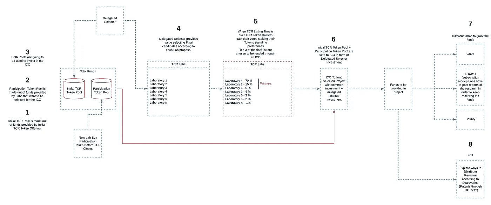
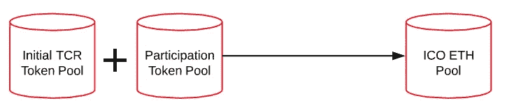
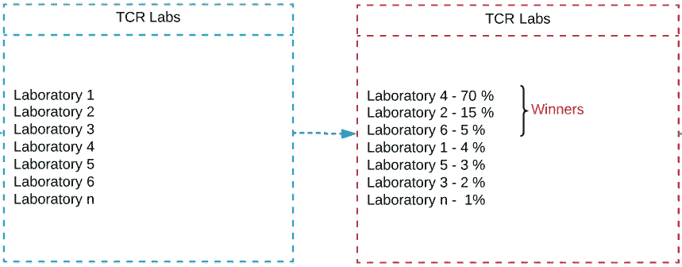
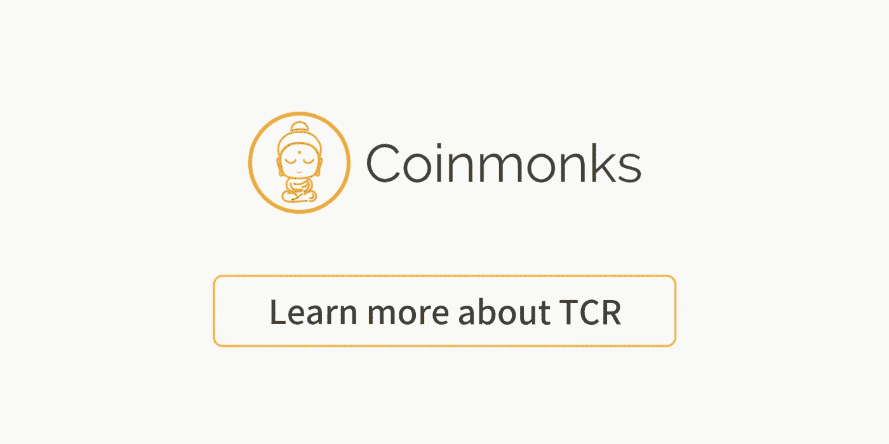

# TCR 负责策划专门的融资提案

> 原文：<https://medium.com/coinmonks/tcrs-to-curate-specialized-funding-proposals-e4306dced0f?source=collection_archive---------6----------------------->

> *“我们将在基因组区块链中创建具有人工智能的纳米聊天机器人，将 DNA 插入它们的体内，以对抗负伽马的 B 型分子，同时进行深度学习”*

我知道这有点过分，但这与我们去年看到的通过 ico 获得资金的惊人说法相差不远。可悲的是有时…大多数情况下，为那些骗局背后的人工作。

那么留给投资者的是什么呢？检查团队？顾问？阅读白皮书？来吧…

这种说法带来的问题是，大量的废话污染了现场，并没有让正确的项目达到可见性并获得适当的资金，所以一般投资者在专业投资方面有些盲目。这就是为什么我认为 [TCRs](/@ilovebagels/token-curated-registries-1-1-2-0-tcrs-new-theory-and-dev-updates-34c9f079f33d) 可以稍微缓解(不是完全解决)上述问题。

上周，与[开放科学网络](http://osn.global)团队一起，我们在阿根廷的门多萨进行了一次训练营，我们讨论了很多 TCR，我想到了一个可能有用的模型…

(我不是最好的信息图表专家...)

让我一步一步来解释。

首先，我们将有一个**“初始 TCR 令牌提供”**，其中只有“OSN acreded 研究人员能够参与”，我知道我知道…这可能是一个冲突点，集中等…但至少最初我们需要知道谁是研究人员(背景)，这就是为什么我喜欢**很多**[Fabian Vogel steller](https://medium.com/u/4b59b3ef14a2?source=post_page-----e4306dced0f--------------------------------)ERC 725 提案，因为我们可以添加 [Researchgate](https://www.researchgate.net/) 或[ORCID](https://orcid.org/)id 到后来，随着模型变得更强大，我们可以为每个科学领域的最佳研究人员实施一个有时间框架的 TCR 列表，以进行项目选择，甚至更好的是一个 [LTCR](https://blog.oceanprotocol.com/the-layered-tcr-56cc5b4cdc45) (分层令牌管理注册)，这是由[特伦特·麦康纳](https://medium.com/u/f1cb98e196bc?source=post_page-----e4306dced0f--------------------------------)开发的概念，我认为这是最近围绕 TCR 的最佳贡献之一。

回到前面的解释，这种最初的 TCR 令牌产品需要有一个明确的前景，例如，关于 TCR 列表将是什么。

TCR 列出正在开发糖尿病研究的公司，更确切地说，是在 2 型糖尿病领域，…

*(免责声明:精确的定义至关重要)*

假设一个研究人员想要参与 TCR，从现在开始我们称之为**“委托选择器”**，为此，他/她需要发送一个 TBD 量的加密货币(例如 ETH)到一个名为**“初始 TCR 令牌池”**的池中，然后他/她得到 TCR 令牌。TCR Token 产品中的 ETH 池不仅仅是“委托选择器”的股份或“参与票”,也是一个**投资池**,因为它上面的所有 ETH 都将在以后转移到 ICO smart 合同，用于“委托选择器”或 Acredited 研究人员选择列表中的公司/项目，因此他们的选择也需要对他们有利(有点“游戏中的皮肤”)

初看起来，TCR 令牌的初始股份对于每个选择器应该是相等的，因为他们将使用形式为**“令牌分配”**的令牌来选择最佳项目，这样所有研究人员(委派的选择器)将具有相同的投票权。

一旦初始 TCR 令牌提供完成，第二阶段开始，因此希望申请成为 TCR 列表一部分的公司/项目需要购买参与令牌，将 TBD 数量的加密发送到**“参与令牌池”**，这样，与普通 TCR 相反，他们在**那一刻**就成为列表的一部分，没有挑战或任何类似的事情。 购买“参与券”的每家公司都将被列出并加入参与令牌库，然后一旦授权选择器的投票阶段结束，将会确定**“获奖者”**。 另一种选择是为项目注册开发一个通用的 TCR，但我认为这是第一种方法的一种发展。

购买参与权标**的公司/项目需要确定**这个列表是为他们准备的，仔细分析需求和 ICO 前景。一旦**“参与代币发行”**完成，授权的选择者投票选出，比方说名单中的 3 个最佳项目，以获得 ICO 的资金。投票在各道菜之间分配他们的“初始 TCR 令牌”,获胜者是在投票阶段积累了更多令牌的前 3 个项目。我说的是 3 家，但如果获奖者的数量可以作为上市公司总数的函数，这是可以讨论的。

现在请记住，我们有两个资金池，分别是… **“初始 TCR 代币池”**和**“参与券池”**，委派的选择者将用这些资金投资于他们正在选择的项目，从而获得比普通 ICO 投资者更多的代币，这些额外的代币是他们选择的报酬。他们将获得 ICO 代币来交换他们的*“初始 TCR 代币”*以及一些规定的授权时间，以避免“抛售”代币，因为他们可能会成为主要持有人。

我们还可以采用不同的形式来发放资金，我非常喜欢的一种形式是使用 [EIP948](https://github.com/ethereum/EIPs/issues/948) ，这是一种订阅模式，在这种模式下，获胜者项目需要更新他们的工作进展，以免他们的订阅被取消。此外，我们可以按照 20-60-20 的模式分配全部资金，开始时将 20%作为赠款，60%作为订阅费，20%作为奖金。

需要进一步讨论作为资助调查结果的发现会发生什么，可能是一组带有贡献者 ID 的 [ERC721](http://erc721.org/) ，稍后可用作收入共享钱包 ID。这是非常重要的一点，因为如果研究没有适销对路的产出，ICO 将充当对研究团队的捐赠，尽管如此，这是一种精心挑选的捐赠。

同样，它需要努力，但我认为这可以成为投资者的一个好模式，他们希望参与资助专门的研究和科学项目，研究人员有动力利用他们的知识选择最好的项目。

欢迎加入我们的[开放科学网络](http://osn.global) [电报小组](https://t.me/osnglobal)或在@mariandipietra 上发微博给我讨论这个模型

最好的，

Click to read more about TCR