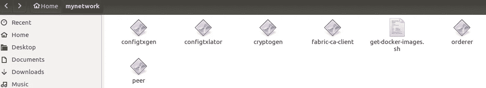
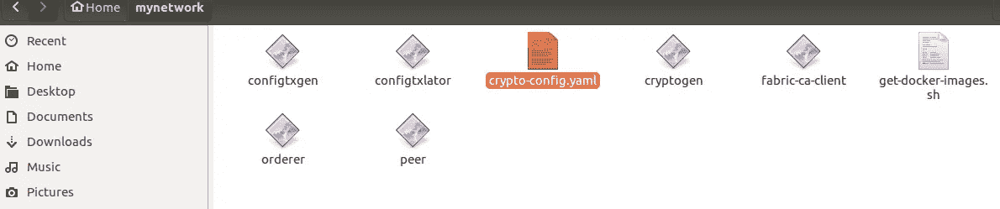
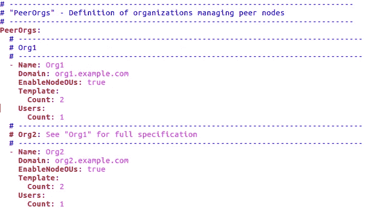

# 自学-hyper ledger:05:00-hyper ledger 结构-网络设置-第 1 部分

> 原文：<https://medium.com/coinmonks/teach-yourself-hyperledger-hour-05-00-hyperledger-fabric-network-setup-p-adf2f670fe77?source=collection_archive---------0----------------------->


Source: Google

你好，感谢你花时间阅读这个系列。我相信您已经从[小时 00:00](/@lokeshwaran.a82/teach-yourself-hyperledger-in-24-hours-hour-00-00-hyperledger-introduction-34675fcd629a) 开始了，如果没有，请在继续之前完成。

在本文中，我们将从头开始设置网络，为此，我们需要了解一些文件&它的配置。

因此，当您从结构样本设置“构建您的第一个网络(BYFN)”时，您会在 **bin 文件夹**中看到这些二进制文件

*   `cryptogen`、
*   `configtxgen`、
*   `configtxlator`、
*   `peer`
*   `orderer`和
*   `fabric-ca-client`

每个二进制文件的作用在结构服务器中是特殊的。当您开发自己的网络时，您必须声明或定义谁将做什么？。例如，让我们举一个实时的例子。这里有一个典型的超市故事，销售男孩/女孩帮助顾客找到产品，客房服务人员会确保环境清洁，计费部门的人员只做计费工作。同样，在部署网络时，您必须定义谁将做什么？。(阅读 Hyperledger 正式文件中的交易流程，以便更好地理解:[单击此处](http://hyperledger-fabric.readthedocs.io/en/latest/txflow.html)了解调用交易时发生的情况)。因此，在网络中，我们有 4 个组件(Orderer、Peer、CouchDB、CA)，将决定谁来扮演这些角色，并生成各自的身份/访问权限。

例如，当一名新员工加入组织(公司)时，我们会提供他/她的访问卡/身份证，对吗？同样，在结构网络中，我们必须定义身份，这将由 MSP(会员服务提供商)提供。为了完成这项工作，我们使用了二进制文件`**CRYPTOGEN**` **。**

现在，我们来谈谈`**CONFIGTXGEN**` **..**再举一个超市的实时例子，在一天开始的时候，他们创建了一个虚拟的计费 ID，以确保计费应用程序运行良好&也是为了商誉。这个虚拟计费 ID 实际上并没有增加任何价值，但是他们用虚拟计费 ID 开始一天的工作，以开始当天的计费编号。同样，在区块链中，我们有一个称为**“Genesis”模块(初始化区块链网络或通道的配置模块，也是链上的第一个模块)**。我不会说这是虚设的，而是一个链条中非常关键的一环，它实际上预示着区块链的“起点”。`**CONFIGTXGEN**` 实际上做了这项工作，它为网络创建了创世纪块。

现在是`**CONFIGTXLATOR**`的时候了(阅读此文[点击此处](https://github.com/hyperledger/fabric/blob/master/examples/configtxupdate/README.md) ) ，我可以将此与“优化器或升级器”联系起来。例如，你有带信道的网络设置，当你想修改信道或更新 genesis 块时，你需要编辑它们，`**CONFIGTXLATOR**`文件帮助你首先将块转换成人类可读的形式&，一旦你做了必要的改变，它提交&更新同样的内容。

`**CONFIGTXLATOR:**`标准用法预计为:

1.  SDK 检索最新配置
2.  `configtxlator`生成人类可读的配置版本
3.  用户或应用程序编辑配置
4.  `configtxlator`用于计算配置更新表示对配置的更改
5.  SDK 提交签名并提交配置

**对等(直截了当)，**它有助于执行一组动作。例如，使用**对等通道**子命令，您可以将对等体添加到特定通道，**对等链代码**帮助您将链代码部署到对等体&等等。

**fabric-ca-client** 命令允许您管理身份(包括属性管理)和证书(包括更新和撤销)。

使用这个二进制文件，我们可以启动订购程序。它将使用生成的“创世纪块”。如果不可用，它会使用 SOLO orderer 配置文件生成一个新的 genesis 块。

涵盖了所有这六个二进制文件之后，理解我们在什么情况下使用它们是非常重要的。让我们从一个全新的网络开始，绝对全新的网络&我们将使用上面的二进制文件进行设置..并定义这四个组成部分。

让我们现在设置网络。

首先，我们需要定义谁将扮演什么角色！正如我之前提到的。继续使用下面的命令下载织物样本。

这里 1.4.0 ->表示织物..如果你想下载一个特定的版本，你可以。

```
curl **-**sSL http:**//**bit**.**ly**/**2ysbOFE **|** bash **-**s 1.4**.**0
```

步骤 1:进入“织物样本”文件夹，在 Bin 文件夹中找到二进制文件。将所有这些复制到你的新文件夹中(我将其命名为 mynetwork)



Binary files in mynetwork folder

第二步:进入“Fabric-samples/first-network”文件夹，将**的 crypto-config.yaml** 文件复制到你的 mynetwork 文件夹中



Folder with “Crypto-Config-Yaml”

是时候深入研究这个文件并进行必要的修改了..

这个文件基本上有几个组件，第一个是订购者(非常重要)组件在光纤网络中，有两种类型的订购者。第一个是“独奏”&另一个是以“卡夫卡”为基础的。SOLO 是单一订购者，在开发环境中使用它是没问题的，但是在生产环境中绝对不行！..当网络中断时，你最终会丢失数据。


crypto-config.yaml — Orderer section

这里，给出的大多数名称都是“用户定义的”，因此您的身份(CA)将基于这些名称创建，因此在将此订购者映射到各自的结构映像时，您应该使用相同的名称/ca 文件。最佳实践是，使用适当的命名标准，以便容易识别哪个容器属于哪个组件。

在上图中，“订购者的名称是“订购者”&域名是 example.com(不要使用任何特殊字符)。所以这个订购者的最终名字将是“{{。主机名}}。{{.在我们的示例中，它是“orderer.example.com”



Peer & Org Settings in Crypto-config.yml

上图显示，我们有两个组织&每个组织分别对应一个同事。我们一个一个来。

对等->表示此部分属于定义对等

名称->组织名称，此处为 Org1

EnableNodeOUS:真的？表示将身份分类为“客户端”或“对等端”的能力。这允许您在现有的`Org.member`和`Org.admin`之外创建诸如`Org.peer`和`Org.client`的策略。如果您启用此功能，CRYPTOGEN 将相应地生成 MSP。

模板:计数 2，表示将在该组织(org1)下创建 2 个对等方，因此对等方名称将类似于 peer1.org1.example.com peer0.org1.example.com

Users: count 1 表示将创建一个用户身份。在现实中，或者在生产结构中，CA 为我们完成了这项工作。它为新用户创建了一个身份。但是在开发中，我们将使用 **CRYPTOGEN(二进制文件)**

下一个对等体(Org2)也是如此。

在这个文件中，我们已经看到了如何设置订购者、同行、组织和用户。在定义您的网络时，您将在这个文件中花费大量的时间，因为生成正确的身份和证书是最重要的。

好了，一切都设置好了，现在是时候生成我们的证书了。去终端和执行这个命令，你会看到 Org1.example.com 和 Org2.example.com 的结果

```
./cryptogen generate --config=./crypto-config.yaml
```


Results obtained after Cryptogen Command

祝贺您，您已经成功地为这些组件创建了证书，现在进入您的目录，浏览每个文件夹，检查它已经创建了多少个文件夹/文件。

理解每个文件夹是什么&它做什么，花一些时间浏览并理解文件夹结构是非常重要的。

现在，我们需要生成“创世纪区块”，区块链的第一个区块。它决定了一个网络的结构，因此它非常关键，应该端到端地了解它。

转到 fabrics-sample/first-network 文件夹并复制 **configtx.yaml** 文件，该文件包含生成“Genesis 块”的配置详细信息。让我们了解每一节。


Organization in Configtx.yaml

在此部分中，您需要提供以下信息..

I)订单或 MSP 路径

ii)对等 MSP 路径

iii)声明哪个对等体扮演“锚定”角色以及相应的端口号。

“名称”和“ID”是用户定义的，但要保持有意义，这将有助于您轻松配置网络的其余部分。

MSPDir ->是订购者和对等组织的 MSP 文件所在的路径。还记得我们生成证书的第一步吗？这些是存放这些文件的路径。所以，如果你想的话，再去探索一次吧。

来自 Org1 的 AnchorPeers 可以与来自 Org2 的 AnchorPeers 通信。基本上，这些通信通过八卦协议发生，我们称之为 GRPC(八卦远程过程调用)


Orderer Section in Configtx.yaml

在这里，我们将声明订购者的详细信息。注意，第一个参数是 ordererType，即“Solo”。正如我前面提到的，对于一个开发环境，你可以选择“Solo”。

地址:->表示订购方的域名，所以 orderer.example.com:7050(端口号)

BatchTimeout，BatchSizes ->这两个参数对于块的创建很重要。例如，订购者工作是形成一堆事务，并将其作为批处理形成&在提交之前传输到“提交对等体”进行验证。所以批处理大小决定了相同的结果，在上面的文件 MaxMessageCount 中— 10 表示允许 10 个事务形成一个批处理或块。

那么一个块什么时候提交呢？—使用上述配置网络确定，因此批处理超时或批处理大小确定何时提交块。每 2 秒提交一个块，或者当事务计数达到 10 时提交。因此，2 秒或消息计数达到的时间决定了块提交场景。

Kafka 参数用于在您使用 Kafka orderer 类型时提供域和端口号，因为我们正在开发中，您可以忽略它。


Profile section in Configtx.yaml

Profile 部分是主要部分，它读取我们在 configtx.yaml 文件的前几个部分中声明的内容。在这个文件中，我们将这个 genesis 文件声明为“TwoOrgsOrdererGenesis”用于订购者详细信息，声明为“TwoOrgsChannel”用于渠道详细信息。

联合体:表示更多的组织一起工作或形成一个网络，这里我们将其命名为“sample consortium”&表示 Org1 和 Org2 都参与了。

类似地，在“TwoOrgsChannel”中，两个组织可以通过这个通道进行通信，可以读取数据，可以写入数据，可以通过这个通道共享数据。

现在是生成创世纪区块和通道的时候了..继续&从您的终端执行以下命令

```
./configtxgen -profile TwoOrgsOrdererGenesis -outputBlock ./genesis.block
```

这个命令应该会在当前文件夹中创建一个名为 genesis.block 的文件。

接下来，让我们通过执行下面的命令创建一个通道文件…

```
./configtxgen -profile TwoOrgsChannel -outputCreateChannelTx ./mychannel.tx -channelID mychannel
```

该命令生成名为 mychannel.tx 的文件，其 channelID 为 mychannel。现在，org1 和 org2 可以通过 mychannel 进行通信。

所以，我们已经在这篇文章中涉及了很多，让我们总结一下…

I)我们讨论了二进制文件及其用法

ii)我们执行 curl 命令来下载特定版本的织物样本

iii)我们讨论了如何读取 cryptoconfig.yaml 文件和参数集

iv)我们介绍了如何读取 configtx.yaml 文件及其参数

v)我们讲述了块是如何创建的

所以，如果你能够毫无问题地执行以上所有指令，你就做得很好了！..只需等待，还有几英里路要走，让我们在下一个系列中见面(不久将推出)。

注:喜欢这篇文章？给 Logeswaran 竖起大拇指(鼓掌)并在 Linkedin 上关注他

**查看此:** [**自学:24 小时内 Hyperledger**](/@lokeshwaran.a82/teach-yourself-hyperledger-in-24-hours-32ac151bbde7)**获取完整教程**

> [直接在您的收件箱中获得最佳软件交易](https://coincodecap.com/?utm_source=coinmonks)

[](https://coincodecap.com/?utm_source=coinmonks)