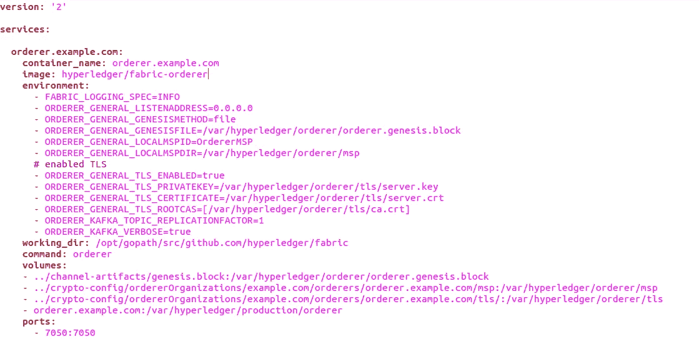

# 自学— Hyperledger:06:00 小时—Hyperledger 结构—网络设置—第 2 部分

> 原文：<https://medium.com/coinmonks/teach-yourself-hyperledger-hour-06-00-hyperledger-fabric-network-setup-part-2-76a39aed9084?source=collection_archive---------0----------------------->


Source: Google

**阅读更多—**[**【https://blockchaindreamlab.com/】**](https://blockchaindreamlab.com/)

您好，感谢您花时间阅读本系列。我相信你是从[00:00](/@lokeshwaran.a82/teach-yourself-hyperledger-in-24-hours-hour-00-00-hyperledger-introduction-34675fcd629a)开始的，如果不是，请在继续下一步之前完成。

在[小时 05:00](/coinmonks/teach-yourself-hyperledger-hour-05-00-hyperledger-fabric-network-setup-p-adf2f670fe77) 中，我们看到了如何使用每个二进制文件来生成引导网络所需的各种文件，我们讲述了如何读取 cryptogen . YAML&configtx . YAML 文件并生成相应的文件。在这里，我们将回顾如何使用 Yaml 文件&将这些东西连接在一起，使用“docker-compose”启动它。

我们先来了解一下什么是“docker-compose”..正如我们所知，要建立 hyperledger 网络，我们需要进行多种角色扮演，如订购者、同行、客户、couch-db、认可同行等等..所以多种东西结合起来就形成了一个网络。因此，在一把保护伞下处理所有这些服务(角色扮演者)是一个非常繁琐的过程。虽然我们可以单独管理，但您需要有人来一次性控制和执行它。这就是“DOCKER-COMPOSE”的由来。

*根据官方文档:* Compose 是一个定义和运行多容器 Docker 应用程序的工具。使用 Compose，您可以使用 YAML 文件来配置应用程序的服务。然后，只需一个命令，您就可以从您的配置中创建并启动所有服务。要了解更多关于 Compose 的所有特性，请参见[特性列表](https://docs.docker.com/compose/overview/#features)。

这里，我们将使用 fabric-samples 文件夹中“first-network”中的一个文件，并开始探索它包含的内容。

转到 fabric-samples/first-network 文件夹，将"**docker-compose-CLI . YAML "&" base "文件夹**复制到您之前工作过的文件夹中。所以你的文件夹现在应该有这些文件了..


mynetwork folder : after copying down docker-compose & base from first-network

现在，让我们探索 docker-compose-cli.yaml 文件包含什么&它的用法…

基本上它包含以下内容..


docker-compose-cli.yaml

卷:表示我们在“第一部分”中声明的域..对于订购者和同行..所以是 orderer.example.com 和 peer0.org1.example.com 等等..

网络:byfn(建立你的第一个网络)——请记住，声明网络名称并始终如一地使用它是非常重要的。因为网络中的容器之间的通信通过该网络发生(这是启用通信桥的选项之一)。

服务:这是这个文件的核心/心脏，在这里我们声明每个卷并将其映射到各自的 container_name…让我们回顾一下第一个..

```
orderer.example.com:
    extends:
      file:   base/docker-compose-base.yaml
      service: orderer.example.com
    container_name: orderer.example.com
    networks:
      - byfn
```

这里，用“base”文件夹中的一个文件扩展了 parm map，我们将该服务声明为“orderer.example.com”，并将名称映射为“orderer.example.com”。因此，在您使用 docker-compose 启动相应的容器后，您可以使用“docker ps”命令查看所有这些容器。(我们将很快看到这一点)。

网络:byfn:这里我们映射这个容器来指向网络 byfn

同龄人也是如此..

```
peer0.org1.example.com:
    container_name: peer0.org1.example.com
    extends:
      file:  base/docker-compose-base.yaml
      service: peer0.org1.example.com
    networks:
      - byfn
```

让我们研究一下基本的 yaml 文件，它包含将所有文件连接在一起的实际参数..



docker-compose-base.yaml

注意:请注意，如果你有不同于“orderer.example.com”的域名，你可以很好地改变它，但它应该在所有地方都相应地改变。

此文件中的 container_name 与 docker-compose-cli.yaml 文件相同..

image:hyperledger/fabric-order 当您第一次使用 curl 命令下载 fabric-samples 时，已经下载了图像。

环境:它包含许多参数&每个参数在连接各自的服务时都有特殊的功能，让我们一个一个地讨论..

> FABRIC_LOGIC_SPEC → INFO、ERROR、DEBUG 是选项..在生产中不要使用 DEBUG，因为它会给你终端中所有容易被黑客攻击的东西。因此，对于生产使用信息，错误的地方，因为发展去与调试。它给你带来了日志
> 
> order _ GENERAL _ listen address-> 0 . 0 . 0 . 0 这意味着它可以监听网络中的任何 ip 地址。如果你想让 ordere 监听特定的 ip 地址，你可以在这里覆盖它。
> 
> order _ GENERAL _ genesis method-> file:表示我们正在使用的源文件是一个文件系统
> 
> ORDERER_GENERAL_GENESISFILE->来自容器的路径(图片)。请注意，该路径不是来自本地磁盘，而是来自容器..那么我们如何将本地磁盘文件映射到这里呢？，我们很快就会看到这一点。
> 
> order er _ GENERAL _ LOCALMSPID = order MSP->还记得这个 ID 吗？，我们在“第一部分”中提供了相同的内容，请检查..
> 
> ORDERER_GENERAL_LOCALMSPDIR ->来自容器的路径(图片)请注意，此路径不是来自您的本地磁盘，而是来自容器..那么我们如何将本地磁盘文件映射到这里呢？，我们将很快看到这一点。
> 
> 下面的参数用于 TLS ->传输层安全性(启用加密)，同样，路径指的是容器..
> 
> order er _ GENERAL _ TLS _ ENABLED = true
> order er _ GENERAL _ TLS _ private key =/var/hyperledger/order/TLS/server . key
> order er _ GENERAL _ TLS _ CERTIFICATE =/var/hyperledger/order/TLS/server . CRT
> order _ GENERAL _ TLS _ root cas =[/var/hyperledger/order/TLS/ca . CRT]
> order _ KAFKA _ TOPIC _ replication factor = 1
> order _ KAFKA _ VERBOSE

Volumes:实际上将本地磁盘映射到容器中的路径..先说第一个..

*   *../channel-artifacts/genesis . block*:/var/hyperledger/order er/order er . genesis . block

../channel-artificats/genesis . block = >正在映射到本地路径

/var/hyperledger/order er/order er . genesis . block

因此，基本上，您是在本地磁盘和容器之间创建一个链接。因此，如果您的本地路径不同，那么相应地映射它。

> 端口:
> — 7050:7050 - >这两个端口表示(主机:集装箱)..例如，这个订购者可以被称为 ordere.example.com:7050，同样适用于集装箱。。这不是强制性的，你应该有两个相同的 ID。你可以定义你自己的，但是请记住，为了简单起见&方便跨文件调用，总是使用简单的。

现在让我们来探索 Peer0.org1.example.com…


docker-compose-base.yaml

这里，与 order 类似，我们声明几个参数来扩展文件 peer-base.yaml 以覆盖 parms，但好的一点是您不需要在 peer-base.yaml 文件中采取任何操作，因为要覆盖的所需参数在对等服务下的 docker-compose-base.yaml 文件本身中是可用的..

所以，让我们现在就开始探索每一个吧..

环境

> CORE _ PEER _ ID = peer0 . org 1 . example . com→直截了当地，我们在这里给出我们的 PEER 0 域
> CORE _ PEER _ ADDRESS = PEER 0 . org 1 . example . com:7051→我们用端口号映射地址，记住所有对等体将通过端口号 7051
> CORE _ PEER _ GOSSIP _ BOOTSTRAP = PEER 1 . org 1 . example . com:7051→hyperledger 中的对等体将通过 gRPC(gossip 远程过程调用)进行通信。所以 Peer0 会引导流言到 PEER 1
> CORE _ PEER _ GOSSIP _ EXTERNALENDPOINT = PEER 0 . org 1 . example . com:7051
> CORE _ PEER _ LOCALMSPID = org 1 MSP→这个 ID 我们已经在 Part1 - >中映射了，请检查

要了解更多关于流言及其运作方式的信息，请阅读这篇文章-> [点击这里](https://hyperledger-fabric.readthedocs.io/en/release-1.4/gossip.html)

我发现这个评论非常容易理解

流言可以在同一组织的同事之间使用，也可以在不同组织的同事之间使用。它总是作用于特定的通道。

1)单个组织中同事之间的交流

*   一个对等体可以是领导者，并且连接到订购服务，并且向其自己组织中的其他对等体递送块
*   一个对等体可以连接到其组织中的其他对等体以获得丢失的块

2)不同组织中同事之间的交流

*   在 1.2 版中，当使用私有数据特性时，gossip 用于在签署时将私有数据分发给组织中的其他对等方
*   对等体可以从其他组织中的对等体获得已经提交的丢失块
*   对等体可以在提交时从其他组织中的对等体获得丢失的私有数据

类似地，对等体中的卷映射到本地磁盘，请确保正确映射了本地磁盘。

现在，在其他对等体之间做同样的事情&你现在应该很好，请确保查看每个对等体的 GOSSIP_BOOTSTRAP 地址，并了解它是如何与其他对等体通信的。

已经涵盖了这个文件端到端，是时候推出我们的网络！，是的，这是启动我们的网络和推出服务的最激动人心的时刻。

```
docker-compose -f docker-compose-cli.yaml  up -d
```


After boostrapping the services

您可以看到，订购者和 4 个同行已经开始确认和查看相同的内容，在终端中发出以下命令

```
docker ps
```

它应该向您显示所有这些服务的运行情况..！现在你的网络已经设置好了&正在监听&最重要的是等待你的行动！！,

到现在为止，你应该理解了每个文件的关键概念，参数&它的用法，它是如何工作的等等。让我们在我的下一篇文章中联系起来。

注:喜欢这篇文章？给 Logeswaran 竖起大拇指(鼓掌)并在 Linkedin 上关注他

**查看此:** [**自学:24 小时内 Hyperledger**](/@lokeshwaran.a82/teach-yourself-hyperledger-in-24-hours-32ac151bbde7)**获取完整教程**

> [直接在您的收件箱中获得最佳软件交易](https://coincodecap.com/?utm_source=coinmonks)

[](https://coincodecap.com/?utm_source=coinmonks)