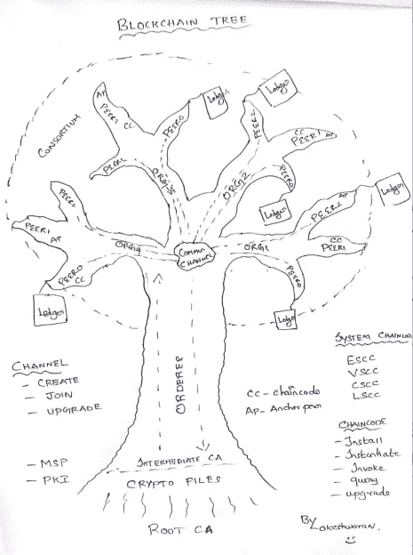

# 自学—24 小时内的 Hyperledger 小时 02:45 结构区块链树

> 原文：<https://medium.com/coinmonks/teach-yourself-hyperledger-in-24-hours-fabrblockchain-tree-de2a47e5857c?source=collection_archive---------4----------------------->

Blockchain Tree : By Lokesh

只是想用一个“树”来解释区块链，任何人看着树就能明白，什么是树干、树根等。，所以这是一个不同的步骤来解释区块链。希望你会喜欢。

对于一棵树来说，“根”非常重要，没有它就无法生存，类似地，在区块链中，我们有一个称为“根 CA”的东西来为参与者颁发身份。在我们进一步深入之前，让我们先了解一下上面的区块链树

它有一个“订购者”，这意味着我们使用“SOLO”选项和 4 个组织(Org1、Org2、Org3、Org4)。

每个组织有 3 个对等体，其中一个对等体将是“锚定对等体”，换句话说，我们称之为“认可对等体”。

众所周知，在区块链网络中，交易的保密性、真实性和原子性是由“非对称加密”密钥来维护的，它是由 CA(认证中心)颁发的。因此，为网络中的所有实体生成证书是非常重要的，让我们先了解这两个 CA，见下文

> CAs 分为两种:根 CAs 和中间 CAs。因为根 ca(赛门铁克、Geotrust 等)必须**安全地向互联网用户分发**数亿份证书，所以将这一过程分散到所谓的*中间 ca*是有意义的。这些中间 CA 的证书是由根 CA 或另一个中间机构颁发的，允许为证书链中任何 CA 颁发的任何证书建立“信任链”。这种追溯到根 CA 的能力不仅允许 CA 的功能扩展，同时仍然提供安全性—允许使用证书的组织放心地使用中间 CA—它还限制了根 CA 的暴露，如果暴露，将危及整个信任链。另一方面，如果一个中间 CA 受到损害，那么暴露程度会小得多。—源 Hyperledger 文档

因此，订购者是第一个将在区块链网络中启动的人，一旦启动，但在我们继续解释其他组织/同行之前。我们需要理解一个叫做“渠道”的重要概念。信道只不过是一个通信管道，或者你甚至可以把它看作“你管信道”——这只是一个例子。比方说，你在 you-tube 上拥有一个频道&那些订阅了该频道的人，将在你发布后获得视频内容，对吗？..也就是说，它以“发布-订阅”格式工作。

这就是信道在这里的工作方式，唯一的例外是参与信道的对等体能够与也加入该信道的其他对等体进行交易。考虑一下，在上面的图片中，我们有一个“公共通道”,所有对等体都加入到同一个通道中。因此它们可以相互交易，而在生产中你不会找到这种简单的方法。您可能需要创建多个通道，以便只让网络中的预期参与者处理私有数据。

简单来说，就拿一家公司来说，我们会有一个不同的部门。那么，您是将消息透明地传达给组织中的每个人，还是只发送给需要的参与者？。当然，我们发送给那些应该正确接收消息人。当然，类似地，这里我们将创建多个通道，并要求对等方相应地订阅。

因此，当一个对等体加入渠道时，将会有一个分类帐副本。是的，你是对的！！参与多个渠道的对等方将相应地拥有多个分类账副本。

渠道确实有自己的生命周期

*   创造
*   加入
*   更新

同样，CHAINCODE 也有

*   安装
*   例示
*   引起
*   询问
*   提升

系统链代码类型

1.  [LSCC](https://github.com/hyperledger/fabric/tree/master/core/scc/lscc) 生命周期系统链码是在一个通道上创建并初始化一个链码。
2.  [CSCC](https://github.com/hyperledger/fabric/tree/master/core/scc/cscc) 配置系统链码处理对等端的通道配置。
3.  [QSCC](https://github.com/hyperledger/fabric/tree/master/core/scc/qscc) 查询系统链码提供了获取块、交易等总账查询 API。

因此理解这些关键概念将有助于您进行调试。对于那些真正想更好地了解区块链的人来说，这篇文章非常有用！。

注:喜欢这篇文章？，给 Logeswaran 竖起大拇指(鼓掌)并在 Linkedin[/](http://www.linkedin.com/in/logeswaranaudhikesavan)[Twitter](https://twitter.com/lokeshwaran_a)上关注他

**查看这个:** [**自学:24 小时内的 Hyperledger**](/@lokeshwaran.a82/teach-yourself-hyperledger-in-24-hours-32ac151bbde7)**获取完整教程**

> [直接在您的收件箱中获得最佳软件交易](https://coincodecap.com/?utm_source=coinmonks)

