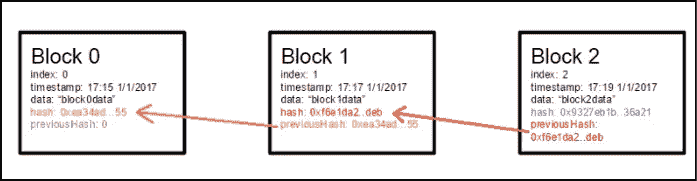
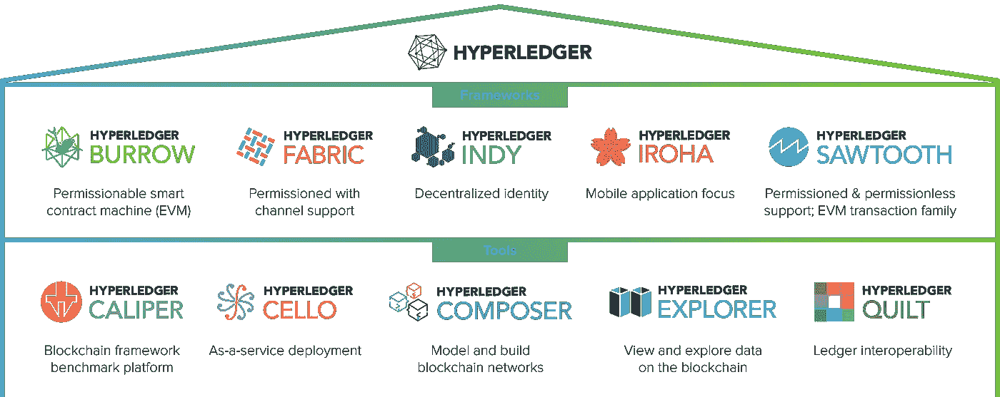

# 自学—24 小时内的 Hyperledger—00:00 小时— Hyperledger 简介

> 原文：<https://medium.com/coinmonks/teach-yourself-hyperledger-in-24-hours-hour-00-00-hyperledger-introduction-34675fcd629a?source=collection_archive---------0----------------------->

Source: Google

在我们直接进入 Hyperledger 介绍之前？，我们都必须明白为什么要超账本？，它是如何产生的。什么是区块链？，为什么不公开区块链？&有太多的问题需要解决。

## 什么是区块链？

以散列引用的方式在程序上链接在一起的一系列块形成了一个链。例如，将事务组合在一起形成一个块，然后每个块都以散列的方式引用其他块。让我们考虑一个简单的例子，你站在一个队列中，一个很长的队列，你身后的人拉着你的手。你的持有位置决定了这里的链接，同样的，在区块链中，每个块都会有自己的 hash(Block hash)，那么每个块都会有之前的块 Hash 作为参考来形成链接，比如看看下图。

块 0:具有块 1 哈希的引用

块 1:具有块 2 散列的引用

块 2:具有块 3 散列的引用(此图片中未显示块 3)。

Source : Google

Source: Youtube

**读者:**看了上面两个例子，我理解了区块链，但为什么是 Hyperledger？这是什么？。

**我:**我知道你的好奇心，但是坚持住。您必须了解，在我们继续讨论 hyper ledger 之前，首先要了解有关公共区块链的问题/顾虑。

区块链基本上有很多种类型，其中以下是流行的…

>公共区块链

>私有区块链

>联合区块链

在这里，公共区块链类似于我们的“互联网”，而其他两个类似于“内部网”，即企业特定的。

在区块链中，每个区块都由若干交易组成。因此，一个块由多个事务组成。但是谁创造了这些积木？一个问题是，那些创造它的人，他们得到了什么好处作为回报？。我们有“矿工”,他们做这种事务挖掘&不断添加它以形成一个块。为了挖掘交易，矿工必须花费巨大的能量(电力)，因为每个交易都有一个名为 Nonce(使用过一次的数字)的值，并且必须对其进行破解，以确定交易是否有效。最先发现它的人赢得加密货币的奖励。

**读者:**你是说比特硬币吗？。！..

我:部分是的，首先你需要明白的是，比特币不等于区块链！。我们大多数人认为比特币==区块链。不是的！。比特币是一种加密货币，我们称之为协议，而区块链是一个框架/平台，加密交易可以在其上发生。

**读者:**打住，你说加密货币不等于区块链，但现在你又说加密交易可以发生在区块链之上..迷茫！

**我:**好吧，我这么说吧，为了把一笔付款从 A 发到 B，你需要一个网关对吧？。同样，当你想从 A 地到 B 地进行加密支付交易时，你需要一个平台。这并不意味着它应该是一个区块链平台，而是一些网关。现在，区块链由块组成，每个块由事务组成(例如这里的加密事务)。

**读者:**所以所有区块内的交易都是加密交易？

**我:**不完全是！。这就是“以太坊”、“超级账本”等区块链平台出现的原因。例如，在“以太坊”(公共/无权限区块链)中，我们有“智能合约”，这是一个可以驻留在区块链&中的程序单元，通过它，您可以执行合约调用。在以太坊，我们有“以太”作为一种加密货币，它在挖掘交易&添加到区块中发挥了主要作用。对于每一次成功的交易开采，矿工们都会得到“乙醚”作为奖励。请注意，在这里，交易可以是任何东西，资产/文件/任何可以用价值来衡量的东西都可以交易。

**读者:**有意思，但是什么是无权限？

**Me:** 无权限网络:任何参与者都可以进入这个网络&访问数据。比如，你可以自由使用“公共公园”对吗？，而在许可网络(付费公园)中，只有授权的参与者(ex 的门票)才能登录&访问数据。这就是 Hyperledger 的用武之地&所有企业都在使用相同的产品。

因此， **Hyperledger** (或 **Hyperledger 项目**)是[开源](https://en.wikipedia.org/wiki/Open-source_software) [区块链](https://en.wikipedia.org/wiki/Blockchain_(database))及相关工具的[伞形项目](https://en.wikipedia.org/wiki/Umbrella_organization)，由 [Linux 基金会](https://en.wikipedia.org/wiki/Linux_Foundation)于 2015 年 12 月启动，并得到 IBM、Intel、SAP 等行业巨头的支持，以支持基于[的](https://en.wikipedia.org/wiki/Distributed_ledger)[分布式账本](https://en.wikipedia.org/wiki/Distributed_ledger)。

Hyperledger Fabric 是一个许可区块链基础设施，最初由 [IBM](https://en.wikipedia.org/wiki/IBM) 和 Digital Asset 提供，提供了一个模块化的架构，在基础设施的节点之间划分了角色，执行[智能合同](https://en.wikipedia.org/wiki/Smart_contract)(在 Fabric 中称为“链码”)以及可配置的共识和成员服务。结构网络由“对等节点”组成，这些节点执行链码、访问分类帐数据、签署交易并与应用程序接口。“订购者节点”确保区块链的一致性，并将认可的交易交付给网络的对等方，以及 MSP 服务，通常作为认证机构实现，管理用于认证成员身份和角色的 [X.509](https://en.wikipedia.org/wiki/X.509) 证书。(来源:维基)

Hyperledger 生态系统非常大&我们在世界各地有如此多的贡献者，为这个开源社区做出贡献。

Source: Google

在这个生态系统中，Hyperledger Fabric 在版本、实现、文档可用性、社区支持用例以及企业采用方面比其他框架(也越来越好)更加成熟。

所以即将到来的系列将主要关注“Hyperledger Fabric”&它的用例、实现、部署等等。

注:喜欢这篇文章？，给 Logeswaran 竖起大拇指(鼓掌)并在 Linkedin[/](http://www.linkedin.com/in/logeswaranaudhikesavan)[Twitter](https://twitter.com/lokeshwaran_a)上关注他

**检查这个:** [**自学:24 小时内的总账**](/@lokeshwaran.a82/teach-yourself-hyperledger-in-24-hours-32ac151bbde7)

**Click to Read today’s Top Story**