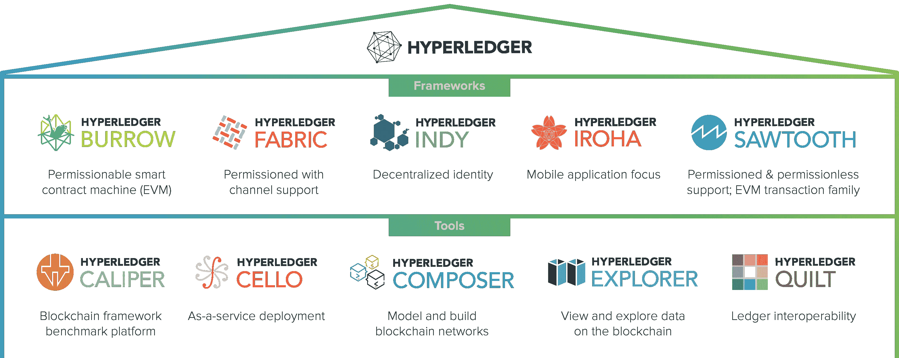

# 自学—24 小时内的 Hyperledger—1:00—Hyperledger 生态系统

> 原文：<https://medium.com/coinmonks/teach-yourself-hyperledger-in-24-hours-hour-01-00-hyperledger-eco-system-4c0f3d815c51?source=collection_archive---------1----------------------->

Source: Google

您好，感谢您花时间阅读本系列。我相信你是从[小时 00:00](/@lokeshwaran.a82/teach-yourself-hyperledger-in-24-hours-hour-00-00-hyperledger-introduction-34675fcd629a) 开始的，如果不是，请在继续下一步之前完成。

在本文中，我们将浏览“超级账本—生态系统”。这是什么？有多少框架和工具是活跃的&有多少处于孵化状态，每个有什么用等等。,

Hyperledger 生态系统非常庞大&流行的框架已经在企业中留下了足迹。在写这篇文章的时候，很少有框架/工具处于孵化状态，所以当你在学习的时候，请在 hyperledger.org 检查一下

框架:

*   超级分类帐洞穴(孵化状态)
*   超级分类帐结构(活动)
*   超级分类帐索引(孵化状态)
*   Hyperledger Iroha(活动)
*   超分类帐锯齿波(活动)
*   超级分类帐网格(孵化状态)

工具:

*   Hyperledger 卡尺(孵化)
*   Hyperledger 大提琴(孵化)
*   Hyperledger Composer(孵化)
*   Hyperledger 浏览器(孵化)
*   总帐被套(孵化)
*   超账本熊(孵化)

让我们深入研究这里的每一个问题..

**超级账本陋居:**超级账本陋居是一个允许的智能契约机器。在 2014 年 12 月发布的第一个同类产品中，Burrow 提供了一个模块化的区块链客户端，该客户端具有一个部分根据以太坊虚拟机(EVM)的规范构建的许可智能合同解释器(来源:Hyperledger.org)。基本上，当你为以太网使用 solidity 编写智能合同时，Burrow 帮助解释相同的&把它带到 Hyperledger network。一种网关/解释器，帮助将智能合同从以太坊网络带到 Hyperledger。

**Hyperledger Indy(IN**dependent**D**e centralized**IdentitY**):**Hyperledger Indy 是一个分布式分类帐，专门为去中心化身份而构建。它提供了工具、库和可重用组件，用于创建和使用基于区块链或其他分布式分类帐的独立数字身份，以便它们可以跨管理域、应用程序和任何其他“竖井”进行互操作**

**因为分布式分类帐不能事后更改，所以基于分类帐的身份的用例必须仔细考虑基本组件，包括性能、规模、信任模型和隐私。特别是，隐私设计和隐私保护技术对于公共身份分类账至关重要，因为在公共身份分类账中，可以在全球范围内进行关联。**

**出于所有这些原因，Hyperledger Indy 开发了分散身份的规范、术语和设计模式，以及这些概念的实现，这些概念可以在 Hyperledger 联盟内部和外部使用(来源 Hyperledger.org)**

**Indy 确保身份控制在用户而不是组织手中，因此用户可以决定以安全的方式共享哪些数据。因为网络中的私有数据不存储在分类帐中，而是通过加密网络在对等网络之间交换。所以印第确保它没有任何瑕疵。**

****Hyperledger Iroha:** 类似于 Fabric 但是用 C++写的。它有一个强大的网络许可系统，所以那些被授权的人只能在 Iroha 网络上写或读，从而确保隐私。任何数字资产都可以在 Iroha 中处理，从简单到复杂，比如医疗数据。在 Iroha 中，智能合约被称为“命令”。在 Iroha 中—建立网络、创建资产、调用事务只需几秒钟。在 Iroha 中，块存储在文件中，而分类帐状态存储在“PostgreSQL”数据库中。**

****Hyperledger 锯齿:**锯齿采用模块化结构，在网络实时增长的同时，为最终用户提供多种共识算法。可以实时应用 RAFT、PBFT 或经过时间的证明。任何用例，无论是医疗、金融还是供应链&等等，都可以在锯齿的帮助下轻松开发。如果是键值对结构，使用锯齿从传统数据库到区块链的数据同步是可能的。**

****Hyperledger Grid(孵化—新):**供应链通常被认为是最有前途的分布式账本用例之一。专注于构建供应链解决方案的计划将受益于共享的、可重用的工具。Hyperledger Grid 旨在整合这些共享功能，以便为所有类型的跨行业供应链场景加速开发基于分类帐的解决方案。**

**Hyperledger Grid 最初打算提供以供应链为中心的数据类型、数据模型和基于智能合同的业务逻辑的参考实现，所有这些都基于现有的开放标准和行业最佳实践。其次，它将以真实和实用的方式展示如何将 Hyperledger 堆栈中的组件组合成一个有效的业务解决方案。**

**Hyperledger 网格是一个框架。它不是区块链，也不是一个应用程序。网格是协同工作的技术、框架和库的生态系统，允许应用程序开发人员选择哪些组件最适合他们的行业或市场模型(Source Hyperledger.org)。**

****Hyperledger Fabric:** 这个系列完全是关于 Hyperledger Fabric 的，所以我将在下一篇文章中讨论这个问题**

**— — — — — — — — — — — — — — —**

****HYperledger Caliper:** 它允许用户使用一组预定义的用例来衡量特定区块链实施的性能。Hyperledger Caliper 将生成包含许多性能指标的报告，如 TPS(每秒交易数)、交易延迟、资源利用率等**

****Hyperledger Cello:** 它旨在将按需“即服务”部署模型引入区块链生态系统，以减少创建、管理和终止区块链所需的工作。**

****Hyperledger Composer:** 是一套用于构建区块链商业网络的协作工具，使企业主和开发人员能够简单快速地创建智能合同和区块链应用程序来解决商业问题。**

****Hyperledger Explorer:** 它可以查看、调用、部署或查询块、事务和相关数据、网络信息(名称、状态、节点列表)、链代码和事务系列，以及存储在分类帐中的任何其他相关信息。**

****Hyperledger Quilt:** 它通过实施 Interledger 协议(也称为 ILP)提供分类帐系统之间的互操作性，inter ledger 协议主要是一种付款协议，旨在跨分布式分类帐和非分布式分类帐转移价值。**

****Hyperledger USRA:** 这是一个共享的加密库，可以让人们(和项目)避免重复其他的加密工作，并有望提高加密过程的安全性。**

**这些是 Hyperledger 下的框架/工具，它在不断发展。让我们自己与 hyperledger 生态系统保持同步，肯定会有助于发挥出最好的一面。**

**注:喜欢这篇文章？，给 Logeswaran 竖起大拇指(鼓掌)并在 Linkedin 上关注他**

****查这个:** [**自学:24 小时内的总账**](/@lokeshwaran.a82/teach-yourself-hyperledger-in-24-hours-32ac151bbde7)**

> **[直接在您的收件箱中获得最佳软件交易](https://coincodecap.com/?utm_source=coinmonks)**

****