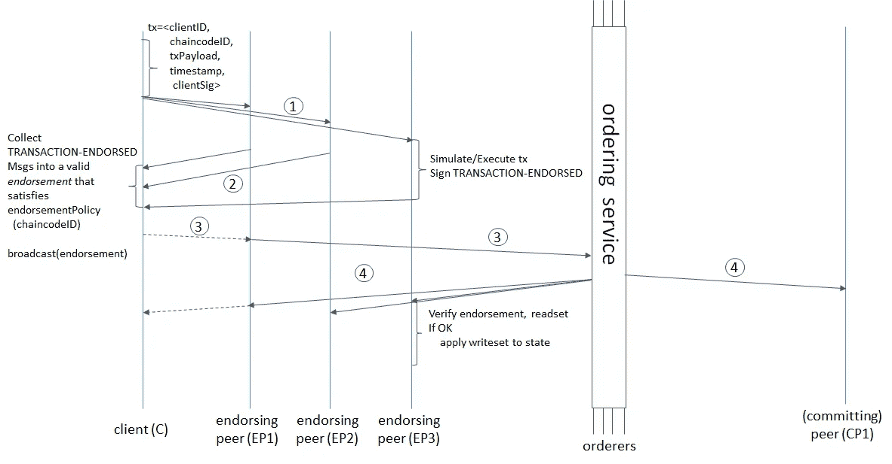

# 自学—24 小时内的 Hyperledger—02:00—Hyperledger 结构—体系结构深度探讨

> 原文：<https://medium.com/coinmonks/teach-yourself-hyperledger-in-24-hours-hour-02-00-hyperledger-fabric-architecture-deep-dive-a2f52c1d01ad?source=collection_archive---------2----------------------->

Source: Google

您好，感谢您花时间阅读本系列。我相信，您已经从[小时 00:00](/@lokeshwaran.a82/teach-yourself-hyperledger-in-24-hours-hour-00-00-hyperledger-introduction-34675fcd629a) 开始，如果没有，请在继续下一步之前完成。

在开始编码之前，理解核心架构是非常重要的。因为不知道 basic 是如何工作的，你将会在研究和调试中浪费大量的时间。所以在本文中，我们将重点介绍 Hyperledger Fabric 架构原理！..

Hyperledger 结构的基本构建块如下

*   系统结构
*   交易工作流程
*   背书政策

了解这三个，会让你更好地了解织物的工作原理。在区块链中，多个节点相互对话。节点只不过是一个系统或实例或虚拟机。

读者:这是否意味着，区块链应该总是在多台机器上执行？

我:不完全是，你也可以在单个节点上设置区块链并测试它。但是对于生产，不建议使用单节点系统，因为单点故障非常高。

## 系统结构

## 节点

Hyperledger 中的节点基本上可以分为三类，

*   客户端—代表帮助最终用户提交交易的应用程序
*   对等体—有两种类型，“提交对等体”和“认可对等体”。
*   订购服务——它是节点结构中非常重要的组件，处理对等点和客户端之间的通信广播。在测试模式中，您可以使用“Solo”订购程序，而对于生产系统，则始终使用“Kafka”。

**区块链数据结构:**

*   有两个元素(状态、分类账)，我们称之为区块链数据结构

状态

*   世界状态表示所有分类帐状态的当前值。这非常有用，因为程序通常需要一个分类帐状态的当前值，并且总是很容易得到。您不需要遍历整个区块链来计算任何分类帐州的当前值—您只需直接从世界州获得它。
*   状态在“对等体”上维护

分类帐

*   它包含状态更改成功的所有事务。
*   分类账在“同行”和可选的“订购者”中维护

因此，大多数情况下，当我们想要检索特定资产的当前状态时，您总是从“world state”中获取，而如果您想要获取包括当前价值在内的交易历史，您将最终查询分类账。

## **交易工作流程**

好，让我们举这个例子，假设你是一个著名的魔术师&你想在一个安全的建筑里表演一个节目。最重要的是，作为一个游客，你应该有你的有效身份证，对吗？，然后你必须把它出示给安检人员@“安检”门。一旦你的身份证通过验证，你将被允许进入大楼，但你必须获得管理层的许可才能进行路演。一旦你得到了适当的认可，那么你将被允许做同样的事情，否则你将被赶出去。

所以这里的关键部分是，ID..在诸如 Hyperledger 的许可网络中，没有适当的证书，用户不能进入网络。这些证书我们称之为 ID，证书的发行将由会员服务提供商(简称 MSP)处理

这里需要理解的组件很少

*   背书对等体
*   订购服务
*   提交对等方
*   客户端(应用程序)
*   证书颁发机构—颁发令牌

这里，在 hyperledger 中，每个参与者都应该拥有有效的令牌(ID —由 MSP 颁发),通过该令牌他们可以访问网络。因此，当参与者发起交易(路演)提案时，将首先由**“背书同行”**(安全)进行验证，他们将检查参与者是否具有有效 id，还将检查“背书”政策，该参与者是否真的可以执行该交易，这些检查将在此处执行。在你通过这个检查之后，交易模拟将会发生，如果你的交易被执行会发生什么，那将会是结果。这里最重要的一点你应该注意，交易模拟不会改变分类帐中数据的状态。它将简单地显示模拟结果，然后通过“认可对等体”签名级联回客户端。

**客户端(应用)**将再次触发相同的“事务模拟结果”，这一次**“订购服务”**将接收这些事务以及网络中按时间顺序排列的其他事务&创建一个事务序列，这将被级联到**“提交对等体”**，后者实际上在分类帐&中插入数据并相应地改变状态。

因此，提交方非常重要，它持有“账本”。当你有多节点系统时，你必须声明哪个节点是支持者，哪个是提交者。背书对等体也可以作为承诺对等体，但承诺对等体不能背书！—切记！

**读者:**那么我如何确定哪个节点是背书者或者提交对等体呢？，我们有什么可配置的选项吗？

我:在某种程度上，你是对的，所有加入特定渠道的对等体都可以作为提交对等体。而那些安装了“链码——智能合约”的对等体，可以充当“背书对等体”。您也可以在 yaml 文件 endorsingPeer=true 中设置它——我们将在接下来的系列文章中更多地讨论“通道”、“链码”、“安装”等，但现在请记住这些提示。

在这里，所有的业务逻辑都将使用编程语言编写，如“GO”、“Python”、“Java”，它被称为“链码”——智能合同

简而言之，这就是流程…

I)客户端通过**应用【客户端】**发起交易===

ii)签核方验证签名并执行交易===通过**签核方**

iii)提案响应由**应用程序(客户)**进行检查===

iv)客户端通过**应用程序(客户端)**将背书组装成交易=== ，并将其发送给**“订购服务”**

v)交易由**“订购服务”**验证并提交===并将其发送给**“提交对等体”**

vi)分类账更新===由**“提交同行”**

注意:只有“写”交易才完全执行上述流程，而对于“查询/读取”分类账，它在**步骤 iii)** 处停止。因为一旦从分类帐中查询到数据，应用程序/客户端将认为任务已经完成。

更多详情请查看 [TxFlow](https://hyperledger-fabric.readthedocs.io/en/latest/txflow.html)

## 背书政策

为了保证区块链和安全属性，背书策略集**应该是一组经过验证的策略集**，具有有限的功能集，以确保有限的执行时间(终止)、确定性、性能和安全保证。

Hyperledger Fabric 使用*背书策略*来定义哪些对等方应该执行哪些交易。

背书政策的示例可能是:

*   对等体 A、B、C 和 F 都必须签署 T 类型的事务
*   渠道中的大多数同行必须认可 U 类交易
*   A、B、C、D、E、F、G 中至少有 3 位同行必须签署 V 类交易

查看这篇文章了解更多关于Kynan Rilee 的“代言政策”

我们已经介绍了 Hyperledger 的基本构建模块，作为一名开发人员/程序员/经理，除了区块链数据结构之外，您还必须了解交易流程及其工作方式。因此，请重新研究这篇文章，直到您清楚地了解数据是如何流动的。

Source: Hyperledger documents

注:喜欢这篇文章？给 Logeswaran 竖起大拇指(鼓掌)并在 Linkedin 上关注他

**查看此:** [**自学:24 小时内 Hyperledger**](/@lokeshwaran.a82/teach-yourself-hyperledger-in-24-hours-32ac151bbde7)**获取完整教程**

> [直接在您的收件箱中获得最佳软件交易](https://coincodecap.com/?utm_source=coinmonks)

