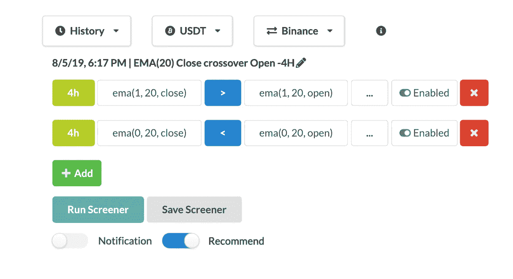
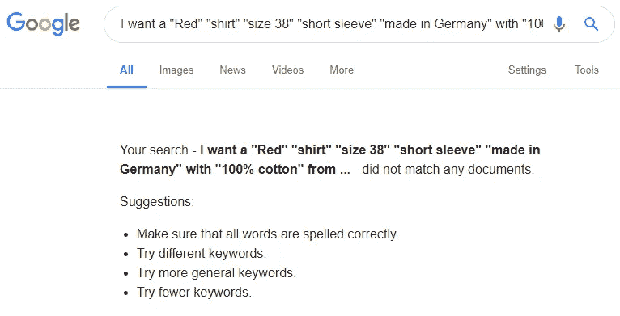
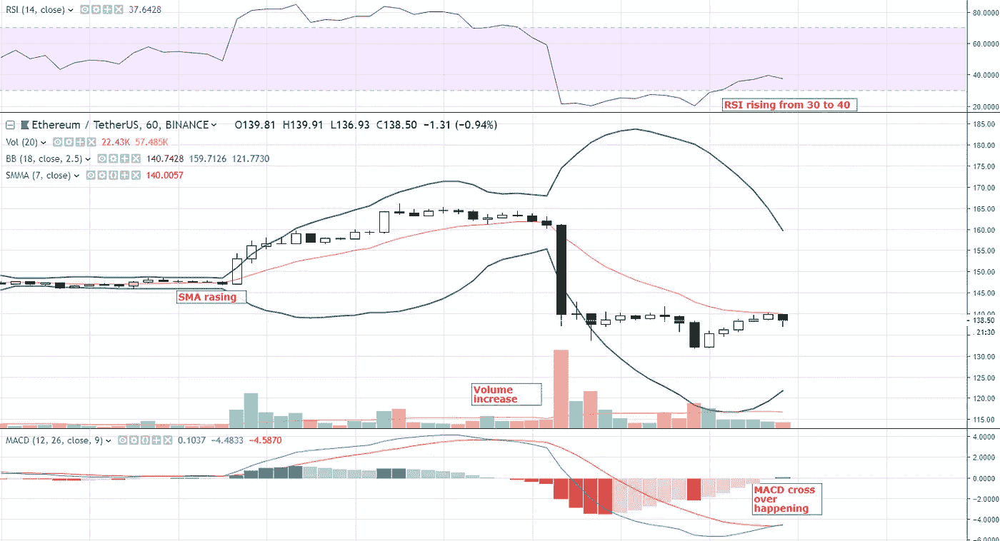

# 技术密码筛选程序 101

> 原文：<https://medium.com/coinmonks/technical-crypto-screener-101-f150f2fe52d8?source=collection_archive---------0----------------------->

Tradeplan.co

如果你的目标是赚钱，或者至少被你最喜欢的硬币的价格变化所困扰，那么你应该知道什么是技术密码筛选。

让我们把它分解成技术——密码——筛选。这些单词中的每一个都有意义，它们共同构成了一个工具的定义。

**先说技术，**关于我们的讨论，技术上指的是对 crypto 价格的技术分析。这些可以分为两种技术分析。

***1 —价格动作技术分析*** —这些更多的是基于如何、何时、下一步做什么的思维类型对价格的分析。用户依靠基本烛台市场来了解市场的情绪。至于他们怎么做，需要练习。两个人对同一个图表假设不同的结果并不奇怪，因为解释取决于个人。

这些也被称为领先指标或趋势交易，因为它们专注于预测下一个价格运动。

这种类型的分析包括价格行为，艾略特波浪理论，突破，蜡烛图，斐波那契等等。

欲知详情，请阅读，

 [## 用指标投资

### 技术交易和加密货币

medium.com](/altcoin-magazine/investing-with-indicators-3bd1a4bbc700) 

***2 —基于指标的技术分析*** — 这些大多是公式化类型的分析。这些公式和计算都有明确的解释。没有两个人会强烈反对一辆 SMA 20 跨界车 SMA 50 不牛。他们可能为了争论而争论，但那并不意味着。

这些也称为滞后指标，因为它们使用过去的数据，一般来说，可以根据趋势变化。

这些类型的分析包括简单移动平均线(SMA)，指数移动平均线(EMA)，布林线(BB)等等…..

如果你对技术指标的内容和方式感兴趣，请阅读下面由 [CryptoCred](https://medium.com/u/f4aaa233d678?source=post_page-----f150f2fe52d8--------------------------------) 撰写的帖子

 [## 技术分析有用吗？

### 我已经推迟写这篇文章一段时间了，仅仅是因为出现了大量的分论点…

medium.com](/@cryptocreddy/does-technical-analysis-work-fa90413a8328) 

# 所以第二个词，密码

在我们的情况下，加密是我们想要交易的资产，如比特币或以太坊或任何其他硬币。

这是筛选者应该为你找到的东西。稍后你会详细了解它。

# 最后一个筛选者，

筛选程序可以理解为扫描仪或查找器或指向搜索引擎。

一个筛选程序需要一个带有条件的查询。下面是一个查询示例，每个条件都在“”中

我想要一件“红色”“衬衫”“38 号”“短袖”“德国制造”“100%棉”的，来自“我周围 50 英里的商店”

想象一下，在谷歌上搜索并输入一个类似上面的句子，得到的结果是 shirt 满足了所有这些确切的“要求”。极不可能，这就是我所说的重点搜索引擎。

你无法获得这些信息是有原因的，因为谷歌没有现成的数据库。

Phewwww…现在下面是我们将看到整个“**技术加密筛选**”作为一个整体。

 [## 贸易计划。IO —加密筛选程序

### Tradeplan.io 是一个简单的定制加密筛选工具，可以根据你的技术指标帮助你找到合适的硬币…

medium.com](/coinmonks/tradeplan-io-crypto-screener-88034678c457) 

每个交易者都在寻找一个完全满足的条件来交易资产。例如，有些人可能会交易密码，如果-

*   RSI 从 35 上升到 40。
*   MACD 穿越发生了。
*   价格穿过布林线下轨线。
*   成交量是 20 天平均成交量的 5 倍。
*   价格在 Y 分钟内变化了 X%
*   SMA 开始向上上涨。

以上都是手动设置交易者的条件和设置的例子。为了使这个过程自动化和容易，需要一个筛选程序。它边读边做，边筛选。

所以主要问题是，筛选员真的能帮助交易者吗？答案是，这取决于你和你如何使用它。

筛选程序的目的是节省你寻找硬币的时间和精力&如果你寻找一个错误的交易设置，你怎么能责怪筛选程序。就像你不能从你在网上买的物品来指责谷歌一样。

然而，一个好的筛选者的价值是不可忽视的，每一个主要的价格变化，无论是上涨还是下跌，都可以通过筛选及早发现，从而创造出合适的条件。

它可以是交易量突然增加，而价格没有太大变化，或者 SMA 曲线在反转。

只有在币安，我们有超过 300 对，所以筛选应该检查所有 300 个硬币 24X7，并提醒你，当它发现你的交易设置你在寻找。这是人力无法手动完成的，这也是 screener 如此有用的原因。

不是所有的筛选程序都是一样的，筛选程序提供的灵活性决定了对交易者的有用性。

要进一步了解这个指标如何帮助你赚钱和节省时间，请阅读下面的帖子

 [## 你是如何发现 WPR/联邦理工学院 30%的收益的？

### 在每次价格变动之前，通常会有微妙的变化，这些变化可以通过各种技术指标来检测。的…

medium.com](/tradeplan-io/how-you-could-have-found-the-wpr-eths-30-gain-1d58594383b2)  [## 85 分钟内逆向工程 LINK/ETH 的 50%。

### 密码波动性是吸引大量交易者进入密码市场的主要因素。

medium.com](/@shakks/reverse-engineering-link-eths-50-in-85-minutes-a28ad089aa0b) 

我以前写过如果人们想筛选密码进行交易，

 [## 如何找到交易的密码

### 如果你像我们一样，希望一天最多做 1 或 2 笔交易，并且有一份全职工作来专注于一天，那么…

medium.com](/datadriveninvestor/how-to-find-the-crypto-to-trade-4884460e2f49) 

[Tradeplan](http://tradeplan.co) 是一个加密筛选工具，计划为初学者建立一个更好的，易于使用和灵活的技术筛选工具。

你可以在 twitter @shakks 上与我联系，并随时询问任何关于筛选员如何能或不能帮助你的问题。

> [在您的收件箱中直接获得最佳软件交易](https://coincodecap.com/?utm_source=coinmonks)

