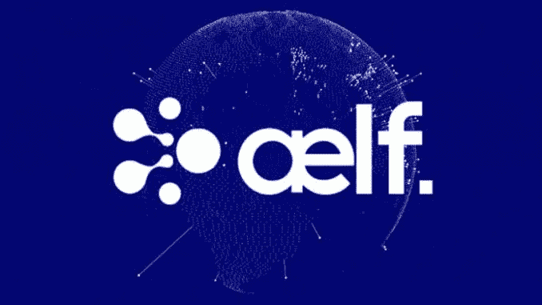
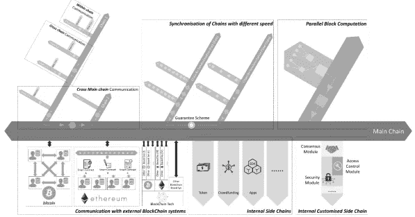
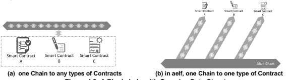
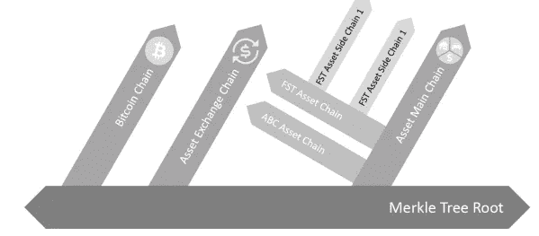
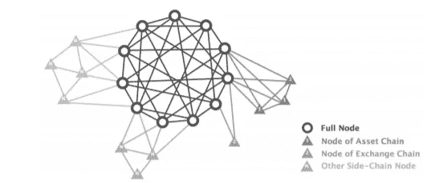
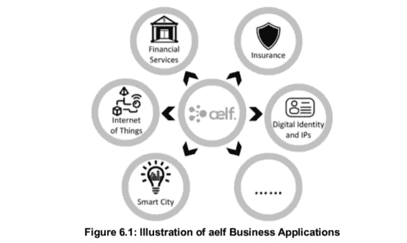

# 深入了解 AELF 项目和生态系统的技术

> 原文：<https://medium.com/coinmonks/technical-deep-dive-into-aelf-project-and-ecosystem-4696327e7a1e?source=collection_archive---------1----------------------->

# **关于 aelf**

aelf 系统旨在提供一个高度专业化和高效的[区块链](https://blog.coincodecap.com/what-is-blockchain-a-simple-guide-for-dummies/)架构，允许开发者定制链，以支持各种行业的理想商业需求。该系统还支持“链分割”功能，以满足未来需求。

为了进一步增强 aelf 的商业潜力，我们为开发者和社区设计了系统最基本的模块和基础设施

# **aelf 系统架构**

aelf 系统包括:-

一条主链。

多个侧链连接到主链上。

## **主链**

主链使用侧链动态索引与侧链相互作用。aelf 系统使用适配器连接比特币、以太坊和其他区块链系统。

aelf(称为 Genesis 智能合同集合)的主要功能由在 Genesis 期间建立的智能合同集合定义。它定义了主要功能、链的一致协议和集合的更新机制。

## **多侧链(一链一合同制)**

Aelf 系统由连接到主链上的多个侧链组成。主链包含系统边界的索引，并记录侧链的位置。这些侧链通过外部信息输入以 Merkle 树验证的形式经由主链相互作用。由于这些侧链不直接相互作用，因此这使得系统可以灵活地从 aelf 系统中添加或去除侧链。

每个链都致力于一种类型的交易，并解决一种类型的业务问题。这种想法使得整个架构和数据更加简单，并符合特定的商业需求。向 aelf 系统添加新侧链的能力使得该系统更加强大，以“易于管理”的结构满足未来的需求。

这些侧链可以进一步延伸，以连接几个子链，在系统的一部分中充当“主链”。从而形成允许 aelf 系统水平和垂直延伸的分支结构。这个想法类似于数据库架构中的分区和分片。它允许每个碎片执行特定的功能，当一个碎片变得太大而无法管理时，它可以进一步分解成多个碎片。

## **智能合同更新**

aelf 的功能由智能合同集合定义。因此，更新集合会影响整个链的功能。集合的更新机制由以前的集合定义。例如，如果在最近的第 100 个块中，80%的多数投票赞成新的智能合同集合，则它被随后的 2000 个块确认，并且新的集合将替换原来的集合。不更新集合的节点将终止其工作。

## **可定制的共识协议**

aelf 将共识协议定义为智能合约集合的一部分，并且可以基于任何业务场景实现任何类型的共识协议。

## **可定制块头**

aelf 内核允许用户在创建链的过程中定制块头结构。

## **aelf 系统中的智能合约**

aelf 操作系统将智能合约定义为协议。[智能合约](https://blog.coincodecap.com/tag/smart-contact)在 aelf 中定义为微服务。这使得智能合约独立于特定的编程语言。aelf 内核将并行处理扩展到云，从而支持基于云的契约执行。

## **光节点**

aelf 中的每个节点只处理系统中的相关信息，这是通过定制和内部 Merkle 树验证机制来实现的。这使得节点更轻，并显著增加了与轻型桌面和移动终端的兼容性。

# **可选模块**

## **数据清理机制**

如果数据变得太大而无法记录，aelf 系统支持历史数据的数据清理机制。该系统主要侧重于处理新数据。这种净化活动不会对当下人们的决定施加任何约束。

## **数据隧道**

数据隧道是一种执行加密 P2P 数据传输的机制。这种设计旨在实现两个节点之间的直接数据传输，这与传统的区块链系统相反，在传统的区块链系统中，交易是广播的，因此所有节点都需要处理交易。

## **快速确认模式**

aelf 支持某些类型的交易的快速交易确认，其中发送者在进行交易之前已经授权接收者。交易将通过数据隧道在分配的地址之间进行，并在一定时期内有效。

## **令牌模块**

aelf 系统支持令牌模块，其中 aelf 令牌被授予由 aelf 操作系统识别的侧链。令牌模块包含值载体(令牌)的所有逻辑和算法。它专门服务于诸如为资源分配付费或为保持 aelf 的稳定性而奖励的场景。

## **定制**

通过向 aelf 操作系统添加侧链，可以定制 aelf 系统以支持商业业务需求。

## **aelf 主链**

aelf 主链是由 aelf OS 运行和控制的区块链。这是整个架构的主要组成部分。

主链包括:-

侧链索引系统

令牌系统

DPoS 共识协议

## **侧链指标体系**

它连接了 aelf 生态系统中的所有链。

aelf 索引两种类型的链:

非常重要的外部链，可用于扩展 aelf 的边界，例如比特币、以太坊

在 aelf 操作系统下运行的内部侧链，为 aelf 系统带来经济效益，并使用 aelf 令牌

侧链步进的工作步骤如下:

主链的节点从侧链读取信息，形成 Merkle 树

新块的头记录了 Merkle 树根。

例如，如果我们想要确认 BTC 的第 1000 个块上的事务 TX1，我们只需要通过消息传递证明 BTC 的第 1000 个块存储在主链的 Merkle 树根上。

为了提高验证效率，Merkle 树结构被扩展为包括块散列以及事务的 Merkle 树根。

频繁的索引可以增加分叉的机会。有时，索引孤立块会降低系统效率。因此，基于每个侧链自身独特的特征，为每个侧链建议不同的索引策略，这可以在系统中定义。

这里出现的一个关键问题是，如果主链频繁地索引一个很有可能分叉的侧链，那么索引孤立块就是浪费精力。因此，我们建议根据每个侧链自身的独特特征为其制定不同的索引策略，这可以在系统中定义。

## **aelf 令牌系统**

自助令牌激励系统中的诚实行为。所有 aelf 侧链都接受 aelf 令牌作为价值存储和价值转移的手段。它可以通过任何接受 aelf 令牌的链进行传输。当侧链申请被主链索引时，它从主链接收一些锁定的令牌。当侧链收到交易费时，它与主链的矿工部分分享。当主链发现索引侧链在经济上不利时，主链有权终止索引。

有三种类型的令牌:

ELF 令牌 aelf 平台上的主令牌，用于交易费、侧链指标费、生产节点押金、投票、区块奖励。

资源令牌(CPU 资源、RAM 资源、磁盘资源、网络资源、读资源、写资源、存储资源、流量资源)——这个令牌被开发者用来支付应用运行时的资源消耗。开发人员需要确保有足够的资源令牌来满足应用程序的正常需求。资源令牌可以和 ELF 令牌一起购买和出售。

开发者创造的代币——在 aelf 平台上，开发者可以创造代币，建立自己的代币模型和激励机制。

## **发行和发行计划**

ELF 发行总额:10 亿

●开采比例:1.2 亿代币(12%)

●区块奖励发布计划:每四年减半

ELF 和资源令牌的总供应量是固定的

●总资源令牌发放量:5 亿个 CPU 资源令牌、RAM 资源令牌、磁盘资源令牌、网络资源令牌、读资源令牌、写资源令牌、存储资源令牌、流量资源令牌。

## **共识协议**

aelf 主链使用 DPoS 来确保块形成的高频率和可预测性。在 aelf 系统中，可以定制每个链上的共识协议以实现特定的目标。

## **aelf 侧链**

当 aelf OS 创建侧链时，希望侧链建立它们自己的共识协议，并将挖掘活动与主链合并。侧链还持有一定数量的 aelf 令牌，并与主链部分分享交易费用。每当一个侧链希望验证来自另一个侧链的细节时，需要包括 aelf 主链的块报头信息，并且验证是通过主链提供的 Merkle 树根来完成的。

## **系统内置 aelf 侧链**

aelf 节点拓扑由主链的完整节点、轻节点和侧链节点之间的互连 P2P 网络组成，其中

非挖掘节点-轻型节点

分类帐节点-完整节点。

# **信息注册和认证侧链**

侧链支持在线和离线的信息注册和认证功能。一些电子商务企业已经采用了这项技术。这项技术现在正着眼于供应链金融、物流、信用评分等领域，在这些领域，他们的大量信息资产可以在未来迁移到这个侧链上。

## 4.5.2.数字资产所有权侧链

这个侧链的主要功能是存储数字资产和钱包所有权信息。

## **4.5.3。资产初次分配侧链**

这个侧链的主要功能是方便资产发起(首币销售)。分发完成后，资产将被移动到数字资产所有权侧链。这样做的好处是，在大规模的第一枚硬币销售过程中，正常的交易不会被中断。

## 4.5.4。分散交换侧链

一个[去中心化的](https://blog.coincodecap.com/decentralization-definition)交易方链起到一个交换的作用。它支持 KYC、资产转移、订单下达/撤回和执行。

# **aelf 跨链优化**

跨链事务需要优化，以匹配不同链之间的块形成速度。

aelf 有两种机制来解决这个问题。

分层侧链机制——我们根据链的块形成速度将链分为不同的级别，并提供专用的适配侧链或适配模块，以便为链的每个级别执行相同级别的跨链事务。

跨级保障机制——对于不同级别的跨链交易，主链为较慢的链提供保障，但这只是需要时的可选机制。这两种机制有效地提高了 aelf 的跨链交易速度。

# **aelf 的主要目标**

## **高度可定制的商用操作系统**

aelf 设计在逻辑上基于内核和外壳架构，这是一种高效且可定制的操作系统。aelf 内核包括区块链系统的基本功能，即最小可行区块链系统。然后，我们开发一个“外壳”作为核心的基本交互界面。这种架构使用户能够使用完整的区块链操作系统，或者通过接口重新定义内核来快速开发基于内核的定制操作系统。

## **跨链交互**

aelf 可以通过消息传递与比特币、以太坊和其他区块链系统进行交互。它还支持基于跨链交互的多级跨链结构，以共享数字资产、用户和信息。

## **性能提升**

**为了提供最佳性能**，该链提供了有效且定制的数据结构、智能契约逻辑，并且可以专门为目标设计共识协议。这使得链将更简单，更容易管理。

此外，aelf 可以定义一种机制来触发系统中的快照。在定义一个周期时，它会获取当前数据的快照，并整理详细的事务数据。新的起源块将包括所有后续事务。

## **协议更新**

在区块链诞生时，投票和更新机制需要明确定义。随着共识协议的引入以包括将来的新特征，它避免了在协议更新上的僵局和争议。

## **私有链模块**

它使用户能够使用他们的私有链模块快速创建独立的链，这为他们提供了对它的完全所有权，而无需与外部生态系统或其他业务进行任何连接。

## **aelf 生态系统开发**

我们通过在三个方面同时努力来追求这个目标:技术、业务和资本。

aelf 团队提出了 aelf 技术解决方案，旨在解决区块链商业应用中最紧迫的障碍，如可扩展性、安全性、定制和互操作性。它为将来采用新协议和支持各种商业场景提供了高效的基础设施。

## **商业应用**

## **金融服务**

可以在 aelf 上开发专门用于金融服务的多个链，包括跨境支付、贸易融资和供应链融资。并行处理功能能够处理国际规模的业务交易，链间通信功能允许从资产注册、账户管理到实时交易的平稳协调。

## **保险**

一个专门的保险 aelf 侧链将集成各种 DAPPs，并将涵盖从用户身份、保险合同执行和索赔处理的所有内容。

## **数字身份和 Ips**

aelf 的多链结构有一个内置的数字身份链。在 aelf 中，其他侧链可以通过“消息传递”使用数字身份。使用该适配器，aelf 还能够从其他已建立的链中检索信息和数据，如比特币和以太坊。

## **智慧城市**

政府将能够使用 aelf 安全方便地运行某些管理任务。政府或组织可以定制共识协议以满足国家安全要求。诸如公用事业记录、公民身份、政府机构信息公开和民意调查之类的活动可以在 aelf 上以极大的透明度和效率实现。一些国家正在这一领域进行实验，包括爱沙尼亚、新加坡和中国。

## **物联网**

aelf 支持轻节点和云服务，在保持高性能的同时降低了对连接设备的计算要求。这对于管理数十亿台设备并实现它们之间的微支付以连接物联网至关重要。

## **与现有链上的现有 DAPPs 互操作**

aelf 将利用其互操作性特性与现有的 dapp 连接，以允许资产交换并捕获来自这些 dapp 的交易数据。

## **培养新的创业想法**

开发团队及其顾问深入参与全球区块链社区的新想法形成和商业化。新的创业公司向我们寻求技术和商业建议。我们将利用这些强大的联系来培育初创企业，并将它们纳入 aelf 生态系统。

## **将老牌公司转变为“区块链行家”**

aelf 团队一直在与互联网公司和传统企业讨论 aelf 上的颠覆性商业模式。此外，该团队打算与全球战略咨询公司合作，在 aelf 生态系统上推进下一代商业模式的边界。

## **首都**

在代币销售期间筹集的资金，该团队及其顾问已经与全球领先的加密基金建立了强大的联盟。我们已经建议了许多象征性销售项目，以成功筹集资金，并帮助他们克服他们面临的许多障碍。这个国际资本网络和我们的声誉确保了强大的融资能力，

# **结论**

Aelf 是一种多用途超级灵活的区块链。它已经建立了相当长一段时间，有一个复杂但非常有效的架构。这种体系结构有助于按照用户的要求调整可伸缩性参数。这使得 aelf 能够将自己标榜为一款随时可供企业使用的行业级区块链。

注:在投资任何项目之前，都要做好调查。

阅读更多:[了解 SegWit](/coinmonks/understanding-segwit-7a1e206aff7b)

> [直接在您的收件箱中获得最佳软件交易](https://coincodecap.com/?utm_source=coinmonks)

