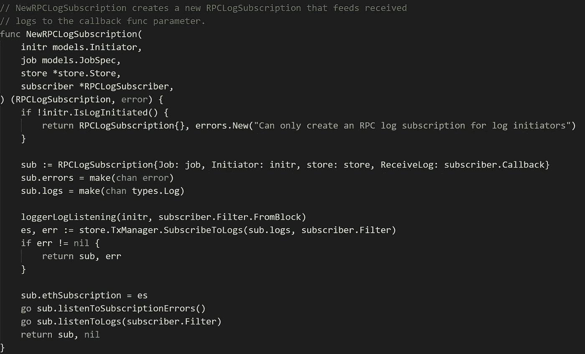

# Chainlink Testnet 实施的技术概述

> 原文：<https://medium.com/coinmonks/technical-overview-of-the-chainlink-testnet-implementation-c8a0b09276d1?source=collection_archive---------6----------------------->

[source](https://fynestuff.com/chainlink-vs-decentralized-oracles-analysis/)

Chainlink 试图通过分散式 oracle 将链外数据连接到链上智能合同。

不久前，我对 Chainlink 的工作原理产生了兴趣。这是我发现的。

Chainlink 实现可以分为两个不同的部分:Chainlink 节点和 Chainlink 智能合约。

**:**

**Chainlink 智能合约将部署在区块链上，并将被其他智能合约用来发起请求和接收链外数据。**

**Chainlink testnet 实现基于以太坊 blockhain，因此，智能合约将使用 Solidity
编程语言。想要使用 Chainlink 请求链外数据的智能契约将继承【Chainlink 智能契约。链式链接智能协定提供了函数、数据结构和其他链式链接智能协定的必要导入。**

****

**要从 API 请求链外数据，发出请求的智能合约必须知道工作流的作业 id([job spec](https://github.com/smartcontractkit/chainlink/wiki/JobSpecs)),该工作流将在请求数据时被触发。每个 JobSpec 都有一个唯一的 id。JobSpec 作业 id 可以通过请求的智能契约构造函数传递(并在作业运行中引用)或在 newRun 函数中硬编码。**

**想要请求数据的智能合约函数必须创建 ChainlinkLib.Run. ChainlinkLib 的实例。Run 保存执行离线请求所需的信息—它是使用 newRun 函数创建的。newRun 函数获取请求数据时将被触发的 JobSpec 的作业 id、发送响应的智能契约的地址(在本例中是 **this** —当前契约的地址)，以及 Chainlink 节点将向其发送数据的函数签名。**

****

**发出请求的智能合约可以向运行中添加更多数据，例如要调用的 API 的 URL、如何解析 URL 调用的响应等。**

**例如，URL“[https://min-api.cryptocompare.com/data/price?fsym=ETH&tsyms =美元，欧元，日元](https://min-api.cryptocompare.com/data/price?fsym=ETH&tsyms=USD,EUR,JPY)”返回以下 JSON 响应。**

****

**通过将 USD 添加到 path 数组中，离线 JobSpec 将知道如何将 JSON 响应的 USD 部分发送回请求的智能契约。**

**ChainlinkLib。Run 然后被传递给 chainlinkRequest 函数，其中包含合同愿意为请求支付的链接数量。
因此，请求智能合约必须由链接令牌提供资金。**

**chainlinkRequest 函数将最终调用 Oracle 智能合约的 requestData 函数。**

****

**requestData 函数将为请求分配一个惟一的 id，并存储大部分的 ChainlinkLib。在名为 callbacks 的映射中运行 info，使用惟一的 id 作为键。然后，该函数将发出 RunRequest 日志，其中包含请求的惟一 id、JobSpec 的作业 id、数据(比如要调用的 URL 和如何解析返回的 JSON)以及一些其他必要的元数据。**

**缺失的一环(双关语)是当前的标桩/匹配契约，它将推动 oracle 节点如何与请求智能契约相匹配的过程。这目前不在公开回购中。Steve 在 Gitter 上描述了赌注/匹配合同的工作方式:**

***“当节点最初存放链接到匹配的合同时，它们建立“可用存放”。可用的保证金由匹配的合同
持有，但神谕可以随时提取。当 oracle 对 SLA 请求提出报价并被选中时，SLA 所需的链路数量将由匹配的合同从可用保证金中移出并指定给 SLA 保证金。在 SLA 结束时，存放的未被扣分的链路以及接收到的服务链路被移回到可用存放中。”***

**现在已经有了一个对离线数据的请求，让我们检查一下当 Chainlink 节点启动时发生了什么，它如何能够发现来自区块链的请求，运行必要的 JobSpec，并将数据返回给发出请求的智能合约。**

****链环节点**:**

**Chainlink 节点是用 Golang 写的。Golang 拥有大多数编程语言所没有的独特特性，比如 [Goroutines](https://golangbot.com/goroutines/) 和 [channels](https://gobyexample.com/channels) 。
如果你没有使用它们的经验，了解这两个特性是个不错的主意。**

**Chainlink 节点公开了一个[命令行界面](https://github.com/smartcontractkit/chainlink/wiki/Command-Line-Options)，允许用户启动 Chainlink 节点、显示所有/单个作业运行、创建作业规范、开始作业运行、备份数据库、导入密钥文件等。**

**为了启动 Chainlink 节点，用户将在 Chainlink 可执行文件的名称后加上单词 **node** 或 **n.** 此外，在命令行上指定密码。**

**这个命令行调用最终调用了 RunNode 函数。RunNode 函数的主要目标是连接到以太坊区块链，创建 ChainlinkApplication 对象，使用密钥库进行身份验证，调用 ChainlinkApplication 启动方法，并设置 Chainlink REST API(允许创建 JobSpecs、桥适配器等)。**

****

**ChainlinkApplication 对象很重要，因为它包含对控制节点工作流程的对象的引用。实例化后，chain link 应用程序将保存这些引用:**

****HeadTracker** “以线程安全的方式保存和存储这个特定节点经历的最新块号。”**

**“管理来自以太坊节点的 websocket 的推送通知，以监听新标题和日志事件。”以太网监听器控制[运行日志](https://github.com/smartcontractkit/chainlink/wiki/Initiators)和[以太网日志](https://github.com/smartcontractkit/chainlink/wiki/Initiators)作业规范的逻辑。

**调度器**控制 [Cron](https://github.com/smartcontractkit/chainlink/wiki/Initiators) 和 [RunAt](https://github.com/smartcontractkit/chainlink/wiki/Initiators) JobSpecs 的逻辑。**

****Store** “包含数据库、配置、密钥库和 TxManager 的字段，用于保持应用程序状态与数据库同步。”实例化后，商店将通过连接到 config.go 中的可配置[以太坊字段来建立到以太坊区块链的套接字连接。](https://github.com/smartcontractkit/chainlink/blob/master/store/config.go)**

****退出器**用特定的退出代码退出链节节点。**

****密钥库认证**:**

**实例化 ChainlinkApplication 对象后，使用密钥库进行身份验证。一个[以太坊密钥库](/@julien.m./what-is-an-ethereum-keystore-file-86c8c5917b97)是你的以太坊私钥的加密版本，可以通过输入密码来解密。一旦密钥库被解密，它将允许您签署交易并从您的帐户转移资金。如果在启动 Chainlink 节点时在命令行中指定了密码，Chainlink 将检查它是否可以解锁位于文件系统上可配置目录中的所有密钥库文件。如果密码无法解锁所有密钥库文件，则 Chainlink 将不会启动。如果节点启动时没有提供密码，系统会提示用户输入密码。如果不存在密钥库文件，则将创建一个密钥库文件。要标记链接令牌，必须将密钥库导入到 Chainlink 节点中。**

****chain link 应用启动方式:****

**身份验证完成后，将调用 ChainlinkApplication Start 方法—这将启动 Chainlink 节点。**

****

**该方法创建一个通道，当观察到 [SIGINT](https://www.gnu.org/software/libc/manual/html_node/Termination-Signals.html) 或 [SIGTERM](https://www.gnu.org/software/libc/manual/html_node/Termination-Signals.html) 系统调用时，该通道会得到通知(常见的终止信号，如按下 control C 或调用进程上的 kill 命令将触发该系统调用)。然后启动一个监听通道的 Goroutine 如果观察到终止信号，ChainLinkApplication 将调用一个允许它正常退出的方法。**

**然后，该方法调用 Store、HeadTracker 和 Scheduler Start 方法。**

****店铺开始方式:****

**Store Start 方法将找到的第一个解锁的密钥库帐户设置为 TxManager 中的当前活动帐户。TxManager 负责与以太坊区块链接口(发送签名交易，提高当前交易的 gas 数量等)。除了设置当前活动帐户之外，Store Start 方法还设置[当前活动帐户 nonce](/kinfoundation/making-sense-of-ethereum-nonce-sense-3858d5588c64) (来自一个帐户的交易数量)。nonce 是从当前活动帐户发送交易所必需的。**

****头部跟踪器启动方法:****

****

**Headtracker 订阅了以太坊区块链的新街区。当以太坊区块链上有一个新的块时，BlockHeader 对象(代表以太坊区块链上的块头的数据结构)将通过管道进入一个名为 headers 的通道。**

**Headtracker connect 方法将从本地数据库中查询所有日志启动的 JobSpec(RunLog 和 Ethlog)—对于每个 job spec，将调用 NewRPCLogSubscription 方法。**

****

**此方法将创建对新日志的订阅—新日志将通过管道传输到 sub.logs 通道。Goroutine listenToLogs 将通过监听 sub.logs 通道来回填日志并处理新的日志条目。**

****

**回填日志是 Chainlink 的一个重要功能，因为这意味着如果 Chainlink 节点关闭/退出，它将能够处理在 Chainlink 节点关闭时发生的日志/数据请求。“处理日志”意味着验证日志的类型是否正确——在 RunLog
验证中，即日志具有与 Oracle.sol 中发出的签名相同的签名，日志中的作业 id 与处理日志的 RunLog 实例的作业 id 相匹配，并且请求满足最少数量的链接。如果验证通过，作业运行将开始。**

****作业运行开始时会发生什么？****

****

**可以在的[处找到工作规范示例。](https://github.com/smartcontractkit/chainlink/wiki/JobSpecs) [Chainlink 按顺序运行 JobSpec 中的每个任务](https://github.com/smartcontractkit/chainlink/wiki/Job-Pipeline)，每次成功运行任务后保存结果。每个任务运行映射到一个特定的[适配器](https://github.com/smartcontractkit/chainlink/wiki/Adapters)的运行。Chainlink 定义了保存当前 TaskRun 结果的 RunResult 数据结构。每个 TaskRun 的结果在 RunResult 的数据字段中设置，并发送给当前 TaskRun。这样做是为了让当前的 TaskRun 可以使用上一次 TaskRun 运行的结果。**

**Chainlink 定义了每个任务在运行之前必须满足的最小确认数量 SLA(针对日志启动的作业规范)。经过 x 次确认后，Chainlink 可以相当确定启动作业运行的程序块是有效的(如果该程序块仍然存在)。如果运行未达到最小确认数，则运行会暂停并进入待定确认状态。**

**最重要的适配器之一叫做 EthTx。这是负责向链上智能合约发送链外数据的适配器。在 RunLog 场景中，EthTx(如果在 JobSpec 中指定)将发送请求的唯一 id(从 Oracle.sol 中 requestData 函数发出的 RunRequest 日志中读取——在下面的示例中为 internalId ),并将数据变量的结果发送到 Oracle.sol 中的 fulfillData 函数**

****

**一旦该数据被发送到 fulfillDataFunction，该函数将把请求的惟一 id 放入回调映射中。回调映射将返回回调数据结构，该结构包含将数据发送到正确的智能合约地址和函数所需的信息。**从回调数据结构中获得必要的信息后，数据被发送到发出请求的智能合约！这就是满足要求的方式！****

****陷入等待确认状态的工作是如何重新开始的？****

**回到 HeadTracker Start 方法，该方法要做的最后一件事是启动一个名为 listenToNewHeads 的 Goroutine，它将监听 headers 通道。Chainlink 需要监听新的头，因为它需要将新的头保存到它的数据库中，以便它知道最后处理的头。
如果节点关闭，然后启动，它将知道最后处理的头。此外，这个 Goroutine 将让 Chainlink 处理以前运行时不满足最低块确认 SLA 的所有挂起的作业运行。如果作业运行满足其最低块确认 SLA，则链节节点启动另一个作业运行。**

****调度程序启动方法****

**调度程序启动方法将确保 [Cron](https://github.com/smartcontractkit/chainlink/wiki/Initiators) 和 [RunAt](https://github.com/smartcontractkit/chainlink/wiki/Initiators) JobSpecs 按照指定的时间表运行。**

****Cron**:“`Cron`启动器是一种调度重复作业运行的简单方法，它使用[标准 Cron 语法](https://en.wikipedia.org/wiki/Cron#Overview)和一个用于指定第二级粒度的额外字段。”**

****RunAt**:`RunAt`启动器在指定的时间触发一次性作业运行**

**对于 Cron 作业，Chainlink 使用这个[库](https://github.com/mrwonko/cron)。该库的主要功能可以在 AddFunc 和 run 方法中看到。在调度程序启动方法中，首先要做的事情之一是调用 Cron 库启动方法，这将在一个 GoRoutine 中启动 Cron 库运行方法。**

**每个 Cron JobSpec 都将使用 AddJob 方法添加到 Cron 库中，这将调用 Cron 库 AddFunc 方法。AddFunc 方法将一个函数及其循环调度作为输入。Cron 库将在每个重复的计划时间间隔调用传递给 AddFunc 方法的函数—在这种情况下，传递的函数调用 BeginRun 方法(开始新的作业运行)。**

****

**AddFunc 方法调用最终会将其输入(函数及其循环调度)封装在一个名为 Entry 的对象中。条目对象将被添加到 Cron 库条目集合中。在被添加到 Entries 集合之后，Entry 对象将通过管道传递到 add 通道。**

****

**cron 添加通道在 Cron run 方法中使用。**

****

**run 方法遍历 entries 集合中的所有条目，并查找每个函数的下一个预定时间。根据这些时间，run 方法找到最早的预定时间(如果有)。从最早的预定时间开始，该方法将创建一个计时器对象(称为 timer ),当计时器到期时，该对象将通过管道进入一个通道(称为 C)。**

**然后，该函数输入一个 select 语句，允许它在多个通道上等待。第一个通道将是下一个预定功能运行的定时器通道(如上所述)。另一个通道是我在 AddFunc 方法中提到的 add 通道(当添加一个新的 cron 时通过管道传输)。下一个通道是快照通道，当有人请求库中当前存在的所有条目的“快照”时，将通过管道传送该通道。最后一个通道将是关闭通道，当调度程序/Cron 库被请求停止时将调用该通道。**

**当计时器对象通道被管道化时，其“下一次”运行时间小于当前时间的所有条目都将执行其功能。
执行后，条目将被赋予一个新的下次运行时间，根据运行时间排序，select 语句将再次开始监听所有通道。**

**当添加通道被管道化时(从 AddFunc 方法),该方法将停止当前计时器(因为添加的函数可能具有比当前最早运行时间更早的运行时间)。然后，从最早的运行时创建一个新的 timer 对象，select 语句再次开始监听所有通道。**

**当存在对所有 cron 条目的请求时，快照通道被管道化。**

**当调度程序/Cron 库被请求停止时，关闭通道将被管道调用—它结束计时器对象并返回。**

**RunAt 函数与 Cron 作业非常相似，只是它们只运行一次。**

****

**对于每个 RunAt JobSpec，Chainlink 将启动一个新的 Gorutine，它将使用 select 语句在两个通道上等待(就像在 Cron 库中一样)。当 Chainlink 想要正常退出时，将通过管道传输第一个通道。第二个[频道](https://golang.org/pkg/time/#After)将在 RunAt JobSpec 预定运行时通过管道传输。当第二个通道通过管道传输时，Chainlink 将通过调用 BeginRun 方法执行 JobSpec 中格式化的运行。**

**总之，Chainlink 能够通过让 Chainlink 节点侦听特定的以太坊日志(请求)，解析日志中的数据，运行顺序作业管道，然后将管道的结果发送到请求智能合约，来桥接链上数据请求和链外数据。**

**干杯！**