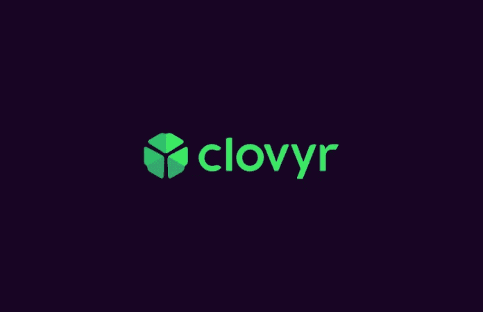
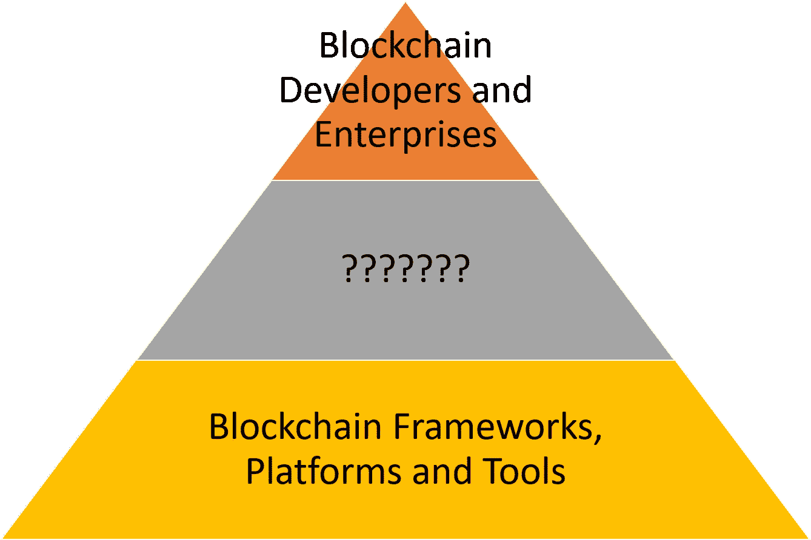
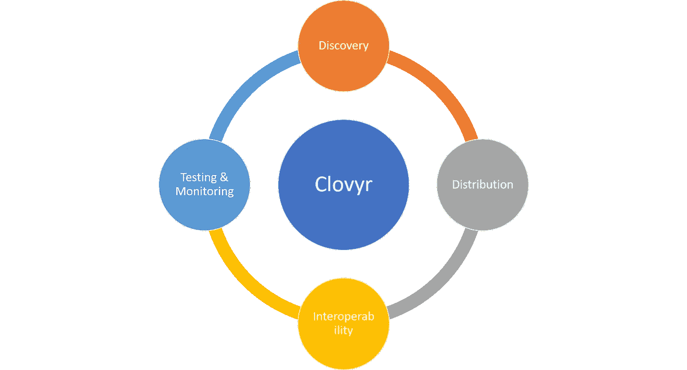
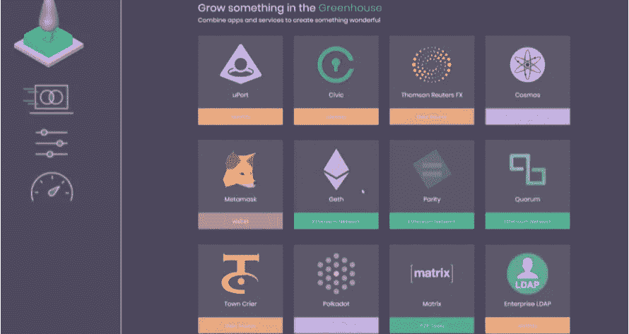

# 技术星期五:Clovyr 希望成为区块链的英雄

> 原文：<https://medium.com/coinmonks/technology-fridays-clovyr-wants-to-be-the-heroku-of-the-blockchain-5b1f639bb6ad?source=collection_archive---------4----------------------->

开发区块链应用程序很难。我说的不仅是大多数区块链堆栈的复杂性，还有数量庞大的堆栈。如果你想开始构建基于区块链的分布式应用程序，你将会被大量的选择淹没，这些选择在数学上声称优于所有的竞争对手。使用什么运行时？以太坊，恒星，NEO？被允许的区块链怎么样？Quorum，Fabric，Monax，Corda 看起来很酷。像 Coco 这样的多运行时框架怎么样？我们应该像微软、AWS 或 Bluemix 那样使用区块链作为服务堆栈吗？我们需要使用 Cosmos 或 Polkadot 连接多个区块链吗？我们如何测试和管理这整个事情？我可以继续下去，但希望你能明白。

在开发人员通常没有接触过区块链生态系统的企业环境中，发现、原型开发和管理区块链应用程序的挑战更加突出。Clovyr 是我见过的第一种技术，它采用智能方法来连接这些服务，允许开发人员和企业快速采用区块链应用程序。

[Clovyr](https://clovyr.io/) 本周在纽约市的共识会议上亮相。这个团队由摩根大通法定人数项目的负责人[安博·巴尔德](https://twitter.com/AmberBaldet)和[帕特里克·尼尔森](https://twitter.com/pmylund)领导。有许多方法可以思考 Clovyr，但有一个方法我觉得很有说服力:如果你把区块链的生态系统想象成一个三层的金字塔，在金字塔的底部，你有一个创新但也很大的生态系统，其中有成千上万个当今市场上的工具和框架。在顶部，我们将放置解决现实世界需求的商业和消费者应用程序。然后，我们会很快发现在中间层需要很多服务来连接其他两个。那是 [Clovyr](https://clovyr.io/) 。

Clovyr 平台在市场上的区块链工具和框架的大生态系统与解决实际问题的开发者和企业之间架起了一座桥梁。从功能的角度来看，Clovyr 解决了区块链应用的四个关键挑战:

a) **发现:**使用 Clovyr 门户，开发人员可以搜索和浏览不同的区块链工具和框架，并了解它们如何适合他们的场景。

b) **互操作性:**Clovyr 平台将有助于简化不同区块链工具和框架之间的互操作性，以便它们可以在端到端的区块链应用程序上进行组合。

c) **分发:**对于框架和 DApp 开发者来说，Clovyr 可以作为接触开发者和企业的主要分发渠道。

d) **测试和监控:**最终，Clovyr 平台将为监控、测试和管理不同的区块链堆栈提供一个统一的模型。

Clovyr 仍在积极开发中，当前版本提供了一个类似应用市场的用户界面，其中包含许多市场上最流行的区块链框架和平台。该目录包括从第 1 层运行时到更高级开发人员框架的区块链堆栈的不同级别的技术。

# 竞争？

Clovyr 是区块链领域一个非常独特的选择，但这并不意味着它不会面临竞争。在我看来，区块链即服务(BaaS)提供商如 Azure、AWS 或 Bluemix 将在他们自己的云运行时提供 Clovyr 的替代方案。从这个角度来看，我们可以将 Clovyr 视为一个真正的平台无关的解决方案，用于分发、发现、原型化和管理区块链应用程序。