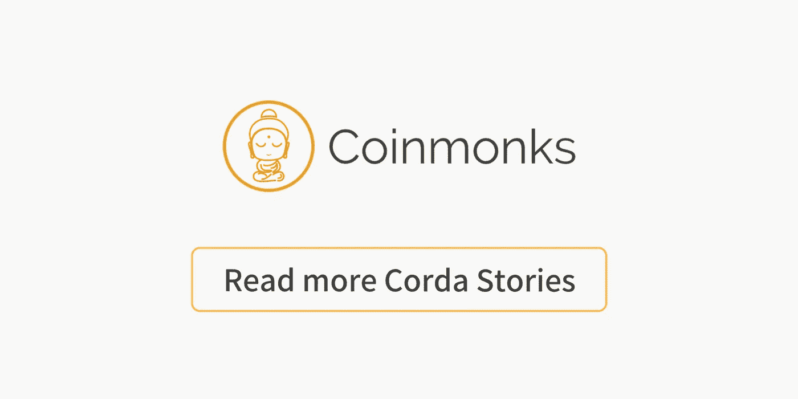

# 技术星期五:R3 Corda 是你从未听说过的最伟大的区块链平台

> 原文：<https://medium.com/coinmonks/technology-fridays-r3-corda-is-the-greatest-blockchain-platform-you-never-heard-of-b4baf1336b58?source=collection_archive---------3----------------------->

欢迎来到技术星期五！今天我们将讨论市场上最完整的区块链平台之一，但它没有得到应有的认可；我们说的是 R3 Corda。

当您想到区块链基础设施平台时，以太坊或 IBM Hyperledger Fabric 之类的名称会浮现在脑海中。Corda 是一个绝对应该出现在列表中的名字。Corda 由世界顶级银行组成的财团创建，从各个功能来看，它可以被认为是实现企业区块链应用程序的最复杂的平台之一。

许多专家认为，Corda 甚至不应该被视为区块链平台，因为它的功能集远远超出了区块链技术公司的典型价值主张。R3 联盟更喜欢用术语“分布式分类帐平台”来称呼 Corda。为了避免混淆，让我们使用术语“受区块链启发的分布式账本平台”(这对于营销贡献来说如何？；) .

像其他区块链技术一样，Corda 的基础设施基于负责执行智能合同的节点网络。Corda 将这一传统概念向前推进了一步，引入了 Corda 分布式应用或 CorDapps 的概念，它封装了分散业务流程的所有组件。CorDapps 包括多种功能，包括类似于区块链智能合同的 Corda 合同。

CorDapp 合同负责处理交易，并对基础分类帐的状态进行适当的修改。Corda 中的交易验证过程必须是确定性的(合同必须总是接受或总是拒绝交易)，以确保网络的完整性。为了保证确定性，Corda 引入了契约沙箱概念，这是一种防止契约导入库的环境，这些库会引入非确定性工件，如随机数、日期或外部数据。

确定性契约在区块链应用程序中是必不可少的，但是，让我们面对它吧，为了实现复杂的业务逻辑，它们也会导致非常模仿。为了规避这一限制，Corda 引入了流的概念，流是协调分类帐更新的过程，不受合同确定性限制的影响。就像契约一样，流作为 CorDapps 的一部分执行，但它们能够执行不确定的操作，如网络调用、IO 操作、调用外部库和其他随机操作。流可以使用基于 JVM 的语言(如 Java)中的 Corda 流框架来实现。

从基础设施的角度来看，Corda 可以看作是运行 CorDapps 的节点网络。然而，与其他区块链不同，Corda 的网络是完全许可的，这意味着网络中的每个节点都有一个已知的身份。为了实现这一功能，Corda 使用了看门人的概念，看门人是负责执行身份管理协议的节点，这些协议允许节点加入网络。Corda 中的节点严格使用点对点协议进行通信，该协议基于通过 AMQP 传送的 TLS 加密消息。为了改善传统区块链堆栈的事务吞吐量限制，Corda 依赖于 UTXO(未用事务输出)模型。UTXO 约束事务接收大量状态作为输入，并产生相应数量的状态作为输出，这有助于并行执行事务。

Corda 最复杂但同样创新的功能之一是 it 节点架构。在 Corda 网络中，每个节点都使用基于五个基本组件的架构:

1 —一个持久化的 tiner，它有一个用于存储历史和当前状态的存储库，以及一个记录该节点处理的事务的存储服务。

2 —支持与其他节点通信的网络接口。

3 —用于与节点所有者交互的 RPC 接口。

4 —允许流程从其他节点调用服务或访问与协调分类帐更新相关的其他信息的服务中心。

5 —用于在该节点中访问和安装 CorDApps 的插件注册表。

像其他区块链技术一样，Corda 't networks 依靠一致算法来处理交易。这方面一个值得注意的创新是公证人的概念，公证人是在交易完成前签署交易所需的节点。从概念上讲，公证人是为了解决区块链网络中著名的“重复花费”问题。

借鉴以太坊的架构，Corda 还使用了 Oracles 的概念来允许访问与交易相关的链外信息。Oracles 是集成 Corda 和外部应用程序的主要机制。

> [在您的收件箱中直接获得最佳软件交易](https://coincodecap.com/?utm_source=coinmonks)

**竞争？**

我喜欢把 Corda 看作是一个受区块链启发的分布式分类帐基础设施平台。从竞争角度来看，Corda 与以太坊或 Hyperledger Fabric 等一级、低级区块链平台竞争。其他区块链平台，如摩根大通的 Quorum、Tezos、纳斯达克的 Linq 或 chain 也可被视为 Corda 的相关竞争对手。

Click to read more about Corda