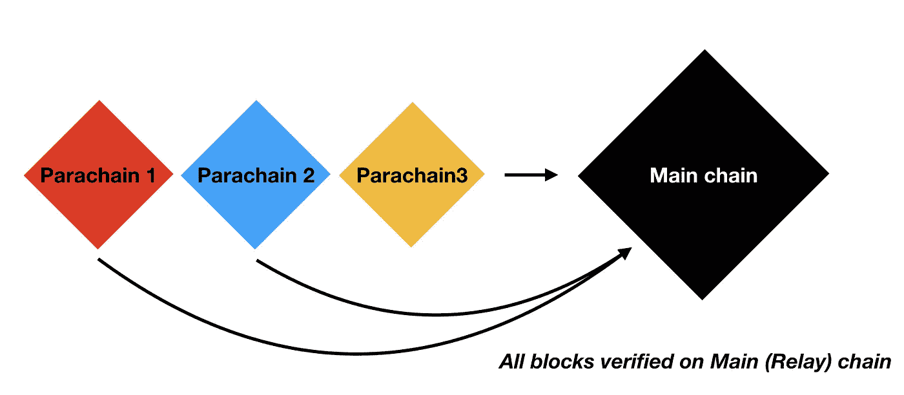

# 电报开放网络、波尔卡多特、宇宙网络——区块链的未来？

> 原文：<https://medium.com/coinmonks/telegram-open-network-ton-polkadot-cosmos-network-future-of-blockchains-7b466b8f2e40?source=collection_archive---------0----------------------->


TON, Polkadot, and Cosmos

就在 5 月 25 日，关于 TON 的新信息出现了。让我们试着简单地理解一下那是什么，并将其与 Polkadot 和 Cosmos 进行比较。本文是从作者的角度对新一代区块链的一个简要说明。

# 电报开放网络

TON 团队计划如何扩展超过 3 亿用户？—分片。

TON 正计划使用分片来扩展用户之间的交易。这里有一篇关于区块链的很棒的文章。
吨将有一个主链和 shardchains。每个碎片都是一个允许与另一个碎片通信的区块链。Shardchains 可以使用超立方体路由相互通信。没有一个虚拟机可以在碎片之间操作数据。所有 TON 数据都表示为相互链接的单元格。

> 回想一下，TON 区块链，以及 TON 虚拟机(TVM 参见[4])，将所有永久存储的数据表示为所谓单元的集合或包。每个单元包含多达 1023 个数据位和多达四个对其他单元的引用。
> [吨级区块链](https://test.ton.org/tblkch.pdf)——(1 . 1 . 1。TVM 细胞)

TON 还具有验证器、校对器、提名器和渔夫角色。此外，有很多智能合同可以用 Fift 语言编写。

TON 也受到了 Polkadot 的启发，并打算将以太坊 2.0 的原则与分片和 PolkaDot 结合起来。

> Polkadot 是一个经过深思熟虑的、最详细的多链利益相关项目；它的开发是由以太坊的创始人之一领导的。这个项目是我们地图上最接近 TON 区块链的项目之一。(事实上，我们的术语“渔民”和“提名者”都要归功于 PolkaDot 项目。)
> [吨](https://test.ton.org/ton.pdf)——(2.9 与其他区块链项目对比)

我们推出了 TON lite 客户端，并在 testnet 上部署了一个智能合约示例。现在开发经验有点挑战性，也不太友好。Lite client 是用 C++编写的，看起来写得很完美。TON 团队真的很会写代码。


Demo of running TON lite client

如果您想要部署一个 testnet 契约或者创建一个帐户，您需要构建 lite 客户端并使用特定的配置运行它。
之后，您可以通过在硬编码地址上请求智能合约来请求一些测试克。

> 只需在任何带有 docker 的机器上执行该命令:

```
docker run -ti -v "$(pwd):/data" --name ton buttonwallet/ton
```

> 之后可以继续按照 TON 演示指令:
> **get account-1:8156775 b 79325 e 5d 62 e 742d 9 b 96 c 30 b 6515 a5 CD 2 f1 f 64 C5 da 4b 193 c 03 f 070 e0d**

这里继续和 TON 合作:[https://test.ton.org/HOWTO.txt](https://test.ton.org/HOWTO.txt)

现在可以说 TON 有一种特定的方式与它相互作用。我们正在等待更多来自 TON 团队的开发者工具，以使这一过程更加方便。

感谢[谢苗诺夫罗曼](https://github.com/poma)写了很多有用的东西。你可以在这里查看:【https://github.com/copperbits/TON-Research[。这个团队对研究 TON 很认真。](https://github.com/copperbits/TON-Research)

# 波尔卡多特

有一个伟大而复杂的[白皮书](https://polkadot.network/PolkaDotPaper.pdf)解释了 Polkadot 实现的大多数想法。

Polkadot 使用一个名为**的链条中继链**来连接所有其他链条。中继链是区块链与 BFT 的共识与 Tendermint 相当相同的证据。中继链有点硬币，并使用它的一切从治理结束到赌注。

简而言之，波尔卡多特对每条链(副链——平行链)都有不同的区块链。因此，它以并行执行的方式运行区块链。



Parachains blocks are verified on Relay chain, Parachains have parallel block execution

此外，Polkadot 有自己的框架来开发名为 Substrate 的副链。他们正在使用 WebAssembly 虚拟机进行副链。

Polkadot 网络有 4 个参与者——验证者、校对者、提名者和渔夫。验证器验证所有的块，并运行一个完整的节点。整理器通过对事务进行排序并向验证器建议块来帮助特定副链上的验证器。


Network participants of Polkadot

Polkadot 最重要的特征之一是所有副链共享共识(也意味着共享安全)。只有一个攻击点——中继链。
副链没有共识和自己的验证器——这可能是一个优势，因为你不需要考虑自己的验证器和共识基础设施。Polkadot 的主要问题是扩展和副链之间的消息传递。他们正在使用超立方体路由机制，试图解决在添加新的副链期间连接数量不断增长的问题。

> **本质上，不是用副链和子组节点的数量来增长节点连通性，而是仅用副链的对数来增长。**[*Poladot 白皮书*](https://polkadot.network/PolkaDotPaper.pdf) *(* 6.6.4 .超立方体路由)

共同的，我们可以说 Polkadot 会有一个中继链和副链与之相连。所有交易都将经过中继链验证。由于性能限制，对副链和验证器的数量会有限制。

# 宇宙网络

宇宙-是另一个想要连接许多区块链的大项目。主要的区别是宇宙没有共识的共享安全。它只是控制有多少宇宙币在区块链之间转移。Cosmos 侧链之间有特定的通信协议。主要思想是宇宙维护可以检查侧链是否达成共识。然而，Cosmos sidechain 并不确保如何达成共识。这是唯一相关的区块链问题。


***Every zone have its own validators
and its own consensus***

Cosmos 使用区块链间通信(IBC)协议来允许不同区域相互通信。

> 现在，我们来看看中心和区域是如何相互通信的。例如，如果有三个区块链，“区域 1”、“区域 2”和“集线器”，并且我们希望“区域 1”产生通过“集线器”去往“区域 2”的分组。要将数据包从一个区块链移动到另一个，需要在接收链上张贴证明。证据表明，发送链向声称的目的地发布了一个数据包。为了让接收链检查这个证明，它必须能够跟上发送方的块头。这种机制类似于 sidechains 使用的机制，它要求两个相互作用的链通过双向的存在证明数据报(事务)流相互了解。
> 
> 自然可以使用两种类型的事务来定义 IBC 协议:一种是`***IBCBlockCommitTx***`事务，允许区块链向任何观察者证明其最近的块散列；另一种是`***IBCPacketTx***`事务，允许区块链向任何观察者证明给定的数据包确实是由发送方的应用程序通过最近的块散列的 Merkle-proof 发布的。
> 
> 通过将 IBC 机制分成两个独立的事务，我们允许接收链的本地费用市场机制来确定哪些分组被提交(即被确认)，同时允许发送链完全自由地决定允许多少出站分组。
> 
> [**宇宙白皮书**](https://cosmos.network/resources/whitepaper)**——**区块链内部交流(IBC)

Cosmos 允许将任何兼容 Tendermint 的区块链连接到网络，但是，这并不意味着您不需要关心这个区块链的一致性和安全性。Cosmos 的主要特点是嫩薄荷。
Tendermint consensus 允许 Cosmos 具有如此高的可扩展性，并且为每个链提供不同的验证器。更多关于 Tendermint 的信息你可以在这里看到。

因此，Cosmos 有另一种方法来将区块链与优势联系起来——更多的定制化、分散化和劣势

# 结论

目前，有 3-4 个领先的新一代区块链正在试图解决区块链的扩展问题，并允许数百万用户同时使用它。

TON 是由一组天才开发人员开发的最雄心勃勃的项目之一，他们也研究过 Telegram messenger 和 vk.com。然而，TON 是在没有社区支持的情况下开发的。现在它甚至还没有完全开源。以太坊社区提出的一些关于其分片的问题和其他想法还没有得到解答。

Polkadot 和 Cosmos 要开放和公开得多。宇宙号已经发布了。Polkadot 和 Cosmos 已经拥有允许在这些网络上开发的工具。Polkadot 有底层框架，Cosmos 有 SDK。TON 仍在积极开发中，除了运行 lite 客户端的汇编语言和小 readme 之外，它没有任何东西。这是一个公开的问题，TON creators 计划如何吸引开发者到 Fift 和他们的平台，而不进行任何宣传，并有像 Polkadot 和 Cosmos 和 Ethereum 这样的竞争对手。
我自己的观点是，TON 将会有一些额外的工具，使得开发智能合约比现在用 fift 在 testnet 上开发要容易得多。TON 将有一个最好的开始，因为使用当前的电报用户，它将立即获得超过 3 亿用户。从开发者的角度来看，TON、PolkaDot 和 Cosmos 不是竞争对手。我们只需将它们添加到我们的应用程序中，就可以一起使用它们的所有功能。
作为同样基于 Telegram 的纽扣钱包，我们将支持 TON，并将在 Telegram 正式发布后为其添加更多功能。现在的区块链有非常相似的界面来开发你的 dapps。这意味着使用 Polkadot 的开发人员将使用 Cosmos 和 TON。大多数 Dapps 目前被设计为在任何或几个区块链上运行。所以，现在我们需要 TON 团队更多的宣传和开发工具——帮助社区开始在它上面创建 dapps 并吸引用户。
自 2017 年以来，我们的团队正在开发一种基于电报的非保管加密钱包。我们认为，用户将更多地使用信使进行支付，而不是简单的移动钱包等其他应用。我们受到微信支付的启发，目前不仅支持 Telegram，还支持脸书信使、Whats app 和 Discord。
更多关于我们这里:[https://buttonwallet.com/](https://buttonwallet.com/)或尝试[按钮这里 t.me/buttonwalletbot](http://t.me/buttonwalletbot)

# 资源

1.  [https://github.com/paritytech/polkadot/wiki/Parachains](https://github.com/paritytech/polkadot/wiki/Parachains)
2.  [https://polkadot . network/polkadotpaper . pdf](https://polkadot.network/PolkaDotPaper.pdf)
3.  【https://blockchain.wtf/2018/07/series/wtf-is/polkadot/ 
4.  [http://slides.com/paritytech/substrate_web3summit#/1](http://slides.com/paritytech/substrate_web3summit#/1)
5.  [https://medium . com/polkadot-network/a-tale-of-two-technologies-presentation-transcript-e 7397 C1 c7a 49](/polkadot-network/a-tale-of-two-technologies-presentation-transcript-e7397c1c7a49)
6.  [https://tendermint.com/docs/](https://tendermint.com/docs/)
7.  [https://cosmos . network/resources/白皮书](https://cosmos.network/resources/whitepaper)
8.  [https://test.ton.org/download.html](https://test.ton.org/download.html)

由 BUTTON Wallet 的首席技术官 Nick Kozlov 撰写

> [直接在您的收件箱中获得最佳软件交易](https://coincodecap.com/?utm_source=coinmonks)

[](https://coincodecap.com/?utm_source=coinmonks)