# 了解更多物联网信息—第 1 部分—物联网平台成本和价值比较

> 原文：<https://medium.com/coinmonks/tell-me-more-internet-of-things-part-1-iot-platform-cost-and-value-comparison-558ce8966767?source=collection_archive---------1----------------------->

## 通过逐步实施一个特定的用例，并在比较中添加一个可能的 DLT(分布式账本技术)，对选定的物联网(物联网)AEP(应用支持平台)进行比较。

[**第 1 部分**](/@bertrand.jan/tell-me-more-internet-of-things-part-1-iot-platform-cost-and-value-comparison-558ce8966767) **|** [第 2 部分](/coinmonks/tell-me-more-internet-of-things-part-2-google-cloud-iot-cost-and-value-comparison-38bfb20d94e1)***|*[第 3 部分](/@bertrand.jan/tell-me-more-internet-of-things-part-3-mindsphere-cost-and-value-comparison-b333ebfb872a) *|* [第 4 部分](/@bertrand.jan/tell-me-more-internet-of-things-part-4-iota-cost-and-value-comparison-381008495d1d) *|* [第 5 部分](/@bertrand.jan/tell-me-more-internet-of-things-part-5-google-cloud-user-handling-ae285e7e34b2)**|[第 6 部分](/@bertrand.jan/tell-me-more-internet-of-things-part-6-google-cloud-user-input-push-subscription-aa39ebc4a348) *| … |第 n 部分*****

****本文(第 1 部分)解释了项目目标。我将介绍使用/业务案例，以及我打算如何比较云实现。最后，我们将设置用例的硬件，并部署一个简单的程序，将传感器数据打印到命令行。****

> ****这是我的个人项目(多个部分)，可能会持续一个月。****

# ****动机和目标****

****根据 [Gartner 炒作周期](https://blogs.gartner.com/smarterwithgartner/files/2018/08/PR_490866_5_Trends_in_the_Emerging_Tech_Hype_Cycle_2018_Hype_Cycle.png)的说法，**物联网平台**这一术语正从其最高潮和最高涨幅开始走下坡路。****

****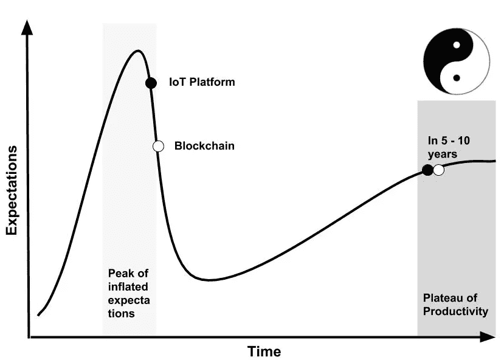****

****Adapted Gartner Hype cycle with IoT Platform and Blockchain as of July 2018\. Yin Yang symbol (describes how seemingly opposite or contrary forces may actually be complementary)****

****尽管 Gartner 不一定对技术的每一个细节都正确，但毫无疑问的是，同一研究团队在短短几年内就发展了数万亿个行业(是的，10 万亿个)🐵)****

****诚然，许多公司已经向互联网开放了他们的设备/业务。有些人将收集的数据分析和数据可视化集中到他们的价值主张上。****

****而像西门子这样的公司在某些方面更专注于工业业务，拥有自己的平台 MindSphere，该平台被称为工业物联网(IIoT)的操作系统(OS)。其他公司，如谷歌(Google Cloud)或亚马逊(Amazon)，为了更好地宣传这个市场，专门在他们庞大的云功能中添加了物联网。****

****所有这些平台都有一个共同点，那就是它们都是作为服务提供的。而西门子 MindSphere 是一个平台即服务(PaaS)——谷歌和亚马逊将基础设施即服务(IaaS)包含在他们的产品中。这意味着西门子不会有自己的服务器(数据中心~云)，而是需要与微软、亚马逊或谷歌合作。****

****物联网的特立独行的方法结合了两个最热门的话题——物联网和区块链(更好的 DLT**D**分布式**L**edger**T**技术)，因此它将是同一曲线上最热门的话题。IOTA 代表(“新经济的无许可分布式账本”)——这不是我所期待的缩写，但它很有意义😎。这里我们必须公平，IOTA 不是一个平台，而是一个协议。****

****因此，将 IOTAs 的分布式和分散式方法添加到比较中是有风险的，但我认为这是值得的，并且在与集中管理的平台进行比较时会引发很多问题和讨论。****

****目前，IOTA 事务(消息)由运行在个人服务器或云实例(VPS)上的分布式节点软件保护。因此，它既不是 IaaS 也不是 PaaS，而是通过提供节点软件、协议以及广泛的社区来促进他们的物联网愿景。****

****除了安全性、数据处理和自动化等其他方面，所有物联网解决方案都有共同点来解决扩展问题。****

# ****但是，为什么我们需要所有的扩展呢？****

****控制理论和系统识别教授强调我们在发疯之前总是应用最简单和最容易的方法(意思是在训练非线性神经网络之前尝试线性识别系统)。这里转化为我们的用例，不一定从大数据方法开始😅。我们将开发的用例(产品)是在只编写一个设备的时候，我们可以用非常简单的不可扩展的方式实现它。我们知道，如果没有其他 9.999 设备，我们将无法进行大数据诊断，而这是对商业案例的真正价值贡献。****

****为了了解物联网平台的优势及其缺点，我们为我们的产品定义了一个业务案例(用例)，以了解价值主张如何随着这些功能的增加而发展。****

*   ******用例**:我们连接到物联网“平台”的产品。****
*   ******商业案例**:如何利用这个连接到云的产品/服务赚钱？****
*   ******价值主张**:客户有什么好处？****

# ****参考架构****

****为了构建我们的方法并使用相同的措辞，我们遵循由[应用系统架构研究所推出的物联网系统参考架构。](http://www.iaas.uni-stuttgart.de/RUS-data/INPROC-2016-48%20-%20Comparison%20of%20IoT%20Platform%20Architectures.pdf)****

****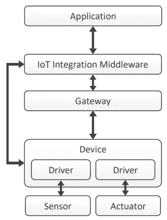****

****IoT reference architecture****

****每个平台都有自己的术语，可以映射到这个简单的概述中。****

# ****使用案例****

****每个人都需要一个便携式环境传感设备，它能告诉你在家里、工作时或通勤时你呼吸的是哪种空气，以及你所处的其他影响健康的环境。****

## ****原型****

*   ******传感器**(颗粒物——SDS 011pm 2.5 和 PM10，湿度和温度)****
*   ******装置**:树莓 Pi 3b+****
*   ******驱动** : USB 连接(数字)，GPIO 连接(模拟)****
*   ******网关**:树莓 Pi 3b+ — WiFi 模块****
*   ******物联网集成中间件**:物联网平台(Google IoT，AWS IoT MindSphere，“IOTA”不是中间件，而是协议和分布式网络)****
*   ******应用:可视化**:度量、时间序列..、**通知:**当条件不健康时通知、**自动化:**支持用于控制{例如加热、空气……}的 API、**手动事件输入**:用户可以或应该记录何时生病或其他指标、**分析:**基于大数据非线性系统识别的诊断👍****

## ****用例假设****

*   ******消息大小** : 20 个字(每个字大约 5 个字符的列)****

> ****20 个字* 5 个字符/字= 100 个字符~ 100 个字节~ 0，0001 MB****

****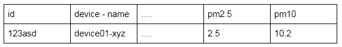****

****Table representation of the telemetry message (device — message)****

*   ******消息频率** : 20 条消息/小时****

****这将导致每台设备每年接收大约 18 MB 的数据****

> ****20*24*100*365 =每台设备每年 17,52 MB****

****随着我们的产品越来越受欢迎，我们会考虑****

> ****1，000 个设备~17，52 GB /年****
> 
> ****10.000 个设备~ 175.2 GB/年。****

****如果我们不丢弃这些数据(当然不会),假设我们在 3 年内获得了大约 300 GB 的数据(10.000 台设备增加)****

## ****商业案例假设****

****只是为了简单起见(我们想比较平台，而不是商业案例)，我们只提供可视化和分析。****

****设备本身可以通过开源指令组装，也可以由第三方购买。****

*   ****免费使用应用程序(仅可视化和警报)[0 欧元]****
*   ****基于数据分析(所有用户设备及其个人输入)为您提供健康建议的许可版本。[20 欧元/年]****

****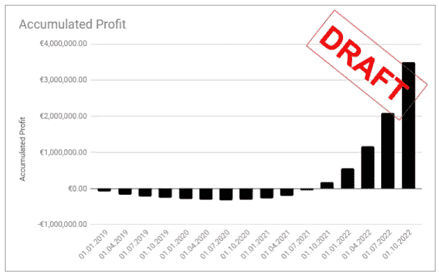****

*****Draft of profit accumulation for our business plan (needs updating for the IoT AEP costs)*****

## ****价值主张假设****

> ****我们真的不知道一天中我们在呼吸什么。当然，我们个人不知道它如何影响我们自己的健康。****

****价值****

*   ****持续的环境测量和记录个人健康事件的可能性。****
*   ****从基本避免某些级别获得建议(基于提供的大数据分析)以补充或应对措施。****
*   ****个人建议——例如，分析你的下一个公寓或房子，以确保它不会影响你的健康。****

****对于物联网平台的比较，这是一个很长的介绍。但是我想为了比较这些解决方案，我们需要一个端到端的使用案例。仅仅比较数据存储的价格是不够的。****

# ****里程碑和关键绩效指标****

****为了能够比较这些平台，我们引入了部分(里程碑)和一些比较指标。****

## ****关键绩效指标****

*   ****K1:持续运行解决方案的成本(€/年，€/用户)****
*   ****K2:维护费用(€/年，€/用户)****
*   ****K3:实现的复杂性(困难=1，可以= 2，简单&简单=3)****
*   ****K4:文件质量(无=1，部分=2，更多=3)****
*   ****K5:现成的功能(少数=1，一些黑客=2，全部都在=3)****

## ****里程碑****

****这是一个原型，我们在可能的情况下使用 javacript(node . js ),即使这样不太合适。****

****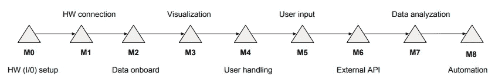****

****Milestones****

*   ****M0:硬件设置(都一样)。****
*   ****M1:硬件连接(Raspberry Pi 及其传感器)。****

> ****可用库的最简单实现。没有硬件串行编码或嵌入式 C 编程(在 MindSphere 的情况下，这可能是原型所必需的😅node.js lib 尚未公开发布)****

*   ****M2:入职传感器(数据)。****

> ****最简单的设备入门。更多设备的 onboarding 展望(用户注册时自动 onboarding)****

*   ****M3:数据的可视化。****

> ****可视化(现成可用)****

*   ****M4:用户可视化和事件处理(阈值)。****

> ****用户拥有设备可视化和事件处理功能(现成可用)。****

*   ****M5:事件或手动情况下的用户输入。****

> ****用户输入以丰富来自设备的事件数据。最容易实现。移动输入的前景。****

*   ****M6:整合外部数据来源。****

> ****添加外部 API 可用传感数据，例如 API 调用专用 GPS 坐标，并添加它们以丰富数据质量。****

*   ****M7:数据分析(空气质量与自身健康的其他因素的相关性)。****

> ****我们没有大数据，但我们提供数据，并检查这些数据的渗透难度(自动或手动)。用于识别疾病和各种输入之间的相关性的机器学习。****

*   ****M8:自动化(向致动器发送命令)****

> ****关闭反馈回路(例如，当事件发生时，使中央加热致动器自动化)。执行器控制。****

# ****可能的非物联网 AEP 实施(无意义实施)—仅适用于概念****

****只需让 ***pi*** 成为服务器——在树莓 ***pi*** 上安装 LAMP (Linux Apache My-SQL PHP)并提供静态 IP 或进行 IP 转发，这样就可以通过 HTML 查看数据。****

****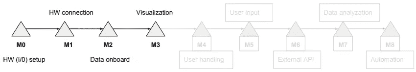****

****Milestones M0 — M3 implemented****

> ****嗯。这可能适用于我们的原型和仅有的一个设备，但即使在那里，你也需要不时地更新灯堆栈以保持安全。****

****你可以在你的后端添加一个 API(应用程序编程接口),它允许一个更强大的服务器从所有设备收集数据。****

> ****Mhhh 这可能行得通，但在扩展您的数据时，仍然需要对设备进行大量的手动管理——服务器也需要扩展，我们甚至还没有谈到要为数据交换实施的安全性以及维护自己的数据中心的成本……****

****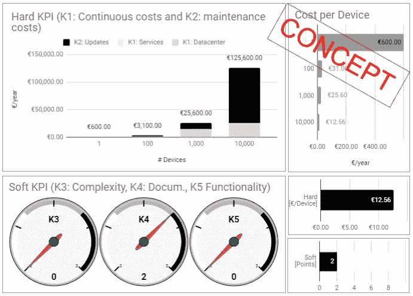****

****completely out of the blue fictitious values — only for conceptual flow****

****该实施具有持续的高成本，如能源、采购、发票等。对于用户和数据采集器。数据服务器需要空间和冷却 **K1** *。*高维护成本，包括设备堆栈升级以保持设备高度安全，以及在扩展 **K2** 时持续更新和升级服务器。该设备以及数据收集器的设置非常复杂。活动包括为每个必要的功能创建自己的解决方案 **K3** 。积极的一面是，你会发现许多不同功能的教程和最佳实践(但不一定知道它们是否仍然安全) **K4** 。说到开箱即用的服务，它就是您的全部。从定义服务器硬件、设置操作系统和安装完整的堆栈，到前端和后端 **K5 编程。******

*****让我们从设置硬件开始。*****

# ****M0 —硬件设置****

*****如果你对硬件方面不感兴趣，你可以直接切换到* [***第二部分***](/@bertrand.jan/tell-me-more-internet-of-things-part-2-google-cloud-iot-cost-and-value-comparison-38bfb20d94e1)*——我们从谷歌物联网的物联网平台起步。*****

****我们需要在我们的设备中读取我们的传感器( ***pi*** )。我们的模拟测量直接连接到 raspberry 提供的模拟输入/输出(IOs)。这种测量是连续的，我们不需要考虑任何间隔，因为设备的寿命不依赖于测量周期的管理。****

****颗粒物(PM)传感器通过 USB 连接，如果连续运行(60 meas ),其寿命约为 8000 小时。/min) —不到一年。****

****我们希望每 3 分钟查询一次传感器。大约 5 秒钟，以获得有效的测量点。****

# ****物料清单(BoM)****

****原型产品 BoM:****

*   ****树莓 Pi 3b+****
*   ****Micro SD 卡 16GB****
*   ****传感器 1: SDS011****
*   ****传感器 2: HD011****

****组件组装和开发工具****

*   ****键盘和鼠标—用于连接 Raspberry(一次性)。****
*   ****HDMI 线缆—用于将覆盆子连接到电视(一次性)。****
*   ****笔记本电脑——用于远程访问 raspberry)和开发。****

****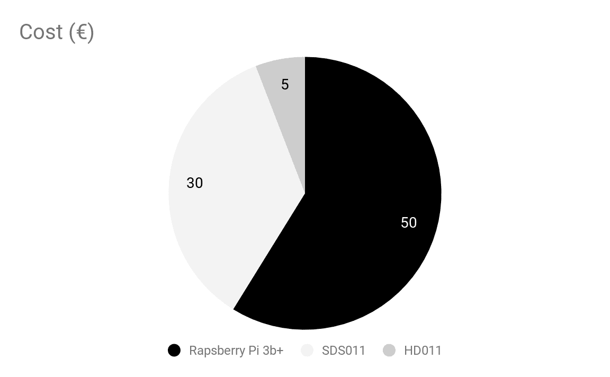****

*****Material cost break down of the prototype (that is all way too expensive — i know)*****

# ****设置覆盆子并连接传感器****

****如果您有一个运行中的 ***pi*** 带`node.js` 8*、`npm` 6*和`git`，请跳过此步骤****

****有大量的教程来设置树莓，包括传感器。****

****最后，硬件应该如下图所示，您应该能够从您的笔记本电脑通过 PuTTY(在 windows 上)或 SSH(在 linux 上)远程连接到 raspberry pi。****

****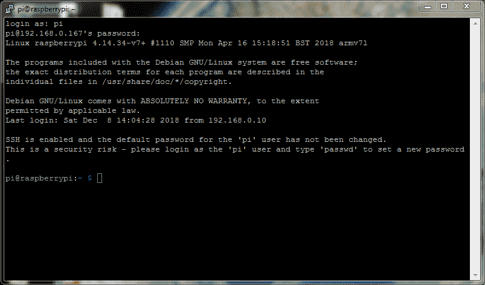****

*****My device remotely reachable on IP 192.16.0.167 and Port: 22\. The devices default user: pi and password: raspberry*****

****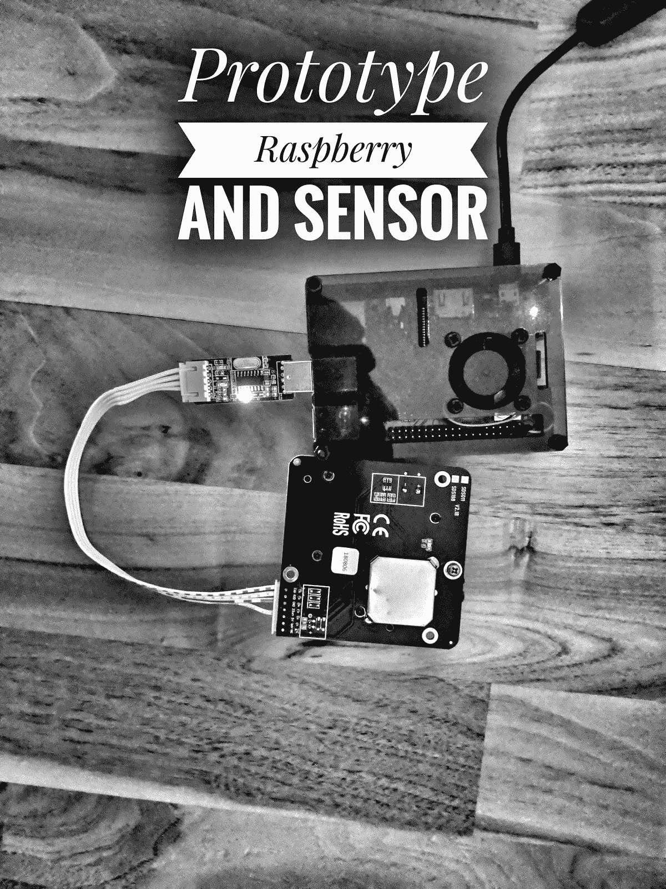****

*****USB connected SDS011 sensor to the Raspberry (no humidity or temperature connected)*****

****一旦您远程连接到您的 ***pi*** 的命令行(shell ),我们就可以开始安装开发所需的软件和软件包了。****

****如前所述，我们将尝试使用 javascript(前端和后端)。****

****该项目使用 node.js 版本(后端 javascript 编程)8 和版本 6 中的软件包管理器(node 的软件包)npm。****

```
**pi@raspberrypi:~ $ **node -v**
V8.12.0
pi@raspberrypi:~ $ **npm -v**
6.4.1**
```

****为了在一个 pi 上安装 node，我做了一些 bash 管道——意思是直接从互联网上执行一个脚本(**curl***location-of-script-in-the-internet*|*(hand-it-over)*bash)。实际上，出于安全原因，最好在执行脚本之前先查看一下它！****

```
**~ $ curl -sL [https://deb.nodesource.com/setup_8.x](https://deb.nodesource.com/setup_8.x) | sudo -E bash 
~ $ sudo apt-get install -y nodejs**
```

****这样，我们应该让 pi 上的节点和包管理器 npm 运行。此外，我们使用[github.com](https://github.com/)来存储和提取用于不同物联网平台的不同自创或改编程序代码。****

****以下命令将 gits CLI(命令行界面)安装到您的 ***pi*******

```
**pi@raspberrypi:~ $ **sudo apt-get install git****
```

# ****取回信号****

****我们的颗粒物质传感器连接到 USB 端口，但应该还没有激活。让我们用`dmesg`检查连接端口，发现我们的传感器连接在`ttyUSB0`上****

```
**pi@raspberrypi:~ $ **dmesg | grep ttyUSB**
[544416.775421] usb 1–1.1.2: ch341-uart converter now attached to ttyUSB0**
```

****我们可能会研究 UART 通信协议的规范，并实现我们自己的串行驱动程序。[https://nettigo.pl/attachments/398](https://nettigo.pl/attachments/398)****

****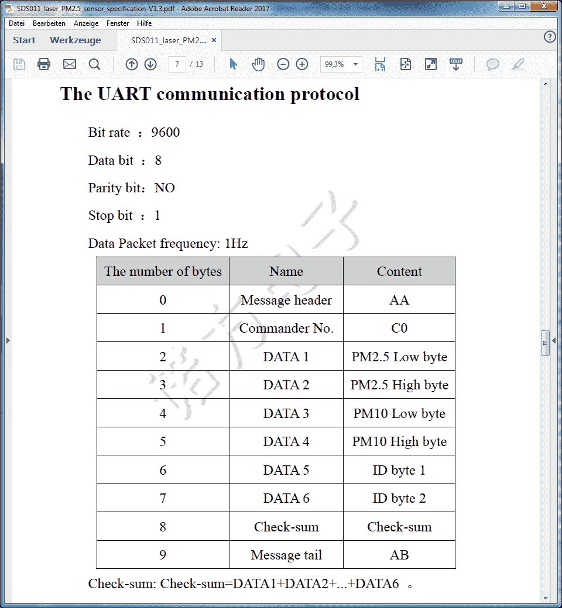****

****UART COM protocol****

****但是我们也可以使用其他人的作品****

****[https://www.npmjs.com/package/sds011-client](https://www.npmjs.com/package/sds011-client)****

****在安装这个包之前，让我们设置我们的项目文件夹`tmmiot`，创建一个`tests`子文件夹，创建一个文件`index.js`用于读取传感器数据并将它们写入控制台。****

```
**~$ **mkdir tmmiot && mkdir tmmiot/tests && cd tmmiot/tests**
~/tmmiot/tests $ npm init -y**
```

****这将创建一个新文件 package.json，您可以使用****

```
**pi@raspberrypi: ~/tmmiot/tests $ **nano package.json****
```

****现在，我们可以将提供与传感器通信命令的包添加到包依赖项中。****

```
**pi@raspberrypi: ~/tmmiot/tests $ **npm i sds011-client -save****
```

****这将把包中所有必要的文件安装到子文件夹`node_modules` **。我们的`package.json`文件现在看起来像这样——添加了依赖项。******

```
**{
 "name”: "tests",
 "version": "1.0.0",
 "description": "",
 "main": "index.js",
 "scripts": {
 "test": "echo \"Error: no test specified\" && exit 1"
 },
 "keywords": [],
 "author": "",
 "license": "ISC",
 "dependencies": {
 "sds011-client": "^0.0.1"
 }
}**
```

****查看这个包的 github 页面，我们可以使用这些简单的命令来查看控制台上的读数。让我们打开`index.js`文件并编写测试代码。****

```
**pi@raspberrypi: ~/tmmiot/tests $ **nano index.js****
```

****在`index.js`编辑器中粘贴以下代码。****

****执行脚本后，我们每秒钟都会在控制台上看到一个新的读数。你可以把频率改为 1 分钟。例如`sensor.setWorkingPeriod(1)`****

```
**pi@raspberrypi: ~/tmmiot/tests $ **node index.js****
```

****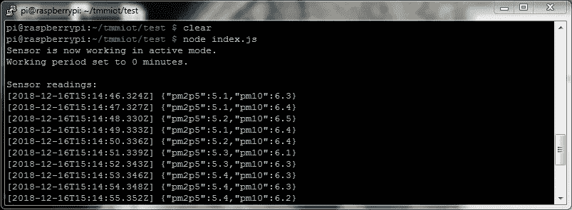****

****Output of the sensor data with 1 sec. sample rate****

> ****故障排除:您的 **pi** 用户需要有权访问群组`tty`****

```
**[@raspberrypi](http://twitter.com/raspberrypi):~/tmmiot/test $ **groups**
pi adm dialout cdrom sudo audio video plugdev games users input netdev gpio i2c spi**
```

> ****如果是这样，你需要将自己加入`tty`组****

```
**pi@raspberrypi:~/tmmiot/test $ sudo usermod -a -G tty pi**
```

> ****注销`~*$* exit`并添加新组。****

> ****恭喜你已经掌握了 PM 传感器的硬件设置。湿度和温度传感器只是为了你自己的探索😃****

****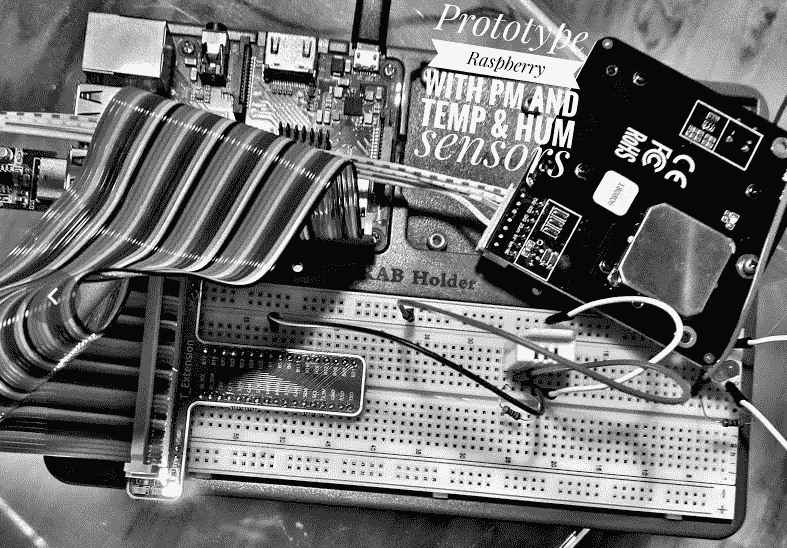****

****Adding the humidity and temperature sensor DHT22 (all installed on a development board sunfounder super kit)****

****下一个是。 [**第二部分**](/@bertrand.jan/tell-me-more-internet-of-things-part-2-google-cloud-iot-cost-and-value-comparison-38bfb20d94e1)****

****我喜欢你的评论、更正和建议👌。****

****[](http://bit.ly/2G71Sp7)****

> ****[直接在您的收件箱中获得最佳软件交易](https://coincodecap.com/?utm_source=coinmonks)****

****[](https://coincodecap.com/?utm_source=coinmonks)****