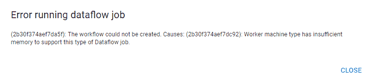
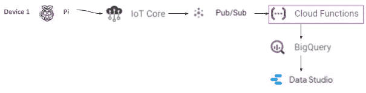

# 告诉我更多物联网信息—第 2 部分—谷歌云物联网成本和价值比较

> 原文：<https://medium.com/coinmonks/tell-me-more-internet-of-things-part-2-google-cloud-iot-cost-and-value-comparison-38bfb20d94e1?source=collection_archive---------2----------------------->

## 谷歌云物联网-入职、数据存储和可视化。如何将您的设备连接到谷歌云物联网，并将摄取的数据传输到数据库进行存储、可视化和分析。

[Part 1](/@bertrand.jan/tell-me-more-internet-of-things-part-1-iot-platform-cost-and-value-comparison-558ce8966767)**|**[**Part 2**](/coinmonks/tell-me-more-internet-of-things-part-2-google-cloud-iot-cost-and-value-comparison-38bfb20d94e1)**|*[Part 3](/@bertrand.jan/tell-me-more-internet-of-things-part-3-mindsphere-cost-and-value-comparison-b333ebfb872a)*|*|[Part 4](/@bertrand.jan/tell-me-more-internet-of-things-part-4-iota-cost-and-value-comparison-381008495d1d)*|*|[Part 5](/@bertrand.jan/tell-me-more-internet-of-things-part-5-google-cloud-user-handling-ae285e7e34b2)***|*[Part 6](/@bertrand.jan/tell-me-more-internet-of-things-part-6-google-cloud-user-input-push-subscription-aa39ebc4a348)*|…| Part n****

***在本系列的 [**第 1 部分**](/@bertrand.jan/tell-me-more-internet-of-things-part-1-iot-platform-cost-and-value-comparison-558ce8966767) 中，我解释了我们打算如何基于特定的使用、业务案例及其价值主张来比较物联网平台。我们定义了项目的范围和规模，并完成了传感器的硬件设置。***

******

***该部分的目标是将传感器数据连续存储在可扩展的数据库中，以便进行可视化和数据分析。在谷歌云服务中，有多种方法可以实现这一点。我主要遵循这些教程:***

*   ***[利用云物联网核心进行实时数据处理](https://cloud.google.com/community/tutorials/cloud-iot-rtdp)***
*   ***[使用谷歌云物联网核心和 MongooseOS 建立气象站](/google-cloud/build-a-weather-station-using-google-cloud-iot-core-and-mongooseos-7a78b69822c5)***

***我们开始实施一个基于 Goolge Cloud 提供的标准服务的可扩展解决方案。之后，我们用云函数替换云流引擎，以增加底层服务的透明度，并比较受限的可扩展版本(它甚至可以免费运行于少数设备和原型)***

## ***实施情况和结果概述***

******

***Implemented (costs estimated) solution***

***该设备通过 node.js MQTT(消息队列遥测传输)代理装载。使用 RSA 公钥/私钥加密—物联网核心，因为设备注册表保存了设备的公钥，用于加密通信 **M2** 。从那里，我们使用发布/订阅来收集数据，并通过云流/云函数将它拉至我们的数据库(大查询)。可视化是在数据工作室 **M3** 的帮助下实现的***

******

***State of implementation (M0 — M3)***

***对于当前没有用户、只有设备接收数据的实施，物联网核心成本最高，其次是云功能的计算成本。接收的消息最少 1024 字节。这就是我们较高的净接收量的原因(因为我们的消息大约有 100 字节，MQTT 开销稍多一点)。每台设备的成本随着设备的增加而增加，原型是免费的 **K1** 。服务价格包括维护和更新基础设施以及保证它们的安全。***

***在软件方面，通过 MQTT node.js 库实现设备代理相对容易，并且存在各种入门教程 **K3** 。设备管理(物联网核心)解释得很好。有足够的文档可用，但是对于数据的可视化来说，它的服务组合相当复杂。**直接从浏览器进入云外壳的可能性以及针对不同服务的可用逐步教程是很棒的 K4。**所有实施的里程碑( **M1-M3** )都提供了开箱即用的各种不同的可能服务，包括通过 K5 数据工作室**的可视化。**除了所有这些优点(你现在已经知道我已经接近粉丝了)，定义数据存储或处理位置的无限可能性使该平台适合 IP(知识产权)、ECC(出口管制分类)和其他可能的责任。另一方面，这种自由选择增加了实现的复杂性。***

******

***Google Cloud estimated costs running with Cloud Function.***

***我已经为此实现创建了一个[配置器](https://tell-me-more-iot.appspot.com)，您可以使用它来研究我是如何得出不同服务的成本的。输入有***

*   *****量器** *(本例:1；100;1000;10.000)****
*   *****消息大小** *(本例:100 字节)****
*   *****消息频率** *(我们的情况是:每台设备每分钟 20 条消息)****

***[](https://tell-me-more-iot.appspot.com/books/5634472569470976) [## 谷歌云平台上的谷歌云物联网配置器- Node.js

### 服务成本细目

tell-me-more-iot.appspot.com](https://tell-me-more-iot.appspot.com/books/5634472569470976) 

Screen of my cost configuration app (naturally running on Google Cloud App engine)

当然还有官方的更复杂的成本估算器——有更多的功能和服务。[https://cloud.google.com/pricing/](https://cloud.google.com/pricing/)

在此第 2 部分实施(M0-M3)中，**尚未包括**:**用户管理—** 个人可视化和事件建议。**高效的数据存储**方便用户快速查询。**为用户提供自动化数据分析**。

# 高度可扩展的实施

该解决方案基于设备上的

1.  **物联网核心**。这里，设备通过设备所有者提供的公钥/私钥(非对称加密)进行注册。*我们只将数据从设备发送到谷歌云物联网核心。设备管理器可以做更多事情，例如更新设备配置(包括回滚等。)*
2.  该设备运行 node.js 程序，通过 **MQTT** (消息队列遥测传输)协议将传感器数据发送到注册表。
3.  从那里，我们在 **Pub/Sub** 中为这个注册中心创建一个订阅。
4.  **数据流**用于从该订阅中获取数据，并将其永久存储到数据库 BigQuery 中。
5.  **BigQuery** 保存存储模式，可通过 API 或 Data Studio 查询
6.  **Data Studio** 用于可视化、报告和手动分析。

你可能会问自己，为什么我需要这么多服务来可视化和查询数据？我们在同一条船上——让我们一起找出答案。


*Overview of Google cloud services used in this article for the project*

这种实现仍然不提供

1.  用户管理—个人可视化和事件建议。
2.  高效的数据存储，方便用户快速查询。
3.  面向用户的自动化数据分析。

如果你喜欢自己尝试，请给自己一个免费的谷歌云服务。有一个大约 200 美元的 1 年免费试用。此外，也有某些总是自由的限制。

在 Google Cloud 中，我们可以通过项目标识来区分不同的项目。他们有自己的资源、账单和分析。我们定义了一个新的谷歌云项目。我的项目名称(项目 id)是`tell-me-more-iot`。这是一个唯一的全局标识符，您需要自己选择一个。


*Creating a new project in Google Cloud (project id: tell-me-more-iot)*

也许这里有一个新的概览图(在这个 GUI 中有相当多的功能)


*Some overview for the complex, extensive dashboard of google cloud*

# 谷歌物联网核心和发布/订阅

有一个很好的快速入门教程可用于基础入门(甚至是计算实例的虚拟入门——如果你手头没有 pi 或运行 linux 的笔记本电脑)

我们介绍了通过 GUI(图形用户界面)和命令行创建注册表和设备的两种可能性。为此，我展示了两种方法，以后你可以自己决定如何进步

## 使用图形用户界面


Creating a IoT Core Registry (and with that a topic for the Pub/Sub)


*Creating the topic for the Pub/Sub during IoT Core registry creation*

我们选择了以下名称:

> PROJECT _ ID = " tell-me-more-IOT "
> TOPIC _ ID = " tmmiot-TOPIC-1 "
> TOPIC _ PATH = " projects/tell-me-more-IOT/topics/"
> REGISTRY _ ID = " tmmiot-REGISTRY-1 "
> REGION = " Europe-west 1 "

## 通过云 Shell 使用命令行

云外壳(终端)是一个短暂的 linux debian 实例，带有预先配置的软件。您可以使用必要的软件定义自己的 docker 配置文件(一旦 cloud shell 打开，就应该部署的映像)。但它已经有了 git、node.js，当然还有 g Cloud——Google Cloud 整个服务组合的 CLI(命令行输入)。

执行 gcloud 命令会导致

```
@cloudshell:~ (tell-me-more-iot)$ 
**gcloud iot registries create****ERROR**: (gcloud.iot.registries.create) argument (**REGISTRY** : — region=REGION): Must be specified.
For detailed information on this command and its flags, **run**:
 gcloud iot registries create — help
```

我们可以进一步参考帮助，或者您只需使用

```
@cloudshell:~ (tell-me-more-iot)$ 
**mkdir scripts
touch createIoT-1.sh
chmod +x createIoT-1.sh
nano createIoT-1.sh**
```

复制并粘贴下面的代码(`mkdir`创建一个新的文件夹脚本，`touch`创建一个名为 createIoT-1.sh(我们的 shell 脚本)的新文件。`chmod +x`赋予文件被执行的权利。`nano`是一个命令行编辑器/或者您可以使用谷歌的基于网络的云编辑器。)

```
#!/bin/bash
PROJECT_ID=”tell-me-more-iot”
TOPIC_ID=”tmmiot-topic-1"
TOPIC_PATH=”projects/tell-me-more-iot/topics/”
REGISTRY_ID=”tmmiot-registry-1"
REGION=”europe-west1"
gcloud config set project $PROJECT_ID
gcloud pubsub topics create $TOPIC_ID
gcloud iot registries create $REGISTRY_ID \
 — region=$REGION \
 — no-enable-http-config \
 — enable-mqtt-config \
 — event-notification-config=topic=$TOPIC_ID
```

然后使用以下命令执行 shell 脚本

```
@cloudshell:~ (tell-me-more-iot)$ 
**./createIoT-1.sh**
```


*Creating the registry and sub/pub topic via CLI*

此刻没有那么多事情发生，因为我们没有向注册表发送任何东西，也没有定义设备(注册表中我们的 ***pi*** 的表示)

让我们开始准备将传感器数据发送到注册表。


*Status of the implementation*

# 准备将数据发送到云注册设备的设备

> 回到码头。

我们为 MQTT 客户机软件创建了一个文件夹

```
@raspberry: ~ $ 
**mkdir tmmiot && cd tmmiot**
```

提取专用的 client node.js 脚本(基于这个[广泛的示例库](https://github.com/GoogleCloudPlatform/nodejs-docs-samples)

```
@raspberry: ~/tmmiot/ $ 
**git clone** [**https://github.com/jhab82/tellMeMoreIoT-MQTTclient**](https://github.com/jhab82/tellMeMoreIoT-MQTTclient)
```

一旦下载完成，我们需要在脚本中安装并替换传感器的 USB 端口名`ttyUSB0`(参见**第 1 部分**

```
@raspberry: ~/tmmiot/tellMeMoreIoT-MQTTclient/ $ 
**npm install**
```

该程序将运行，但会崩溃，要求一个我们需要创建的私钥文件。

*   **私钥**——解密消息(由我们的设备创建和拥有)
*   **公钥** —能够加密消息(由我们的设备创建，并与我们的物联网核心注册设备共享)

根据本[教程](https://cloud.google.com/iot/docs/how-tos/credentials/keys)，我们的设备需要签署一个 JSON Web 令牌(JWT ),该令牌将被发送到物联网核心用于**身份证明。**此外，我们使用 X.509 证书，该证书默认在 30 天后到期，您可以添加`-days 100000`以便有更多时间进行设备注册。

```
@raspberry: ~/tmmiot/tellMeMoreIoT-MQTTclient/ $ 
**openssl req -x509 -newkey rsa:2048 -keyout rsa_private.pem -nodes -out rsa_cert.pem -subj "/CN=unused"**
```

已经创建了两个文件。`rsa_private.pem` 留在原处，不会与任何人或任何东西共享。我们现在应该将`rsa_cert.pem`复制到我们的注册表中。

## 通过图形用户界面使用设备


*Adding the device and to the IoT registry and handing over the public key (this public key was generated on our pi — only for visual aid I have created here with the consol)*

我们导航到我们的`tmmiot-registy-1`并单击 create，填写必要的信息，包括将我们的 **RS256_X509** 证书粘贴到公钥值字段中(d *别忘了添加设备)。*我们现在已经准备好与云进行安全通信。

## 将数据发送到云注册中心专用设备

> 回到码头

是时候把传感器数据带到云端了。在您能够启动代理(或客户机启动和数据发送)之前，您需要更改一些变量以适应您在`mqtt-agent.js`中的项目。

```
var argv = { projectId: “**tell-me-more-iot**”,
 cloudRegion: “**europe-west1**”,
 registryId: “**tmmiot-registry**”,
 deviceId: “**tmmiot-device-1**”,
 privateKeyFile: “rsa_private.pem”,
 tokenExpMins: 20,
 numMessages: 10,
 algorithm: “RS256”,
 mqttBridgePort: 443,
 mqttBridgeHostname: “mqtt.googleapis.com”,
 messageType: “events”,
 };
```

我改编了由 [Google](https://github.com/GoogleCloudPlatform/nodejs-docs-samples/tree/master/iot/mqtt_example) 提供的 node.js MQTT 客户端示例。客户端每 3 分钟运行一次。并查询传感器，然后运行 2-3 秒并产生一个测量点，该测量点以 JSON 格式的字符串发送到 Google cloud registry。每 20 分钟一次。JSON web 令牌得到更新。我们发送的数据是 JSON 格式的，如下所示:

```
{“id”:”tmmiot-device-1",”time”:1544729995403,”date”:”2018–12–13T19:39:55.403Z”,”pm2p5":5,”pm10":6.8}
```

使用以下方式运行客户端:

```
@raspberry: ~/tmmiot/tellMeMoreIoT-MQTTclient/ $ 
**node mqtt-agent.js**
```

或者使用 nohup 命令在后台运行程序(即使您关闭了终端)

```
@raspberry: ~/tmmiot/tellMeMoreIoT-MQTTclient/ $ 
**nohup node mqtt-agent.js > out.log 2>&1 &**
```


IoT Core registry and first heartbeat and data received from the device

## 创建主题订阅

为了接收或处理数据，我们需要订阅发布/订阅主题。

```
@cloudshell:~ (tell-me-more-iot)$
**gcloud pubsub subscriptions create tmmiot-subscription 
-topic=tmmiot-topic-1**
```


Pulled sensor data by command line on Cloud Shell

订阅将在主题被请求(拉)时发送消息，并将消息保留 7 天(此持续时间可以是有限的或延长的)。一旦消息被接收并得到确认，它就不再存在于主题/注册表中。

由于我们已经向主题发送了一些传感器数据，并且有了订阅，我们可以拉取(请求数据)—拉取不会以任何定义的顺序传递消息。下面的代码只是提取一条消息并确认它。

```
@cloudshell:~ (tell-me-more-iot)$ 
**gcloud pubsub subscriptions pull -auto-ack tmmiot-subscription**
```


*Status of the implementation*

***pi*** 通宵运行，我们可以在注册表中看到对设备的监控


*Monitoring of the device registry in Google IoT — Bytes received peaks at 640B every 20min (JSON web token renewal) and around 128B for the message every 3 min.*

# 将订阅数据流式传输到 BigQuery

将数据从发布/订阅流传输到 BigQuery 数据库是非常容易的。

Google Cloud Flow 函数运行一个模板 Java 应用程序，该应用程序将所有 JSON 格式的字符串数据流式传输到一个具有等效模式的预定义 BigQuery 数据库中。我们发送的数据需要如下所示的数据库

```
{“id”:”tmmiot-device-1",”time”:1544729995403,”date”:”2018–12–13T19:39:55.403Z”,”pm2p5":5,”pm10":6.8}
```


Database schema represented by a simple table

## 创建大查询数据库

让我们使用命令行来创建数据库并添加我们的模式。首先，我们需要定义一个 JSON 格式的文件`tmmiot_table_schema.json`，并将其存储在我们的 cloudshell 中。

```
[
 {
 “description”: “device-id”,
 “name”: “id”,
 “type”: “STRING”,
 “mode”: “NULLABLE”
 },
 {
 “description”: “Measurement time”,
 “name”: “time”,
 “type”: “STRING”,
 “mode”: “NULLABLE”
 },
 {
 “description”: “Measurement date”,
 “name”: “date”,
 “type”: “STRING”,
 “mode”: “NULLABLE”
 },
 {
 “description”: “Sensor 1”,
 “name”: “pm2p5”,
 “type”: “STRING”,
 “mode”: “NULLABLE”
 },
 {
 “description”: “Sensor 2”,
 “name”: “pm10”,
 “type”: “STRING”,
 “mode”: “NULLABLE”
 }
]
```

创建数据集`tmmiot_dataset`

```
@cloudshell:~ 
**bq mk — dataset tell-me-more-iot:tmmiot_dataset**
```

然后，我们用 JSON 格式的模式向数据集添加一个表`tmmiot_table`

> bq mk —表[项目标识]:[数据集]。[表格][模式文件的路径]

```
@cloudshell:~ 
**bq mk -table tell-me-more-iot:tmmiot_dataset.tmmiot_table tmmiot_table_schema.json**
```

*提示:与之前的 CLI 不同，我们不会使用****g cloud****作为命令，而是使用* ***bq*** *。*


*BigQuery dataset with table and schema*

## 为 BigQuery 创建云流

> **请在测试后删除数据流作业，因为这项服务是为高性能而设计的，而且随着时间的推移会让你花钱**

我们的传感器数据仍然没有被永久记录。订阅只能保存 7 天的遥测事件数据。我们希望永久存储数据和最简单且高度可扩展的解决方案——我们使用来自 Google Cloud Flow 的[模板。](https://cloud.google.com/dataflow/docs/guides/templates/provided-templates#cloudpubsubtobigquery)

为了使用 cloud flow，我们需要首先定义一个用于存储临时文件的数据桶。

*提示:这里我们使用**`***gsutil***`**来创建和访问 google cloud 的存储功能，这些功能是以桶的形式组织的。您当然可以再次使用 GUI。***

> **gsutil m B- p[项目名称]-c[存储类别]-l[存储桶位置]GS://[存储桶名称]/**

```
**@cloudshell:~ 
**gsutil mb -p tell-me-more-iot gs://tmmiot_bucket_1****
```

**要创建一个子文件夹，我们需要将`cp`文件复制到子目录中。**

```
**@cloudshell:~ 
**touch tmp_test
gsutil cp tmp_test gs://tmmiot_bucket_1/tmp/****
```

**当然，这也可以通过 GUI 来实现**

***提示:我们已经创建了存储，但还没有考虑存储位置。如果你需要你的数据在一个特定的地方，你需要指定***

****

**Further we open the Dataflow GUI and create a new job**

**此外，我们打开 Dataflow GUI 并创建一个新作业。作业名称`tmmiot-dataflow`和云数据流模板:**云发布/订阅 BigQuery****

> **作业名称: **tmmiot-dataflow** 云数据流模板:**Cloud Pub/Sub to big query** 区域端点:**Europe-west 1** Cloud Pub/Sub 输入主题:**projects/tell-me-more-IOT/topics/tmmiot-topic-1** big query 输出表:**tell-me-more-IOT:tmmiot _ dataset . tmmiot _ table** 临时位置:)**
> 
> **提示:n1-standard-1 是能够用于此模板的最小机器(我们尝试了 f1-micro，但出现了下一个错误)。如果不移交最大工作线程和机器类型，默认情况下将有 4 个工作线程和 n1 个标准 4(4 个 vCPUs 和 15GB RAM)。**

****

***Error when trying to use a f1-micro compute engine as the data flow engine***

****

***Creation of the dataflow job and view of the compute instance where the job is running***

****

***Dataflow overview with resource metrics***

****

***Querying the database after 9 min data flow running***

> **提示:数据流作业只能停止，不能完全删除。该作业将显示在概览中。例如，如果您输入了存储段名称，则作业会失败，并将保留在概览中。由于我已经在一夜之间将数据输入到主题(Pub/Sub)中，所以我会假设将所有未确认的消息都推入数据库中。但在等待 9 分钟后，我们只看到三个条目，这意味着流媒体服务只考虑新消息。**

**JAVA 模板[源代码声明](https://github.com/GoogleCloudPlatform/DataflowTemplates/blob/master/src/main/java/com/google/cloud/teleport/templates/PubSubToBigQuery.java)**

```
**/** * The {@link PubSubToBigQuery} pipeline is a streaming pipeline which ingests data in JSON format * from Cloud Pub/Sub, executes a UDF, and outputs the resulting records to BigQuery. Any errors * which occur in the transformation of the data or execution of the UDF will be output to a * separate errors table in BigQuery. The errors table will be created if it does not exist prior to * execution. Both output and error tables are specified by the user as template parameters.**
```

> **提示:这个流量引擎对于我们一个单独的传感器来说太大了——但是一旦你有了更多的流量，你就知道去哪里找了😄**

# **使用 Data Studio 可视化数据**

**这是实现我们故事目标的最后一步。但是在我们进入第 3 部分之前，我们将替换数据流服务，以便创建相同功能的可伸缩性较低的版本，从而实现更好的透明性，并节省一些欧元。**

**让我们尝试从我们的传感器可视化 PM10 和 PM2.5 的时间序列(因为我们只有一个设备，所以我们只做这个)。**

*   **导航到[datastudio.google.com](http://datastudio.google.com)并创建一个新报告。**
*   **将您的 BigQuery 连接到此报表**
*   **配置以文本形式读入的日期**
*   **创建新字段，将日期字符串转换为 YYYYMMDDHH 格式**

```
****TODATE**(date, ‘RFC_3339’, ‘%Y%m%d%H’)**
```

*   **将传感器数据配置为平均值(或最大值或最小值)**

****

***Create a new report with Data Studio connected to BigQuery***

****

***Visualization of sensor data in Google Cloud Studio***

****

**Overview of implementation**

## **演员表**

**离开这个运行约 26 小时后，帐单显示我约 2，50€消费。全部连接到云数据流引擎。**

****

**Screen from the billing for tell-me-more-iot project***** 

# ****用云函数替换数据流****

****让我们快速替换数据流作业(旨在处理大量遥测事件),并将其替换为可扩展性较差但部署迅速的解决方案。它的云功能。****

****云功能只是在应用程序或计算引擎帐户上使用预定义的分配内存运行。****

********

****Cloud Function setup****

> ******index.js******

```
**/**
 * Triggered from a message on a Cloud Pub/Sub topic.
 *
 * @param {!Object} event Event payload and metadata.
 * @param {!Function} callback Callback function to signal completion.
 */
exports.pubsubToBQ = (event, callback) => {
 **const** pubsubMessage = event.data;**const** BigQuery = require(‘@google-cloud/bigquery’);
 **const** bigquery = **new** BigQuery();bigquery
    .dataset("tmmiot_dataset")
    .table  ("tmmiot_table")
    .insert (JSON.parse(Buffer.from(pubsubMessage.data, 'base64').toString()), {'ignoreUnknownValues':true, 'raw':false})
    .then   ((data) => {
      console.log(`Inserted 1 rows`);
      console.log(data);
    })
    .catch(err => {
      **if** (err && err.name === 'PartialFailureError') {
        **if** (err.errors && err.errors.length > 0) {
          console.log('Insert errors:');
          err.errors.forEach(err => console.error(err));
        }
      } **else** {
        console.error('ERROR:', err);
      }
    });

  callback();
};**
```

> ******packages.json******

```
**{
 “name”: “pubsubToBigQuery”,
 “version”: “0.0.1”,
 “dependencies”: {
 “@google-cloud/bigquery”: “^.3.0”
 }
}**
```

> ****提示:如果您自己尝试，请更改数据集和表的名称****

****我们用更小的解决方案云功能取代了 Cloudflow(大数据)。****

********

****Overview of implementation****

## ****演员表****

****大约 24 小时后，云功能不再收费。只注册了 9 次调用，但是每 3 分钟可靠地执行一次函数。这是最有可能的，因为云函数是如何计算调用的。****

********

****Filtered billable services for Cloud Function after leaving it 24h running****

****我喜欢你的评论、更正和建议👌。****