# 了解更多物联网信息—第 4 部分— IOTA 成本和价值比较

> 原文：<https://medium.com/coinmonks/tell-me-more-internet-of-things-part-4-iota-cost-and-value-comparison-381008495d1d?source=collection_archive---------2----------------------->

## IOTA——如何通过 IOTA (MAM)消息将您的设备数据传输到分布式不可变的 Tangle，并可视化其内容。

[Part 1](/@bertrand.jan/tell-me-more-internet-of-things-part-1-iot-platform-cost-and-value-comparison-558ce8966767)**|**|[Part 2](/coinmonks/tell-me-more-internet-of-things-part-2-google-cloud-iot-cost-and-value-comparison-38bfb20d94e1)**|*|[Part 3](/@bertrand.jan/tell-me-more-internet-of-things-part-3-mindsphere-cost-and-value-comparison-b333ebfb872a)*|*|[**Part 4**](/@bertrand.jan/tell-me-more-internet-of-things-part-4-iota-cost-and-value-comparison-381008495d1d)*|*[Part 5](/@bertrand.jan/tell-me-more-internet-of-things-part-5-google-cloud-user-handling-ae285e7e34b2)**|[Part 6](/@bertrand.jan/tell-me-more-internet-of-things-part-6-google-cloud-user-input-push-subscription-aa39ebc4a348)*|…| Part n****

***在[第 1 部分](/@bertrand.jan/tell-me-more-internet-of-things-part-1-iot-platform-cost-and-value-comparison-558ce8966767)中，我们介绍了[第 2 部分](/coinmonks/tell-me-more-internet-of-things-part-2-google-cloud-iot-cost-and-value-comparison-38bfb20d94e1) Google IoT 和[第 3 部分](/@bertrand.jan/tell-me-more-internet-of-things-part-3-mindsphere-cost-and-value-comparison-b333ebfb872a) MindSphere 中的目标和硬件。***

***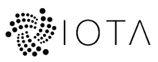***

***本文比较了 IOTA，并将其协议用于我们的特定业务/用例，并将其与所选的 IoT 平台解决方案进行比较。***

***我将测量数据发送到 Tangle (IOTA 的不可变数据库网络),并探索如何将它可视化，以用于我们的规模化、有望成功的环境传感器商业案例。每个设备的实现成本有多高，以及对用户有什么好处。请记住，当前的网络和协议正在不断发展，只有从基于互联网的架构迁移到基于网状物联网网络的架构，IOTA 的未来重要性和优势才能充分展现。此外，对于我们的用例，在我看来，无论如何，基于云的特性和基于 IOTA 的特性的组合目前会更合适。***

***当谈到区块链或在这种情况下分布式账本技术(DLT)通常是每个人都想到的加密货币。目前我们不需要这个特性。除了支持价值交易的交换(像其他加密货币一样)，IOTA 还有一些有趣的其他功能。众所周知，IOTA 支持基于零费用的零价值不可变交易。这项服务可以单独用于将所有数据装载到 IOTA 的网络中，但它不是有组织的(流式)也不是私有的。这是第二级实现，屏蔽认证消息(MAM)声明将安全可靠的数据流引入该无许可分布式分类帐。实现零费用交易的诀窍在于结束那些验证分类账的人(在其他区块链架构中称为激励性矿工)和那些在网络中执行交易的人的分离。在 IOTA 中，您是两者，如果您想要添加一个事务，您需要在您的事务得到验证之前验证另外两个事务。***

***听起来不错。让我们首先尝试为 M0-M3 里程碑实现最简单的解决方案，然后在扩展用例时探索成本。***

***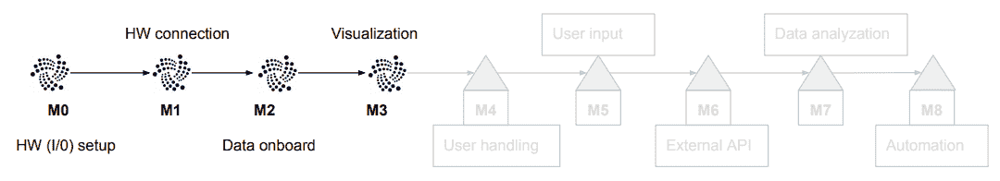***

***本文和用例的实现主要如下。***

*   ***[https://www.iota.org/](https://www.iota.org/)***
*   ***[https://www . mobile fish . com/developer/iota/iota _ quick guide _ raspi _ mam . html](https://www.mobilefish.com/developer/iota/iota_quickguide_raspi_mam.html)***
*   ***【https://discordapp.com/invite/fNGZXvh ***
*   ***[https://github.com/iotaledger](https://github.com/iotaledger)***
*   ***[https://thetangle.business/](https://thetangle.business/)***

***当然，已经有一个优秀的思想开放的社区，它提供了许多教程和概念证明(PoC)案例，尽管 IOTA 基金会还很早。我尝试实现一个基于开源免费协议的解决方案，并指出当从我们的原型向上扩展时，我们需要在哪里进行调整。***

# ***实施情况和结果概述***

***该解决方案基于***

*   ***用 MAM 发送数据。这是我们的 Raspberry Pi (RPi)的 MAM publisher 程序。MAM 对象创建和签名是在设备上完成的。***
*   ***在服务的 Permanode 上执行 tip 选择(随机查找两个需要验证的事务，作为 getTransactionToConfirm (gTTA)函数调用)以计算成本。*实际上在实现中使用 devnets full 节点作为原型(这是免费提供的)。****
*   ***将工作证明(PoW)外包给同一个完整节点。([https://devnet.thetangle.org/nodes;](https://devnet.thetangle.org/nodes;)https://powsrv.io/T2)***
*   ***通过同一个完整的节点广播它，然后将它传播给整个网络的邻居。***
*   ***使用 MAM 在部署在 google app engine 上的 web 应用程序上获取数据——MAM 接收器。***
*   ***通过谷歌图表可视化(部署在谷歌应用引擎)。***

***IOTA 生态系统的大部分库都在 github 上。这意味着我们可以使用我们的包管理器快速进入。***

***由于 IOTA 是无许可的，我们不需要在某个地方创建一个帐户或获得任何其他授权来使用该系统。事实证明，属性“无许可”是最令人兴奋的，但也是最难的属性，以确保网络安全。***

***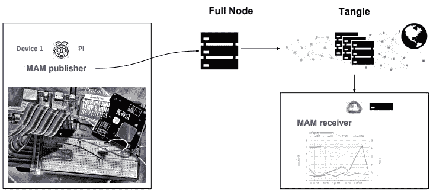***

****Overview of flow of data****

***一个更加先进和完整的真实 MAM 用例原型已经由 [Erwin Rooijakkers](/@erwinrooijakkers/gdpr-compliant-smart-meter-data-on-the-iota-tangle-four-lessons-learned-while-putting-the-dea852a5b2aa) 实现并记录下来。***

***他已经列出了当前的一些缺点，如***

*   ***您的 MAM 渠道不提供现成的安全授权。***

> ***很可能会在即将到来的 **MAM+** 版本中推出***

*   ***永久存储不可变数据的永久节点(服务)不可用。(拥有永久不变的加密存储的缺点及其对未来技术潜在利用它的影响。)***

> ***现在有一项服务处于测试阶段(价格可能会有变化)本文中的估计仅反映当前的定价表—2019 年 2 月[https://thetangle . business](https://thetangle.business)***

*   ***目前，在将消息附加到缠结之前，工作证明(PoW)(用于网络的垃圾邮件保护)的计算/能量成本相对较高。***

> ***可以使用现场可编程门阵列(FPGA)进行显著优化***

*   ***尖端选择的计算工作量。该算法对于在发出交易之前找到待确认的两个最佳提示是必要的。***

***当谈到当前相对较高的功率要求时，我们有一些由 [Atis Elsts](https://hackernoon.com/lessons-learned-from-evaluating-iota-on-internet-of-things-devices-a44575e606de) 和[微引擎](/@punpck/iota-crypto-core-fpga-1st-progress-report-caebe1dac579)提供的更近的分析。***

*****PoW 的计算工作量*****

***除了所有其他任务(尝试字节转换、签名等。)PoW 为设备承担了最繁重的工作。在我们的 RPi 上，两者都显示 83 到 90 的 power(不知道他们使用的是哪种 power 实现)。这对我们很有用，因为我们每 3 分钟发送一次新的测量值。***

*****做功消耗的能量*****

*   ***Atis 文章推导出大约 55J(焦耳)的功率是 1.5*10^-5 千瓦时。***
*   ***Erwins 文章为 PoW 的一次交易导出 0，00005kWh ~180J。***

> ***据我所知，计算时间和必要的能源消耗可以减少到大约 300 毫秒的时候使用 FPGA 代替 RPi。基本上是用硬件门实现 PoW 例程来加速计算。***

## ***消息大小和 TPS 要求***

***假设每个 IOTA 事务 1600 字节(2673 trytes ),我们需要每个 MAM 消息两个事务。此外，每个设备每 3 分钟发送一个 MAM 消息(这是针对我们的消息 21 事务)。***

***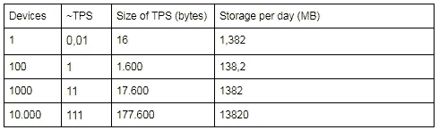***

*****实施#1(目前可能)*****

*   ***完整节点执行 PoW、gTTA 和 findTransactions(所有繁重的任务都外包了——我们需要信任这里的节点)。***
*   ***该节点只是从不执行快照(随着 tangle 网络及其所有事务的增长)。***
*   ***没有公钥加密的 MAM 实现(我们只发送加密密钥(副密钥)，例如通过电子邮件)。***

***这是我基于商业服务价格的估计。使用 getTransactionToApprove(gTTA)-刀尖选择(每 1000 次执行 0.3€)，然后附加 Tanlge (PoW)(每 100 次执行 1€)。此外，我还假设每个用户每天从 MAM 流中获取 100 次(findTransactions)。我们需要一个 MAM 消息(带有当前的有效负载和安全性)两个事务。要广播的两个事务都需要执行 PoW。但是对于 MAM 包，我们只需要一个 gTTA。***

***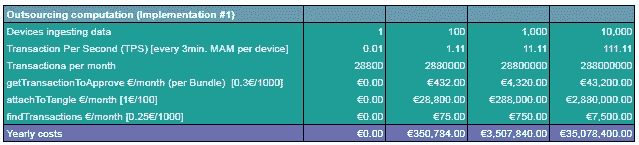***

***Cost for the use case for implementation #1***

***这是一个很高的价格，对于我们的用例来说，现在可能不值得遵循。***

*****实施#2(目前可能)*****

*   ***我们的 RPi 设备在大约 90 秒/个事务中执行 PoW。对于我们的 MAM 消息，这需要大约 180 秒。能源成本将由设备持有者承担。***
*   ***节点在 100 天后执行本地快照(快照后数据会丢失)，这意味着我们会丢失较旧的数据。*我们只是使用来自 angle.business* 的 permanode 服务进行成本估算。***
*   ***用自制密钥加密交换的 MAM 实现(希望是量子证明)。***

***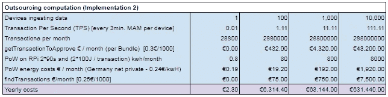***

***Estimation of cost for Implementation #2***

***估计基于 gTTA 和 findTransactions 的角度.业务费率。PoW 是在 RPi 上完成的，并且试图仅近似 PoW 所需的那部分能量(知道 RPi 无论如何都必须全时运行)。对于一个设备来说，它被假定保持在总是免费的限度内，但是仅仅花费用户额外的能量成本。***

***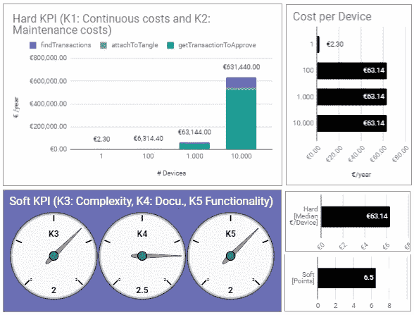***

***我仍然相信，使用优化的硬件和软件 **K1** 可以进一步降低价格。正如前面所指出的，这都是测试和早期。
说到软点，我经历了一些困难，以找出哪些库是最新的，可以使用。不和谐的聊天和社区在这里真的很有帮助，当被卡住的时候 **K3** 。我特别喜欢从基金会转移到限制聊天到更多与开发相关的话题，而不是让它淹没在 IOTA 令牌的价格谈判中。就在最近，文档也有了新的面貌。现在，开发会谈甚至可以在聊天中实时跟踪——这非常有趣！开箱即用的功能都是可用的，或者正在以各种编程语言构建——但是还没有真正的基于图形用户界面的平台。***

***当涉及到我们的特定用例(环境传感器数据的可视化)时，将每一个测量值存储在一堆数据上并在那里对其进行可视化有点太戏剧化了。但是，当你想象医院有必要(根据法律)测量污染水平时——用于审计跟踪的不可变分类账可能会变得更有趣(成本和价值方面)。***

*****实施#3(未来可能的设置—欧米茄)*****

*   ***该设备以非常有效方式执行功率(甚至可能只有非常有限的量，少于今天所需要的)。主要保护将是网络绑定工作证明(NBPoW)。***

> ***带宽是一种稀缺资源，自然会限制不良行为者的能力，因为保留带宽的主要部分的成本变得过于昂贵。***

*   ***永久节点存储所有必要的事务。***

> ***或者用 IOTA 控制的代理(ICT)分布(不是一个节点上的所有事务)，通过 Iota 令牌激励。或者通过 IRI 永久节点集中管理—通过 IOTA 令牌进行管理。至少这是我对它的有限理解。***

*   ***MAM+与开箱即用的 sidekey 安全加密交换一起使用。***

***为了充分享受这个建筑，恐怕我们需要等待几年。***

# ***实现用例***

***如前所述，IOTA 正在积极发展。通过加入 Discord 聊天，你甚至可以在 github 上看到开发者为他们的 pr 交换信息。第二层协议 MAM 也正在朝着 MAM+的方向发展。这意味着当你读到这篇文章的时候，我正在使用的库的某些部分可能已经过时了。***

## ***在公共 MAM 信道上发送消息***

***在 RPi 上***

```
*****pi@raspberrypi:~/tmmiot $**
mkdir IOTA**pi@raspberrypi:~/tmmiot/IOTA $**
git clone [https://github.com/jhab82/tmmiot-IOTA-agent.git](https://github.com/jhab82/tmmiot-IOTA-agent.git)**pi@raspberrypi:~/tmmiot/IOTA/tmmiot-IOTA-agent $**
npm install***
```

***在我们传输传感器数据之前，让我们先尝试发送一条消息，了解一下 MAM 提供的不同选项。***

***上面的代码初始化了创建 MAM 通道所必需的 MAM 对象(对于那些喜欢深入研究这种默克尔树结构的人来说，可以尝试使用短的[或长的](https://github.com/l3wi/mam.client.js/blob/master/docs/overview.md)***

***我们需要 IOTA javascript 库`const IOTA = require(’iota.lib.js’)`，它允许我们创建事务并将工作外包给 IOTA 服务器(完整节点)。这些服务器是分布式的，大多是运行 IOTA 参考软件(IRI)的虚拟专用服务器 VPS(在 AWS、Google Cloud 或 Azure 上)。所谓的全节点是当前 IOTA 网络的主干。***

> ***IOTA 的开发考虑到了未来物联网的网状网络环境。当前的网络试图通过手动对等和计算能力等措施来模拟性能。***

***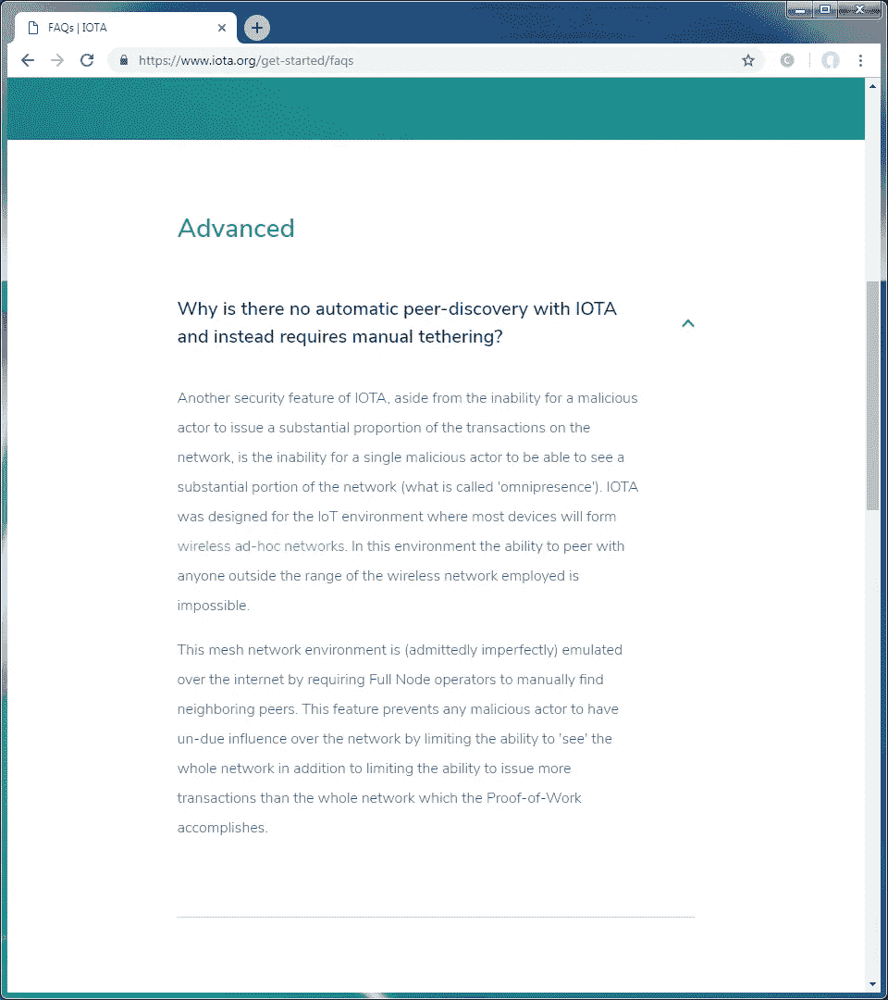***

***[https://www.iota.org/get-started/faqs](https://www.iota.org/get-started/faqs)***

***由于我们自己没有安装完整的节点，我们使用公共可用的完整节点及其公开的 API 将我们的消息附加到 tangle。由于我们处于开发阶段，我们当然会使用 IOTA 基金会提供的开发纠结`https://nodes.devnet.thetangle.org`***

***此外，我们用 IOTA provider `Mam.init(iota, undefined, 1)`初始化我们的 MAM 对象，并将其定义为最低安全性，并将其更改为 public。妈妈可以***

*   *****public** (意思是每个有地址的人——我们在这里称之为根地址——都可以读取流)和***
*   *****受限**(仅具有发布者选择的根地址和密码(侧密钥))以及***
*   *****私人**(仅限种子持有者)。***

***这已经是对 IOTA 生态系统所使用的单词和短语的深入探究了。别担心，虽然我们还没有触及这项复杂事业的表面😄但是数据的加入非常快。***

***在代码中，我们有一个异步发布函数，它将我们的有效载荷转换为 trytes，并通过`Mam.attach`将其附加到 tangle。在这里，完整节点承担了寻找两个 tip 以确认(gTTA)用这些 tip 执行 PoW 的繁重工作。在 RPi 上，构建事务(如果是私有的或受限的，也要签名),然后发送到广播。***

```
*****pi@raspberrypi:~/tmmiot/IOTA/tmmiot-IOTA-agent $**
node mam_min_publish.js***
```

***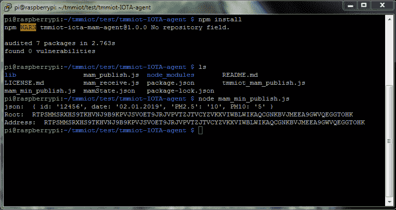***

***Feedback of the channel-id / root / address***

***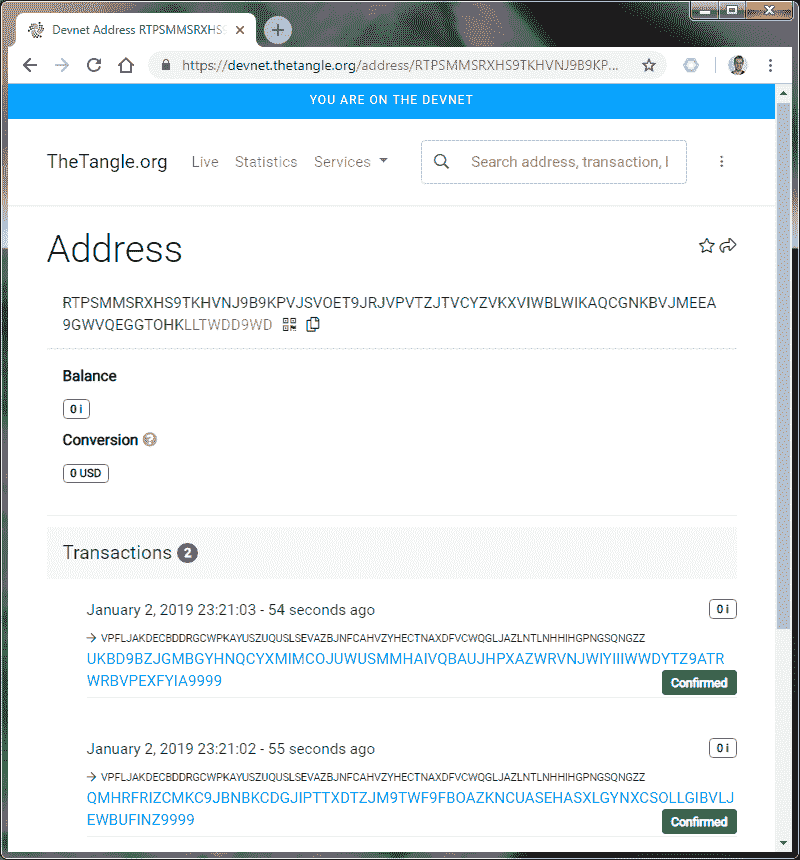***

***RTPSMMSRXHS9TKHVNJ9B9KPVJSVOET9JRJVPVTZJTVCYZVKXVIWBLWIKAQCGNKBVJMEEA9GWVQEGGTOHKLLTWDD9WD***

***我们的一条消息需要两个 IOTA 事务。如果您将有效负载的大小增加到 IOTA 事务的限制之上(根据[iota.org](https://docs.iota.org/introduction/iota-token/anatomy-of-a-transaction)您可以在这个消息中存储 2187 个 trytes)或者更改安全设置，那么每个 MAM 消息将需要更多的事务。***

***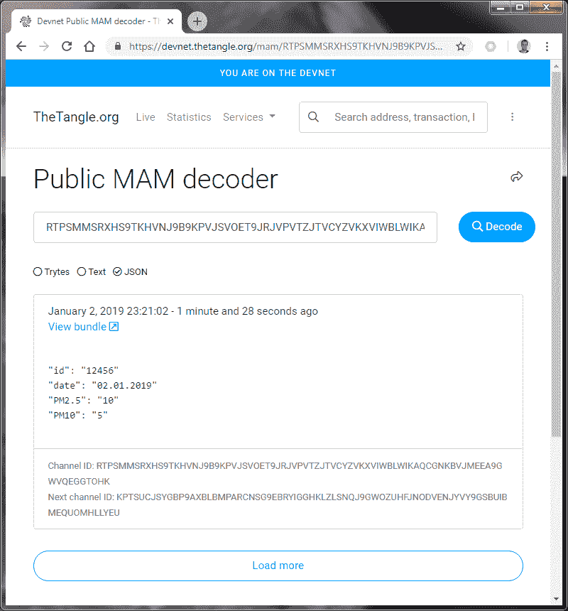***

***tangle explorer 显示我们已经创建了两个立即得到确认的事务。***

***在 IOTA 中，每个事务都需要验证另外两个事务(这两个要确认的事务可以通过 tip 选择或 getTransactionToApprove (gTTA)函数找到)。当涉及到零价值交易时，他们不需要任何验证。一旦他们被广播到 tangle，他们就会被接受。与价值交易相反，价值交易只有在经过他人验证后才能得到确认(基本上是确保价值没有被创造或删除——不包括双重花费)。***

***为了保护网络免受垃圾邮件的侵害，IOTA 网络要求为每个附加的事务提供一些工作证明(PoW)。PoW 需要一些计算能力，现在我们把它外包给公众可用的完整节点(幸运的是，他们通过 API 免费提供)。***

***使用公共的 MAM 解码器，我们得到解码的消息和作为根地址的信道 ID 以及下一个消息将被存储的下一个信道 ID(下一个根地址)。***

***上面的截图向我们展示了我们已经成功地存储了我们的数据，并且我们可以使用提供的根地址(channel-ID)来获取它。***

# ***与其他实现有什么不同***

***与其他两个物联网平台相反，我们没有授权、注册或必须设立账户，也没有为未来的账单提供任何信用卡信息——你现在可能会觉得太棒了，我会把我所有的数据都存储在这里。不幸的是你不能。至少不会永远那么容易。为了使完整的节点数据库保持合理的规模，需要不时地对数据库进行清理(IOTA 称之为快照)。这意味着只有 IOTA 地址的余额被求和，并且数据库重新开始，当然对所有非零余额的状态有合理的共识。*所以数据根本不是不可变的？*确定是在节点被手动修剪之前— **或者你有一个永久节点，它保存所有数据并让你查询(很可能像在 thetangle.business 中那样收费)。*****

***除了其他物联网平台，在这个网络中你不会有一个可以查看、更改或删除你的数据的中央权威。它不是谷歌或西门子，我的意思是授权你访问的管理员。我敢肯定，在集中组织的许可系统中，有不同的方法通过合理的权限管理和加密来限制访问的可能性，但一旦我们转向机器经济，这些方法都容易失败。***

***IOTA 中偏执型数据所有者的另一个特征是其声称的抗量子计算机加密架构。这听起来太超前了，老实说，我没有足够的知识来和你讨论后量子密码术。总之，我所理解的是，大多数公钥算法能够被足够强大的未来量子计算机破解。基于一次一密 OTP 的架构不容易被非常高效的量子计算强行破解。***

***总而言之，我们有***

*   ***创建了一个 MAM 编码的消息***
*   ***通过远程电源将此消息附加到缠结上***
*   ***通过公共 tangle explorer 接收消息(提供通道 ID /根地址)***
*   ***通过公共网络接口解码信息***

***当再次执行上述程序时，将生成一个新的 channel-ID，使我们的消息不相关。但是我们希望能够停止我们的流，并在重新开始时恢复到相同的频道。让我们接下来做这个。***

# ***在已创建的频道上恢复发布***

***为了恢复通道上的发布，我们需要存储下一个根地址和来自 MAM 对象状态(mamState)的一些其他信息(包括种子)。***

***为了总是重新流整个通道，我们还需要存储第一个根地址。我已经重写了上面的代码来做到这一点。现在，我们可以在这个公共频道上恢复发布，甚至在我们的 RPi 出现故障后，也能够恢复该频道。***

***[](https://github.com/jhab82/tmmiot-IOTA-agent/blob/master/mam_resume_publish.js) [## jhab 82/TMM IOTA-剂

### tmmiot 项目的 MAM 代理。通过在 GitHub 上创建帐户，为 jhab82/tmmiot-IOTA 代理的开发做出贡献。

github.com](https://github.com/jhab82/tmmiot-IOTA-agent/blob/master/mam_resume_publish.js) 

接下来，我们限制其他人查看该频道——我们需要将 MAM 对象更改为由选择的密码(side-key)加密。

# 将频道切换到受限模式

除了创建一个密钥并将密钥转换为 trytes 之外，对代码只需做很少的修改:

```
const key = iota.utils.toTrytes("tmmiot-iota-sideky");
```

然后我们需要改变我们的 mamState 的模式:

```
mamState = Mam.changeMode(mamState, "restricted", key);
```

就是这样，从这里我们不能使用纠结浏览器，但另一个浏览器来查看我们的限制频道。查看现在为每个新频道创建的 mamChannelRoot.json，我们拥有请求流的所有信息。

```
{"subscribed":[],"channel":{"side_key":"HDADADXCCDHDRAXCCDHDPCRAGDXCSCTCZCMD","mode":"restricted","next_root":"DKMVKBRGITNGLVEZPOGASILFTIRK9KFJHBKJESQKFIYMGOJLFQKWKFMGIPASCNNTBGR9ITJRQGYJSJILS","security":1,"start":1,"count":1,"next_count":1,"index":0},"seed":"UJHR9SDKXUOBNVHDGDXKPUBCABGPXDWAATCKITOTQRQSJJCBXONMZVDVKZDPPYXNZYLTQMHHJ9SISIDJF"}
```

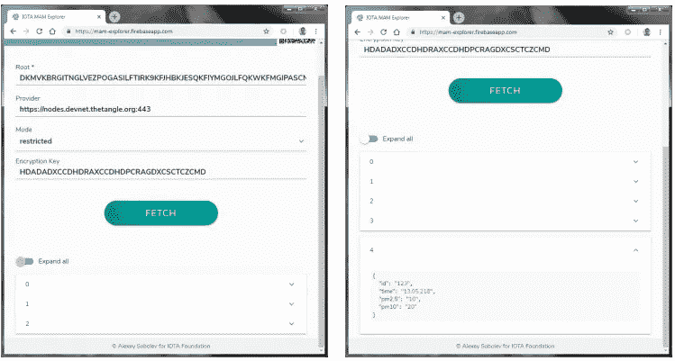

当我们恢复提要时，我们得到更多的条目。

# 将传感器数据添加到代理

就像我们为 Google 和 MindSphere 中的其他代理所做的那样添加包。

[](https://github.com/jhab82/tmmiot-IOTA-agent/blob/master/tmmiot_mam_publish.js) [## jhab 82/TMM IOTA-剂

### tmmiot 项目的 MAM 代理。通过在 GitHub 上创建帐户，为 jhab82/tmmiot-IOTA 代理的开发做出贡献。

github.com](https://github.com/jhab82/tmmiot-IOTA-agent/blob/master/tmmiot_mam_publish.js) 

```
**const** rpiDhtSensor = require(‘rpi-dht-sensor’); 
//DHT sensor com package
**var** dht = **new** rpiDhtSensor.DHT22(4); //on GPIO 4**const** Sensor = require(‘sds011-client’);//PM sensor com package 
**const** sensor = **new** Sensor(“/dev/ttyUSB0”); 
// Use your system path of SDS011 sensor.sensor.setReportingMode(‘query’); //set the PM sensor to query mode
sensor.setWorkingPeriod(3); //set the interval to 3min.
```

并查询我们的 PM 传感器。我们每三分钟收到一次。然后发布到我们的频道。

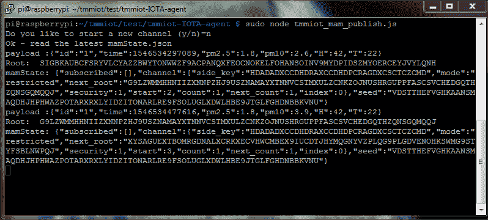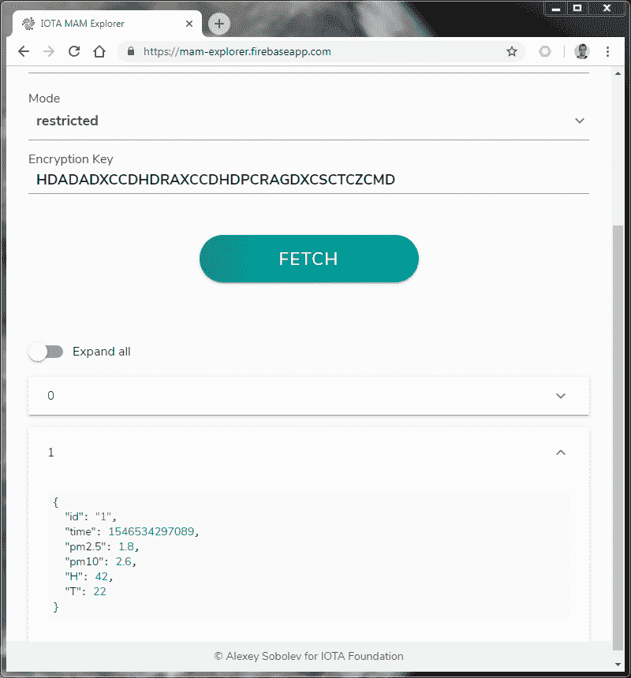

太棒了——我们可以运行这个 nohup 并离开房间，并且可以放心地知道我们会将传感器数据安全地、不变地存储在 tangle 中。

记住这一点——我们的 RPi 并没有做很多工作。它每 3 分钟获取一次传感器数据，并由此创建一个 MAM 对象，然后将所有的努力工作发送到完整的节点，这为我们提供了查找事务的机会，以确认是否执行 PoW 并将消息附加到 tangle。

可能 devnet 全节点是负载平衡虚拟专用服务器(VPS)——为我们提供了一个进入 tangle devnet 的入口点。但它也可以是硬件优化的集群，提供非常环保高效的服务。

# 数据可视化

与[第 2 部分](/coinmonks/tell-me-more-internet-of-things-part-2-google-cloud-iot-cost-and-value-comparison-38bfb20d94e1)中的谷歌云实现相比，我们还没有看到一个旧的学校数据库，可以用 SQL 查询该数据库，以获得可视化各种指标所需的所有信息。有了 MindSphere，还没有可用的 API 或 GUI 来查询机载数据——我们只是看到了我们自己的传感器数据的预定义可视化。两个物联网平台都没有准备好搭载新的环境传感器——它们都是完全许可的。管理员需要对它们进行授权(如图所示)。当然，我们需要自动化入职流程，但目前都是手动许可的。

有了 IOTA，每个人都可以单独携带他们的数据，并遵循上述指南来解决同样的问题。但是，为了获得来自所有传感器(100、1000 和 10.000)的所有数据，我们需要进一步思考。

当然，我们可以实现一个能够存储单个根地址和它们的侧密钥的市场(可能通过向所有者提供一点现金或者更好的 IOTA 令牌)，但这可能是为了后面的章节(类似于[data.iota.org](http://data.iota.org))。现在我们假设我们知道所有的根地址和它们的侧键。

接下来，我构建了一个简单的 google chart 应用程序，能够从混乱中获取数据(通过提供您的根键——类似于我们查询数据的 firebase 应用程序，但不是列出变量并将它们写入图表。)

## MAM 流的可视化

我已经写了一个非常粗略的可视化的公共 MAM 流

[](https://github.com/jhab82/iota-mam-visualization) [## jhab 82/iota-mam-可视化

### 在 google 折线图中 MAM 传感器数据的可视化-jhab 82/iota-MAM-可视化

github.com](https://github.com/jhab82/iota-mam-visualization) 

而在数据库中，您可以查询过滤对象(例如设备)的最近 10 个条目。有了 MAM，你需要从头开始一直跑到最后。因为消息的下一个根是从实际根派生出来的。

有一天，我将我的传感器数据流式传输到了现在有 480 个有效载荷不可变地存储在这个分布式分类账中的混乱中。为了可视化这个并不断更新流，我需要在某个地方存储我的根地址，否则我需要从头到尾通过计算量很大的 MAM 运行。

> 已经有了其他的 MAM 实现，比如 [RAAM](/@lamberti.robin/random-access-authenticated-messaging-45a5f40f2532) 。此外，如前所述，基金会议程上有一个 MAM+项目，可能会有额外的功能。

但这是当前的 MAM 实现。或者我应该说，我希望是现在。为了减少计算量，我们只导出下一条消息，并临时存储下一个根。用户可以手动执行以解码该流中的下一条消息。

我已经切换回了一个公共的 MAM 流(只是因为我不知道如何在这个后端实现上安全地请求 sidekey)。我应该在客户端实现它(也许下一步)。

获取单个 MAM 消息和路由器的后端函数的代码片段。

[https://iota-mam-vis-app-dot-tell-me-more-iot.appspot.com/](https://iota-mam-vis-app-dot-tell-me-more-iot.appspot.com/)


Animated (GIF) for the implemented visualization of an MAM sensor stream

我喜欢你的评论、更正和建议👌。

> [在您的收件箱中直接获得最佳软件交易](https://coincodecap.com/?utm_source=coinmonks)

[](https://coincodecap.com/?utm_source=coinmonks)***