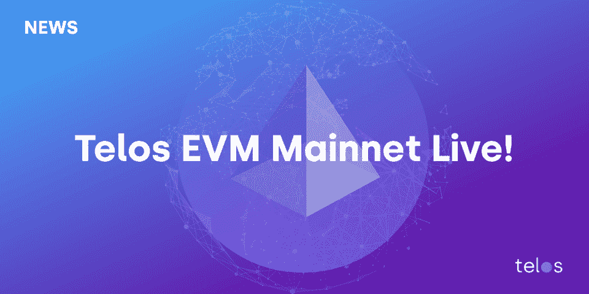

# 泰勒斯·EVM:DeFi 的游戏改变者

> 原文：<https://medium.com/coinmonks/telos-evm-the-game-changer-of-defi-1e67c62f185?source=collection_archive---------8----------------------->

## Telos 以太坊虚拟机是一项旨在为现有的 DeFi 问题带来先进解决方案的技术。

Source: telos.net

分散金融，也称为 DeFi，是区块链的一个方面，旨在通过向任何人提供金融服务来颠覆传统金融世界。金融服务，如贷款、借款、储蓄、保险等。都在 DeFi 的保护伞下试图利用区块链技术进行破坏。

DeFi 在加密领域已经成长为一个超过 1000 亿美元的产业，并且还在朝着更大的成就前进。智能合同概念是赋予 Defi 行业展翅高飞的基础技术。

智能合约是在区块链上运行的自动化程序，一旦满足预定条件就会执行。它们的主要功能是消除对中介的需求，实现无缝交易。

在以太坊上，智能合约是用 Vyper 和 Solidity 编写的，旨在与以太坊虚拟机(EVM)集成。

## **什么是以太坊虚拟机？**

EVM 是一个基于区块链以太坊的软件平台，允许开发者通过智能合约创建分散的应用程序。它维护和部署智能合同的执行。

以太坊环境导致了区块链上的 DeFi 协议的实施，该协议为交易者/投资者的金融需求提供了更多的解决方案。以太坊区块链给区块链带来了各种好处。然而，以太坊区块链也有缺点。

以太坊区块链的一个主要缺点是高昂的燃气费。用户认为执行交易所需的汽油费高得离谱。

另一个缺点在于区块链可以执行的事务数量。由于以太坊是一个著名的区块链，EVM 有大量的事务要执行，这可能需要很长时间。

由于攀登以太坊区块链的缺点，许多公司正转向创造一个更好的 EVM。Telos 就是这样一家公司。

## **泰勒斯 EVM 是什么？**

Telos 是一家于 2018 年成立的区块链公司，旨在通过为 Web 3.0 铺平道路来推动未来经济。 [Telos EVM](https://www.telos.net/evm) 是一个第 1 层以太坊虚拟机，为 web 3.0 提供动力。

它于 2021 年 11 月 2 日推出，与以太坊一样，在泰罗斯区块链号上运行一份可靠性合同。Telos EVM 是一个强大且可扩展的以太坊智能合约平台，旨在为分散金融(DeFi)世界带来更多解决方案。

泰罗斯区块链的一个重要因素是，迄今为止，它完全靠自力更生融资，没有大型投资者。最近，[筹集了 800 万美元的资金](https://www.google.com/amp/s/cointelegraph.com/news/telos-raises-8m-funding-before-evm-launch-to-avoid-token-sales/amp)，以促进其 EVM 生态系统，并最大限度地增加 DeFi 行业的增长机会。

## **是什么让泰勒斯·EVM 独一无二？**

在其他已实现的以太坊虚拟机中，泰洛斯 EVM 并不是从已经存在的 EVM 实现中派生出来的；相反，它是一个全新的 EVM，从头开始重新设计，使其更具扩展性，并减少了大多数 EVM 替代品面临的许多问题。

在以太坊区块链上执行交易的成本很高，因为用户支付的煤气费可能高得离谱。使用 Telos EVM，交易费用为以太坊燃气费的 1%。大多数 Telos EVM 交易的成本可能在 0.01 美元左右，它与 TLOS 的价值没有直接联系，这使得每个人都非常负担得起，从而有助于微交易。

交易速度也恰好是以太坊区块链给 DeFi 带来的一个主要缺点。Telos EVM 通过每秒 10，000 次交易(tps)和 0.5 秒的阻塞时间解决了这个问题。

加密中的前端运行已经发展成为数十亿美元的道德弊端，其中矿工、机器人或完整节点运营商在知道未来交易的情况下将交易放在队列中。Telos 的首席架构师和白皮书作者道格拉斯·霍恩(Douglas Horn)在该公司最近的新闻稿中表示，“分散融资的前台运行正日益成为一个更加复杂和令人沮丧的问题，这始于个人使用机器人提供额外的汽油费，以在高价值交易前插队。泰勒斯 EVM 是更快，更好，更便宜的功能，以消除前端运行。”

由于其每秒创建两个新块的性质，它留给机器人很少或没有时间来扫描内存池中有价值的交易。Telos EVM 交易的固定费率天然气费也有助于消除抢先交易，因为没有人可以通过提供更高的费用超越另一个人。

Telos 被认为是“最绿色的区块链”,因为它在绝对和每笔交易的基础上拥有任何分散的公共区块链中最低的能源消耗。它目前执行一个交易仅用 0.000001 千瓦时，从对环境的影响来看，这是一个更高效的选择。

## **泰洛斯·EVM 如何改变分散化的金融世界**

泰洛斯 EVM 公司引入了低交易成本和固定的天然气费用，彻底改变了 DeFi 行业，因为分散在全球各地的数百万用户可以以低至 1 美元的价格加入并相互交易，同时仍能获得大量利润。

此外，开发人员可以将他们的智能合约部署到 Telos EVM，而无需修改代码。这是一个突破，因为基于以太坊的 dApps 无法支持 DeFi 项目在以太坊产生的惊人的天然气费用，而被允许以初始费用的一小部分在 Telos EVM 上运行。

## **结论**

分散金融是密码行业的一个非常敏感的方面，因为它为金融界提供了许多潜力。Telos EVM 就是这样一个项目，旨在扩大 DeFi 交易的规模，让任何人都能以更实惠和无缝的方式获得这些交易。

> 加入 Coinmonks [电报频道](https://t.me/coincodecap)和 [Youtube 频道](https://www.youtube.com/c/coinmonks/videos)了解加密交易和投资

## 另外，阅读

*   [尤霍德勒 vs 科恩洛 vs 霍德诺特](/coinmonks/youhodler-vs-coinloan-vs-hodlnaut-b1050acde55a) | [Cryptohopper vs 哈斯博特](https://blog.coincodecap.com/cryptohopper-vs-haasbot)
*   [如何匿名购买比特币](https://blog.coincodecap.com/buy-bitcoin-anonymously) | [比特币现金钱包](https://blog.coincodecap.com/bitcoin-cash-wallets)
*   [币安 vs FTX](https://blog.coincodecap.com/binance-vs-ftx) | [最佳(SOL)索拉纳钱包](https://blog.coincodecap.com/solana-wallets)
*   [如何在 Uniswap 上交换加密？](https://blog.coincodecap.com/swap-crypto-on-uniswap) | [喜美元评论](https://blog.coincodecap.com/hi-dollar-review)
*   [3 commas vs . Pionex vs . crypto hopper](https://blog.coincodecap.com/3commas-vs-pionex-vs-cryptohopper)
*   [40 个最佳电报频道](https://blog.coincodecap.com/best-telegram-channels) | [Bitso 评论](https://blog.coincodecap.com/bitso-review)
*   [币安 vs 北海巨妖](https://blog.coincodecap.com/binance-vs-kraken) | [美元成本平均交易机器人](https://blog.coincodecap.com/pionex-dca-bot)
*   [新加坡十大最佳加密交易所](https://blog.coincodecap.com/crypto-exchange-in-singapore) | [收购 AXS](https://blog.coincodecap.com/buy-axs-token)