# 元宇宙的十种商业模式

> 原文：<https://medium.com/coinmonks/ten-business-models-in-metaverse-72587f42048b?source=collection_archive---------0----------------------->

*作者:*[*@ dawnx 666*](https://twitter.com/dawnx666)*翻译:* [*@C_Chyn*](https://twitter.com/C_Chyn)

近日，**脸书**正式更名为“Meta”，标志着其战略进军元宇宙。9 月，**腾讯**注册了“元宇宙之王”和“QQ 元宇宙”等与元宇宙相关的商标(王者荣耀和 QQ 分别是腾讯的热门手机游戏和即时通讯应用)。也是在 9 月，华为轮值主席胡在一个论坛上说，“代表了人类对虚拟世界和现实世界进一步融合的期望。”这些只是行业领导者采取的许多行动中的一些例子，这些行动引起了对“元宇宙”概念的更多关注。

## 为什么元宇宙最近受到如此多的关注？

从技术的角度来看，区块链为所有数字资产带来了可执行的产权。从互联网的发展来看， **3D 和多媒体一直是大势所趋**:从短信到图像，再到视频和流媒体直播，互联网一直在不断走向活跃。元宇宙结合了两种观点:建立在区块链技术的基础上，它符合内容丰富的大趋势。此外，元宇宙平台(如 Cryptovoxels)由特殊的 NFT 组成，每个 NFT 都能够容纳更多更小的 NFT，从而创建一个远远超过任何其他 NFT 的生态。

## 在元宇宙，我们可以期待哪些商业模式？

## **1。NFT 艺术品销售**

目前，画廊是元宇宙最常见的商业模式。根据我的观察和与世界各地业内人士的讨论，这可能是由于非艺术学科和艺术之间的内在联系。元宇宙的许多第一批活跃成员是艺术家或艺术行业的成员。来自 CryptoVoxels 的例子包括刘嘉颖的纯金画廊、宋婷的熊猫画廊、BCA 画廊和韩国社区的 dogesoundclub。这些团体带来了画廊，这是元宇宙最早也是最流行的商业模式。

[https://www.cryptovoxels.com/play?coords=W@291E,369N](https://www.cryptovoxels.com/play?coords=W@291E,369N)

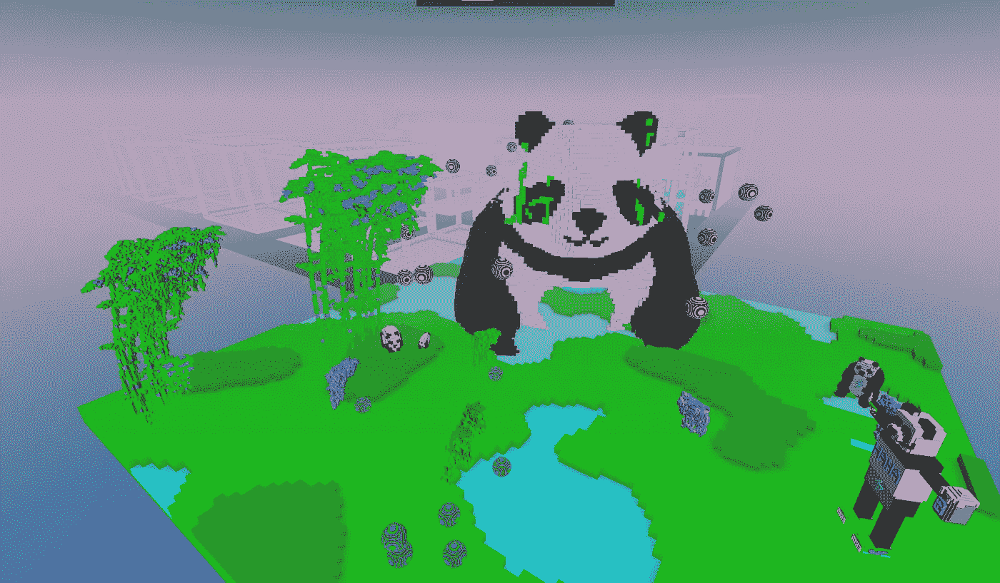

[https://www.cryptovoxels.com/play?coords=NW@569W,205N,12.5F](https://www.cryptovoxels.com/play?coords=NW@569W,205N,12.5F)

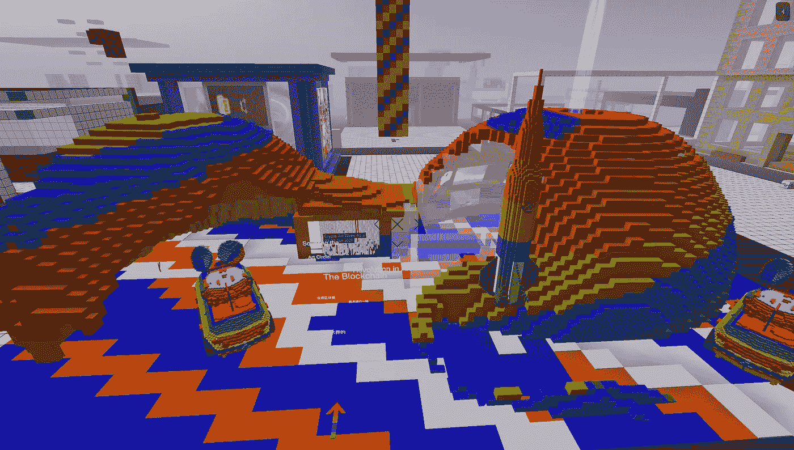

[https://www.cryptovoxels.com/play?coords=S@122E,432N,5.5F](https://www.cryptovoxels.com/play?coords=S@122E,432N,5.5F)

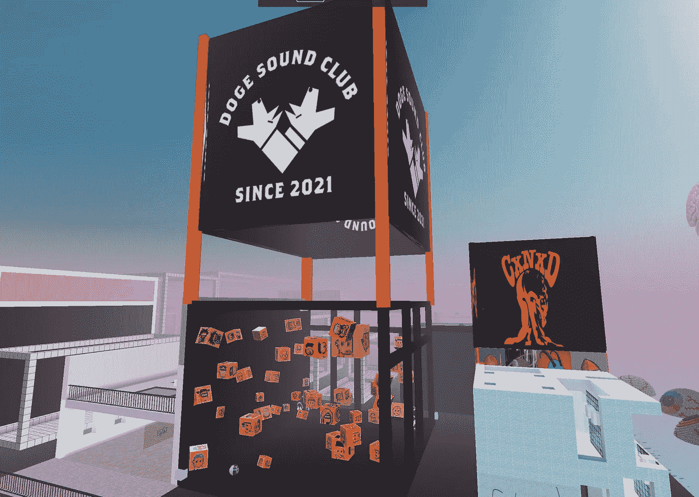

[https://www.cryptovoxels.com/play?coords=E@795E,230S,9F](https://www.cryptovoxels.com/play?coords=E@795E,230S,9F)

## **2。Vox** 的销售

与物质世界不同，元宇宙是由其他材料制成的。例如，包括所有建筑物和可穿戴设备在内的隐体素完全由体素组成，即 3D 网格上的数字值。因此，体素的使用在密码体素中是不可或缺的，用于建筑装饰或个人展示。为了满足这一需求，**我们现在有多家 vox 商店，Vox Walk 是这一商业模式的最佳范例**。

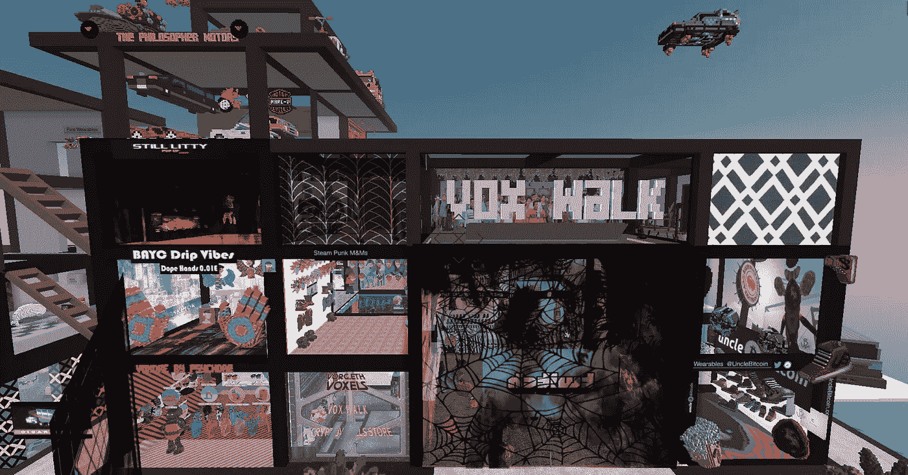

[https://www.cryptovoxels.com/play?coords=W@6483W,116S](https://www.cryptovoxels.com/play?coords=W@6483W,116S)

## **3。施工**

一些土地所有者拥有多个地块，但用于建设的时间和精力有限。其他土地拥有者是倾向于雇佣专业团队来建造他们的总部以达到品牌目的的组织。**诸如此类的需求导致了元宇宙**的第三方建筑服务，如 MetaEstate 和 Voxel Architects。CryptoVoxels 的主要岛屿起源城市中累积游客人数最多的前四座建筑——space age、StoneAge、GlassAge 和 Welcome——都是由 Voxel Architects 建造的。MetaEstate 还建造了著名的精致建筑，如 MetaChi 总部、创意时尚中心和好邻居餐厅。

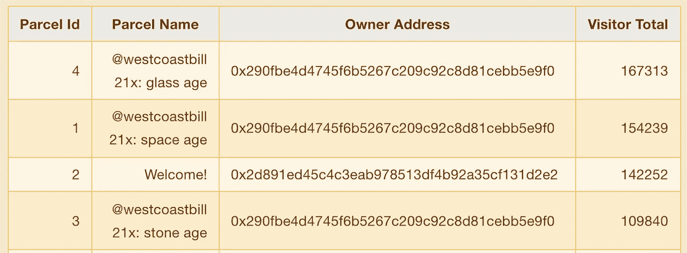

[https://www.k1ic.com/cv-en.html](https://www.k1ic.com/cv-en.html)

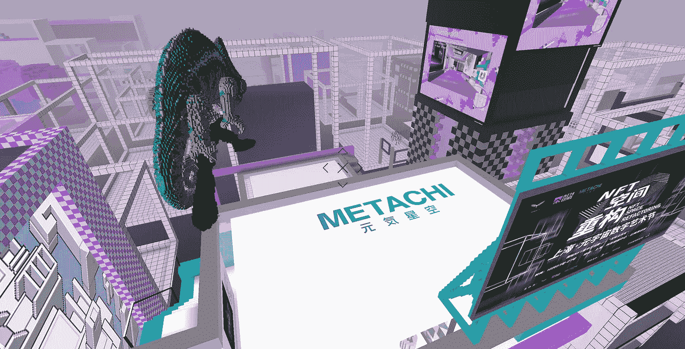

[https://www.cryptovoxels.com/play?coords=W@639W,276N,18.5F](https://www.cryptovoxels.com/play?coords=W@639W,276N,18.5F)

## **4。广告**

**一些土地所有者拥有多块土地，但施工时间和精力有限**。其他土地拥有者是倾向于雇佣专业团队来建造他们的总部以达到品牌目的的组织。诸如此类的需求导致了为元宇宙提供第三方建筑服务，如 MetaEstate 和 Voxel Architects。CryptoVoxels 的主要岛屿起源城市中累积游客人数最多的前四座建筑——space age、StoneAge、GlassAge 和 Welcome——都是由 Voxel Architects 建造的。MetaEstate 还建造了著名的精致建筑，如 MetaChi 总部、创意时尚中心和好邻居餐厅。

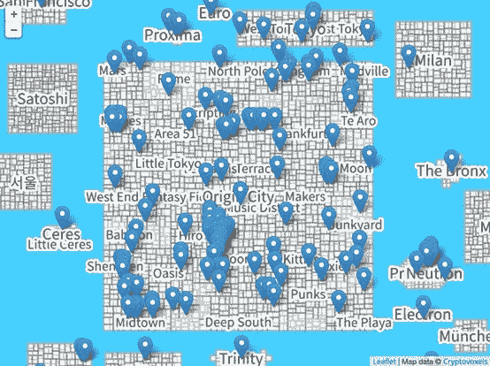

[https://metaverse-billboards.com/](https://metaverse-billboards.com/)

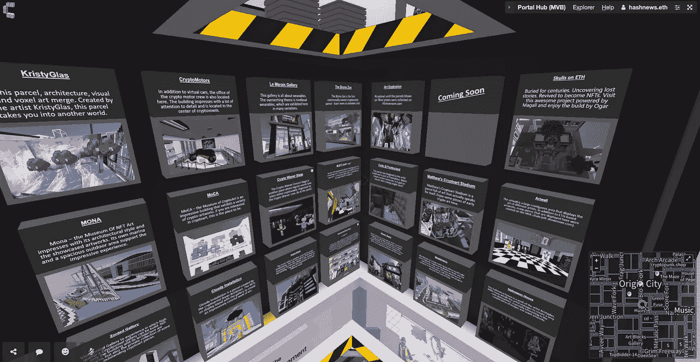

[https://www.cryptovoxels.com/play?coords=N@7E,35S](https://www.cryptovoxels.com/play?coords=N@7E,35S)

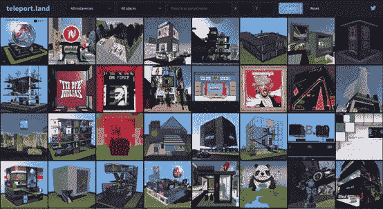

[http://www.teleport.land/](http://www.teleport.land/)

## **5。包裹租赁**

**就像现实世界中的房地产一样，数字包裹既可以租赁也可以购买**。 [CV Analytics](https://www.k1ic.com/cvb-zh.html) 的数据分析显示，许多土地所有者持有多块土地。我们还知道，一些地块所有者打算进行长期投资，而不是建设。因此，存在一个自然市场，土地所有者可以将他们的闲置土地出租给其他有建设或运营想法的人。

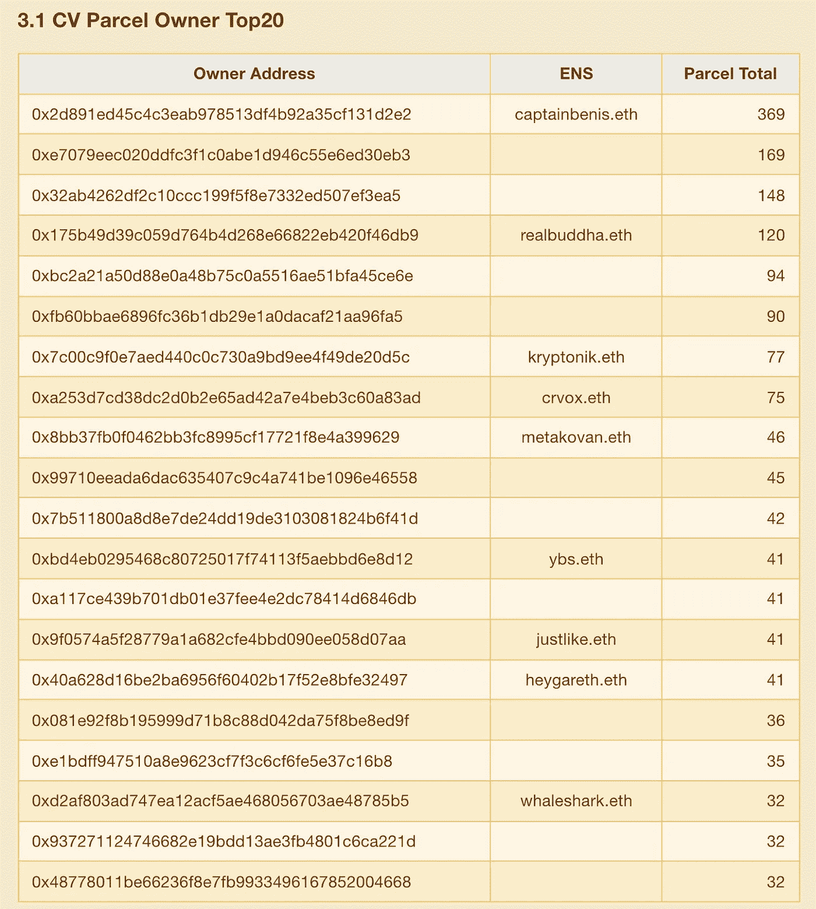

[https://www.k1ic.com/cv-en.html](https://www.k1ic.com/cv-en.html)

## **6。浸没**

沉浸感是指人们如此专注于设计好的环境，以至于忘记了现实。在北京环球影城，看似身体体验的东西实际上是精神沉浸，用哈利波特把移动的椅子变成翱翔，用变形金刚跳过摩天大楼，和小黄人坐立不安。**我认为元宇宙是一个自然的沉浸式体验的地方，基于专业的建筑设计和 3D 设备**。

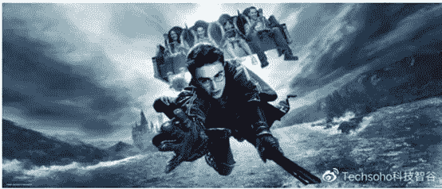

Image sourced from the web

## **7。游戏**

游戏的虚拟本质使它们很容易融入元宇宙。例如，沙盒是一个社区驱动的区块链游戏平台，创作者可以在区块链上将体素资产和游戏内设备转化为 NFT。此外，游戏当然可以成为其他元宇宙平台的一部分。**通过这样的上链游戏，玩家可以在投资 NFT 的同时享受游戏，因为游戏内物品本身就是 NFT。**

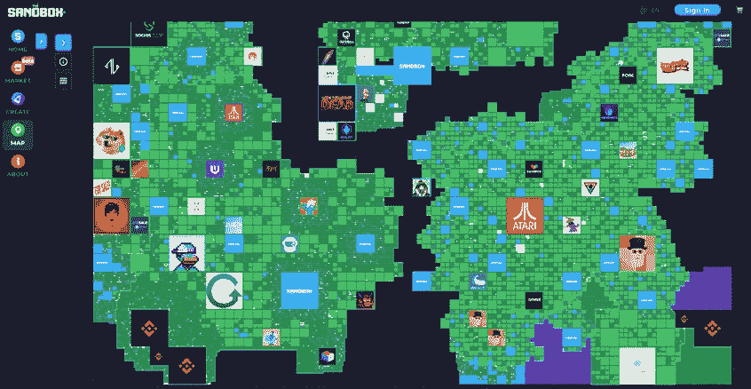

[https://www.sandbox.game/en/map/](https://www.sandbox.game/en/map/)

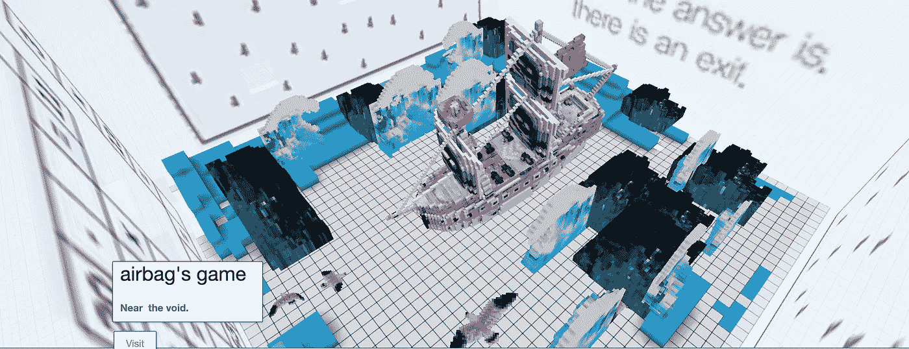

[https://www.cryptovoxels.com/spaces/d0a82c2b-e9cd-4c24-93a5-a9d106b4cdfe](https://www.cryptovoxels.com/spaces/d0a82c2b-e9cd-4c24-93a5-a9d106b4cdfe)

## **8。服装销售**

有些方面元宇宙永远不会取代物质世界，比如衣、食、住、行，这些都是我们基本的物质需求。具体来说，服装的在线销售正在走向 3D，从 2D 的图形介绍到直播试衣。然而，看别人试衣服和自己试不一样。**使用 3D 扫描仪，可以将 3D 虚拟版的布料放在 3D 虚拟版的自己身上。**

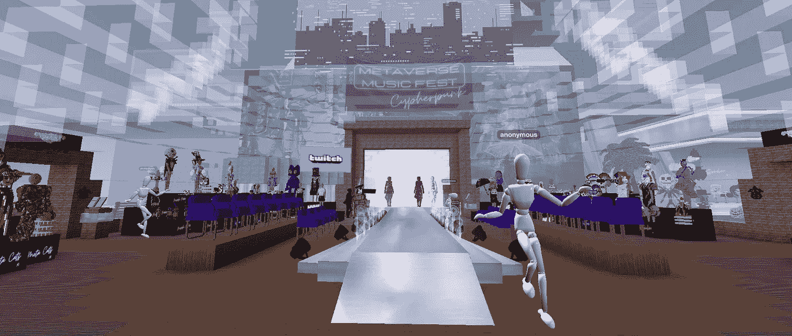

[https://www.cryptovoxels.com/play?coords=W@810E,81N](https://www.cryptovoxels.com/play?coords=W@810E,81N)

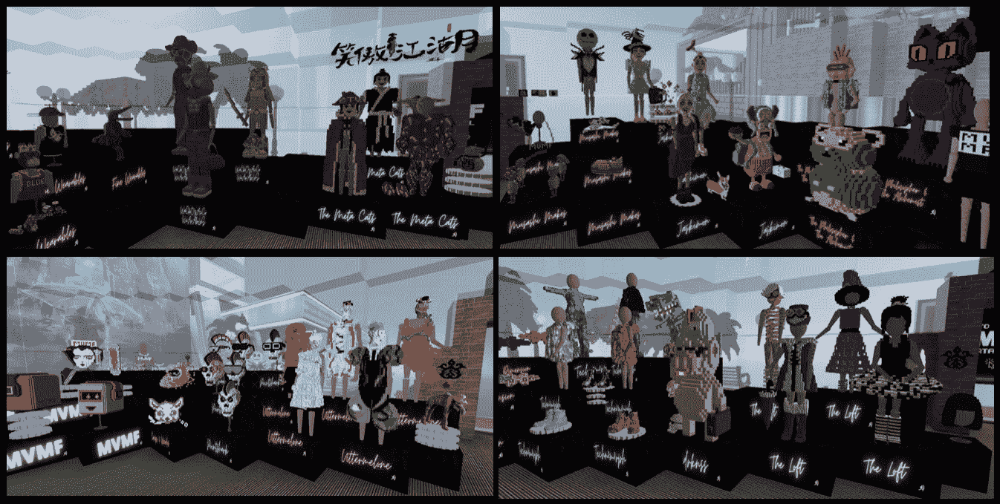

[https://www.cryptovoxels.com/play?coords=W@810E,81N](https://www.cryptovoxels.com/play?coords=W@810E,81N)

## **9。网上 KTV(卡拉 ok)**

对于喜欢 KTV 的人来说，它是一种社交方式。然而，在现实世界中，相距遥远的人们很难在 KTV 见面。这样的限制在元宇宙不存在。当它上市时，你有兴趣在元宇宙与世界各地的人一起唱卡拉 ok 吗？

## 10。数据服务

数据无处不在，元宇宙也不例外。平台需要每个包裹的访客数据。潜在买家需要待售包裹的历史数据。潜在卖家需要市场数据来设定他们的要价。游客想知道去哪里。以上每一项都需要数据的支撑。**专业数据分析提供商可能会成为一项重要的业务**。

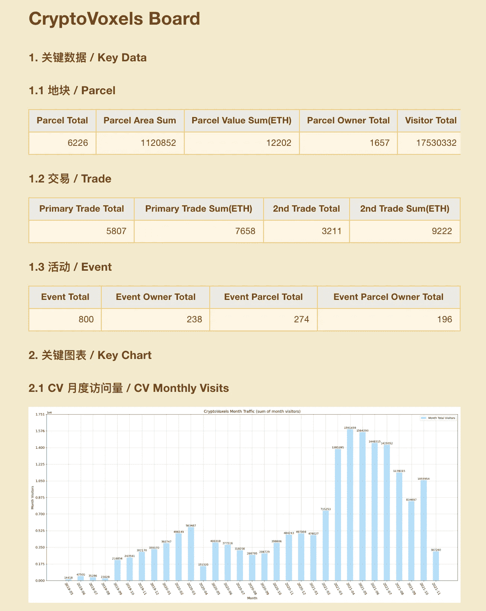

[https://www.k1ic.com/cvb-zh.html](https://www.k1ic.com/cvb-zh.html)

在不久的将来，我们可能会有很多新的工作:元宇宙建筑师、元宇宙建筑设计师、元宇宙建筑培训师、元宇宙游戏策划人、元宇宙建筑运营专家等等。除了我列举的十种商业模式之外，可能还会有其他成功的商业模式。

那么，元宇宙的未来会是什么样子呢？一个整合了社交网络和广告的 3D“推特”？沉浸式节目一个接一个的主题公园？一个提供 3D 服装试衣和试穿的在线市场？国际卡拉 ok 的 KTV？当然，就像脸书、谷歌、亚马逊都不能单独代表互联网一样，它必须是多个元宇宙平台之间的联系和互动，才能创造出真正的元宇宙。

*注意:本帖中所有关于元宇宙的讨论都是指区块链的元宇宙，因为我相信这是唯一真实的元宇宙。此外，我要感谢* [*安德鲁·斯滕沃尔德*](https://twitter.com/AndrewSteinwold) *的灵感。*

> 加入 Coinmonks [电报频道](https://t.me/coincodecap)和 [Youtube 频道](https://www.youtube.com/c/coinmonks/videos)了解加密交易和投资

## 另外，阅读

*   [支持卡审核](https://blog.coincodecap.com/uphold-card-review) | [信任钱包 vs 元掩码](https://blog.coincodecap.com/trust-wallet-vs-metamask)
*   [Exness 点评](https://blog.coincodecap.com/exness-review)|[moon xbt Vs bit get Vs Bingbon](https://blog.coincodecap.com/bingbon-vs-bitget-vs-moonxbt)
*   [如何开始通过加密贷款赚取被动收入](https://blog.coincodecap.com/passive-income-crypto-lending)
*   [Coldcard 评论](https://blog.coincodecap.com/coldcard-review) | [BOXtradEX 评论](https://blog.coincodecap.com/boxtradex-review)|[uni swap 指南](https://blog.coincodecap.com/uniswap)
*   [阿联酋 5 大最佳加密交易所](https://blog.coincodecap.com/best-crypto-exchanges-in-uae) | [SimpleSwap 评论](https://blog.coincodecap.com/simpleswap-review)
*   [购买 Dogecoin 的 7 种最佳方式](https://blog.coincodecap.com/ways-to-buy-dogecoin) | [ZebPay 评论](https://blog.coincodecap.com/zebpay-review)
*   [如何在 Bitbns 上购买柴犬(SHIB)币？](https://blog.coincodecap.com/buy-shiba-bitbns)
*   [iTop VPN 审查](https://blog.coincodecap.com/itop-vpn-review) | [曼陀罗交换审查](https://blog.coincodecap.com/mandala-exchange-review)
*   [最佳期货交易信号](https://blog.coincodecap.com/futures-trading-signals) | [流动性交易所评论](https://blog.coincodecap.com/liquid-exchange-review)
*   [最佳加密交易信号电报](/coinmonks/best-crypto-signals-telegram-5785cdbc4b2b) | [MoonXBT 评论](/coinmonks/moonxbt-review-6e4ab26d037)
*   [OKEx 评论](/coinmonks/okex-review-6b369304110f) | [Coinswitch 俱吠罗评论](/coinmonks/coinswitch-kuber-review-1a8dc5c7a739) | [比特币基地收费](/coinmonks/coinbase-fees-831e77d4f2c5)
*   [AscendEX 审查](/coinmonks/ascendex-review-53e829cf75fa) | [OKEx 交易机器人](/coinmonks/okex-trading-bots-234920f61e60) | [OKEx 交易机器人](/coinmonks/okex-trading-bots-234920f61e60)
*   [火币交易机器人](https://blog.coincodecap.com/huobi-trading-bot) | [如何购买 ADA](https://blog.coincodecap.com/buy-ada-cardano) | [Geco？一次审查](https://blog.coincodecap.com/geco-one-review)
*   [币安 vs 比特邮票](https://blog.coincodecap.com/binance-vs-bitstamp) | [比特熊猫 vs 比特币基地 vs Coinsbit](https://blog.coincodecap.com/bitpanda-coinbase-coinsbit)
*   [如何购买 Ripple (XRP)](https://blog.coincodecap.com/buy-ripple-india) | [非洲最好的加密交易所](https://blog.coincodecap.com/crypto-exchange-africa)
*   [非洲最佳加密交易所](https://blog.coincodecap.com/crypto-exchange-africa) | [胡交易所评论](https://blog.coincodecap.com/hoo-exchange-review)
*   [eToro vs robin hood](https://blog.coincodecap.com/etoro-robinhood)|[MoonXBT vs Bybit vs Bityard](https://blog.coincodecap.com/bybit-bityard-moonxbt)
*   [Stormgain 评论](https://blog.coincodecap.com/stormgain-review) | [Probit 评论](https://blog.coincodecap.com/probit-review) | [北海巨妖评论](/coinmonks/kraken-review-6165fc1056ac)
*   [如何在势不可挡的域名上购买域名？](https://blog.coincodecap.com/buy-domain-on-unstoppable-domains)
*   [印度的秘密税](https://blog.coincodecap.com/crypto-tax-india) | [altFINS 审查](https://blog.coincodecap.com/altfins-review) | [Prokey 审查](/coinmonks/prokey-review-26611173c13c)
*   [Blockfi vs 比特币基地](https://blog.coincodecap.com/blockfi-vs-coinbase) | [BitKan 评论](https://blog.coincodecap.com/bitkan-review) | [期货交易机器人](/coinmonks/futures-trading-bots-5a282ccee3f5)
*   [南非的加密交易所](https://blog.coincodecap.com/crypto-exchanges-in-south-africa) | [BitMEX 加密信号](https://blog.coincodecap.com/bitmex-crypto-signals)
*   如何在 WazirX 上购买柴犬(SHIB)硬币？
*   [MoonXBT 副本交易](https://blog.coincodecap.com/moonxbt-copy-trading) | [阿联酋的加密钱包](https://blog.coincodecap.com/crypto-wallets-in-uae)
*   [MoonXBT vs Bybit vs 币安](https://blog.coincodecap.com/bybit-binance-moonxbt) | [硬件钱包](/coinmonks/hardware-wallets-dfa1211730c6)
*   [雷米塔诺审查](https://blog.coincodecap.com/remitano-review)|[1 英寸协议指南](https://blog.coincodecap.com/1inch)
*   [购买 PancakeSwap(蛋糕)](https://blog.coincodecap.com/buy-pancakeswap) | [矩阵导出审核](https://blog.coincodecap.com/matrixport-review)