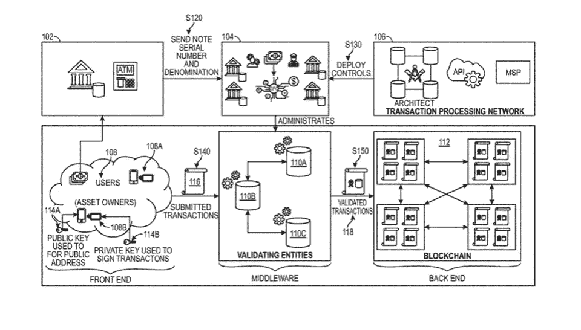
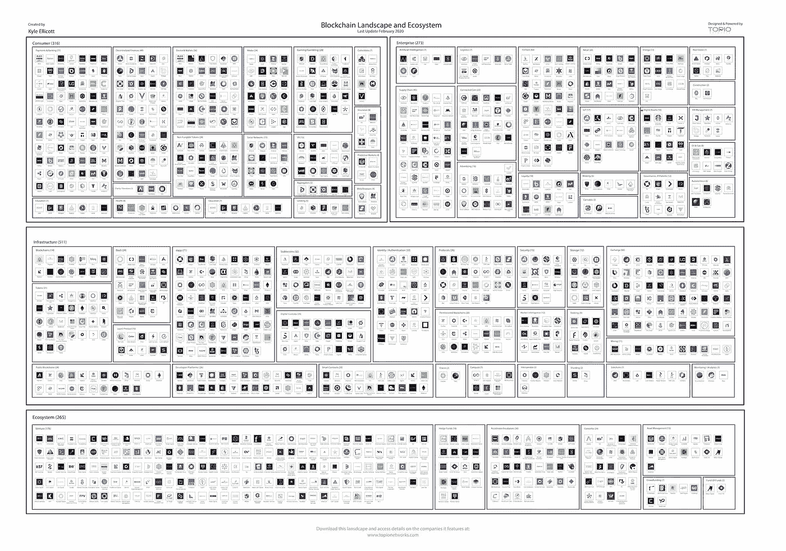

# 腾讯投资 700 亿美元包括区块链/法国成功测试数字欧元/美国国家区块链战略/企业区块链和互操作性

> 原文：<https://medium.com/coinmonks/tencent-investing-70-bn-including-blockchain-france-successfully-tests-digital-euro-u-s-d0c0e07edf5a?source=collection_archive---------4----------------------->

*2020 年 5 月 27 日*

*本周景观…* ***腾讯*** *在未来五年投资 5000 亿元人民币(700 亿美元)到基于新兴技术的“新基础设施”上。* ***法国*** *成为第一个试行数字欧元***的国家，在区块链上成功运行。* ***脸书*** *宣布更名&将其数字钱包从****Calibra****更名为****Novi****。* ***签证*** *已经向美国专利商标局提交了专利申请，有可能使用* ***以太坊*** *作为区块链来创造数字货币。一项众议院法案概述了美国国家区块链战略的路径。* ***埃森哲****–****富士通*** *项目希望解决区块链的互通性。* ***中国*** *人大提出区块链发展基金。****liquid PPS****将****EOSIO****互操作性推向跨链和通用解决方案。虚拟产品的销售像数字蛋糕一样火爆。******Eosfinex****加入 EOS DeFi 协议，均衡处理智能合约升级。我们充满了用例，包括运动员，分散优惠券，ERP 集成和成功的步骤。最后，明天请与我一起参加 5 月 28 日的***Q2 2020 年分散应用状态(DApps)，我们将深入探讨不断变化的 DApps 前景。尽情享受吧！*****

*****奖金*** *:我最近发布了最新的 Q2 2020 版 my* [*DApp“栈”景观图*](https://s3.amazonaws.com/spoke-profiles-prod-assets/uploads/a069e1e1e798c975d4eca968c72f4ac1352d62a4/original/DApps_Stack_Landscape_Q2_2020.pdf?utm_source=Social%20Media&utm_medium=LinkedIn&utm_campaign=Topio%20-%20Dapps%20Landscape%20update&utm_content=S3%20Link) *(包含在下面供下载)，它提供了一个行业概述，突出了 400 多家全球公司、生态系统参与者和工作小组。如果这是你看到的第一个版本，就把它当作你在这个行业中进一步导航的路线图。在这里获得高分辨率的免费！***

## **📖[腾讯向包括区块链在内的新技术投入 700 亿美元](https://www.coindesk.com/tencent-invest-blockchain)**

**据路透社报道，作为流行信息服务微信的创造者，腾讯将在未来五年投资 5000 亿元人民币(700 亿美元)用于基于新兴技术的“新基础设施”。腾讯高级执行副总裁童道森(Dowson Tong)周二在接受官方媒体采访时证实，该公司还专门投资了云计算、人工智能和网络安全等领域。目前还不清楚腾讯最终将为区块链留出多少 700 亿美元的投资，也没有详细说明具体会投资什么……[阅读更多](https://www.coindesk.com/tencent-invest-blockchain)**

## **🇫🇷宣布首次成功测试数字欧元**

**法国成为第一个试用数字欧元的国家，并在区块链上成功运行。法兰西银行使用内部开发的区块链技术为代表欧元的中央银行数字货币(CBDC)创建数字证券。当前的试点计划侧重于改善金融市场的功能，数字欧元的批发用途而非零售用途……[阅读更多信息](https://decrypt.co/29513/france-announces-first-successful-test-of-a-digital-euro)**

***相关:📖***——*[*武夫*](https://medium.com/u/90fea94b3ff1?source=post_page-----d0c0e07edf5a--------------------------------)***

## **📖[脸书将其服务更名为让人们互相发送天秤座数字货币的服务](https://www.cnbc.com/2020/05/26/facebook-novi-is-new-name-for-libra-digital-wallet.html)**

**周二，脸书宣布将其数字钱包从 Calibra 更名为 Novi。这项工作于去年首次亮相，是该公司进军数字货币领域的雄心勃勃的计划的一部分。脸书正在准备推出一种名为 Libra 的加密货币，旨在让人们更容易在世界各地汇款。虽然 Libra 将由一个由一系列公司和组织支持的非营利协会运营，但脸书拥有 Novi，这是一个用于存储和交换数字硬币的数字钱包。… [阅读更多信息](https://www.cnbc.com/2020/05/26/facebook-novi-is-new-name-for-libra-digital-wallet.html)**

## **📖 [Visa 申请数字美元区块链专利](https://www.forbes.com/sites/jasonbrett/2020/05/14/visa-submits-patent-application-for-digital-dollar-using-blockchain/)**

****

**[Source: Forbes](https://www.forbes.com/sites/jasonbrett/2020/05/14/visa-submits-patent-application-for-digital-dollar-using-blockchain/#cf57bb35b637)**

**Visa 已经向美国专利商标局提交了一份专利申请，以创建可能使用以太坊作为区块链的数字货币。该申请描述了一个集中的过程，以在每次生成一美元价值的数字法定货币时保持稳定的硬币的价值。中央实体确保相应的实体美元钞票从流通中移除，以调节数字法定货币的价值。这可以应用于其他央行数字货币(CBDCs)，如英镑、日元和欧元，因此世界任何地方的央行的实物货币都可以数字化……[阅读更多信息](https://www.forbes.com/sites/jasonbrett/2020/05/14/visa-submits-patent-application-for-digital-dollar-using-blockchain/)**

## **📖[众议院法案概述美国国家区块链战略之路](https://www.coindesk.com/brett-guthrie-emerging-technologies-blockchain-strategy)**

**美国众议院议员布雷特·格思里(Brett Guthrie)提出了一项名为“HB6938”的法案，呼吁美国联邦贸易委员会(FTC)调查区块链技术在行业、政府和全球的普及程度。此举被认为是继中国推出区块链服务网络之后，中国目前正在快速推进其央行数字货币数字元的测试。重点应放在州级/商业部门区块链采用、区块链发展计划、风险缓解战略和立法框架的建议上……[阅读更多信息](https://www.coindesk.com/brett-guthrie-emerging-technologies-blockchain-strategy)**

**

[Mainnet.events](http://mainnet.events/)** 

## **📖[区块链企业:成功的七个步骤](https://cointelegraph.com/news/enterprise-blockchains-seven-steps-to-success)**

**区块链技术堆栈具有内在的经济模型激励、奖励和惩罚，其迁移是一项重要的工作，更不用说能够提升和转移遗留应用程序了。尽管已经为区块链的成功概述了七个步骤，包括作为经济平台的激励措施，但超过一个堆栈意味着不需要对遗留应用程序进行平台迁移；有业务架构；超越设计模式；采用和变更管理；治理；并将用户的价值链符号化……[了解更多](https://cointelegraph.com/news/enterprise-blockchains-seven-steps-to-success)**

***相关:📖* [*分散券:分析一个*](/@kentmakishima/decentralized-coupons-analysis-of-a-hedera-hashgraph-use-case-c48b3ede5088)[*Hedera Hashgraph*](https://medium.com/u/387bb8085e8a?source=post_page-----d0c0e07edf5a--------------------------------)[*用例*](/@kentmakishima/decentralized-coupons-analysis-of-a-hedera-hashgraph-use-case-c48b3ede5088)*——*[*Kent maki shima*](https://medium.com/u/a72e246b0067?source=post_page-----d0c0e07edf5a--------------------------------)**

***相关:📈* [*埃森哲-富士通项目希望解决区块链互通*](https://cointelegraph.com/news/accenturefujitsu-project-hopes-to-solve-blockchain-interoperability)**

## ***🇨🇳*t34】中国国会提议成立区块链发展基金**

**一名全国人民代表大会代表(NPC)建议中国设立一个国家区块链发展基金，以建立一个更好的治理体系。该基金旨在支持几个有前途的区块链企业的发展和增长，鼓励区块链技术创新，以及其他方面。它还可以帮助中国在未来的技术发展中占据全球上风……[阅读更多信息](https://cointelegraph.com/news/chinas-congress-proposes-blockchain-development-fund)**

## **📖[基线演示展示以太坊上的安全企业协作](https://cointelegraph.com/news/baseline-demo-showcases-secure-enterprise-collaboration-on-ethereum)**

**[基线协议](https://www.baseline-protocol.org/)已经执行了概念验证，表明多个利益相关方可以安全地执行采购订单，而不会在以太坊(ETH)主网上暴露敏感数据。基线方法被认为是寻求提高安全性和性能的全球企业的意外收获。由于数据受到保护，合同受到数字化管理，公司可以无缝协作，而无需更改其当前系统。… [阅读更多信息](https://cointelegraph.com/news/baseline-demo-showcases-secure-enterprise-collaboration-on-ethereum)**

## **📖[Steem 传奇实际上是一场关于如何去中心化的战斗](https://decrypt.co/29784/steem-saga-battle-decentralize)**

**Steem network 用户投票支持 hard fork，该公司从今年早些时候分叉 Steem 以创建竞争对手区块链 Hive 的用户那里获得了约 500 万美元的资金。授权的股权证明“容易受到股权投票集中滥用的影响。”然而，在区块链之间移动的能力表明，加密货币生态系统作为一个整体越来越分散……[阅读更多](https://decrypt.co/29784/steem-saga-battle-decentralize)**

# **本周的更多内容:**

**📈[万事达卡加入区块链数字身份联盟 ID2020](https://www.ledgerinsights.com/mastercard-joins-blockchain-digital-identity-alliance-id2020/)**

**📈[流动性证明](https://www.placeholder.vc/blog/2020/5/22/proof-of-liquidity)由[乔尔·莫内格罗](https://medium.com/u/44c9101c2548?source=post_page-----d0c0e07edf5a--------------------------------)——[占位符](https://medium.com/u/2fc03186b285?source=post_page-----d0c0e07edf5a--------------------------------)**

**🎧[面向运动员和影响者的新粉丝参与模式](https://a16z.com/2020/05/26/a16z-podcast-new-fan-engagement-models-for-athletes-and-influencers/) — [安德森·霍洛维茨](https://medium.com/u/df45fd4a749d?source=post_page-----d0c0e07edf5a--------------------------------)**

**💸[自 2014 年以来，加密货币数据和基础设施提供商已经筹集了 2.86 亿美元的资金](https://www.theblockcrypto.com/linked/66301/cryptocurrency-data-and-infrastructure-providers-have-raised-286m-in-funding-since-2014)**

**💸[安德森·霍洛维茨](https://medium.com/u/df45fd4a749d?source=post_page-----d0c0e07edf5a--------------------------------) [预测第四次加密牛市](https://www.coindesk.com/andreessen-horowitz-bull-cycle-crypto-fund)**

**📖[微众银行在新加坡推出中国 FISCO BCOS 区块链](https://www.ledgerinsights.com/webank-rolls-out-chinas-fisco-bcos-blockchain-to-singapore/)**

**📖[为什么世界需要去中心化](/@phoreblockchain/why-the-world-needs-decentralization-ba4d2edb458a)——[佛尔区块链](https://medium.com/u/5040b77eccb?source=post_page-----d0c0e07edf5a--------------------------------)**

**📺[疫情期间的投资与支点:Fintech 与区块链](https://youtu.be/eDqa8Ibz93A)——[拉托肯](https://medium.com/u/eb73c6f6ed28?source=post_page-----d0c0e07edf5a--------------------------------)**

**📺 [REIMAGINE 2020 —区块链:基础层](https://youtu.be/b8k8e2WQZqo) — [MouseBelt Labs](https://medium.com/u/ea4623bd9f5e?source=post_page-----d0c0e07edf5a--------------------------------)**

**📖[中央加密期货交易所整合 Chainlink 的价格预测工具](https://cointelegraph.com/news/centralized-crypto-futures-exchange-integrates-chainlinks-price-oracles)**

**📖[我们的隐私技术为在家工作的革命做好准备了吗？](https://www.thestar.com/opinion/contributors/2020/05/25/are-our-privacy-technologies-ready-for-the-work-at-home-revolution.html)——[两院制](https://medium.com/u/2e1d9bbe8764?source=post_page-----d0c0e07edf5a--------------------------------)**

# **分散式应用程序手表**

## **📖[liquid PPS 通过跨链和通用解决方案推动 EOSIO 互操作性向前发展](https://cointelegraph.com/news/baseline-demo-showcases-secure-enterprise-collaboration-on-ethereum)**

**[liquid PPS](https://medium.com/u/111b26bf40a9?source=post_page-----d0c0e07edf5a--------------------------------)正在通过名为 Cross-Chain vRAM 和 Universal LiquidAccounts 的跨链和通用解决方案推动 eosio 互操作性向前发展。这两个产品解决了区块链世界的两个主要问题，一个是任何用户或区块链爱好者都明显缺乏 IBC，另一个是每个连锁店要求用户拥有一个本地帐户是一个重大的不便，并大大降低了优质的区块链体验… [阅读更多](https://cointelegraph.com/news/baseline-demo-showcases-secure-enterprise-collaboration-on-ethereum)**

## **📖[虚拟土地的销售正在飞速增长](https://decrypt.co/30149/sales-of-virtual-land-are-going-through-the-virtual-roof)**

****

**Source: [https://somniumspace.com/](https://somniumspace.com/)**

**在一个名为 [Somnium Space](https://medium.com/u/735afcf9fa85?source=post_page-----d0c0e07edf5a--------------------------------) 的分散经济中，虚拟土地的销售非常火爆。在过去的十周内，虚拟世界中的数百块土地总共卖出了 47 万美元。dapp 目前在市场 [OpenSea](https://medium.com/u/b7346f3882bb?source=post_page-----d0c0e07edf5a--------------------------------) 上高居榜首。**

**Somnium Space 的土地价值在最近几周翻了一番。用户可以通过游戏中的货币 CUBE 购买土地并在其上建造、管理、出租和出售地块，还有其他创收方式..… [阅读更多](https://decrypt.co/30149/sales-of-virtual-land-are-going-through-the-virtual-roof)上[解密](https://medium.com/u/2de7a312127a?source=post_page-----d0c0e07edf5a--------------------------------)**

## **📖 [Dapper Labs 欢迎 CryptoKitties 加入 Flow 区块链](https://cointelegraph.com/news/dapper-labs-welcomes-cryptokitties-onto-flow-blockchain)**

**[Dapper Labs](https://medium.com/u/6544777e30d2?source=post_page-----d0c0e07edf5a--------------------------------) 宣布其基于[以太坊](https://medium.com/u/d626b3859bc9?source=post_page-----d0c0e07edf5a--------------------------------)的流行收藏品游戏 [CryptoKitties](https://medium.com/u/c8b1419b5d28?source=post_page-----d0c0e07edf5a--------------------------------) 将在 Flow 区块链上推出。它还构建了一种新的专有面向智能合约的编程语言，称为 Cadence，专为流智能合约而设计。我们的目标不仅是运行 CryptoKitties，而且任何其他 NFT 都有机会进入高吞吐量环境，让人们为他们构建应用程序，并拥有可以扩展到数十亿用户的最高吞吐量市场……[阅读更多](https://cointelegraph.com/news/all-in-on-pos-blockchains-an-overview-of-crypto-staking-networks)**

**📖[币安和 Eosfinex 加入 EOS DeFi 协议处理智能合约升级](https://cointelegraph.com/news/binance-and-eosfinex-join-eos-defi-protocol-to-handle-smart-contract-upgrades)——[均衡 _EOSDT](https://medium.com/u/5db4a8782ba2?source=post_page-----d0c0e07edf5a--------------------------------)**

**📖从私人区块链到公共以太坊**

**📖 [DAPP 账户:非托管区块链账户](https://www.eosgo.io/news/dapp-account-noncustodial-blockchain-accounts)——[EOS GO](https://medium.com/u/9e143385b92c?source=post_page-----d0c0e07edf5a--------------------------------)**

**📖[什么是股权证明？](https://consensys.net/blog/blockchain-explained/what-is-proof-of-stake) — [同意](https://medium.com/u/6c7078bf7b01?source=post_page-----d0c0e07edf5a--------------------------------)**

**📖[信任钱包](https://medium.com/u/d3191ca07046?source=post_page-----d0c0e07edf5a--------------------------------) [移除 DApp 浏览器以符合苹果应用商店指南](https://community.trustwallet.com/t/trust-wallet-to-remove-dapp-browser-to-comply-with-apple-app-store-guidelines/30593)**

# **🎟️即将举办的活动**

***明天请与我一起参加 5 月 28 日***的 Q2 2020 年分散式应用状态(DApps)，我们将深入探讨不断变化的 DApps 前景，包括 DeFi、数字身份、存储、市场等新兴主题；一键式部署和平台等新兴趋势；加上用例、商业模式、趋势、机会领域等等！****

****

**[Topio Networks](https://www.topionetworks.com/events/5e8b64981dedae5a9973a0a1)**

# **🎙️区块链工业状况 2020 年第一季度:**

***现已发售，下载你的高清副本****Q1 2020****版* [*区块链景观图*](https://www.linkedin.com/posts/kyleellicott_q12020-blockchain-landscapekyleellicotttopionetworks-activity-6638879840634310656-UNtB) *。这是我发布的第五版景观，包括****747****家公司(* ***900 多家独特公司*** *包括更广泛的关键生态系统参与者)和超过*****220 亿美元的资金**** *从 2010 年到 2020 年，整个景观筹集了超过 180 亿美元的投资—出现明显的循环，并有完整的分解。***

**一个完整的 60 分钟的景观概述视频现在可以在***这里免费观看。在视频中，我对 2020 年的前景进行了细分，提供了 2019 年的总结、2020 年的新兴趋势、DeFi、Libra、CDBCs、Stablecoins、DApps 等等！***

****

**Source: [Topio Networks](https://www.topionetworks.com/markets/blockchain-landscape-5bf43854b9abe4633c1f87da)**

> **👉下载新的[区块链基础设施景观 Q1 2020](https://s3.amazonaws.com/spoke-profiles-prod-assets/uploads/d21d960161f92e629f68bf78b3d148743e4b3f49/original/Blockchain_Landscape_Q1_Feb2020_KyleEllicott.pdf?utm_source=pdf&utm_medium=email&utm_campaign=kyle) 版，了解关于 DeFi、DApps、基础设施、数字货币等的见解！**

**不想等到下周，[现在就订阅](http://click1.m.readwritelabs.com/xsdqkbbrgsdtqkmntpjlstcnkytvpvphsnhsqlvbrhhd_yfqbfcmslnskglmckvqv.html?source=post_page---------------------------)📥有关区块链、DApps 等的实时行业见解！**

> **[直接在您的收件箱中获得最佳软件交易](https://coincodecap.com/?utm_source=coinmonks)**

****