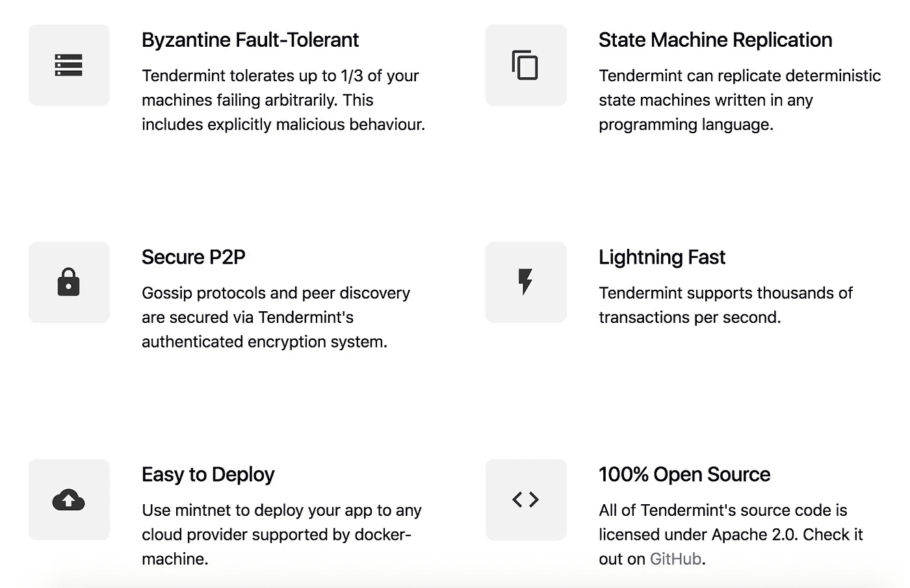
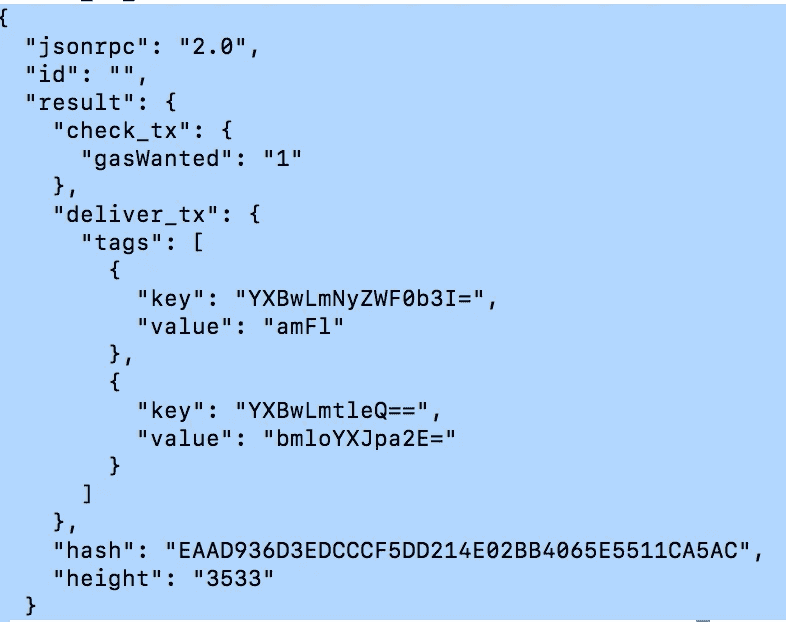
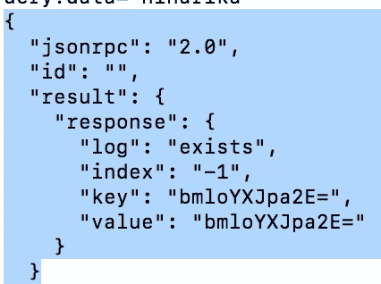

# Tendermint 101 —区块链的未来就在这里

> 原文：<https://medium.com/coinmonks/tendermint-101-blockchain-future-is-here-522bbc4c04d?source=collection_archive---------0----------------------->

分布式系统受到安全性、可靠性、快速性和一致性等基本问题的困扰。随着 Web 3.0 之风吹遍全球，区块链的应用已经从货币扩展到电子投票、基础设施协调等等！

Tendermint 是解决分布式系统必须面对的问题的一种尝试。Tendermint 是在比特币、以太坊等加密货币的传统中出现的。目标是提供比比特币的工作证明更高效、更安全的共识算法。

> Tendermint 是一款在多台机器上安全一致地复制应用程序的软件。

→即使多达 1/3 的机器以任意方式出现故障，Tendermint 也能工作——它是**拜占庭容错(BFT)** 。

→每台没有故障的机器都看到相同的事务日志，并计算相同的状态。

# 嫩薄荷的特点



Source: tendermint.com

## Tendermint 由两个主要技术组件组成:

区块链共识引擎和(Tendermint Core)，

通用应用程序接口(应用程序区块链接口(ABCI))。

Tendermint 核心可以承载任意的应用程序状态。因此，用任何语言编写的区块链软件:Haskell、GoLang 或 Rust 都可以作为 ABCI 应用程序运行。

# 现在的区块链是独一无二的！

拿比特币举例。它有一个整体设计。比特币的区块链堆栈是一个单一的程序，处理从连接到广播，到达成共识，到检查账户余额等一切事情。

> 巨石柱(大部分)反映了糟糕的从业者的方法。

Tendermint 旨在将共识引擎(即 Tendermint 核心)和 P2P 连接从主应用中分离出来。任何编程语言都可以用来开发 ABCI。

# **不再拖延，让我们直接进入嫩薄荷核心吧！**

## 步骤 1:下载 Tendermint 核心

[](https://github.com/tendermint/tendermint/releases) [## 嫩薄荷/嫩薄荷

### ⟁嫩薄荷核心(BFT 共识)在去。通过在…上创建帐户，为 tendermint/tendermint 的发展做出贡献

github.com](https://github.com/tendermint/tendermint/releases) 

注意:您可能必须将“tendermint”命令显式添加到二进制文件中。

## 步骤 2:初始化 Tendermint

```
$ tendermint init
```

应该会得到以下输出:

```
I[10–18|20:14:08.996] Generated private validator module=main path=/Users/niharikasingh/.tendermint/config/priv_validator.jsonI[10–18|20:14:08.996] Generated node key module=main path=/Users/niharikasingh/.tendermint/config/node_key.jsonI[10–18|20:14:08.996] Generated genesis file module=main path=/Users/niharikasingh/.tendermint/config/genesis.json
```

## 步骤 3:作为 Tendermint 节点启动您的机器

```
$ tendermint node — proxy_app=kvstore
```

您将看到以下(永无止境)输出:

```
I[10–18|20:16:40.037] Starting multiAppConn module=proxy impl=multiAppConnI[10–18|20:16:40.038] Starting localClient module=abci-client connection=query impl=localClientI[10–18|20:16:40.038] Starting localClient module=abci-client connection=mempool impl=localClientI[10–18|20:16:40.038] Starting localClient module=abci-client connection=consensus impl=localClientI[10–18|20:16:40.038] ABCI Handshake module=consensus appHeight=0 appHash=I[10–18|20:16:40.038] ABCI Replay Blocks module=consensus appHeight=0 storeHeight=0 stateHeight=0I[10–18|20:16:40.038] Completed ABCI Handshake — Tendermint and App are synced module=consensus appHeight=0 appHash=I[10–18|20:16:40.038] This node is a validator module=consensus addr=601302EBD1F8B4BCE9F99B219965F2796AB6BB10 pubKey=PubKeyEd25519{991BF1D2F72E5204B752B9A1EB604A9B07945F51891CE93D22DD14FB3E630B0C}I[10–18|20:16:40.044] P2P Node ID module=p2p ID=7cb3c8fa590fc5aadf16a475a544bbc1368acc4f file=/Users/niharikasingh/.tendermint/config/node_key.jsonI[10–18|20:16:40.044] Starting Node module=main impl=NodeI[10–18|20:16:40.044] Starting EventBus module=events impl=EventBusI[10–18|20:16:40.045] Starting RPC HTTP server on tcp://0.0.0.0:26657 module=rpc-serverI[10–18|20:16:40.046] Starting P2P Switch module=p2p impl=”P2P Switch”I[10–18|20:16:40.046] Starting MempoolReactor module=mempool impl=MempoolReactorI[10–18|20:16:40.046] Starting BlockchainReactor module=blockchain impl=BlockchainReactorI[10–18|20:16:40.046] Starting ConsensusReactor module=consensus impl=ConsensusReactorI[10–18|20:16:40.046] ConsensusReactor module=consensus fastSync=falseI[10–18|20:16:40.047] Starting ConsensusState module=consensus impl=ConsensusStateI[10–18|20:16:40.048] Starting baseWAL module=consensus wal=/Users/niharikasingh/.tendermint/data/cs.wal/wal impl=baseWALI[10–18|20:16:40.048] Starting TimeoutTicker module=consensus impl=TimeoutTickerI[10–18|20:16:40.048] Catchup by replaying consensus messages module=consensus height=1I[10–18|20:16:40.048] Replay: Done module=consensusI[10–18|20:16:40.048] Starting EvidenceReactor module=evidence impl=EvidenceReactorI[10–18|20:16:40.048] Starting PEXReactor module=p2p impl=PEXReactorI[10–18|20:16:40.048] Starting AddrBook module=p2p book=/Users/niharikasingh/.tendermint/config/addrbook.json impl=AddrBookI[10–18|20:16:40.048] Starting IndexerService module=txindex impl=IndexerServiceI[10–18|20:16:40.048] Started node module=main nodeInfo=”NodeInfo{id: 7cb3c8fa590fc5aadf16a475a544bbc1368acc4f, moniker: Niharikas-MacBook-Pro.local, network: test-chain-pmZKFH [listen tcp://0.0.0.0:26656], version: 0.25.0–0c9c3292 ({amino_version: 0.12.0, p2p_version: 0.5.0, consensus_version: v1/0.2.2, rpc_version: 0.7.0/3, tx_index: on, rpc_address: tcp://0.0.0.0:26657})}”I[10–18|20:16:40.049] Ensure peers module=p2p numOutPeers=0 numInPeers=0 numDialing=0 numToDial=10I[10–18|20:16:40.049] No addresses to dial nor connected peers. Falling back to seeds module=p2pI[10–18|20:16:41.042] Timed out module=consensus dur=993.37484ms height=1 round=0 step=RoundStepNewHeightI[10–18|20:16:41.042] enterNewRound(1/0). Current: 1/0/RoundStepNewHeight module=consensus height=1 round=0I[10–18|20:16:41.042] enterPropose(1/0). Current: 1/0/RoundStepNewRound module=consensus height=1 round=0I[10–18|20:16:41.042] enterPropose: Our turn to propose module=consensus height=1 round=0 proposer=601302EBD1F8B4BCE9F99B219965F2796AB6BB10 privValidator=”PrivValidator{601302EBD1F8B4BCE9F99B219965F2796AB6BB10 LH:0, LR:0, LS:0}”I[10–18|20:16:41.044] Signed proposal module=consensus height=1 round=0 proposal=”Proposal{1/0 1:43021D31FC0A (-1,:0:000000000000) B1C53868762E @ 2018–10–18T14:46:41.044131868Z}”I[10–18|20:16:41.045] Received proposal module=consensus proposal=”Proposal{1/0 1:43021D31FC0A (-1,:0:000000000000) B1C53868762E @ 2018–10–18T14:46:41.044131868Z}”I[10–18|20:16:41.045] Received complete proposal block module=consensus height=1 hash=7C902D710CE0BF50306E5BC1BDBB2F7CB5E703B6I[10–18|20:16:41.045] enterPrevote(1/0). Current: 1/0/RoundStepPropose module=consensusI[10–18|20:16:41.045] enterPrevote: ProposalBlock is valid module=consensus height=1 round=0I[10–18|20:16:41.046] Signed and pushed vote module=consensus height=1 round=0 vote=”Vote{0:601302EBD1F8 1/00/1(Prevote) 7C902D710CE0 2F3FB8AE1AB4 @ 2018–10–18T14:46:42.042791392Z}” err=nullI[10–18|20:16:41.047] Added to prevote module=consensus vote=”Vote{0:601302EBD1F8 1/00/1(Prevote) 7C902D710CE0 2F3FB8AE1AB4 @ 2018–10–18T14:46:42.042791392Z}” prevotes=”VoteSet{H:1 R:0 T:1 +2/3:7C902D710CE0BF50306E5BC1BDBB2F7CB5E703B6:1:43021D31FC0A(1) BA{1:x} map[]}”I[10–18|20:16:41.047] enterPrecommit(1/0). Current: 1/0/RoundStepPrevote module=consensus height=1 round=0I[10–18|20:16:41.047] enterPrecommit: +2/3 prevoted proposal block. Locking module=consensus height=1 round=0 hash=7C902D710CE0BF50306E5BC1BDBB2F7CB5E703B6I[10–18|20:16:41.048] Signed and pushed vote module=consensus height=1 round=0 vote=”Vote{0:601302EBD1F8 1/00/2(Precommit) 7C902D710CE0 AF3DD9DE247F @ 2018–10–18T14:46:42.042791392Z}” err=nullI[10–18|20:16:41.049] Added to precommit module=consensus vote=”Vote{0:601302EBD1F8 1/00/2(Precommit) 7C902D710CE0 AF3DD9DE247F @ 2018–10–18T14:46:42.042791392Z}” precommits=”VoteSet{H:1 R:0 T:2 +2/3:7C902D710CE0BF50306E5BC1BDBB2F7CB5E703B6:1:43021D31FC0A(1) BA{1:x} map[]}”I[10–18|20:16:41.049] enterCommit(1/0). Current: 1/0/RoundStepPrecommit module=consensus height=1 commitRound=0I[10–18|20:16:41.049] Commit is for locked block. Set ProposalBlock=LockedBlock module=consensus height=1 commitRound=0 blockHash=7C902D710CE0BF50306E5BC1BDBB2F7CB5E703B6I[10–18|20:16:41.049] Finalizing commit of block with 0 txs module=consensus height=1 hash=7C902D710CE0BF50306E5BC1BDBB2F7CB5E703B6 root=I[10–18|20:16:41.049] Block{Header{ChainID: test-chain-pmZKFHHeight: 1Time: 2018–10–18 14:46:41.042791392 +0000 UTCNumTxs: 0TotalTxs: 0LastBlockID: :0:000000000000LastCommit:Data:Validators: 6F80F8CDC51E593CACFD38A763836FAB50095B38NextValidators: 6F80F8CDC51E593CACFD38A763836FAB50095B38App:Consensus: 0E520AF30D47BE28F293E040E418D0361BFB5370Results:Evidence:Proposer: 601302EBD1F8B4BCE9F99B219965F2796AB6BB10}#7C902D710CE0BF50306E5BC1BDBB2F7CB5E703B6Data{}#EvidenceData{}#Commit{BlockID: :0:000000000000Precommits:}#}#7C902D710CE0BF50306E5BC1BDBB2F7CB5E703B6 module=consensusI[10–18|20:16:41.050] Executed block module=state height=1 validTxs=0 invalidTxs=0I[10–18|20:16:41.050] Committed state module=state height=1 txs=0 appHash=0000000000000000I[10–18|20:16:41.050] Recheck txs module=mempool numtxs=0 height=1I[10–18|20:16:41.051] Indexed block module=txindex height=1I[10–18|20:16:42.051] Timed out module=consensus dur=998.105755ms height=2 round=0 step=RoundStepNewHeightI[10–18|20:16:42.051] enterNewRound(2/0). Current: 2/0/RoundStepNewHeight module=consensus height=2 round=0I[10–18|20:16:42.051] enterPropose(2/0). Current: 2/0/RoundStepNewRound module=consensus height=2 round=0I[10–18|20:16:42.051] enterPropose: Our turn to propose module=consensus height=2 round=0 proposer=601302EBD1F8B4BCE9F99B219965F2796AB6BB10 privValidator=”PrivValidator{601302EBD1F8B4BCE9F99B219965F2796AB6BB10 LH:1, LR:0, LS:3}”I[10–18|20:16:42.055] Signed proposal module=consensus height=2 round=0 proposal=”Proposal{2/0 1:48B45F4423A5 (-1,:0:000000000000) F52DF1F111D8 @ 2018–10–18T14:46:42.051967933Z}”I[10–18|20:16:42.056] Received proposal module=consensus proposal=”Proposal{2/0 1:48B45F4423A5 (-1,
```

## 第四步:交易

要发送事务，使用`curl`向 Tendermint RPC 服务器发出请求，例如:

```
$ curl http://localhost:26657/broadcast_tx_commit?tx=\"niharika\"
```



注意结果中的`value`(`bmloYXJpa2E`)；这是`niharika`的 ASCII 的 base64 编码

我们来查询一下同样的！

```
$ curl -s 'localhost:26657/abci_query?data="niharika"'
```



这清楚地表明一切工作正常！

*这是开始使用 Tendermint 的非常基础的入门书。*

> [直接在您的收件箱中获得最佳软件交易](https://coincodecap.com/?utm_source=coinmonks)

[](https://coincodecap.com/?utm_source=coinmonks)