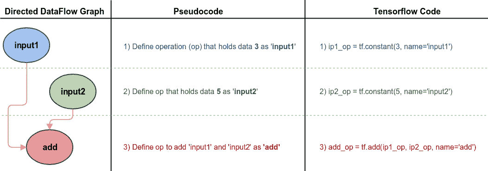
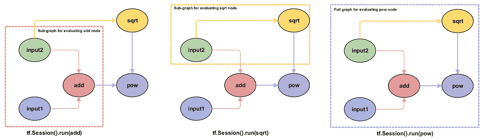
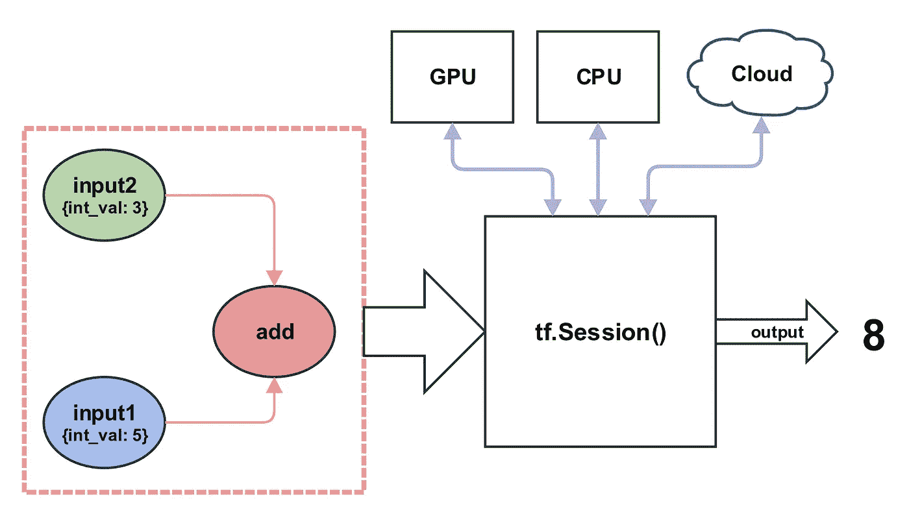
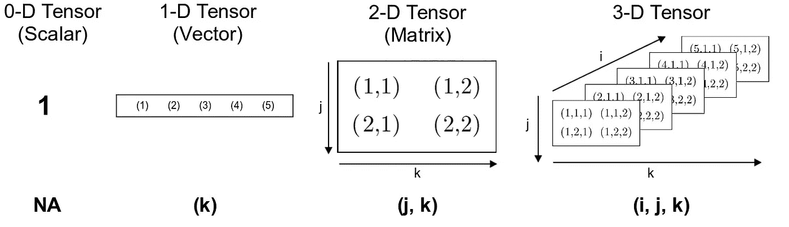
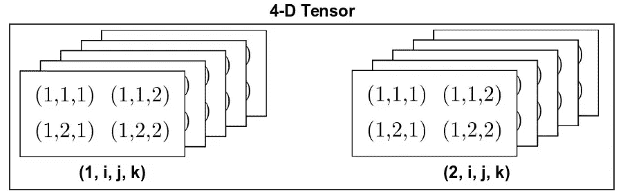
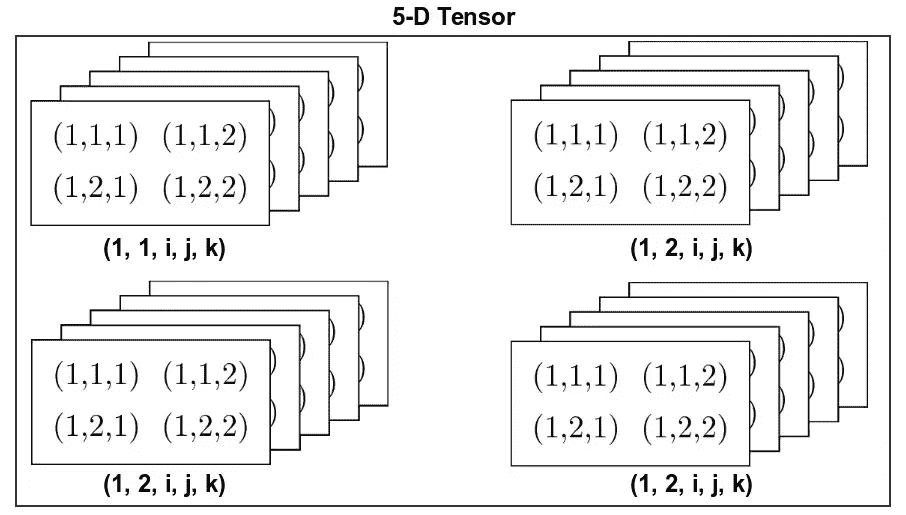
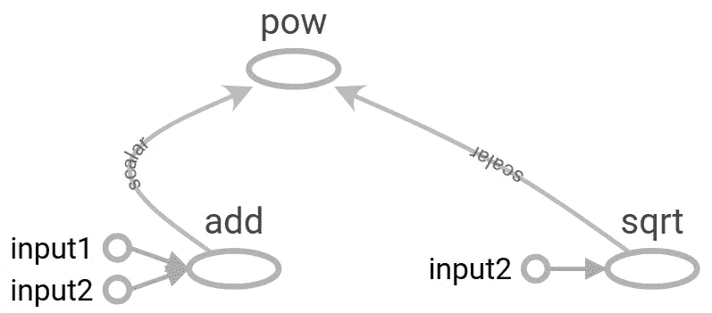

# 张量流:概念介绍

> 原文：<https://medium.com/coinmonks/tensorflow-a-conceptual-introduction-bc35a6267e41?source=collection_archive---------8----------------------->

## 张量流背后核心概念的说明性介绍。

# 什么是张量流

TensorFlow (TF)是一个开源的数值计算框架，提供了常用的机器学习(ML)和深度学习(DL)工具的抽象，以及构建新模型、优化器、损失函数等的能力。与无数的其他 ML/DL 库不同，TensorFlow 在研究所需的灵活性和在生产中部署应用程序所需的可伸缩性和效率之间提供了关键的平衡。

TF 框架使用两个基本概念:

1.  数据流编程范例
2.  将数据封装为张量

# 数据流编程范例

大多数程序员接触到的编程范例是[命令式编程](https://en.wikipedia.org/wiki/Imperative_programming)。这里的代码是一个命令序列，其中控制以有序的方式流过代码，以生成所需的输出。命令式程序的主要焦点是关于接下来需要执行什么语句，而不是所述执行需要什么数据。更简洁地说，*命令式编程是控制流而不是数据流。*

在[数据流编程](https://en.wikipedia.org/wiki/Dataflow_programming)中，代码是需要执行的操作定义的集合。一个*操作*可以是简单的两个数相加，来执行一个复杂的优化程序。操作可以依赖于一些输入数据，或者依赖于其他操作的输出(独立的情况是没有意思的)。评估一个操作的主要要求是其所有输入的可用性，使其对数据做出反应，因此得名:*数据流*。

# 数据流和张量流

数据流程序的代码通常被视为有向图，其节点是操作，传入的边表示在操作之间流动的数据。因此，任何 TF 应用程序的第一步都是建立数据流图。例如，要在 TF 中添加两个数字，我们通过将操作定义为图节点，将对其他操作的依赖定义为边来构建图。下图中的三行 TF 代码正是这样做的。第`1`行和第`2`行定义了保存数据的操作，从而创建了蓝色和绿色节点。行`3`定义了`add`操作，因为它使用`ip1_op`和`ip2_op`作为 op 的参数，所以创建了红色节点和两条红色边。需要注意的重要一点是，此时对`3+5`的实际评估还没有发生，只是构建了图形。



在数据流编程范例中，*执行*的概念被视为当数据流经一个有向图时对它的评估。在 TF 中，我们评估节点，而不是直接执行图形。由于节点有依赖关系，我们最终只评估由这些依赖关系引起的子图。如下图所示，`add`节点的评估将导致保存在`input1`和`input2`节点(此处为`3`和`5`)中的数据流向`add`节点。因为现在满足了`add`节点的所有依赖关系，所以它继续进行自我评估，即计算`3+5=8`。因此，在 TF 的说法中，我们说节点`add`评估为`8`。同样，当我们评估`pow`节点时，首先评估依赖节点`add`和`sqrt`，然后`pow`节点拥有评估自身所需的数据。



# 图形评估

为了评估节点，我们使用了一个`tf.Session`对象。一个会话对象充当一个容器，将一个图的执行环境上下文化。人们可以将会话视为数据流图的执行引擎——待评估的节点被发送到会话，它评估归纳的子图，并输出一个输出。代码执行的实际物理位置，即 CPU、GPU、 [TPUs](https://en.wikipedia.org/wiki/Tensor_processing_unit) 、分布式云等。由会话对象管理。也就是说，我们可以灵活地指定在哪里执行某些操作。我们将在以后的文章中介绍更高级的图形执行方法。



# 为什么使用数据流范式？

许多 ML/DL 模型(神经网络、图形模型等。)被表示为图形，用于可视化它们的理论定义。使用图作为这种模型的计算模型是一种自然的扩展。此外，使用图来建模 ML/DL 问题也有许多计算优势。例如，操作(节点)的计算只需要执行连接到该操作的子图，从而节省了计算时间。这也允许将计算分成更小的片段，便于分布式计算(将计算分散到不同的 CPU、GPU、TPU 等。).

大多数 ML/DL 应用程序都有一个优化器组件，它经常使用基于梯度的方法来最小化损失函数。传统上，损失函数的梯度是手动计算的，并提供给优化器——这是一项繁琐的工作，有时本身就是一个难题。通过将模型表示为图形，我们可以方便地使用[自动微分](https://en.wikipedia.org/wiki/Automatic_differentiation)来消除推导和实现梯度函数的手动步骤。

# 将数据封装为张量

张量是一个数学对象，表示为一个多维数组。根据上下文，它可能意味着许多事情。例如，张量可以是向量、标量甚至其他张量之间的[线性变换](https://en.wikipedia.org/wiki/Linear_map)。更多关于张量的数学方面，这里[这里](https://www.ese.wustl.edu/~nehorai/Porat_A_Gentle_Introduction_to_Tensors_2014.pdf)和[这里](https://web2.ph.utexas.edu/~jcfeng/notes/Tensors_Poor_Man.pdf)。

出于张量流的目的，可以把张量想象成能够以结构化的方式存储对象的存储单元。下图说明了张量在维度增长时的结构和索引。



在上图中，用用于访问存储值的索引方案来表示单元格。当维度增长时，更高维度的索引被钉在左侧。例如，二维张量(矩阵)中的元素被索引为`(row, column)`，而在三维张量中，它被索引为`(depth, row, column)`。

很难想象大于三维的张量的结构。一个技巧是将高维度想象成一个容器，以结构化(索引)的方式存储一组低维张量。例如，四维张量是三维张量的数组。



类似地，5 维张量是 4 维张量的数组。



现在，试着想象一个 6-D 张量。

# 一个简单的张量流程序

```
**[Out]**
[8.0, 2.236068, 104.56122]
```

Tensorboard 是随 TensorFlow 框架一起提供的一个图形可视化(等等)工具。TF 提供的`FileWriter` API 将数据流图写成文件，以便 Tensorboard 生成可视化效果。



# 结论

TensorFlow 是一个使用数据流范式构建的数值计算库，其中在操作之间流动的数据是张量。在 TensorFlow 中，学习算法表示为数据流图，输入数据表示为流经该图的张量。这就是这个框架被恰当地命名为 **TensorFlow** 的原因。下图是描述输入张量通过数据流图的流动的动画。它还展示了并行性如何成为数据流范例的一个内置特性。


Credit: Tensorflow Programmers Guide, [Graphs and Sessions](https://www.tensorflow.org/guide/graphs)

由于表示一个 TF 应用程序的图形本质，我们获得了以无数种方式组合操作的能力，给予研究人员实现新想法所需的灵活性。TF 还利用数据流图提供的内置并行性来提供高效的计算能力。此外，定义和计算之间的明确分离使我们能够轻松地为 TF 应用程序启用分布式计算，从而使 TensorFlow 成为企业 ML/DL 应用程序的理想框架。

*原发布于*[*https://www . surajx . in/2018/07/tensor flow-a-conceptual-introduction/*](https://www.surajx.in/2018/07/tensorflow-a-conceptual-introduction/)*。*